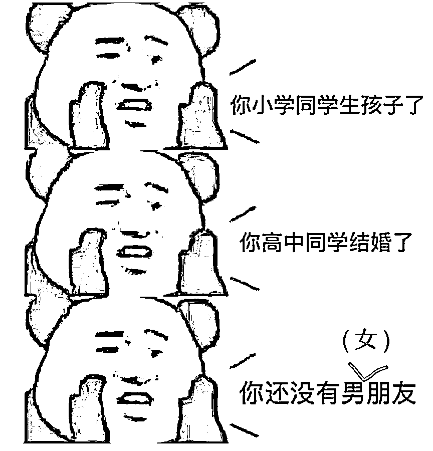
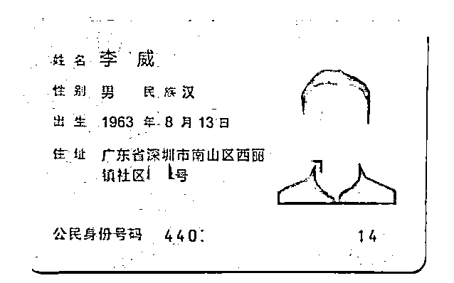
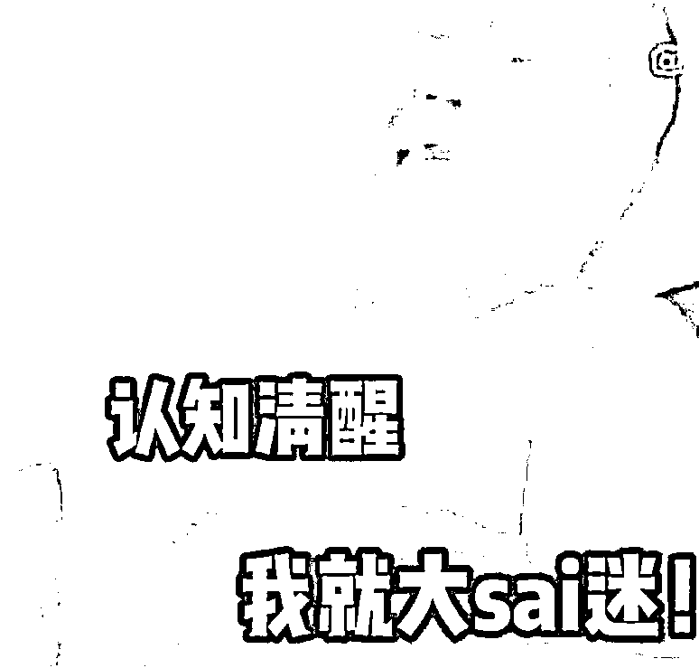
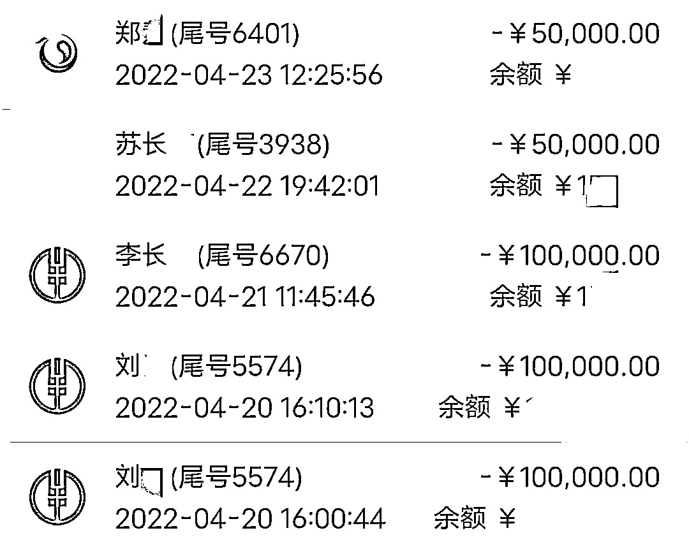
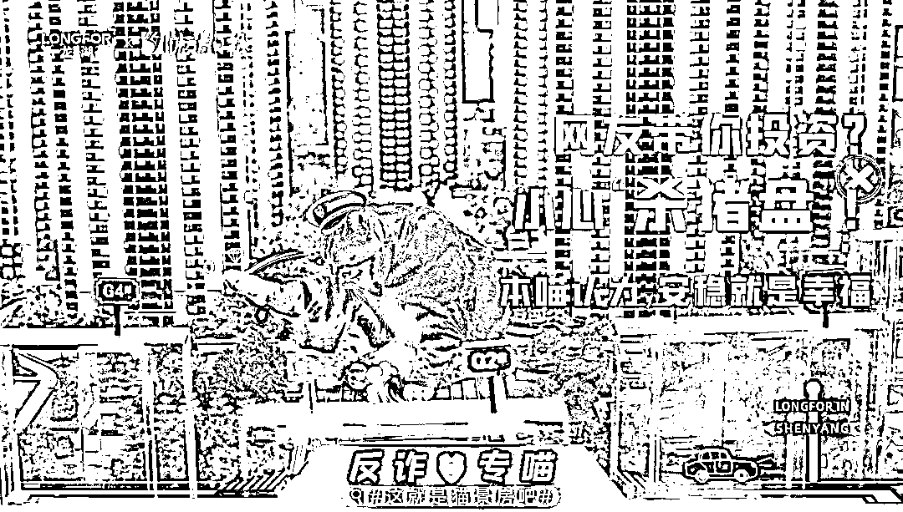
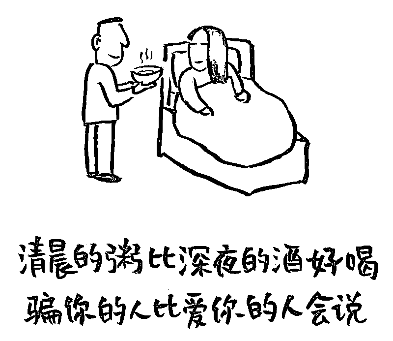
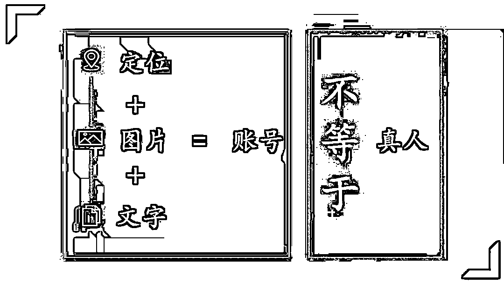

# 梦见网恋男友骗自己 40 多万,一问民警,还真是!

> 原文：[`mp.weixin.qq.com/s?__biz=MzIyMDYwMTk0Mw==&mid=2247535393&idx=7&sn=a6877cedb2b1632fddd1581e78c73d8a&chksm=97cb8019a0bc090f70000cec559224e53a0e775188da0d29a7091796fcedd381724d26debadd&scene=27#wechat_redirect`](http://mp.weixin.qq.com/s?__biz=MzIyMDYwMTk0Mw==&mid=2247535393&idx=7&sn=a6877cedb2b1632fddd1581e78c73d8a&chksm=97cb8019a0bc090f70000cec559224e53a0e775188da0d29a7091796fcedd381724d26debadd&scene=27#wechat_redirect)

没有安装反诈 APP，从未认真学习防骗知识，

**骗子网友“托梦”说出真相，她找反诈民警“解梦”，**

结果， ”梦想成真“了！

这不是编出来的故事…………

今年 4 月，家住辽宁朝阳的韩女士来到公安机关报警，

说自己做了一个梦，梦见和她正在网恋的男朋友是个骗子，

韩女士之前在这名网友的游说下，参与了理财投资，

她怀疑自己遭遇了诈骗。

您还别说，韩女士的梦做的还挺准。

经警方查证，韩女士遭遇的就是警方天天宣传的**”杀猪盘“诈骗**。

然而，早在韩女士报警前 2 天，朝阳警方就已经对她进行过电话预警，

但当时被恋爱冲昏头脑的韩女士，”有理有据“地驳回了民警的劝阻，

坚称自己能够做出正确的判断……

这到底是怎么一回事捏？

今年 2 月，单身的韩女士在某婚恋网站上注册了账号，希望寻求一位伴侣，但注册后却一直无人问津。

直到 4 月，一名自称婚恋网站“导师”的人与韩女士取得了联系，电话中，“导师”向韩女士推荐了一名“成功男士”，

称其早年间在深圳打拼，是一名金融领域的精英，目前在朝阳某证券公司上班，并准备定居朝阳。

“导师”夸赞韩女士条件优秀，与对方郎才女貌，很是合适，随后，“导师”还向韩女士发送了几张“成功男士”的照片。

**（骗子使用的照片是小红书 APP 上的一位网红大叔，帅得很，知名度也很高，小编漫画了一下他的形象...****）**

照片中的“成功男士”优雅帅气，风度翩翩，韩女士想，这不就是标准男友的最佳典范吗？

紧接着，韩女士添加了对方的微信，交谈中得知，这位“成功男士”名叫“李威”，身价不菲，能力过人，且热爱朝阳这座城市，为心中佳人愿长久定居。

为了证明自己，还向韩女士发来了身份证照片

骗子 PS 出来的假身份证

一时间，韩女士被“李威”迷得晕头转向，马上与他确定了恋爱关系。

甜蜜的时光总是短暂的，因为骗子的耐心有限。

几天后，“李威”见时机成熟，便露出了其“李鬼”的真面目。

据韩女士称，“李威”向其推荐了一款名为**“Fbsex”的 APP**，并称要指导韩女士做虚拟货币投资。

想着有金融精英男友做后盾，肯定稳赚不赔，韩女士便大方地向该 APP 内投资了 3 万元钱。

果不其然，短时间内，韩女士的投资便获利了 2702 元。原来自己的“男朋友”能够领先同龄男人走向人生巅峰，是这么做到的！

想到这里，韩女士对“李威”的爱意更甚从前。 

在接下来的时间里，韩女士先后将自己的全部积蓄共计 33 万元全部投入该 APP 中意图获利，APP 账户内短期便产生了”18 万元的收益“。

就在韩女士沉浸在爱情事业双丰收之时，反诈民警却“不合时宜”地打来了劝阻电话，民警告知韩女士，她可能正在遭遇电信诈骗，立即停止当前的操作。

听完民警的话，韩女士可太生气了，**警察这不是见不得别人好吗！**于是韩女士在电话里毫无情面地拒绝了警察的好意，并坚定地告诉民警，**自己没有被骗，是正常投资。**

放下电话，韩女士转身又投入到**“爱情与事业”**之中。好在韩女士还算是个懂得知足的人，看着自己的账户余额内 51 万余元的数字，她准备就此收手，提现过日子。

到手的钱骗子怎么还能吐回去？就在韩女士提现时，系统却显示**操作失败**，据韩女士称，当时客服给出的答复是**“因其账户被冻结导致提现失败，需再次充值 10 万元将账户激活”**，韩女士又将 10 万元潇洒地打入了骗子的账户之中。

当晚，韩女士做了一个梦，梦里她发现自己被诈骗了，她无助，绝望，想哭喊却没人听得见。

惊醒之后，她觉得事有蹊跷，认为自己做梦一向很准，**警察有可能骗人，自己的梦是不会骗自己的。**于是第二天一早，她来到了公安分局。

韩女士的梦这次真的很准，她不听劝阻只信命的行为，妥妥地坑了自己，前后共计损失了 43 万余元。目前，朝阳警方已立案侦查。

****

**再次提醒：**

**趋利避害，**是所有诈骗的根源。

上百种诈骗手段，无外乎围着这四个字转圈圈。

爱情也好，事业也罢，从小就都明白“天上不会掉馅饼”的道理，为什么越长大就越糊涂呢？

最后，简单粗暴一点：

**网恋，见不到面的，就视对方为骗子，**

**只要对方提到赚钱，就要****坚决拉黑**！

来源：朝阳微警事，沈阳公安反电信网络犯罪查控中

更多精华好文，请点击关注

← 向右滑动与灰产圈互动交流 →

