# 工厂周边百名儿童流鼻血 比亚迪陷污染指控后承诺彻底整改｜独家

> 原文：[`mp.weixin.qq.com/s?__biz=MzIyMDYwMTk0Mw==&mid=2247535433&idx=1&sn=66000cc1ec1208c31c3444eb65d209d5&chksm=97cb8071a0bc096768317500a5d1c04e5e1714f9ef040db44b5b79685ecfb8d57df1c7a92827&scene=27#wechat_redirect`](http://mp.weixin.qq.com/s?__biz=MzIyMDYwMTk0Mw==&mid=2247535433&idx=1&sn=66000cc1ec1208c31c3444eb65d209d5&chksm=97cb8071a0bc096768317500a5d1c04e5e1714f9ef040db44b5b79685ecfb8d57df1c7a92827&scene=27#wechat_redirect)

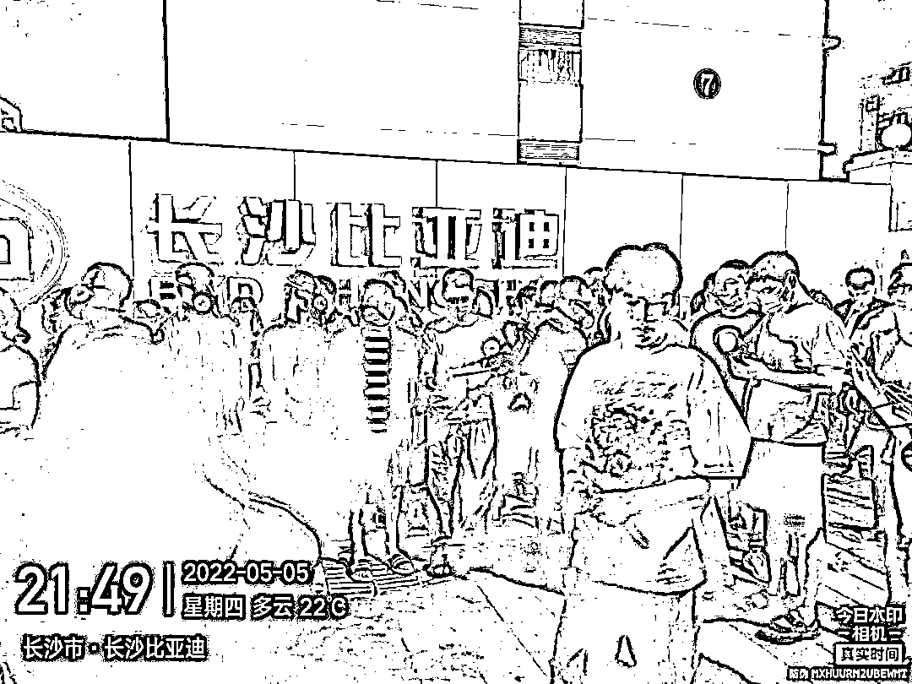

5 月 7 日，据中国慈善家杂志报道，长沙比亚迪雨花区工厂（下称长沙比亚迪）陷入环境污染漩涡。 

凤凰网新视界了解到，近两个月，比亚迪长沙工厂附近有**浓烈的油漆味、烧塑料味、牛粪味等刺激性气味，傍晚至第二天凌晨刺激性气味最重。**工厂附近的十几个小区，中建嘉和城，中建凤凰台、联盟佳苑、奥园、中航城、新兴小区、长潭家园、恒大城、博长山水香颐、碧桂园南城首府小区的一千多位居民称受到影响。

**与此同时，周边小区上百个孩子出现不明原因鼻出血，**大人也出现**恶心呕吐、久咳不愈等症状**。

**一份小区居民提供的调查问卷调查显示，嘉和小学，嘉和城小区靠南边的 27、28、29、30 栋楼，距离比亚迪工厂更近的景环小区，出现不适症状的居民最多。南风吹来的时候，这三个地方均处于比亚迪工厂的”下风向”。**

在中国慈善家杂志的报道中，也将这股刺激性气味的源头指向长沙比亚迪工厂。

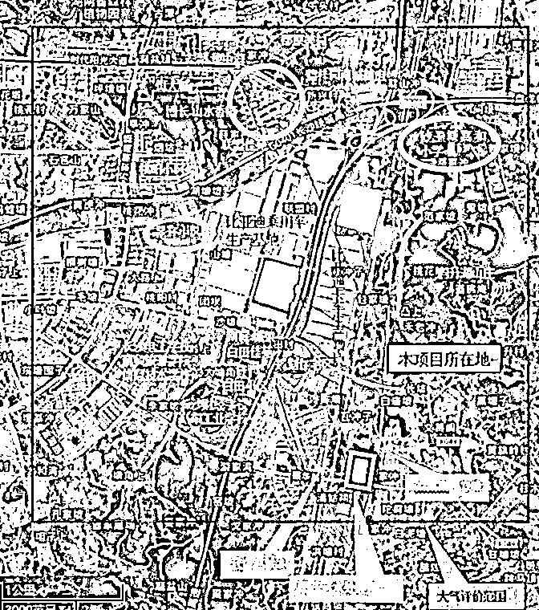

嘉和城小区业主提供给凤凰网新视界的 2 份视频和 1 份录音中显示，**雨花区生态环境执法大队罗队长也向居民表示，“可以闻到小区的刺鼻气味，该气味在比亚迪工厂、距离比亚迪更近的景环小区也能闻到。”**

**百名儿童不名原因鼻出血**

5 月 5 晚，袁群第三次与该工厂交涉。她是长沙中建嘉和城小区的居民，也是嘉和小学 2004 班学生小糖的家长。

第二天早上，她 7 岁女儿小糖第三次鼻出血，最严重的一次是 4 月 9 日早上，当时小糖在家中睡觉，袁群去看时，女儿的鼻血已经流到了床上、衣服上。

小糖的同学，最近也密集出现了鼻出血症状，有的在学校，有的在家中。小糖托管班老师给出的统计数据写着，多位儿童在托管期间有鼻出血症状。

袁群告诉凤凰网新视界，**小糖班里有 44 名学生，有 21 人在近两个月内出现多次不明原因流鼻血的症状，数量几乎占了总人数的一半。**该校老师表示，30 多年教龄，50 多年的人生，没从见过在嘉和城这么多孩子这样“流血”。

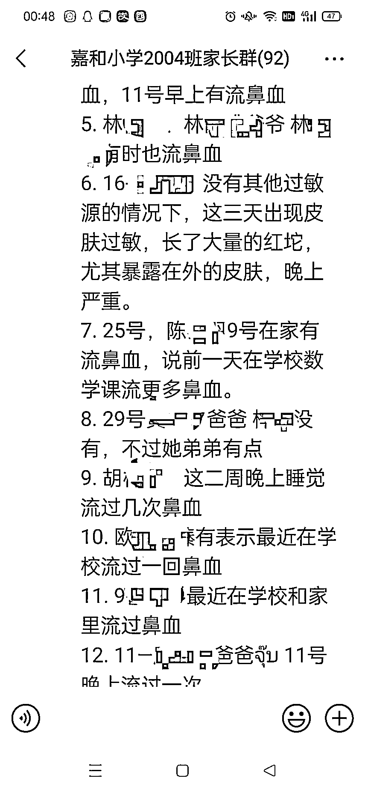

**图|****受访者供图**

刘军与袁群同小区，他的 2 个孩子也未能幸免，1 个月内 4 次鼻出血。5 岁女儿鼻出血时间是 4 月 3 日晚、4 月 12 日早上，儿子是 4 月 10 日早上、4 月 15 日傍晚。

黄女士儿子，4 月流了 4 次鼻血 。她称基本活动都在小区里，白天多次闻到油漆味、烧焦的塑料味，闻之恶心想吐。晚上睡着、凌晨都能闻到异味，早上起来乏力、喉咙干痒 。 

凤凰网新视界获得的一份刚传出不久就被暂停的“接龙”信息显示，短时间内就有 47 条反映孩子出现咳嗽、流鼻血的症状。**据凤凰网新视界统计，附近小区有上百个孩子陆续出现不明原因流鼻血，其中，最小的孩子只有 1 岁多。**

袁群近两个月，也出现过近五次呕吐和头晕症状，另外喉咙长期干痛，咳嗽。最严重的一次是 3 月 22 日，袁群在家中晕倒，还打了 120 急诊就医，但未查出原因。

另一位居民提供的 4 月 22 日的病历写着，**小区出现刺激性异味，闻及恶心、咽喉不适，过敏性鼻炎。**

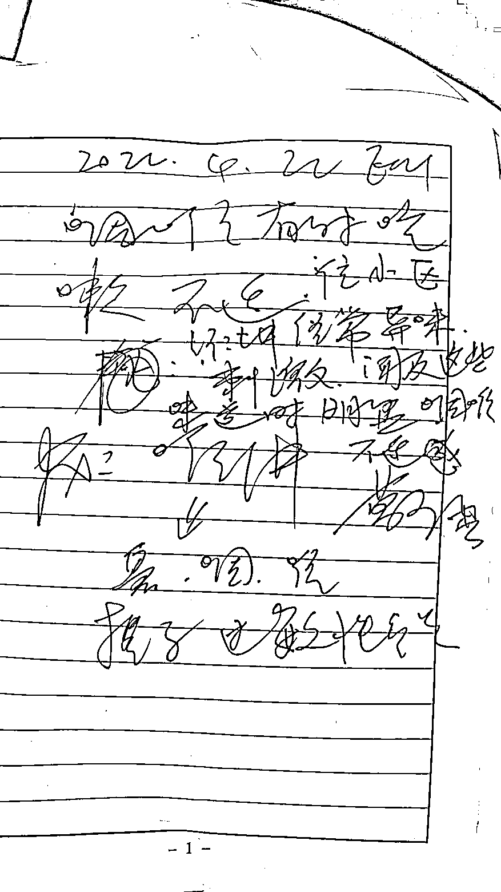

恐慌情绪进一步蔓延，一位居民告诉凤凰网新视界，**该小区出现了两位白血病患者，都是只有一岁多的孩子，这让大家更担心了。**“要是小孩真的得了什么病，得了什么癌症，谁来承担家庭的的损害？”

家长们多方寻找原因，最终将矛头指向了附近的比亚迪长沙工厂。他们认为，刺激性气味与比长沙亚迪涂改车间排放废气味道相似。

**“刺鼻气味”从何而来**

据中国慈善家援引汽车行业业内人士观点，在汽车生产制造过程中，涂装等环节经常会使用到大量的化学产品，产生大量污染物，如果处理不当，对周边大气和水体会带来影响。

**但引发刺激性气味、儿童鼻出血、大人呼吸道不适的根源到底是什么，可能需要作为利益相关方的业主自己去寻找和认定。对于无专业背景的居民来说，建立完整证据链可能并非易事。**

清华大学公共管理学院副教授贾西津在接受凤凰网新视界采访时表示：“从视觉、听觉、嗅觉这些可见的途径上，已经发现有这样的可能性，可以继续沿着这个方面去或者证实或排除。**如果出现群体性健康状况，家长寻找环境因素，这是一个合理怀疑。”**

北京师范大学中国社会管理研究院/社会学院副教授韩俊魁告诉凤凰网新视界，需要先确认污染源是水、空气还是因为气候，确定因果关系后，再考虑走公益诉讼司法程序。

贾教授认为，这种大规模健康性问题，首先考虑的不是个体性因素，而是涉及到他们所共属的环境，包括食物、水、空气、辐射源、污染源等，都是有可能的。

她建议，居民们既要去寻求政府相关部门帮助，拨打 12345，联系环保部门、规划部门、质检部门，也需要与管理部门沟通，寻求开发商、物业等帮助，还可以联系更专业的环保组织、相关律师帮助，寻找到底是标准问题、规划、审批、环评问题还是检测问题，必要时走公益诉讼司法程序。

贾西津建议，家长可以申请公开环评标准、环评结果、环评程序，这样就能获得更多的信息并查验。**或者出钱找权威检测部门检测，如果检测标准和结果与官方公布的不一样，可以比较出来。**

目前，除公益诉讼及自发检测外，嘉和城的居民已经走完了上述所有流程。

根据国家汽车制造厂卫生防护距离标准，汽车厂与居住区位置，应考虑风向频率及地形等因素的影响，以尽量减少其对居住区大气环境的污染。该标准根据不同风速，规定工厂与居住区的距离从 300 米至 500 米不等。

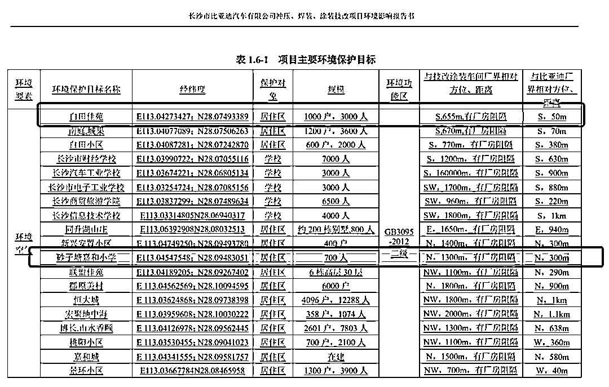

**而比亚迪工厂距离有些小区甚至只有 40 米、50 米，距嘉和学校仅有 300 米。**

比亚迪提交的工厂环境影响报告中将距工厂最近距离只有 100 多米的嘉和城小区列为**在建**状态，但据凤凰网新视界了解，该小区 1 期 2018 年 12 月**已交付**，2 期于 2019 年 11 月交付，入住用户 3800 户，入住率已达 60%以上。

而根据比亚迪涂装项目环境影响报告，原环评批复要求，车间边界 400 米范围为防护距离，**禁止新建居民区、学校等环境敏感建筑。**

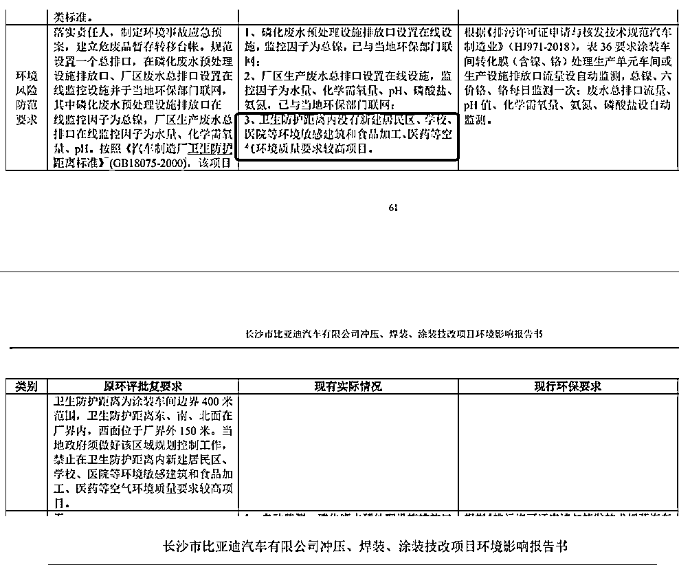

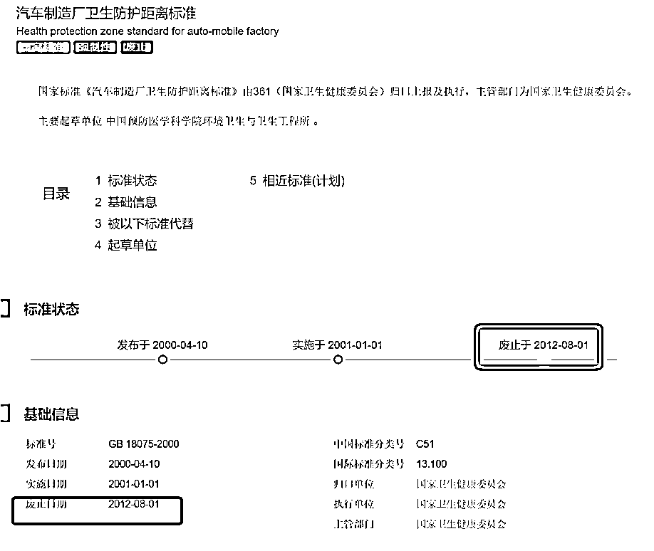

该报告采用的还是 2012 年已被废止的汽车制造厂卫生防护距离标准（GB 18075-2000），而按照 2021 年 6 月 1 日起施行的大气有害物质无组织排放卫生距离推导技术原则（GB/T 39499-2020），生产大气有害物质的生产车间的边界应至敏感区边界最小距离。

该环评报告也明确指出，**存在环保问题，挥发性有机物（VOCS）未采取处理措施。**

**产量的 AB 面**

刘军的学区房距离学校 100 米，正对着比亚迪长沙工厂，两个孩子在离工厂更近的嘉和小学上学。2019 年搬到这个小区后，刘军两个孩子都曾流过鼻血，但从未像 3 月、4 月这么密集、严重。

他的房间推开窗就能看到工厂，**他观察到，近两个月，工厂经常直到凌晨 4 点半还是灯火通明，早晨 7、8 时又开工了。**

这与多位嘉和城业主的说法吻合，搬来后该小区会偶尔出现臭味，但此前还未严重到“让人呼吸一分钟都难以忍受”，今天 3、4 月刺激性味道加剧，严重到让人“忍无可忍”。

**刘军认为，前几年比亚迪产量没那么高，所以没那么大排量，随着今年产量指数飙升，污染也在加剧。**

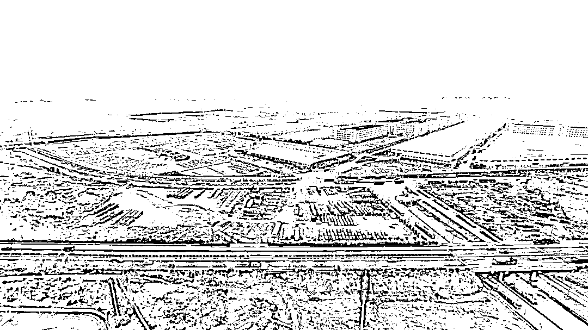

**图|****嘉和城居民在家中拍摄的比亚迪工厂，左下角为小学操场**

根据 2021 年乘联会信息统计，比亚迪 2021 年新能源汽车销量达 58 万台，居国内新能源市场第一位。**2022 年仅第一季度，销量就比去年半年的销量还要高，**就达到了 39.24 万辆，其中 3 月、4 月 DM 插混系列车型共同比猛增 615.2%、313.22%。

卖完车，如何交付就成了最大的问题，4 月 22 日，一则比亚迪车主等待 262 天提车后，给 4S 拉横幅致谢的图片火遍抖音，动辄 3 到 4 个月的交付期，招来了比亚迪消费者的不满。

目前，比亚迪累计未交付订单量达到 40 万辆，且仍在逐月增加。

**DM 插混系列车型这 6 倍、3 倍增长的销量，如何交付？哪里的工厂产量能跟上？**

**这一重任的压力落在了号称“产能最大的”比亚迪雨花区工厂身上。**

比亚迪工厂 2009 年就已经落地到了长沙雨花区，2021 年，比亚迪推出了 DM-i 超级混动系统，长沙雨花区工厂是比亚迪 DM-i 的主要生产基地，也是比亚迪混合动力系统目前在全国唯一的生产基地，总投资 37 亿元，占地 650 亩，建筑面积 60 万平方米，分两期建设。

一期于 2021 年 1 月启建，7 月便建成投产，承担“三电”核心部件电机的生产与组装（电池、电机、电控及芯片，是新能源汽车全产业链的核心技术）。

据湖南日报报道，雨花经开区工作人员“白+黑”“5+2”奋战，两个月内为这个一期项目腾地。目前，该项目已形成月产 6 万套电动总成的生产能力，全面配套比亚迪汽车所有 DM-i 车型，车间内 5 条生产线同步开工，每 3 分钟便能下线一台电机。

二期项目也已有部分车间、厂房完成建设，预计今年 5 月项目正式投产。项目全面投用后，长沙比亚迪成为集团**车系产品最多、产能最大的生产基地，可实现年产新能源汽车 60 万辆以上。**

**产量拉满的另一端，可能是环境问题。**

比亚迪 2011 年深圳工厂故事似乎在重演。

彼时，比亚迪曾计划斥资 82 亿元，在深圳市龙岗区宝龙工业区兴建一座新能源材料基地，号称“世界最大的新能源电池厂”，项目用地距离周边居民区仅百余米，一路之隔的邻居们对污染隐患强烈抗争。

当年 10 月，该计划被叫停，11 月，该规划被变更。变更规划后，被移除的生产环节搬往了其他地区，其中，也包括长沙。

2019 年长沙市生态环境局官网上公布的《长沙市省级环保督察反馈问题第四十七项整改情况公示》显示，长沙比亚迪因喷涂车间生产废气排放的污染物影响附近居民生活**被作为重点被投诉企业，被纳入重点监管对象。**

在湖南省生态环境厅官网上，一份 2021 年 5 月 8 日群众信访举报转办和边督边改公开情况一览表显示，对于**长沙市雨花区比亚迪制造厂涂装车间油漆味严重、影响居民生活问题，经雨花经开区管委会、同升街道、区生态环境分局、区生态环境执法大队联合调查核实，情况基本属实。**

今年年初，长沙市生态环境局发布了 2021 年长沙市重点企业挥发性有机物综合整治情况公示，其中有 28 家单位，长沙市比亚迪汽车有限公司位列其中。

**要福不要“毒”**

**4 月 25 日、4 月 27 日、4 月 29 日、5 月 4 日、5 月 5 日，**居民与包括比亚迪在内的涉事各方曾因此事进行过多轮协商，但未达成一致。

4 月 25 日，雨花区生态环境执法大队到嘉和城核查，称可以闻到小区的刺鼻气味。

执法大队罗队长表示，“领导很重视，想帮忙解决，目前还在努力当中，下一步，会继续把民生问题放第一位，该报告的报告，尽最大能力做好自己工作。”

4 月 27 日，比亚迪在嘉和城张贴三月份环境检测报告，报告称比亚迪的排放符合标准。

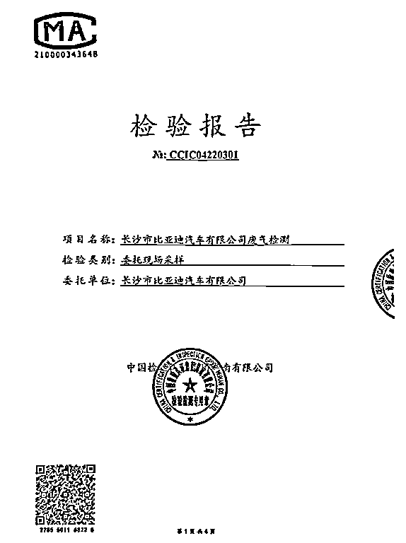

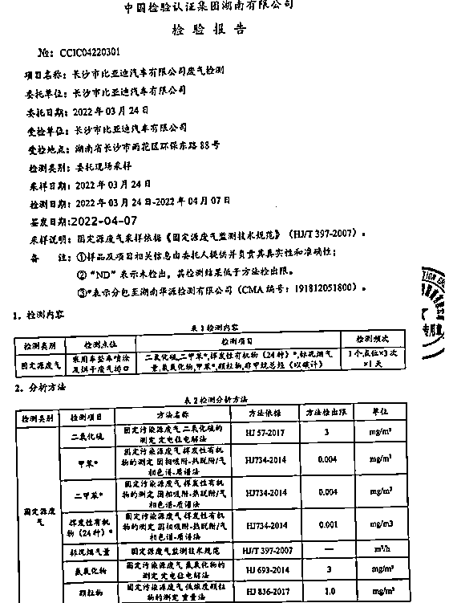

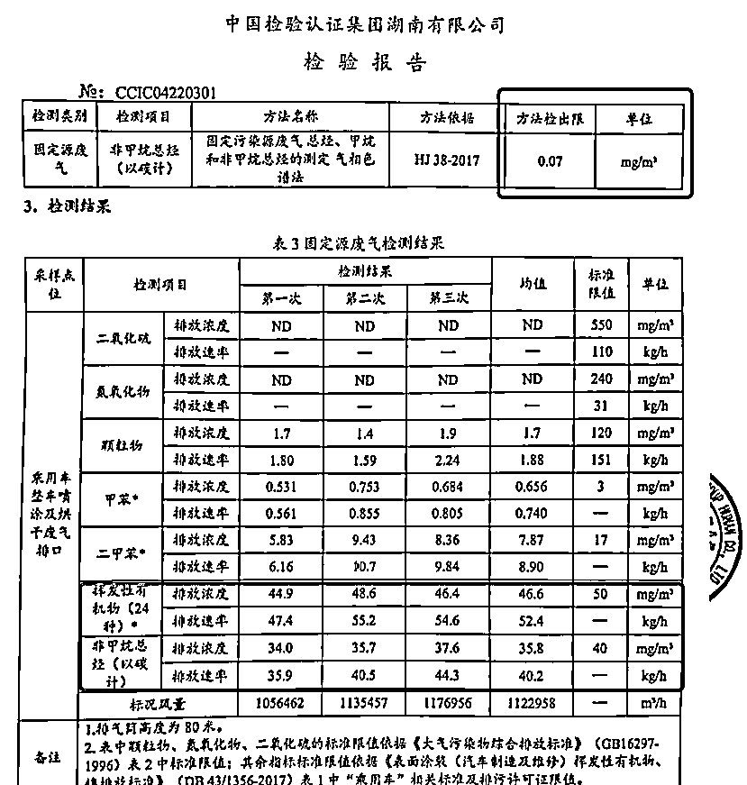

但业主不认可该检测报告。

他们认为，**在检测时间上，刺激性味道最重的时间集中在傍晚至第二天早上，但该报告可能“恰好”避开了这个时间段，将时间选在了“可控”的白天。**

4 月 29 日，社区组织区环保执法大队、比亚迪公司、职业病医院、二期环评单位与业主代表进行第一次会议，小区业主希望公开标准，在监督下重新对环境检测。

在沟通会上，环保部门及比亚迪公司代表承认小区能闻到异味。

五一假期期间，有居民称因工厂短暂休息，小区里刺鼻的味道得到了轻微缓解。

5 月 4 日晚，随着工厂复工，刺鼻的味道再次出现，一些居民，称五一假期在外出游身体正常，回到小区 1 天就开始流鼻血。

居民周粥表示，其爱人五一节后从常德回长沙家中后，出现 2 次鼻出血症状。刘军近一月久咳不愈，五一在老家待了两天症状缓解，回来后症状又开始反复。

据据中国慈善家杂志报道，此前环保部门代表曾告诉居民，如果下次再闻到刺鼻气味可以打电话给他们，环保部门随时派人检测。但居民打电话给雨花区生态环境执法大队，一位负责人到达现场后，承认闻到气味，但因没有带仪器设备未能检测。

居民自购了检测设备，测量结果也证实了他们的担心。根据国家相关标准，室内 tvoc（总挥发性有机化合物）值等于或小于 0.60mg/m3 才算安全，而有居民自行检测的该值为 1.015mg/m3。

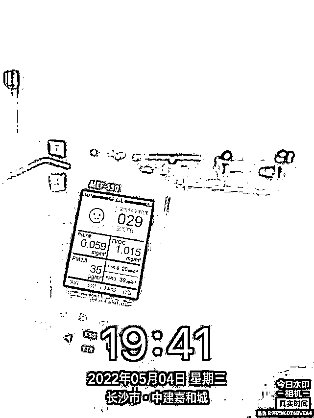

5 月 5 日晚，刺鼻的味道加重，点燃了业主的怒火，业主们再次到工厂附近集体抗议，打出“要福不要毒”的标语。

**“福”既是比亚迪总裁王传福的名字，也代表了当地对比亚迪带来的经济价值、商业价值、就业价值的认可，“毒”则代表了居民对企业可能带来的环境问题的担忧，对生命健康的担忧。两者并非完全对立，如何平衡两者之间的关系，是企业需要认真思考的问题。**

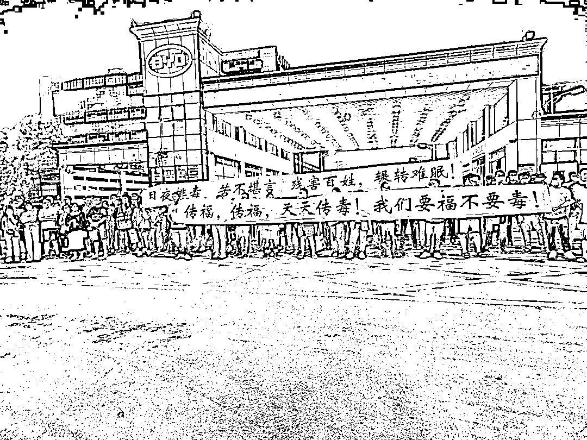

**“有毒的食品我们可以不吃，有毒的空气我们如何能够不闻？我们等得起，我们的孩子等不起。”**5 月 6 日，嘉和城小区的居民在联名抗议书中这样表示。

业主诉求很明确：

1.严查废气扰民原因，查明并公布刺激性气味的主要成分、污染来源；

2.公布此前对比亚迪废气监测“合格”结果的相关检测数据、检测方法、检测标准；

3.重新启动对比亚迪的废气排放监测，监测时间、采样地点、监测方法、数据结果，接受小区业主监督；

4.对 Vocs 排放进行技术整改，整改完成之前不予排放。**不能整改的车间，必须搬离。**同时，对比亚迪厂区后续建设项目，暂缓批准。

凤凰网新视界就比亚迪长沙工厂废气排放问题咨询了长沙市雨花区环保局，得到回复，“环保局无执法权，建议去咨询生态环境执法大队。”

凤凰网新视界联系到了雨花区生态环境执法大队，但对方称在开会，拒绝回应。

凤凰网新视界多次拨打长沙市环境监察支队、长沙市规划监察执法支队雨花区大队电话，无人接听。

针对工厂附近数千名居民反馈的百名儿童不明原因鼻出血与比亚迪的相关性；居民提出的环评诉求；居民在工厂集体抗议后比亚迪的相关举措等问题，我们联系到了比亚迪，并将上述问题发给了对方。

**截至发稿前，对方暂未回应。**

凤凰网新视界独家获得了一份比亚迪长沙地区总经理朱斌 5 月 5 日与居民的沟通录音。

居民代表称，“因为你们的产量，你们的销售量，牺牲我们的健康。我们一天都忍不了了，你知道三个月对我们来说，还有点风险吗？**有多少家庭因此生病吗？你们只管赚钱。”**

比亚迪长沙地区总经理朱斌表示，“一期项目前期的量是大，大家可能觉得还是个隐患，怕万一我们哪天又开始大量生产。**但我们前前后后投了可能有 100 多个亿，停产掉不太现实。****公司现在请了专业团队给我们做一个方案，希望 5 月份把整改方案做出来，尽量减轻到你们体验不出来。**”

比亚迪承诺，一期项目将彻底整改，将整改周期压缩到最短。二期 4 月 30 号已经完成了设备安装，现在在调试，调试还要最后的三个月，需要有个过程，一步一步来改。

5 月 6 日，景环小区业主代表小京告诉凤凰网新视界，她刚参与了与比亚迪最新一次的沟通，比亚迪在当晚 8 点临时决定，不再在晚上排放废气。

当晚十点，小京开窗通风，觉得刺激性味道减轻了很多。7 日，其他居民也有类似的感受。

（应采访者要求，刘军、袁群、小糖、黄女士、周粥等为化名。）

凤凰网《新视界》出品作者 | 季倩编辑 | 于浩微信编辑 | 杨倩

更多精华好文，请点击关注

← 向右滑动与灰产圈互动交流 →

