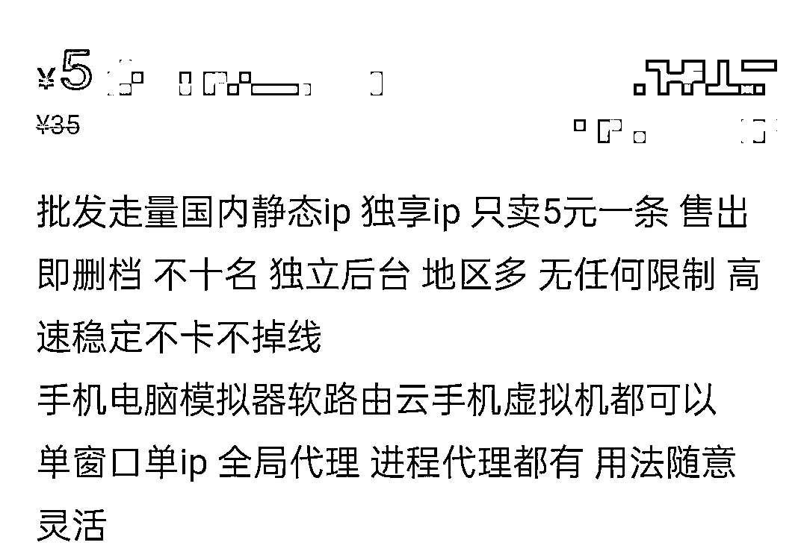

# IP 属地显示催热的 IP 代理，会扒拉你的隐私

> 原文：[`mp.weixin.qq.com/s?__biz=MzIyMDYwMTk0Mw==&mid=2247535433&idx=5&sn=06469cb74725e5c595461af1dbd18679&chksm=97cb8071a0bc0967a0c25203f896ac389cbc09906d6c9483f78c38215d08f16aa7b8d304a3d5&scene=27#wechat_redirect`](http://mp.weixin.qq.com/s?__biz=MzIyMDYwMTk0Mw==&mid=2247535433&idx=5&sn=06469cb74725e5c595461af1dbd18679&chksm=97cb8071a0bc0967a0c25203f896ac389cbc09906d6c9483f78c38215d08f16aa7b8d304a3d5&scene=27#wechat_redirect)

随着微博、抖音、小红书、快手、知乎等平台逐步上线 IP 属地功能后，一众“身在海外”的“大 V”、网红纷纷现出原形，暴露了自己的国内 IP 属地。

一时间，有人在嘲笑翻车的网红，有人在担心自己的隐私是否因此泄露，也有一些人，在悄悄地修改自己的 IP 属地。

**IP 属地功能催热 IP 代理服务**

**5 日，有媒体报道称，随着各大平台 IP 归属地功能的上线，付费 IP 代理的生意红火了起来。但实际上，早在 3 月微博开始尝试在部分领域显示 IP 属地时，就已经有人在修改微博 IP 地址。**

**3 月 17 日，“微博管理员”发布声明称，“近期，俄乌局势和国内疫情等热点事件频发，引发网友高度关注讨论。站方在加强违规信息排查处置的同时，发现仍存在个别冒充当地网友发布和传播不实信息的行为，为更好维护传播秩序，站方在前期功能基础上，将于未来一周上线‘用户个人资料页展示近期发帖所在地’的功能。”**

**“一开始发现有很多散布不实消息的微博账号 IP 归属地有问题，但很快这些账号就修改了自己的 IP 属地。”对于微博上线的该项功能，有网友对此表示。**

**这些 IP 是如何被修改的？**

****

**某二手平台上的商家宣传内容。**

**中新财经注意到，在社交平台上，有不少网友询问如何修改自己的 IP 地址。而在一些电商平台上，IP 代理修改服务已悄然上线。**

****服务器只要一个月十几元****

****“想找此类业务，首先要搜对关键词。”尽管目前不少电商平台屏蔽了“IP 代理”的关键词搜索，但中新财经尝试搜索了几个关联词，仍然找到了多个提供“IP 代理”的商家。****

****中新财经观察发现，这些商家提供的服务价格不等，往往一天的价格在 4-10 元不等，包月价格平均下来则更优惠。一些提供境外服务器的商家价格明显更贵，一些商家则注明只提供国内 IP 代理服务，并提示禁止用于违法违规行为。****

********

****来自某电商平台的商家宣传。****

****在一些商品页面里，有消费者留言询问，是否可用于修改 IP 地址。而在中新财经询问如何修改 IP 归属地后，有商家直接提供了操作教程。****

****“国内 IP 代理主要是通过国内代理服务器实现。”一位业内人士向中新财经解释了 IP 代理的原理：“用户这边每发一个网络包，会先到代理服务器做拆包和打包，再转发到微博服务器。微博服务器读取该网络包时，获得的是代理服务器 IP，就判为代理服务器的 IP 属地。微博服务器回送包给代理服务器后，代理再转回给用户。”****

****“对专业人士来说，操作难度不大。”业内人士告诉中新财经，“租一个服务器，最便宜的也就一个月十几元钱。”****

******警惕个人信息泄露******

******对于上线 IP 属地功能，不少平台表示，初衷是为了减少冒充热点事件当事人、恶意造谣、蹭流量等不良行为。******

******但有网友对此表示了担忧：“开放 IP 属地，感觉自己的生活隐私被暴露了，也容易挑起地域歧视。”出于种种原因，也有不少网友寻求修改 IP 地址。******

************

******一网友在测试 IP 修改软件。截图自微博******

******然而，修改 IP 地址真的是在保护自己的隐私吗？******

******事实上，使用代理服务器依然存在个人信息泄露风险。中新财经注意到，一些代理服务器登录需要实名制。******

******“相当于你在别人家里，登录社交平台账号密码，别人想看就能看。”业内人士对此形容，“有一些特殊的脚本，也可以查找到代理背后的用户 IP。”******

******来源：中国新闻网，利箭在行动******

******更多精华好文，请点击关注******************

******← 向右滑动与灰产圈互动交流 →******

************