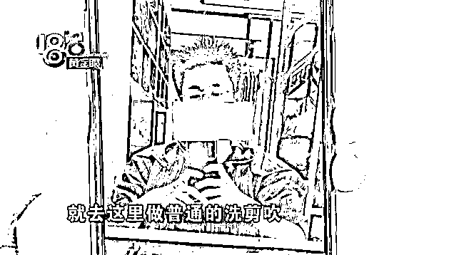
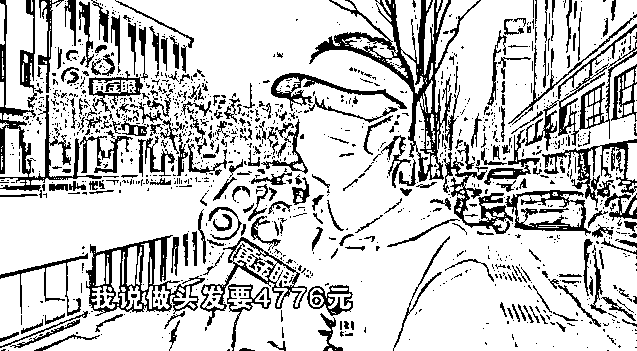
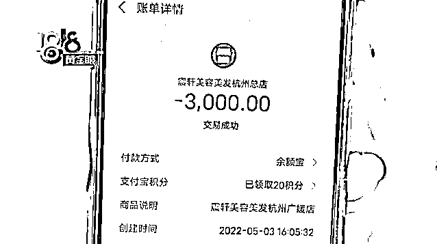
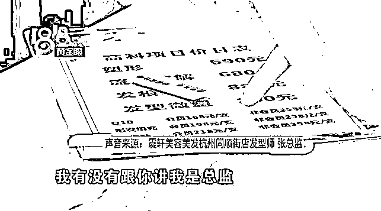
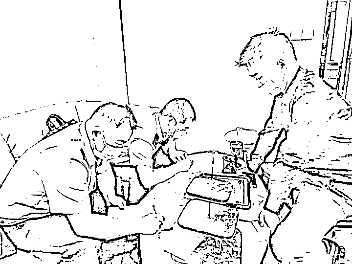
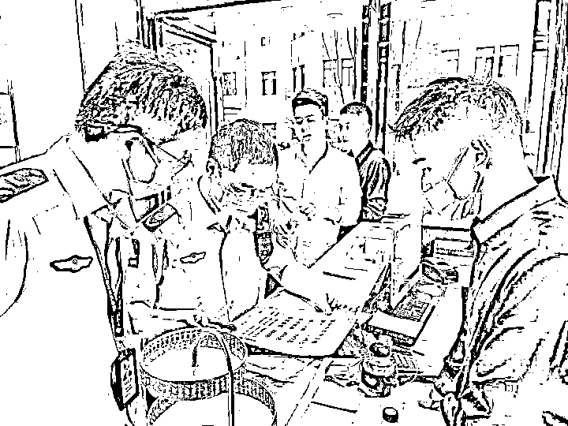
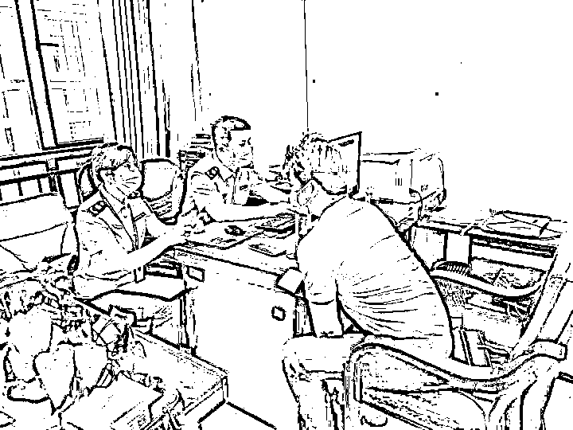
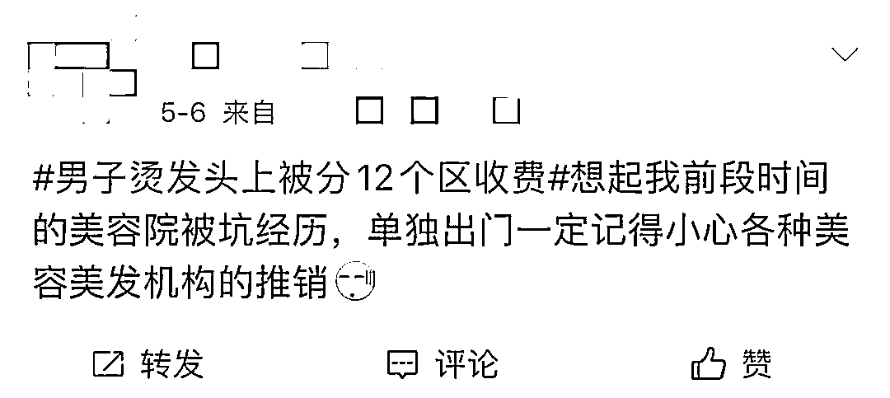
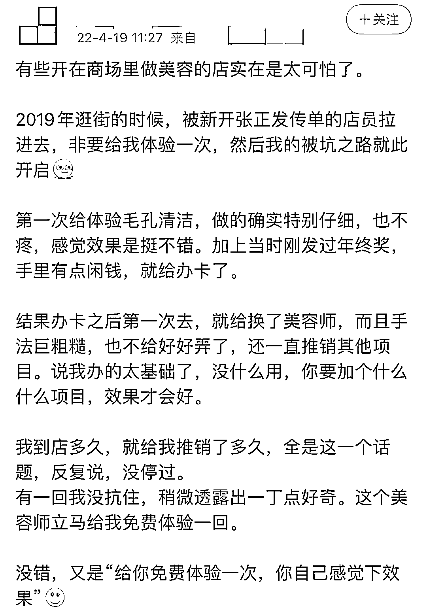
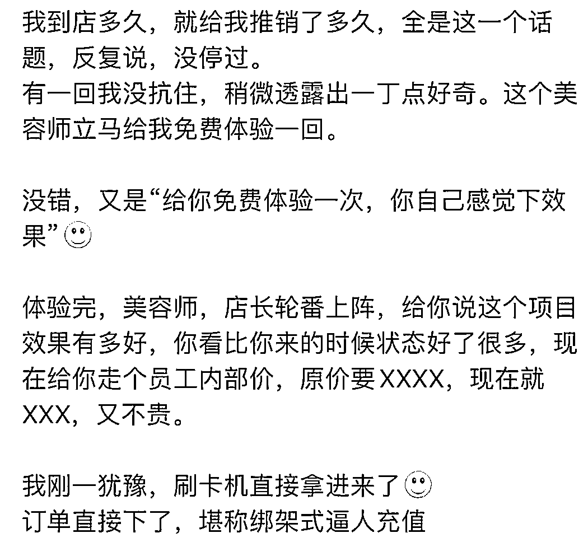

# 坑人！男子烫发被分 12 个头皮区收费，每个区 398 元

> 原文：[`mp.weixin.qq.com/s?__biz=MzIyMDYwMTk0Mw==&mid=2247535433&idx=6&sn=c75083ee6b66a5a7618942d7482e74eb&chksm=97cb8071a0bc0967c9dece2ae46d840f7db1c953327cb20296ebc57bc9dc550e92204e9a4bc5&scene=27#wechat_redirect`](http://mp.weixin.qq.com/s?__biz=MzIyMDYwMTk0Mw==&mid=2247535433&idx=6&sn=c75083ee6b66a5a7618942d7482e74eb&chksm=97cb8071a0bc0967c9dece2ae46d840f7db1c953327cb20296ebc57bc9dc550e92204e9a4bc5&scene=27#wechat_redirect)

最近， 

杭州的刘先生遇到了一件“离谱”事，

他去理发店给头发做造型，

店员报价 398 元的服帖烫， 

收款时却变成了 4776 元。 

店员解释说，

是按区域收钱， 

**刘先生头上被分成了 12 个区域，**

**每个区域都收 398 元！**

‍**‍12 个头皮区域咋分的？‍****‍

据刘先生介绍，他因为头发比较长，就打算做一个普通的洗剪吹，于是到了余杭区同顺街道的震轩美容美发门店做发型。

洗完头后，工作人员推荐做服帖烫。 

由于刘先生是会员，因此参照会员价是 398 元，对此刘先生觉得价格可以接受，因此就同意了。

结果在结束之后看到对账单，刘先生愣住了，**因为店员告知 398 只是一个区域的价格，而刘先生的头皮面积大概比较特殊，总共分了 12 个区域，因此价格是 4776 元。**

********

******被震惊的刘先生当时只能妥协又充值 3000 元，因为店员说当天消费可以打五折。******

********

****据这家震轩的张总监介绍，刘先生当时做的是水光针项目。****

****眼尖的刘先生立刻发现价格和那天店员介绍的并不一样，对此，张总监淡淡且傲娇地说，你看我是什么级别，我有没有跟你说我是总监。****

********

****当面对记者质疑如何分 12 个区的时候，张总监陷入短暂的停顿，然后转身离开。****

****当记者提出想看看当天所用的药水时候，工作人员同样加以拒绝。最终心力憔悴的刘先生得到卡里余额 1200 元的退款。****

******责令停业整顿****** ******5 月 6 日，在监测到一条标题为“男子烫发头上被分 12 个区收费，想打折再办卡”舆情信息后，余杭区市场监管局迅速反应，**连夜出动 4 名执法人员前往案发地点进行检查**，并通过市、区两级市场监管部门联动，合力打响消费者权益保护战。

经了解，该商家存在涉嫌**模糊定价、诱导消费、损害消费者知情权及价格欺诈**等嫌疑。

通过现场取证，执法人员在店中还发现，**涉案产品中无中文标签，包装上均为韩文，涉嫌违法产品行为。**

****

****

****

**针对以上问题，余杭区市场监督管理局作出以下处置：**

 **一、针对上述无中文标签及疑似价格欺诈等问题，执法人员已现场责令该店**停业整顿**。**

**二、针对在该店发现的 3 盒无中文标签的进口化妆品已**立案调查**。**

**三、集体约谈五常辖区美容美发店，着重对《中华人民共和国消费者权益保护法》、《中华人民共和国价格法》、《中华人民共和国广告法》、《化妆品监督管理条例》、《合同违法行为监督处理办法》再次宣贯。**

****责令立即开展自查是否存在以下情况：****

**超出经营范围、价格违法行为、产品质量问题、虚假宣传、预付式消费、销售“三无”产品；**

**为有效避免纠纷，在消费前做到对消费者清楚明示消费项目、单价、总价金额，并由消费者签字确认。**

****消费被“坑”该咋办？****

****不少朋友都有去美容美发被“坑”的经历。****

********

********

********

******被无良商家坑钱该咋办？******

****消费者可利用**12315 申诉平台、12345 市长热线**等维权渠道，对遇到的美容美发行业乱象及时保留类似通话**录音、视频、消费凭证**等证据，第一时间进行举报、积极监督，提供有效证据。****

******你有没有**消费**被“坑”的经历？******

 ****来源：央视网综合都市快报，红网************ ********更多精华好文，请点击关注************************

********← 向右滑动与灰产圈互动交流 →********

****************