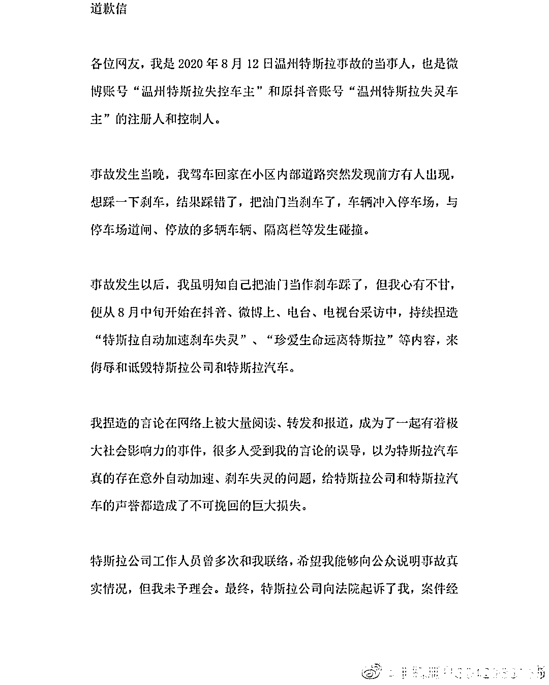
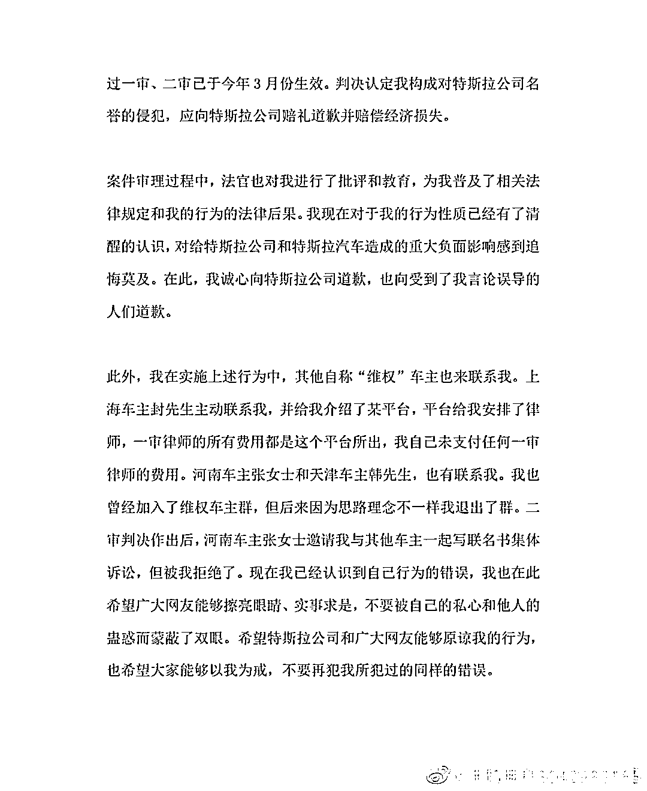

# 特斯拉温州“刹车失灵”车主道歉，承认错踩踏板

> 原文：[`mp.weixin.qq.com/s?__biz=MzIyMDYwMTk0Mw==&mid=2247535510&idx=4&sn=bff3cec29c354dc984801699151b62a4&chksm=97cb80aea0bc09b8e1d28834c19540d98ec8336bc5ee0bd20d61086e90f3cd1e75da693e5e04&scene=27#wechat_redirect`](http://mp.weixin.qq.com/s?__biz=MzIyMDYwMTk0Mw==&mid=2247535510&idx=4&sn=bff3cec29c354dc984801699151b62a4&chksm=97cb80aea0bc09b8e1d28834c19540d98ec8336bc5ee0bd20d61086e90f3cd1e75da693e5e04&scene=27#wechat_redirect)

据北京日报，特斯拉温州“刹车失灵”事件去年被传得沸沸扬扬（**此前报道：[特斯拉深夜道歉](http://mp.weixin.qq.com/s?__biz=MzIyMDYwMTk0Mw==&mid=2247513163&idx=6&sn=261004ccaeee19c8d94432e4ca02d63b&chksm=97cb7f73a0bcf6659e6ff70520ec6ad503a32245ed5fc8355ab05176f0c8c73f8c228e44c4f5&scene=21#wechat_redirect)**）。后经过鉴定，事实与车主描述不符，车主被判道歉及赔偿 5 万元。此后车主上诉，二审被驳回。5 月 9 日，车主发布了道歉声明，承认错踩踏板。

根据道歉声明，这位车主表示，事故发生当晚，在驾车回家时突然发现前方有人，想踩一下刹车，结果踩错了油门。他还表示，事故发生后，虽明知自己把油门当作刹车踩了，但因心有不甘，在多个媒体上捏造“特斯拉自动加速刹车失灵”等内容。

来源：界面新闻

更多精华好文，请点击关注

← 向右滑动与灰产圈互动交流 →

