# 快手小黄车，贩卖的是演技

> 原文：[`mp.weixin.qq.com/s?__biz=MzIyMDYwMTk0Mw==&mid=2247535510&idx=5&sn=85bc3c211c6de78412fa9c62ac60ecc3&chksm=97cb80aea0bc09b81dc49e43ab20c45a95954597bb7100c9bc1d226bf214dba2f18fe674885a&scene=27#wechat_redirect`](http://mp.weixin.qq.com/s?__biz=MzIyMDYwMTk0Mw==&mid=2247535510&idx=5&sn=85bc3c211c6de78412fa9c62ac60ecc3&chksm=97cb80aea0bc09b81dc49e43ab20c45a95954597bb7100c9bc1d226bf214dba2f18fe674885a&scene=27#wechat_redirect)

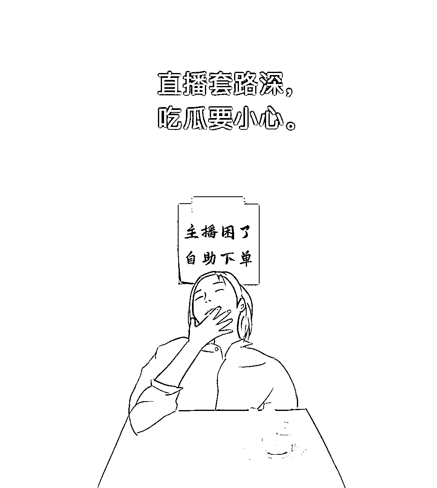

**作者/潘辰  ****编辑/三火  ****排版/张玉琪**

**快手主播千千万，带货直播占一半。** 

**近年来，随着直播带货行业的竞争越发激烈，对着商品进行介绍的带货形式，已经逐渐 Out 了；而今年 3 月底，国家针对直播行业推出的新规，更是给野蛮生长的直播带货，上了一道枷锁。**

**这一背景下，很多直播间里的带货主播，都在另辟蹊径，用更新颖的方式博得流量、招揽顾客。**

**主播二哥家、大姐夫、西贝七郎等人，在打麻将、斗地主、讲故事的同时，通过小黄车获得了不菲的收入；主播启大大、周二、傲娇妹等人，利用亦真亦假的都市爱情故事，来吸引关注；阿浩、野哥、野嫂、猪小妹又饿了等主播，也在众人面前一边吃着美食，一边直播带货。**

**精彩喧闹的浮华背后，直播间里都是生意。**

****

****休闲娱乐来一套****

**被誉为我国国粹之一的麻将，就被一些脑洞大开的主播搬进了直播间，成为了带货引流的道具。** 

****快手主播二哥家，就是一位既能打麻将，又能带货的直播小能手。****

**在他的直播间里，你看不到正在售卖的商品，屏幕前只有一张麻将桌。四个人围桌而坐，抓牌打牌的过程中，麻将牌的碰撞声清脆悦耳。**

**在二哥家的直播间里，五湖四海的老铁们，有时看着手里的牌开动脑筋，想着如何打赢这场逆风局；有时想着下一轮该抓到什么牌，才能胡个大的。**

**却不知，老铁们在评论区争论刚才打出的三筒合不合适的时候，主播已经靠着下方小黄车的商品销量，挣够了今晚牌局的本钱，早已佛系无比了。**

**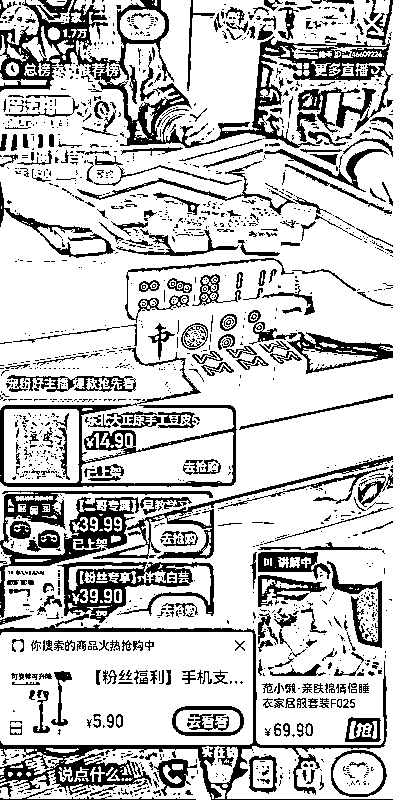**

**麻将能成为直播带货的工具，扑克牌又怎能屈居人后呢？**

****在快手的另一场带货直播中，斗地主这门游戏就成了直播间的主角。****

**在一位名叫大姐夫的主播直播间里，斗地主游戏的背景音乐一刻不停，欢快悦耳的节奏中，围坐一起的几个人，不断用最帅的姿势甩出扑克牌。**

**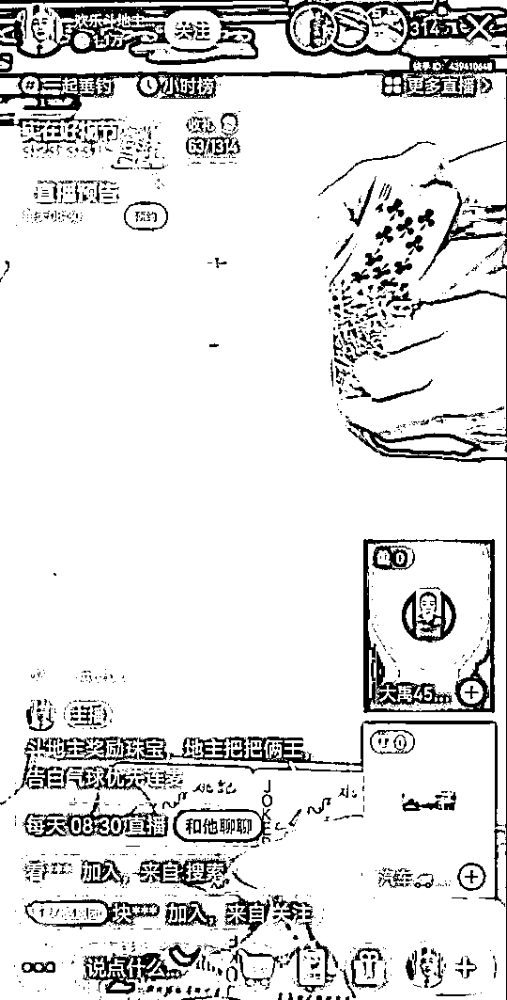**

**而在直播间的评论区，老铁们也聊得热火朝天，几名网友因为刚才要不要出两个 6，已经争论许久。**

**与此同时，直播间里的小黄车，让一些精神紧张的观众，得到了片刻的休息。可以在休闲娱乐的同时，顺便买点商品。**

**一群人的牌艺切磋，足够吸引关注；一个人的故事讲述，同样十分出彩。**

****在主播西贝七郎的直播间里，一切道具都显得无用，主播仅凭一张嘴，就能留住成千上万的观众。****

**屏幕前的西贝七郎，此刻正在为你讲述一段离奇的民间故事，故事的情节扣人心弦。嬉笑怒骂间，一段恩怨情仇正在逐渐展开；横眉立眼间，一场纠纷冲突似乎在所难免。**

**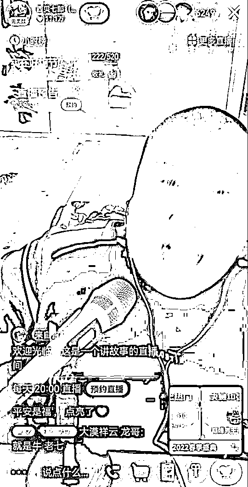**

**而作为观众的你，在为故事主人公担忧的同时，也会猛然发现直播间里，小黄车的颜色实在有些扎眼。**

**有的直播方式是安静的，有的直播方式则动感十足。**

****静静七月的直播间里，五位女士对着屏幕跳起了健身操。律动的节奏、舒展的动作，可能会让你瞬间上头，误以为打开了运动软件 Keep。****

**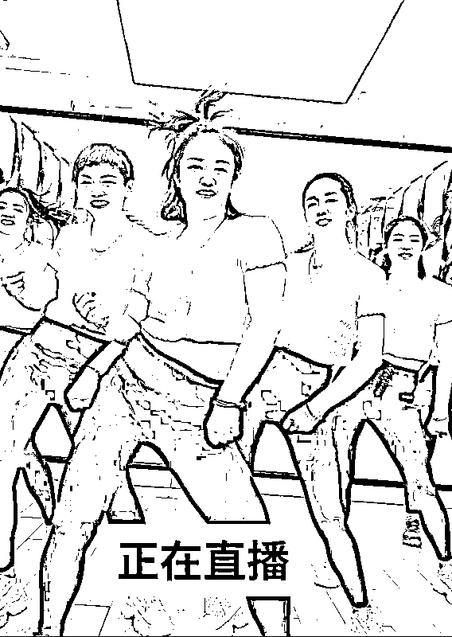**

**但是，在屏幕下方不时蹦出的商品，也在提醒着你，这不是一场单纯的运动教学，挥汗如雨的背后，还有生意在做。**

**对此，有网友在直播间表示：“每次锻炼之后，都觉得自己很辛苦，然后去小黄车里买点东西犒劳自己。”**

****

****热播剧集八点档****

**除了各式各样的休闲活动，爱吃瓜也是人们的天性。** 

**而在一些快手的直播间里，你经常能够看到各式各样的狗血故事，在现实中不断上演。**

****在主播启大大的一场直播中，我们就见识到了琼瑶剧情节的现实直播。****

**这位单手开法拉利的主人公，正在和追求许久的女孩子进行约会。但是，坐在副驾驶的女孩子，在接到了一个电话之后，突然称自己临时有事，执意要下车离开。**

**女孩离开后，独自一人的启大大觉得事情有些蹊跷，于是偷偷跟踪对方，却发现女孩又去见了另外一个男人。**

**愤怒的启大大冲上去和对方理论，一番拉扯之后，才发现女孩和自己约会的目的并不单纯，而那位半路杀出的男士，也只是另一位蒙在鼓里的傻瓜而已。**

**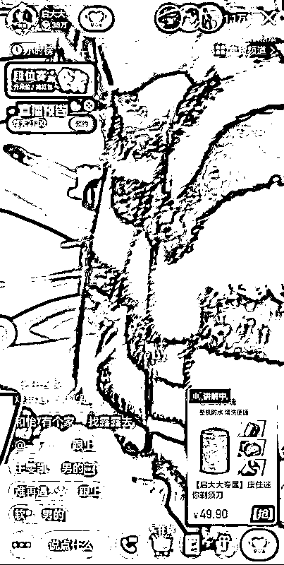**

**见证了一场荒唐的故事之后，直播间的观众们纷纷义愤填膺。不过，下方小黄车又好似在告诉我们，事情远没有那么简单。这场都市爱情故事的背后，很可能只是直播的带货套路。**

**俊男靓女演艺的爱情故事，永远都不会缺少吃瓜看客。**

****在主播周二的一场直播中，对首次与自己约会的女孩子，主播进行了一次拜金测试。****

**周二在约会途中，找借口离开女孩一会儿，然后让好朋友假装富二代搭讪女孩，自己在暗中偷偷观察。****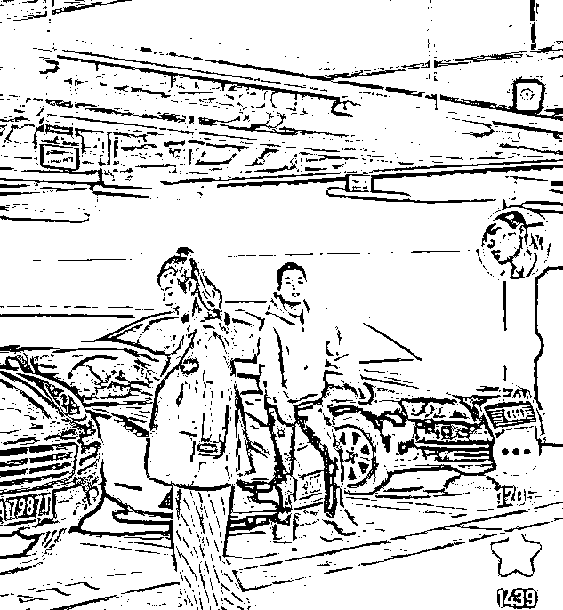**

**在与女孩聊天的过程中，朋友不断彰显自己富二代的身份，还试探女孩是否愿意现在跟自己走。故事的结局，则是女孩没有经过考验，准备随富二代离开；而及时出现的主播周二，也让女孩因此无地自容。**

**只是，在主播和朋友一起对女孩进行训斥，观众纷纷为此唏嘘感慨的时候，直播间里的商品链接，却不时地出现在屏幕上，让人猛然感觉到，事情似乎没那么简单。****越是接近真实的故事，越不会缺少吃瓜看客。******另外的一场快手直播中，两位积怨已久的仇人狭路相逢，互相咒骂、推搡的过程中，上演了一场动作戏。****

**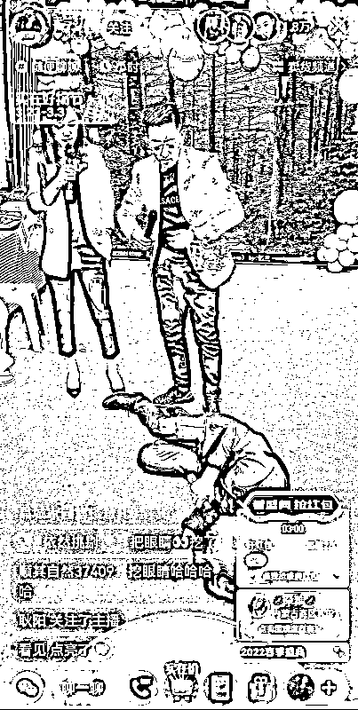**

**两拨人马大打出手，直播间的镜头却纹丝不动。而在拳脚夹杂着的谩骂声中，作为吃瓜群众的你，可能会忽然发现直播间的小黄车里，有瓜子在卖，于是便立刻下单，边嗑瓜子边看热闹了。**

****

****美食最抚凡人心****

**各种各样的现实故事，大都是编造的；而直播间里的美食，则是真实的。** 

**在快手上，还有很多主播靠美食来吸引关注，完成带货直播的引流。**

****主播猪小妹又饿了，靠能吃、爱吃闻名快手江湖。**每次带货直播的时候，猪小妹都会在面前放上一些美食，在介绍商品的过程中，她经常会忍不住吃上几口。****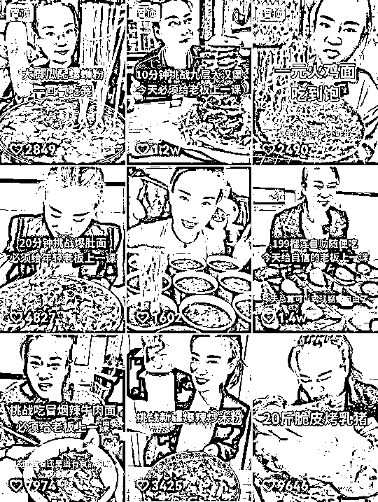**

**长此以往，很多观众来到猪小妹的直播间，不是为了听她介绍商品，就是为了看看她直播的时候，又把什么吃进了肚子里。**

**不过，也有网友感到奇怪，质疑她天天这么能吃，为什么始终不胖呢？**

**有的主播仅仅是自己吃，有的主播还会招上别人一起吃。**

****快手主播阿浩直播带货时，不仅自己经常当众享受美食，还“独乐乐不如众乐乐”，带着几位徒弟一起吃喝。****

**在阿浩的直播间里，我们经常会看到这样一副世界名画，主播阿浩对着镜头卖力干饭，火鸡面、酸辣粉等食物，在他夸张的表现中，不断进入口中。**

**而他的身后，站着好几排徒弟，个个望眼欲穿，努力踮起脚尖、瞪大眼睛，看着他的盘中餐，并且还会不时对他说上一句：“师父，您就让我吃一口吧。”**

**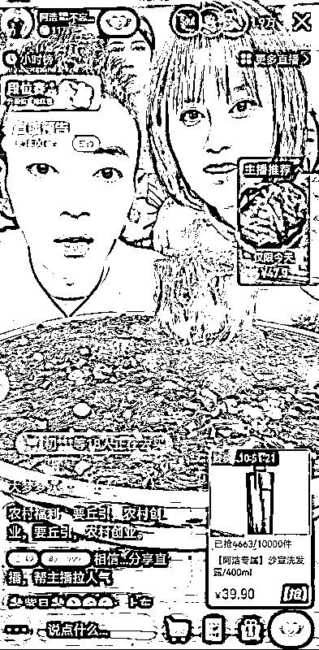**

**不过，在吃吃喝喝完毕之后，阿浩会在休息的时候，对带货商品进行介绍，介绍完一件商品之后，他往往又会拿出新的食材，享受另一种美食。**

****有些带货主播，在享受美食的同时，还会玩出一些新花样。****

**有的主播会在直播时，当众表演绝活。比如，一口吃下一大把金针菇，并且一根金针菇都不会掉落；比如，一口吃下超级变态辣的食物，然后一边流着眼泪，一边对着虚空“喷火”。**

**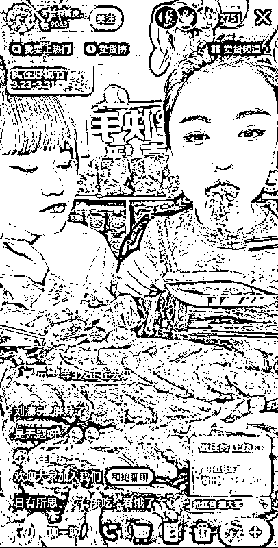**

**与此同时，有些主播之间，还会在直播带货的过程中，进行美食 PK 赛。有的主播互相比赛谁吃东西吃得快，有的主播比拼谁吃东西吃得多，直播间里，眼花缭乱的食物，令人目不暇接。**

**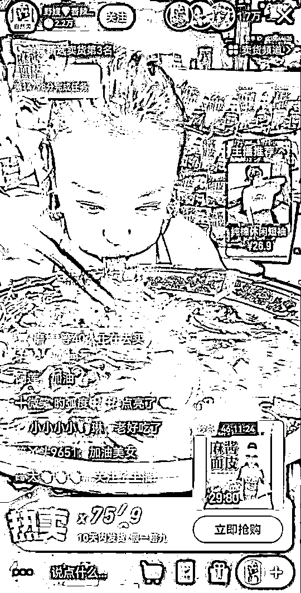**

**而这些关于美食的比赛，都是为了吸引眼球，然后方便卖货。**

**对此，有网友在看过直播后表示：“这种带货的形式确实能吸引到人，但是不知天天这么吃下去，主播的身体遭不遭得住。”**

**其实，不论是什么形式的直播，只要直播间里挂出了小黄车，主播的最终目的就是带货；其他的一切，都是为此精心设置的套路。**

**这些套路之下，直播间里的水，已经变得太深。我们这些看客，在吃瓜的同时，也一定要小心。**

**来源：封面新闻，极光新闻**

**更多好文，敬请关注******

**← 向右滑动与灰产圈互动交流 →**

****