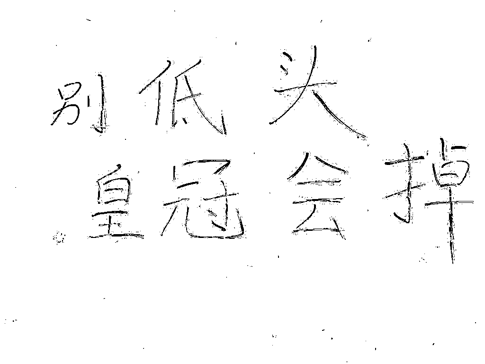
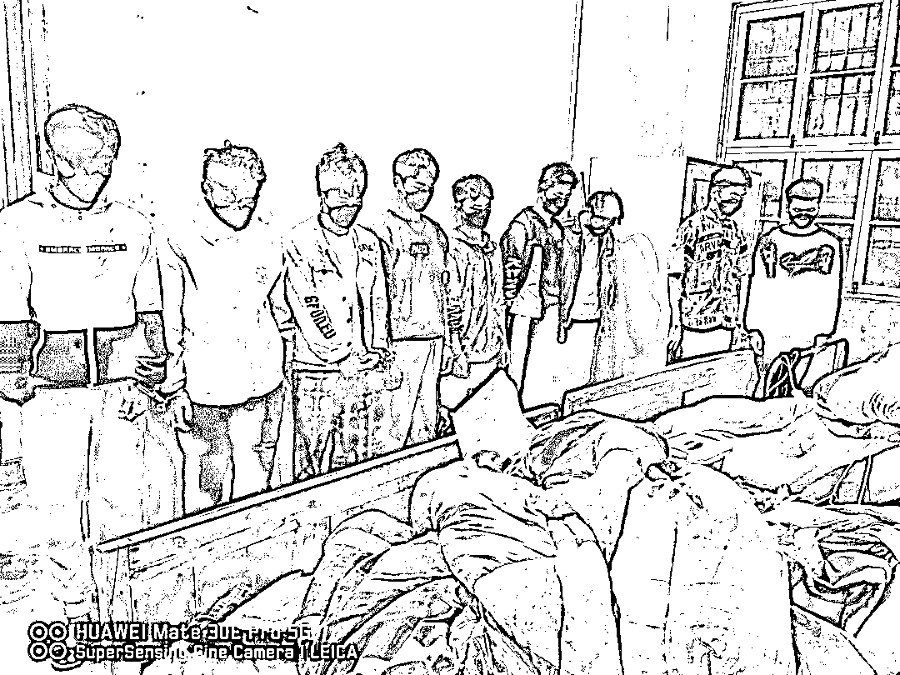
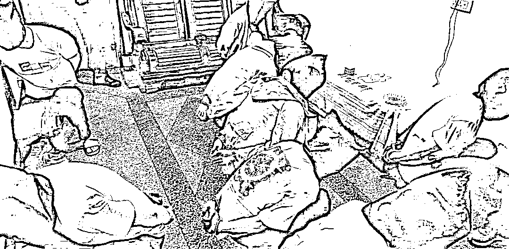
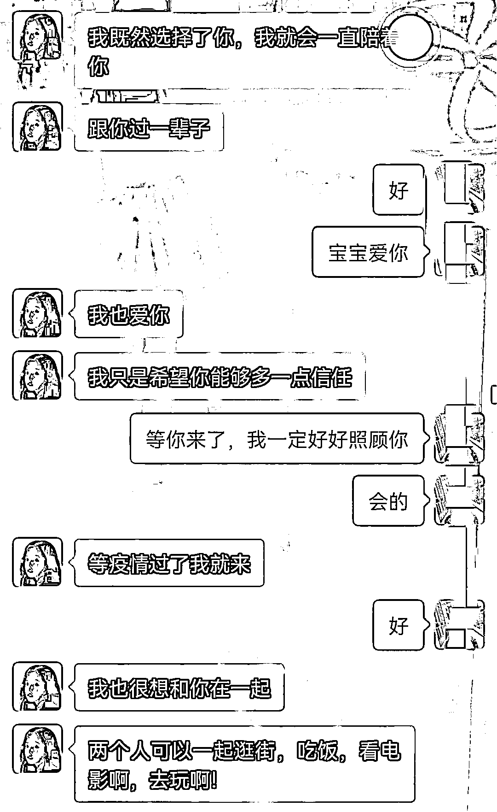
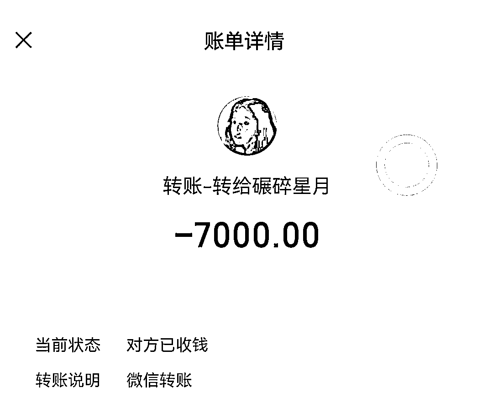
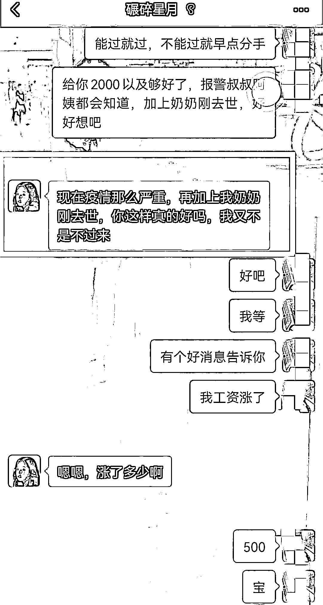
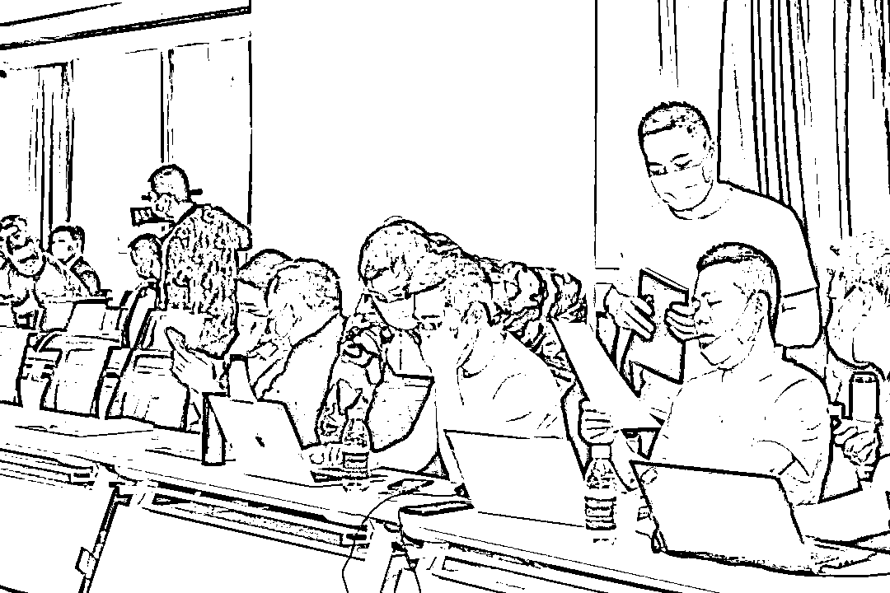
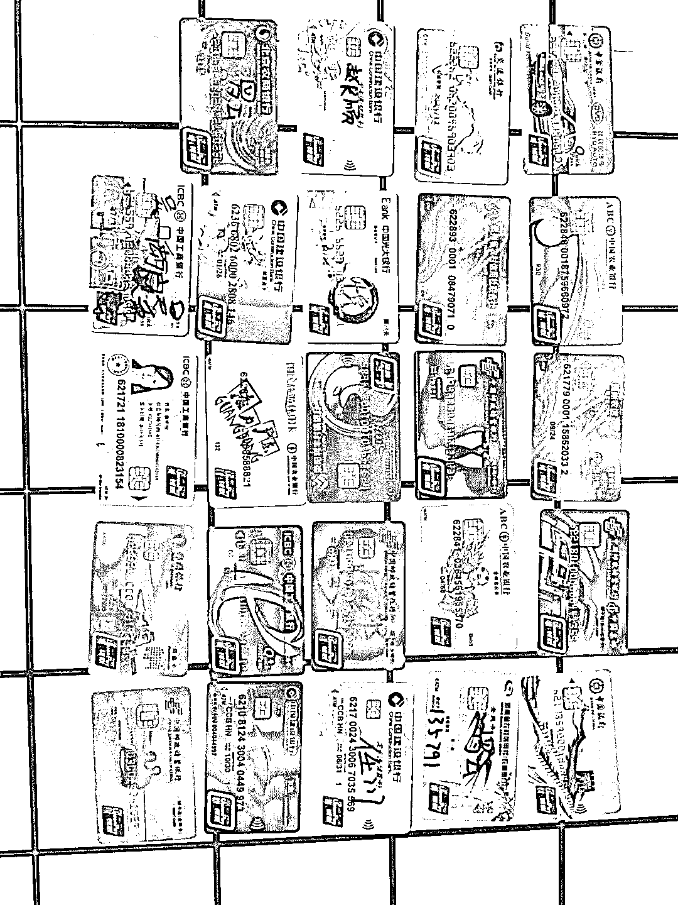

# 抓获 270 名“美女”！温州联合河南警方破获特大婚恋交友诈骗犯罪团伙

> 原文：[`mp.weixin.qq.com/s?__biz=MzIyMDYwMTk0Mw==&mid=2247535510&idx=7&sn=471ecb68765ce982ebce5c6ecdffec83&chksm=97cb80aea0bc09b8088b934dc9c1f3b9cb36050569965895355668699d53aabe14cffc27c3b4&scene=27#wechat_redirect`](http://mp.weixin.qq.com/s?__biz=MzIyMDYwMTk0Mw==&mid=2247535510&idx=7&sn=471ecb68765ce982ebce5c6ecdffec83&chksm=97cb80aea0bc09b8088b934dc9c1f3b9cb36050569965895355668699d53aabe14cffc27c3b4&scene=27#wechat_redirect)

**拍摄点**

**电信网络诈骗犯罪窝点墙壁上**

**    “别低头，皇冠会掉”，很难想象，如此励志的话，竟然出现在电信网络诈骗犯罪窝点的墙壁上。4 月 28 日凌晨，在公安部、浙豫省公安厅的统一指挥下，**浙江温州、河南南阳警方联合出动 500 余名警力**，在河南省郑州市、贵州省毕节市两地，对“11.1”婚恋交友诈骗专案嫌疑人开展集中收网，**共捣毁诈骗窝点 35 个，抓获犯罪嫌疑人 270 名，查获作案手机 307 部、查扣冻结银行卡 267 张**，成功打掉了对这一长期窝藏在河南省郑州市的婚恋交友诈骗集团。**作为公安部打击治理电信网络新型违法犯罪研判中心**，温州警方坚持全国反诈一盘棋思想，以“三型“警务为导向，积极构建“融合共治”全社会反诈格局，**在当前疫情防控形势下积极探索集约高效的跨省协作打击战法，提升跨区域协同能力**，实现战果最大化。**

********

**（警方抓捕现场）**

****我被“女友”拉黑了.. ****

****    今年 2 月，温州男子小郑到鹿城公安分局报案，称其网上认识的“女友”突然把他的微信“拉黑”了，怀疑对方是骗子...****

****   经了解，小郑通过一款社交软件“伊对”认识了一名叫“鑫鑫”的女子。小郑和“鑫鑫”通过多次视频聊天，感情迅速升温，正式确定了男女朋友关系。小郑觉得，他和“鑫鑫”志趣相投，有聊不完的话题，满心以为自己找到了“对的人”。****

********

****（双方部分聊天记录）****

****    有次聊天，小郑说刚发了 7000 元的工资，“鑫鑫”说小郑花钱太大，要替小郑攒钱，出于对“女友”信任，小郑把 7000 元的工资转给了“鑫鑫”保管。****

********

****（转账记录）****

****   在交往期间，小郑多次提出见面，让“鑫鑫”来温州或者他去郑州找她。**但每次“鑫鑫”都能找出拒绝见面的理由**，疫情无法外出、奶奶生病住院、奶奶刚出去.....****

********

****(骗子编造的理由）****

******向“女友”要钱，发现被骗******

******在双方网上恋爱的 3 个月内，小郑一直没有怀疑过“女友”。直到有次，小郑因急需用钱，就向“女友”拿回部分存在她那的工资，但“女友”找不同理由拒绝了，心急的小郑打了多个电话给对方，才发现对方手机已经停机，**微信、“伊对”等联系方式均被拉黑.**..这是才焕然大悟，原来一直被对方骗了。****** 

********警方成立专案组  挖出背后的团伙********

********    接警后，民警通过调查发现，“鑫鑫”的背后是一个有组织的诈骗团伙，诈骗窝点在河南郑州。于是，市反诈中心牵头，成立市县两级专案组，经过两个月的缜密侦查，一个长期盘踞在河南郑州的特大婚恋诈骗团伙逐渐浮出水面，该团伙组织严密、分工明确，已研判分析出集团成员近 300 名，关联全国受害人 7000 余名。温州市副市长、公安局长毛伟平高度重视，要求专案组加强经营，积极探索疫情防控影响下的跨区域打击新模式，适时组织收网。********

****************

********（专案组研判场景）********

********    4 月 28 日凌晨，在河南省郑州市、贵州省毕节市两地，浙豫警方对“11.1”婚恋交友诈骗专案嫌疑人开展集中收网，共**抓获犯罪嫌疑人 270 名，**成功打掉了对这一长期窝藏在河南省郑州市的婚恋交友诈骗集团。********

************

******（查获涉案物品）******

********传销式管理，专门对男性下手********

********据了解，该诈骗集团业务员大多数为年轻男性，通过冒充女性网友身份，**将“伊对”、“世纪佳缘”等 APP 账号定位至沿海一带城市添加受害人**，以恋爱方式赢得了受害者的好感后，再引导至微信聊天，不断以编造“帮助保管工资”、“奶奶去世需要用钱”等各种借口诈骗对方的钱财。******** 

******  此外，团伙以“传销”模式管理 ，要求集中住宿、集中管理，每个窝点由 10 余人组成，时不时还会**组织业务培训、工作经验分享会、岗位交流**等活动。内部纪律严格，每次外出不能超过 2-3 人，**每次外出间隔不能超过 10 分钟**，窝点内不准喝酒打架等。******

********警方提示********

******    网络交友需谨慎，“真情”陷阱终为钱。一旦遇到异常热情、联系时间很短就主动要求确立情侣关系的人，需要提高警惕。如果对方提出因游戏充值、见面路费、投资开业、生病救急等，要求向其汇款时，更要留个心眼，切勿在未深入了解对方底细的情况下，轻信对方的承诺，落入“温情”陷阱。******

******来源：温州防诈骗，巴蜀反诈******

******更多精华好文，请点击关注******************

******← 向右滑动与灰产圈互动交流 →******

************