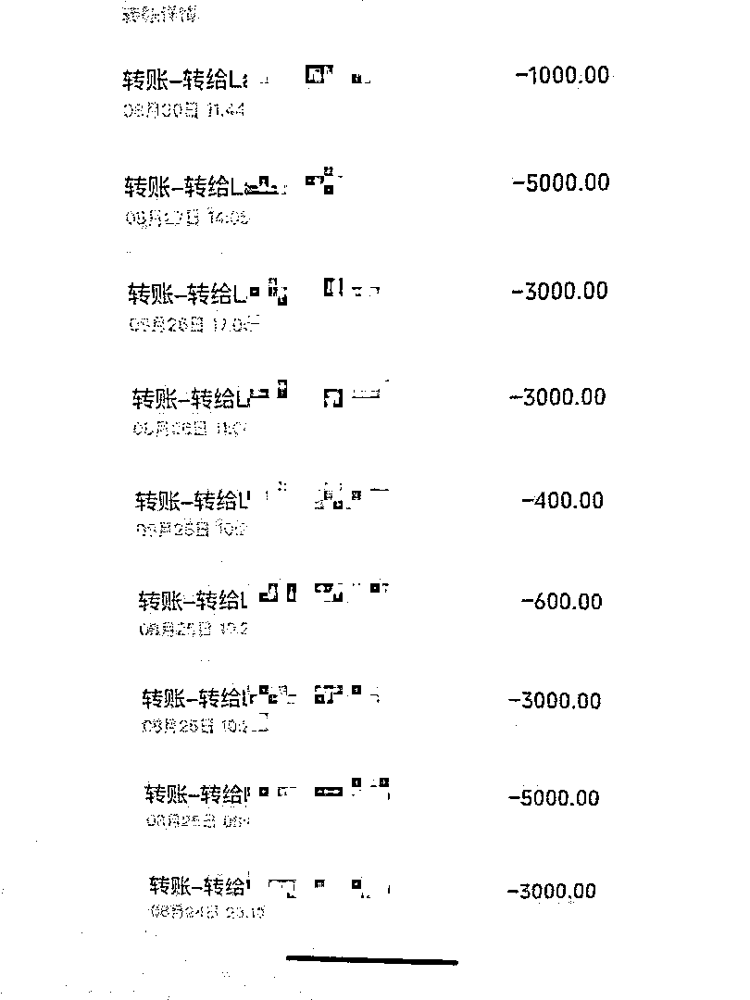

# 3 名女主播，被“榜一大哥”骗了？

> 原文：[`mp.weixin.qq.com/s?__biz=MzIyMDYwMTk0Mw==&mid=2247535510&idx=8&sn=36a85af9d3f68e94f50832e78620602e&chksm=97cb80aea0bc09b88792995dc4b6cc749dca51828414495f96901b921c58eecfb8ced5a21cd6&scene=27#wechat_redirect`](http://mp.weixin.qq.com/s?__biz=MzIyMDYwMTk0Mw==&mid=2247535510&idx=8&sn=36a85af9d3f68e94f50832e78620602e&chksm=97cb80aea0bc09b88792995dc4b6cc749dca51828414495f96901b921c58eecfb8ced5a21cd6&scene=27#wechat_redirect)

2021 年 6 月，四川省广安市邻水县一名年近半百的无业人员周某找了一份“好差事”：看网络直播，给美女主播打赏，成为“榜一大哥”（给主播刷礼物第一名）从而获得美女主播信任，然后花言巧语向美女主播“借钱”。在不到 3 个月时间内，周某骗了 3 名美女主播近 20 万元。

2022 年 4 月 17 日，邻水县公安局在重庆市渝北区某宾馆内将周某抓捕归案。

**美女主播打款给周某的记录（部分）**

**3 万打赏引来 10 万“收益”**

周某的人生并不顺畅，48 岁了，还没有一个固定职业。2021 年 6 月，周某经过深思熟虑，找了一份“好差事”。

周某通过某网络直播平台认识同城刘姓女主播。周某在刘主播的直播间为刘某狂刷 9000 多元礼物，成为该主播的“榜一”。

对“榜一大哥”周某，刘主播免不了互动几下。一来二往，二人熟悉起来。

打肿脸充胖子的“榜一大哥”也有，周某是不是这样的人？周某轻轻松松化解了刘主播的疑虑：在成都开公司做工程，目前正在邻水做一个房地产项目。周某还向刘主播透露一个“私人信息”：老婆在 2008 年出交通事故去世了。

周某的“坦诚”取得刘主播的信任。周某多次以承包工程急需周转资金等理由，多次向刘主播借款。刘主播三千、五千不等，多次打款给周某。

在借款期间，周某在刘主播的直播间又打赏了 2 万余元。而这“榜一大哥”的派头，诱使刘主播继续借钱给他。刘主播前后打了 10 万余元给周某。

**打赏近万元“借款”万余元**

首战告捷，周某“干好工作”的信心大增。他准备如法炮制，再从其他女主播身上找钱花。

2021 年 8 月，周某通过某网络直播平台认识唐姓女主播。周某在唐主播的直播间豪爽打赏近 1 万元，成为唐主播直播间的“榜一大哥”。

“榜一大哥”在取得唐主播信任后，多次称自己急需资金周转，向唐主播借款 1 万余元。周某想扩大战果，继续借钱时，唐主播觉得这个“榜一大哥”有些不靠谱，拒绝再借钱给周某。

打赏近 1 万元，“借款”1 万余元，只是小有盈余。周某也觉得没有办好这份“差事”。

**“私人司机”糊里糊涂被利用**

2021 年 8 月，周某瞄准某网络直播平台许姓女主播。这次，周某增加了“技术含量”。

在一次预约网约车中，周某留下驾驶员的电话。周某有意识的坐了几次该驾驶员的车。在网约车驾驶员眼中，来坐车的，都是他的老板，周某当然就是“周总”了。

有次，周某听说许主播要外出办事。“我回家乡，带了一个私人司机，我喊他来送你。”周某对许主播说。

一会儿，该驾驶员开着车赶到许主播面前，招呼许主播上车，送许主播下车，服务得十分周到。此时，许主播还不知道，这辆车只是周某叫的网约车，网约车为乘客提供周到服务是理所当然的。该驾驶员也不知道，他糊里糊涂成为周某的“私人司机”了。

不久，周某对许主播称，自己在上海有别墅，开有一家建筑公司，拥有多家洗浴中心，老婆多年前出车祸去世。许主播对事业有成的周某既崇拜又同情。

在完全取得信任后，周某便以微信支付功能被冻结，向许主播借款 5000 元。第一次借钱成功后，又以接政府工程、打官司、解冻银行卡、缴纳工程税款等理由，向许主播陆陆续续借款 8 万余元。

**警方抓获“榜一大哥”**

久走夜路要闯鬼。刘主播、唐主播、许主播之间并不认识，她们先后要求周某还钱。周某总以各种理由搪塞，3 名女主播始终没能要回自己的钱。

去年 9 月、今年 1 月，意识到被骗的 3 名女主播分别到邻水县鼎屏派出所报案。办案民警根据掌握的信息迅速锁定犯罪嫌疑人。4 月 17 日，警方在重庆市渝北区某宾馆内将周某抓捕归案。

警方查明，周某的老婆既没有出车祸，也没有去世。周某给女主播打赏，只是为“借钱”作铺垫。

目前，周某已被采取刑事强制措施。案件正在进一步侦办中。

来源：封面新闻，极光新闻

更多好文，敬请关注

← 向右滑动与灰产圈互动交流 →

