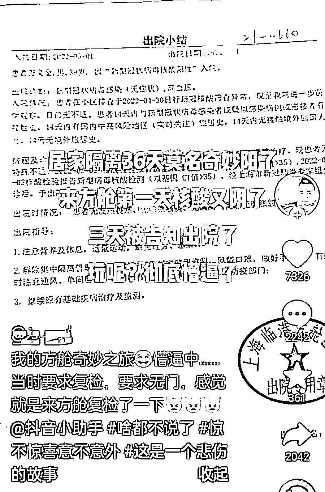
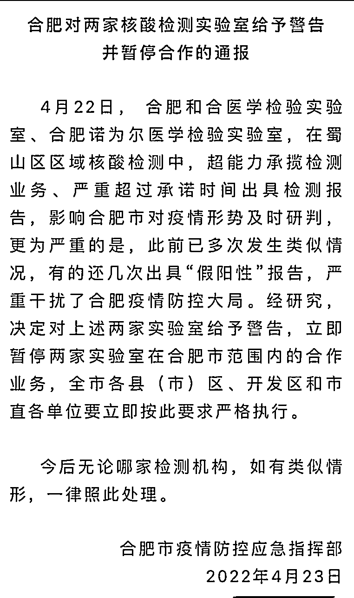

# 说几句“核酸造假”

> 原文：[`mp.weixin.qq.com/s?__biz=MzIyMDYwMTk0Mw==&mid=2247535570&idx=1&sn=c11a169c3ad5c47a8f25ea2a2f4a6534&chksm=97cb80eaa0bc09fc69742b64045ca3f495868e4a53f522e6ee7011c72f08675c7a13ebb05fc1&scene=27#wechat_redirect`](http://mp.weixin.qq.com/s?__biz=MzIyMDYwMTk0Mw==&mid=2247535570&idx=1&sn=c11a169c3ad5c47a8f25ea2a2f4a6534&chksm=97cb80eaa0bc09fc69742b64045ca3f495868e4a53f522e6ee7011c72f08675c7a13ebb05fc1&scene=27#wechat_redirect)

‍‍

这个事，一直想说，从我们楼层封禁一个多月都没有阳性，结果因为拒绝下楼陪着阳性楼做核酸，立即就出现阳性后就想说了！因为太诡异了，一个多月都是正常的，反倒不下楼聚集做核酸后，就忽然有了？ 

这个事上午看了上海的官方通报，因为没有具体的名称，写出来意义不大！ 

主流的官媒也只是在报道上提了一下“相关检测机构！”

而就在刚刚，总算有个媒体将涉事的检测机构爆料了出来，还上了热搜！

在这之前，网上的传言是这样的； 

小区五人转走后，复检都是阴性！

一位女儿说，自己的妈妈 5 月 7 号检测是阳性，8 号凌晨抗原阴性，8 号早晨接到疾控电话，她们要求复核，疾控中心态度强硬，后来只能转运，而疾控中心却把 7 号的检测报告改为阴性？ 

居民们认为太过于魔幻了，报警有用吗？

不仅这个，一个小区转运走的 4 个人，在方舱强烈要求检测，结果是阴性。

康泰新城两位老人，核酸阳性，一天后改回阴性，人已经在方舱 2 天了！ 

不知道普通人能争取到复核的机会吧！ 

下面的这种情况，都是随申办上的记录！ 

有网友分享了自己的方舱奇妙之旅，

在一则视频的下面留言画风是这样的； 

说实话，已经被搞蒙圈了！

核酸被爆出问题的现象，不只是一个地方了！ 

今天看到北京也在调查！

在这之前，我们都知道，郑州出现过；

合肥也出现了关于核酸的问题；

一个很敏感的，某基因机构的举报某核酸机构的事情，被打断了肋骨，

还有北京那个 W 健委主任，腐败案件中，有收取核酸检测提成这一项。

对此，人民 R 报四川分社的林社长就曾直接说过；不停止核酸的惊天暴利，疫情就必定没完没了。

我们也知道，近些年，一些检测机构什么的，的确赚得的盆满钵满！ 

但这些，其实不是我所关心的。

毕竟，太远了，我又一直没在医保上积攒一毛钱

我最关注的是，这个阳性阴性的定义，他们说有就有，说是阳性就是阳性，尤其是这个无症状，一个好好的人，说是阳性就是阳性，当事人怎么可以分辨？

有没有这个权利需要知道自己的身体状况，

而不是说你是，质疑一下，就被戴上违反防疫规定的帽子？

我觉得在任何时候，人都应该具备起码的知情权？

这一点不过分吧！

此外，核酸机构出现问题，我觉得这固然可恨，

但相关部门的责任也应该不能被推卸，

因为这可都是特别指定的！

同时，期待明日的调查结果！

PS：小的时候，一个班里只要有一个学生没做完作业，全班同学都要留下来不能放学，于是全班同学都去怪那个没做完作业的同学，大家绝对不会去怪那个制定规则的 XX 老师！近期上海疫情，我发现，很多行为依然这样

来源:我会永远在你身后

← 向右滑动与灰产圈互动交流 →

