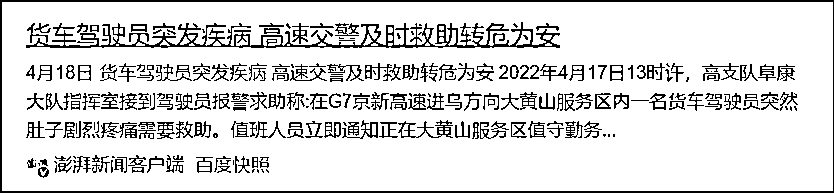
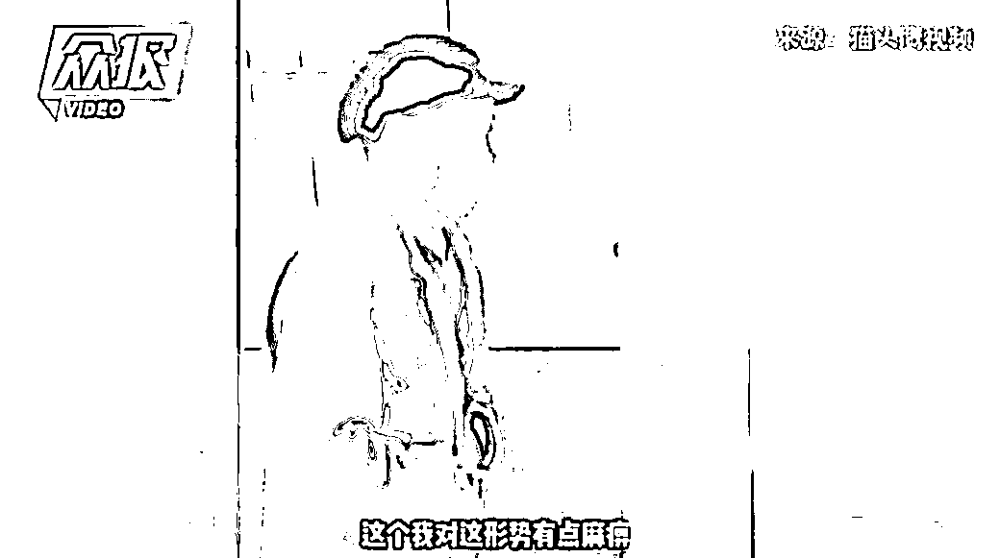
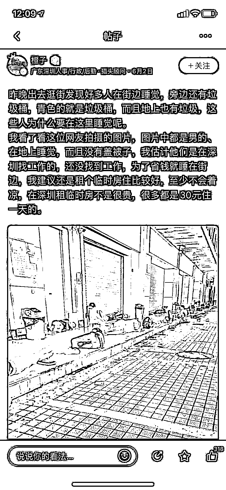

# “恶意放歌”“恶意吃饭”“恶意看病”“恶意做工”？

> 原文：[`mp.weixin.qq.com/s?__biz=MzIyMDYwMTk0Mw==&mid=2247535570&idx=2&sn=26a4227a85ceb2c2239b23af5d5798c5&chksm=97cb80eaa0bc09fcc723a6b71acc70cf02cfcd173a80dfb49b9074731f397d248df8616672ac&scene=27#wechat_redirect`](http://mp.weixin.qq.com/s?__biz=MzIyMDYwMTk0Mw==&mid=2247535570&idx=2&sn=26a4227a85ceb2c2239b23af5d5798c5&chksm=97cb80eaa0bc09fcc723a6b71acc70cf02cfcd173a80dfb49b9074731f397d248df8616672ac&scene=27#wechat_redirect)

在封控、静默、静态管理下，数以万计普通人的生活被按下了暂停键。 

但他们并非一动不动，为了在疫情中生存下去，他们需要为吃饭买菜、看病就医而努力。

有时候一些人对他们说，**不，你的行为是错误的，请停止“恶意”的行为，并接受处罚。**

于是他们陷入到比之前还困难的境地。

这篇文章我想问大家，疫情期间真有那么多恶意行为吗？

**01.**

**恶意放歌？**

几位穿白色防护服的人上门，说别人听到，他们也听到，你在阳台上放《国际歌》，请配合调查。 

这个“你”就是房屋的男主人，他待在门口，配合落实程序，并准备离开房子。

女主人上来了，她和男主人一样不解，于是和穿防护服的人员开始了讨论。

女主人本着关爱家人的心，问有什么措施保护老公不被感染，对方说他们可以提供专业防护服一套，穿得和他们一模一样出去。

接着：

> -“为什么口头传唤我老公？”
> 
> -“刚才跟你说过了。（放《国际歌》）”
> 
> -“我们没放过啊，再说了，放《国际歌》有什么问题吗？”
> 
> -“放放没问题，不要紧的，你放了，我们也要调查清楚相关原因的。”

之后男主人接过一套防护服，穿了起来，也就是到这里视频暂止。

一方的强势，一方的弱势在其中展现得相当清晰。（想必你也看过这组画面，所以我不放视频了。）

视频是否是完整视频，这户人家是否发生了其他的违法行为，我们不得而知。

从目前已知信息而言，视频带来的直观感受就是： 

**一个居民仅仅因为播放《国际歌》而被人举报，还被口头传唤。**

那么该如何理解口头传唤的合理性呢？

难道因为《国际歌》是禁歌禁曲吗？

当然不是。

痛仰乐队不久前在电视上演唱摇滚版《国际歌》，为河南卫视的五四晚会拉开了序幕。

难道因为《国际歌》不能被普通人私下擅自使用吗？

当然也不是。

互联网上转发、演唱、台词截图分享的内容一大堆，并未见被控评。

再怎么说这都是一首正能量的歌曲。

> 穿越了 100 多年的烽火，《国际歌》在当今中国它却依然流行。

目前还不知道，男主人被传唤是不是只因为放了《国际歌》。

如果仅仅因为疫情期间在阳台播放《国际歌》，而被举报，进而被调查的话，那本身是一种诡异的逻辑。

谁也想不通，竟然有人认真对待这种无理举报了。

我们所能理解的只能是，进行防疫工作时少了自信，确实有可能把居民播放正能量歌曲的举动，当做阴阳怪气。

**但这何尝不是给自己徒增工作量，又给居民带来不便呢？**

如果情况愈演愈烈，甚至可能出现接下来影响他人吃饭的局面。

**02.**

**恶意吃饭？**

基于疫情形势，一些地方对司机过服务区有了严格要求。

山西省中阳县的一个高速服务区给过路车辆贴封条，提醒司机师傅：**“过境车辆禁止中途上下车。”**

原本无可厚非，防患于未然，但这也会出现一个尴尬局面。

如果司机有病毒传染的风险，封条的存在，意味着有效地将感染者限制起来。

如果司机饿出毛病来了，谁负责？

服务区不帮助协调解决吃饭问题，就可能发生司机自行负责的情况。

4 月 20 日，三位货车司机开车路过中阳县，车辆被贴上了封条，到了下午 2 点多，或许是出于饿过头了的原因，他们决定出车去吃饭。

因为违反了规定，三人被传唤，后来被行政拘留。

这条新闻引发热议，除了本身的争议以外，还有一点是和最近的另一条新闻有关。

一个货车司机，停留在吉林松原王府服务区，因为封控的原因，他出不去，被困多日后他突发疾病，抢救无效死亡。

当然事情没有传闻中被困 20 天那么夸张，所在的位置也有一些基本的饮食物资。

但问题是，被困多天在高速路上，小问题也会憋成大困难。

**毕竟他们货车司机本身身背多种职业病。**

中国物流与采购联合会发布《2021 年货车司机从业状况调查报告》显示，86.5%的货车司机因为开车，患有胃病、颈椎病、高血压等职业病。

糟糕的生存环境一直存在于货车司机的世界里，尤其是疫情下，他们更显得势单力薄。

试问，能被温暖相待的又有几人？

**货车司机们的存在无非是再次提醒我们，疫情带来的次生伤害，依然处于防疫工作中的高位。**

生病发痛、小病变大病的情况下，人怎么可能不去寻医求药呢。

所以一些限制看病的不当措施，很容易引起当事人的反弹。

**03.**

**恶意看病？**

河北邢台，44 岁的张某刚手部伤口发炎，出现了发热症状，他着急上医院看病。

这时候他妻子想了一招，他们说自己“已经拨打了 120 急救电话，但是救护车来不了，需要自行去医院就诊”。

这个借口得到了村干部的认可，村干部开了证明，放他们去看病。

看到这张出入证明后，疫情防控执勤点的民警拨打 120 急救电话，张某刚如愿被运到医院治疗。

后来夫妻的骗招败露，他们被警方立案调查。

自始至终，张某刚面临一组个体与群体相矛盾的悖论。

从群体而言，疫情期间当地医疗资源紧缺，医院缺人手，缺车辆，120 救护车更是稀缺中的稀缺，不能随意乱调动。 

从个体出发，伤口发炎，小病可能变大病，不能无视下去了。

无可奈何之下，他骗取了救护车，违反了防疫规范。

但这又像《我不是药神》里普通人对生命健康的诉求。

明明有便宜好药，但有人说它违规了，患者只能铤而走险买这个“低价假药”；明明情况紧急，但有人不开急诊证明，不让外出看病，患者只能谎骗得手。

看完蓝底白字的通报，更多网友的疑问是：

**面对看病困境的只有张某刚一人吗？**

有句话是：“每个人都活得那么枯燥， 可每个人又都在那么拼命地活着。”张某刚不过是“每个人”里普通的一个。

以前，他们勤劳、努力，去寻找谋生机会，去解决吃饭买菜、看病就医所需要的钱。

现在，他们不仅仅被病毒包围着，还被生活生产的压力包围着，他们甚至不知道哪一种危险更严重。

没多少人会给他们答案，倒是有人喜欢让他们接受更难的挑战——

**04.**

**恶意谋生？**

晋江出了一条新闻，和文学无关，但也足够魔幻现实主义。

事情是这样的，晋江公安发布了通报，一两天后，微博被疯狂转发。

微博得到热度的关键在于其中一个故事。

1981 年出生的张某，谎称外出买菜，实际驾车前往附近做工。他的行为构成拒不执行紧急状态下依法发布的决定、命令违法行为。

晋江警方决定对张某给予行政拘留 5 天。

作为处在社会面管控中的男子，他的行为违反了当地防疫要求；作为多日没有收入进账的男子，他又在努力让自己赚钱养家。

现年 41 岁的张某陷入的现实困境正是如此。

如果只是生活拮据困顿到也罢，并非不光彩的事，可现在他被行政拘留 5 天。

行政拘留不算案底，却注定对他的未来生活造成不小影响。

问题来了，张某在乖乖坚持防疫时，快生活不下去了，他该怎么办？

同时，就算偷偷打工，他也没作奸犯科，是不是口头警告更合适呢，怎么动用行政拘留了呢？

对此，网友们心生巨大的不理解和强烈的同情，他们还管这叫**“恶意打工”“恶意谋生”**。

**一句话，口粮难挣，防疫期间更难挣。**

如此严厉形势下，自给自足的农民的情况怎么样呢？

一位老农操一口乡音在村委会的广播室，对村民说：

**“全村，这个……老少爷们儿们，注意了啦，我在喇叭里说两句。”** 

谁听了这样的方言，都以为是村干部要发表一些事关全村发展的重要讲话。 

没想到，接下来他说，自己着急下地干农活，被抓住了，因为违反了防疫规范。

视频里，老农民歪着因常年劳作而歪的脊背，诚恳道歉：

**“我对这个形势有点麻痹了。”**

**意思是大家不能像他一样不懂规矩。**

但不能总不让人去田地里吧，毕竟国家三令五申过：

**农村防疫，不能一刀切“禁止下地干活”。**

这时候有人灵机一动。

某地，一群农民进行春耕播种。

除了携带农具以外，人群最大的特征是穿了防护服。

这是在“科学”种田吗？这是硬性规定这么穿才能下地吗？这是宣传摆拍吗？

当地的回应斩钉截铁：**“政府免费发放防护服让农民做好防护种地。”**

****

**无论是摆拍宣传还是过度防疫，都令人哭笑不得。**

**因为对于奥密克戎而言，它并不会思考农时农事、车贷房贷是什么，它不会在乎普通人来年吃什么。**

****在乎“琐碎小事”的只有农民和打工人自己。****

**像特斯拉这种具有一些复工复产保障手段的是少数。**

> **根据彭博社得到的一份特斯拉内部备忘录，其中提到，因为（特斯拉上海超级工厂）宿舍数量不足，工人们只能睡在工厂地板上。  **
> 
> **此外，特斯拉将会提供淋浴条件、一天三餐，以及一天 63 美元（400 元）的补助，同时还有在建的娱乐设施。不过一位知情人士称，津贴的实际金额还将根据职位和级别来决定。**

**由于补助力度超过了一般企业的认知，网友称它是在**“恶意补贴”。****

******05.****** 

******保护普通人******

****不得不说，上述案例中的人几乎都违反了当地防疫规范。****

****但同时，可以看到普通人遵守防疫规范的成本不小，严格遵守的合理性也在成疑：****

******比如，如果我不去种菜种庄稼，烧苗了，今年的收成谁负责？******

******比如，如果我不闯关，家里亲人的病症积小成大，危害生命健康了，谁负责？******

******比如，如果我不违规出去赚钱，车贷房贷谁负责？******

****孤立无援的个体，在试玩所有方法后依然没有破局，那他们就可能铤而走险。****

********

****本来不应该是这样的。**** 

****帮助居民解决吃饭买菜问题，开放急诊就医渠道、推进复工复业都是新闻报道里大力宣传的内容。**** 

****不应该到了基层一线变了个样子，不应该针对普通的大多数人就换了方式。****

********

****最近博主“愤怒银行”的微博“58 同城上的失业笔记”引发了网友的共鸣。****

****有人露宿深圳街头，为了省 30 元一天的住宿费；****

********

****有人去超市应聘，被问你多大了，多久没上班，孩子由谁带，而她没上班的原因其实是亲爱的母亲离开了。****

********

****还有：****

******“我一个 95 后的女生还跟着搬运货，结果还吃我工资。”******

********

******“去殡仪馆工作也行。”******

********

****哀民生之多艰。   ****

****仿佛是一片欣欣向荣世界以外的另一个世界，不知道图片中的主人公们最后会过得怎么样。****

******所以，还是多一些对普通人的共情吧。******

****在疫情期间，他们故作坚强去承受重担，他们不是不疼，只是在忍。****

****防疫兼顾民生，不在此时，又待何时呢？****

****来源：雷叔说事********************

****← 向右滑动与灰产圈互动交流 →****

********