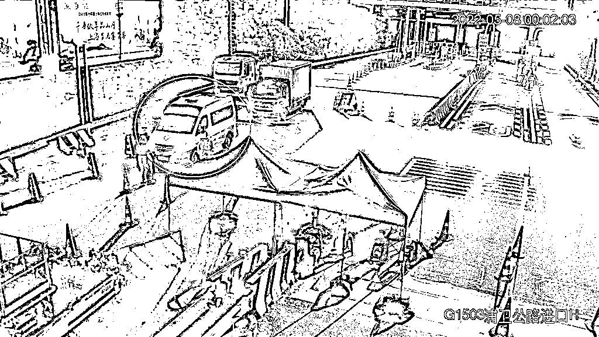

# 救护车里竟藏 850 条香烟，上海一男子被拘

> 原文：[`mp.weixin.qq.com/s?__biz=MzIyMDYwMTk0Mw==&mid=2247535570&idx=3&sn=43d753d36636bd9f6fc106708fe82b30&chksm=97cb80eaa0bc09fc1154ec08373e0060d06136bac97a7e437fdb93808ff55096fe8c07646b1a&scene=27#wechat_redirect`](http://mp.weixin.qq.com/s?__biz=MzIyMDYwMTk0Mw==&mid=2247535570&idx=3&sn=43d753d36636bd9f6fc106708fe82b30&chksm=97cb80eaa0bc09fc1154ec08373e0060d06136bac97a7e437fdb93808ff55096fe8c07646b1a&scene=27#wechat_redirect)

还记得[**上海一团长：一天赚一万，我只是小虾米，希望疫情别结束...**](http://mp.weixin.qq.com/s?__biz=MzIyMDYwMTk0Mw==&mid=2247534498&idx=5&sn=8abd69d9920687ce407adad4dce1ff3d&chksm=97cb8c9aa0bc058c358338a4eda5898ec42c4dbbc8b00c3b8b1b3e98a9ffc35b5409c5572037&scene=21#wechat_redirect)嘛？

据东方网 5 月 10 日消息，一辆救护车在辖区里穿行，结果车上并非转运病人，竟是装有其他物品。近日，奉贤警方就查获这样一起“挂羊头卖狗肉”案件。

监控视频。图自东方网

近日，奉贤公安分局江海派出所民警在走访辖区过程中，有群众反映，日前有一辆 120 救护车在辖区行驶，然而车上并未转运病人，而是运输了货物。这一情况引起了民警注意，同时民警也记下了群众描述的该辆救护车的特征及号牌等信息。

图自东方网

5 月 8 日 1 时许，分局民警在本区大亭公路杨溇支路路口处卡口处查获该辆救护车，并在车上当场查获各类香烟 850 条。

图自东方网

经查，该辆救护车属于驾驶员张某所有，张某将该辆车挂靠在外省某家医院，并在网上发布了可以承接转运的贴文。5 月 5 日，有人联系张某，以 5000 元报酬要求其运输一批香烟至上海奉贤。张某通过点亮救护车辆上顶灯的方式通过了各个检查道口并成功交付。5 月 8 日，当张某第二次故技重施再次运输香烟入奉贤时，被分局民警查个正着。

目前，张某因拒不执行紧急状态下的决定的违法行为被处行政拘留并处罚款的处罚，同时，其非法经营的行为也将面临刑事追究。

来源：东方网 记者：毕迎春

← 向右滑动与灰产圈互动交流 →

