# 在“意外怀孕”吧，一群女孩在线发帖求姨妈

> 原文：[`mp.weixin.qq.com/s?__biz=MzIyMDYwMTk0Mw==&mid=2247535570&idx=4&sn=aed41e5b02c59c6710aceb0605b94321&chksm=97cb80eaa0bc09fcdcb17df2657c4b44410a4e3cec73d5cf8cec38137bcc4e35940772b7ced5&scene=27#wechat_redirect`](http://mp.weixin.qq.com/s?__biz=MzIyMDYwMTk0Mw==&mid=2247535570&idx=4&sn=aed41e5b02c59c6710aceb0605b94321&chksm=97cb80eaa0bc09fcdcb17df2657c4b44410a4e3cec73d5cf8cec38137bcc4e35940772b7ced5&scene=27#wechat_redirect)

对于一些“姨妈恐惧症”的女孩来说，

爱情也许可以一直都没有，但“姨妈”万万不能不来。

*痛死也要来*

当代女孩的焦虑真是从头到脚，姨妈准时和发际线不能后退，二者一样重要。

**即便江湖上流传着关于催姨妈的诸多方法，但对于不少姨妈困难户们而言，求助于玄学才是真正的希望。**

虽然建国后动物都不许成精，但没有说过人不能造神。

于是在万千姐妹们的焦虑与呼唤下，“姨妈神”横空出世，带着慈祥的微笑坐在“姨妈庙”里接受女孩儿们的朝拜。

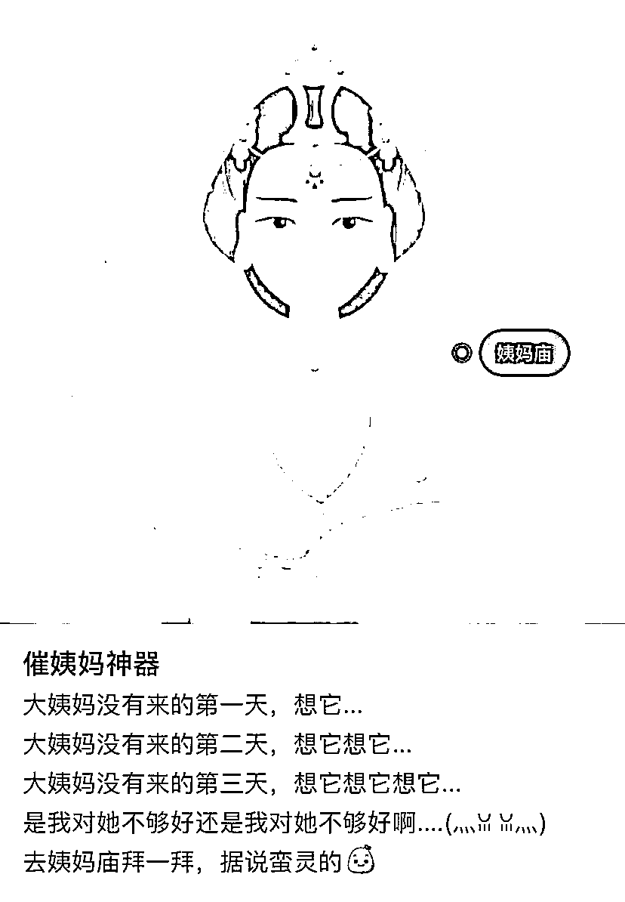

在**豆瓣有个姨妈庙小组**，在里面你会发现，**中国当代年轻女性的姨妈焦虑完全不亚于秃头焦虑。**

**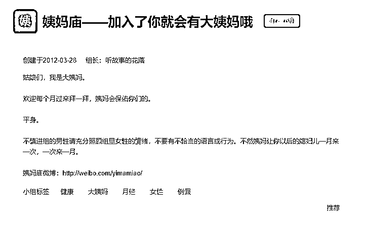**

***用 玄 学 打 败 玄 学***

**点进小组，满屏是对姨妈神的祈祷，且不论到底准不准，至少从那一串最新回复的时间看，饱受姨妈之苦的姐妹远比你我想象中的多。**

**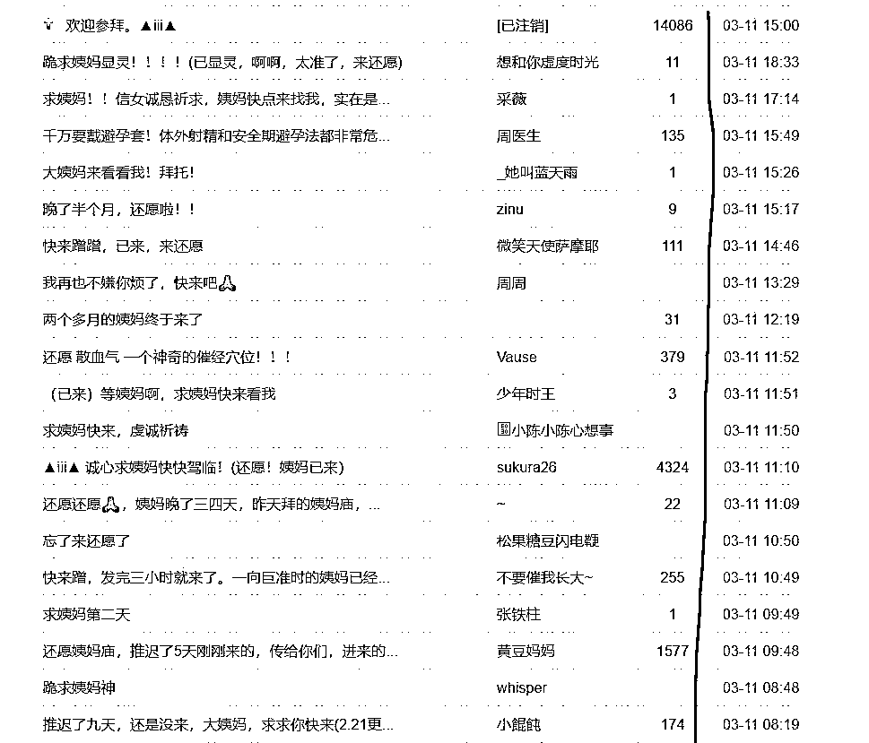**

**“求姨妈”是最常见的帖子，女孩们像深陷追妻火葬场的总裁一样，一边后悔过去的行径一边祈求她快回来。**

**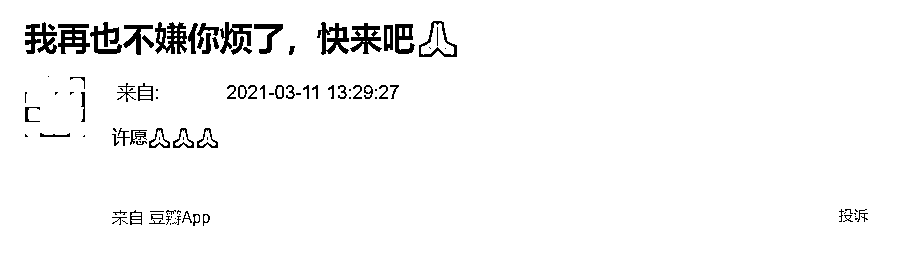**

***完了，我在这篇文里也吐槽过姨妈了……***

**对于大学生来说，吃外食的诱惑在来姨妈面前都显得微不足道。**

****

**如果哪天真正的有了一座实体“姨妈庙”，我一定要去门口卖香火，赚个盆满钵满**

**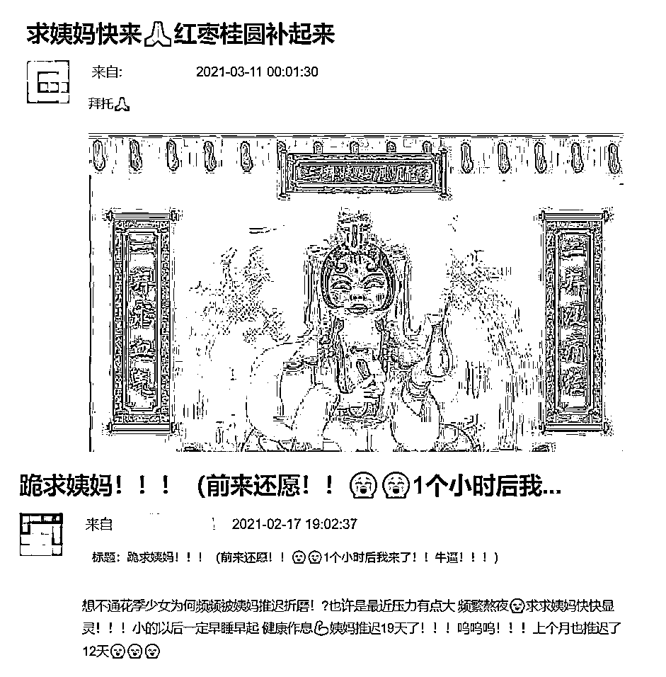**

***占另一大头的就是还愿贴。***

****不知是心诚则灵还是缘分到了，有些女孩在组里许愿之后真的来了姨妈，于是又赶紧回来还愿。****

**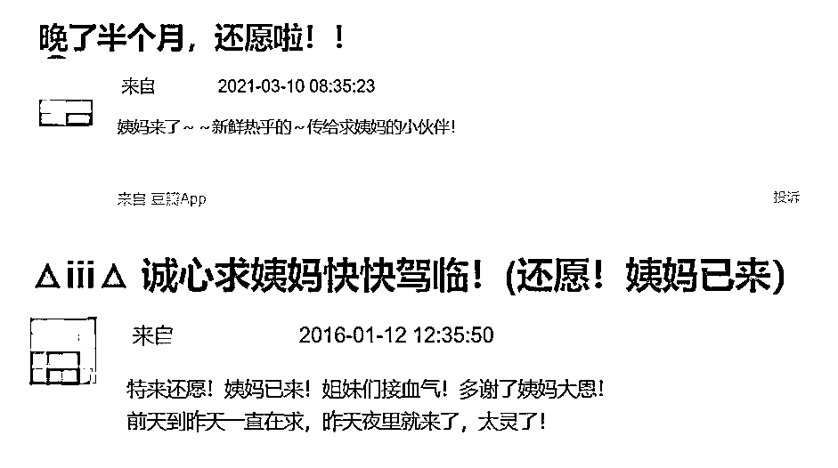**

**虽然沾“血”的词在我国非常不讨喜，但在姨妈庙组里，“血”就是她们的生命之光，欲念之火，每一个还愿贴下都有女孩紧跟着来“接姨妈”、“沾血气”。**

**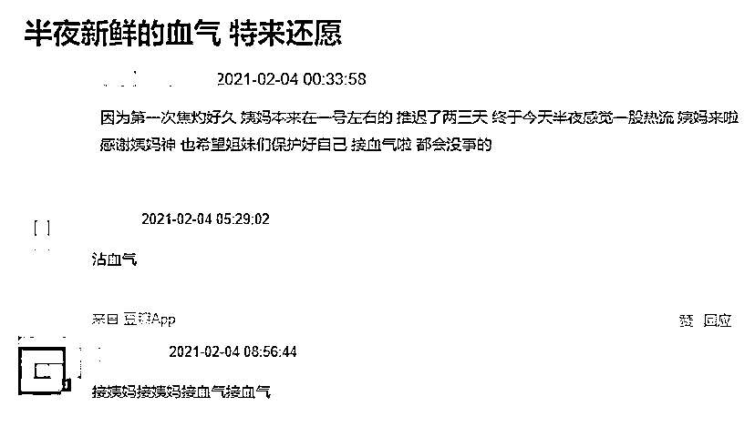**

**其实从豆瓣到小红书乃至互联网所有不知名社区，在姨妈有关的帖子里下都有一群女孩姐妹希望能一沾楼主的热腾腾的血气，大家千呼万唤，只为让自己悬着的那颗心放下。**

**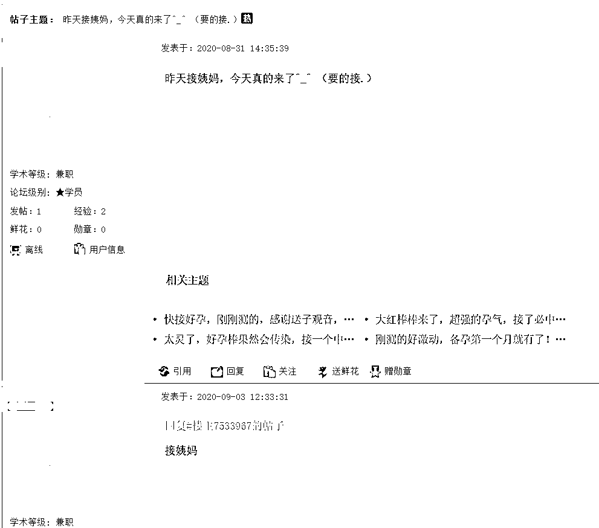**

**哪怕是以“理性社区”闻名的某乎，也有用户在“接到姨妈”后广播里还愿。**

**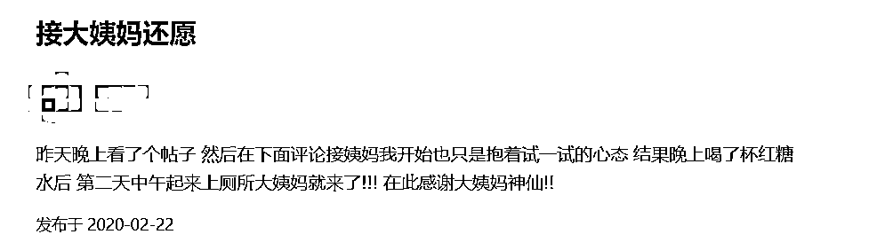**

**万万没想到的是，16 年左右，就有记录经期的 app 真的做出了“拜姨妈神”的功能：**只要打开 app 点进去，你就可以给姨妈神贡献一份赛博香火.....****

**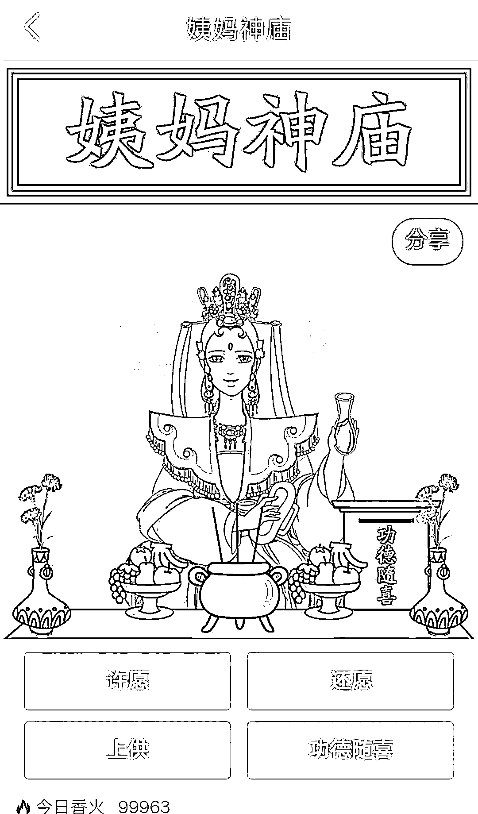**

***让疼痛来的更猛烈些吧！***

**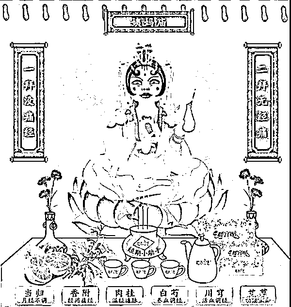**

**永远不要低估大众人民的创造力，伴随着“姨妈神”的脚步，“姨妈符”也跟着一起在互联网亮相，成为众多女孩们祈求姨妈驾到时的配图。**

****

**“姨妈符”风格众多，不论是传统的黄纸红字还是有两块卫生巾在挥舞翅膀的魔幻风，不变的是女孩们发帖时真诚的祈愿：**让 我 来 姨 妈**。**

**她们相信，广播时用了符，就会福至心灵第二天浦西血流成河。**

****

**除了求神拜佛之外，网上也有一些正儿八经的偏方。**

****“每次看小红书找攻略的时候，我都发自内心觉得当代女孩为了让姨妈准时驾到，真是太辛苦了。**”** -- 匿名女孩****

**她们最基本的是泡 jio，只不过要加点调料……啊不，加一点药材。**

**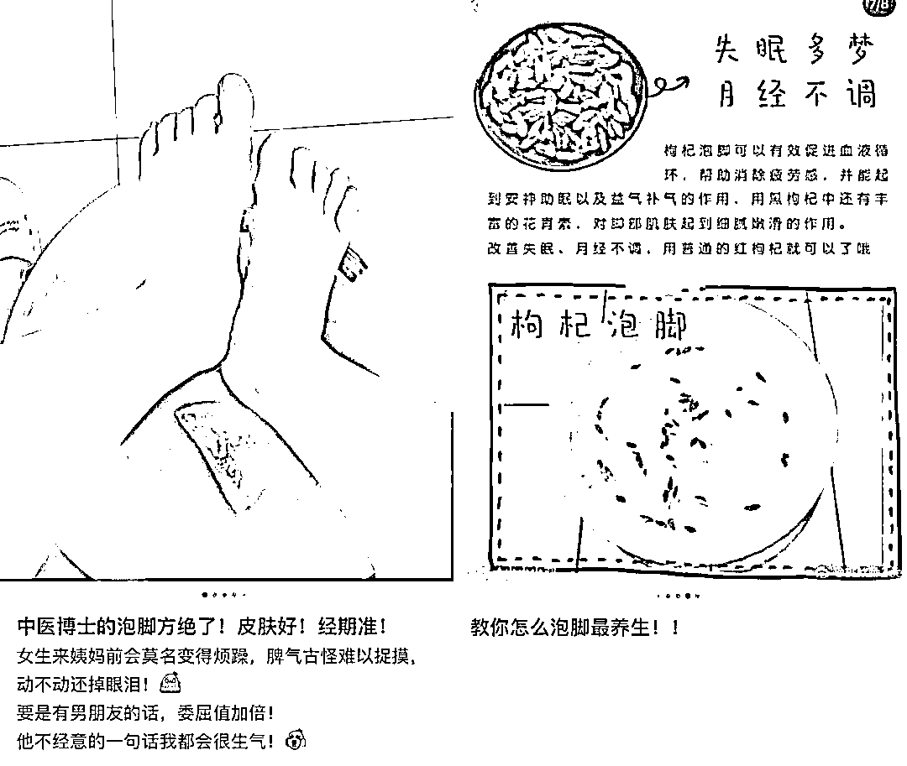**

***……我最近喝茶会放一把枸杞来着，看完我好难受***

**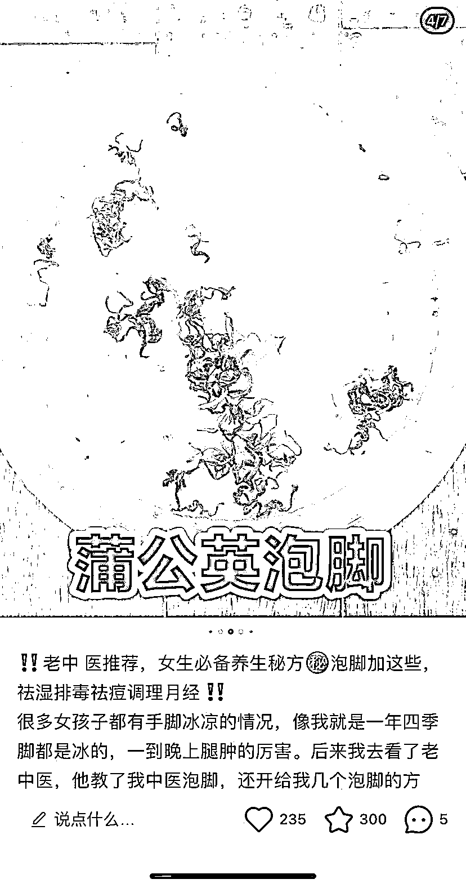**

**倒不是不相信中医，只是我个人觉得泡脚的原理就是加速血液循环，从这个角度讲，其实只用一盆热水效果也差不多吧？！**

**当然，如果每个女孩们都和我一样想的话，那么围绕着催经的产业就会大规模缩水——逛了一圈淘宝，我发现不论是枸杞、益母草、艾叶还是红花。**

****凡是你能想到泡水的都可以拿去泡 jio。****

**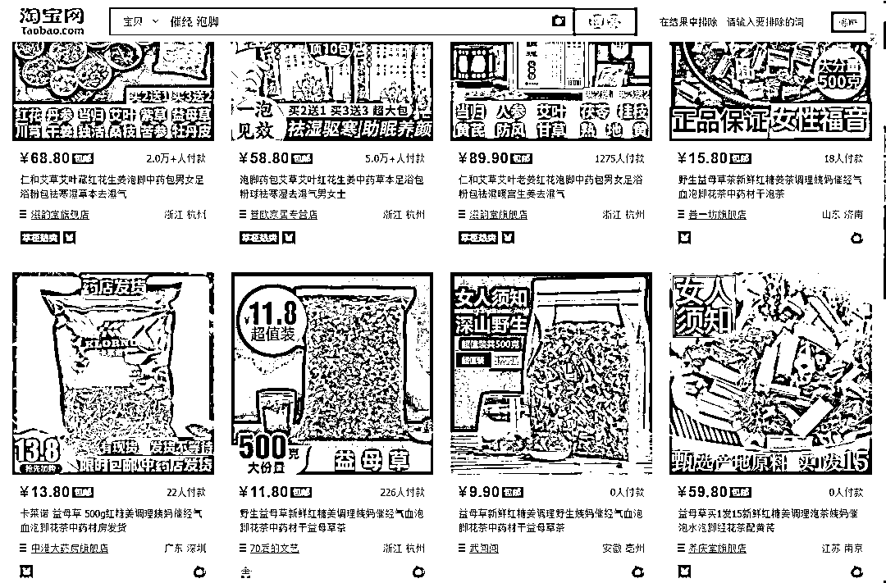**

**催姨妈让每一个女孩都变成了老中医，除了让脚要经过中药洗礼腌制入味之外，**按摩穴位也必不可少。****

**小红书上的博主们从穴位位置到按摩手法和次数都能给你介绍的清清楚楚，给人一种关了软件就能出门开个按摩店的错觉。**

**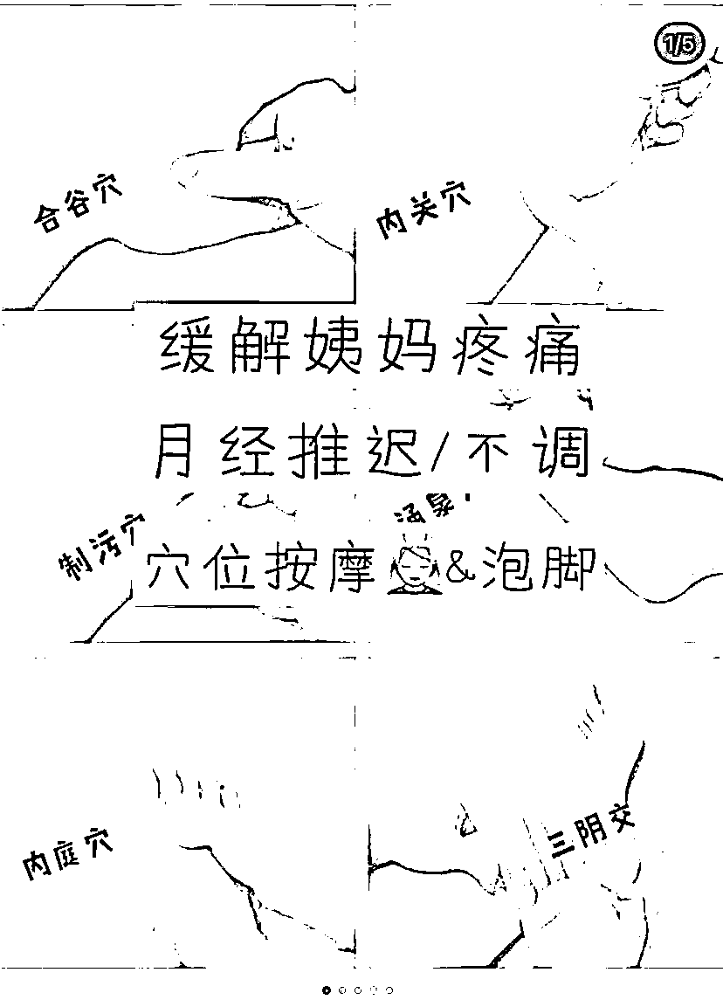**

**如果你遇到哪位女孩最近有事没事一个劲儿掐自己的大拇指，或者看到她的大拇指有三个诡异的**红点**，**建议你最近对她好一点，毕竟她正饱受身心的双重痛苦。****

****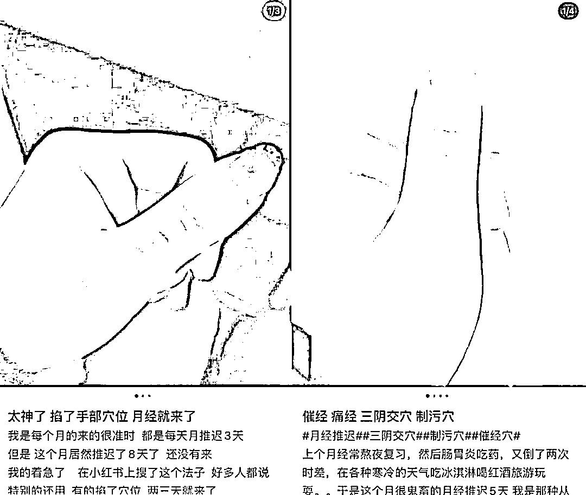****

*****亲身体会，掐大拇指真的好痛啊*****

****根据评论区的反馈：“按穴位确实非常有效”****

****有的早上按下午就来，有的今天按明天就来，比男朋友上游戏还准时。如果此时看文章的人（女孩）也受月经不调的困扰，或许可以一试。****

****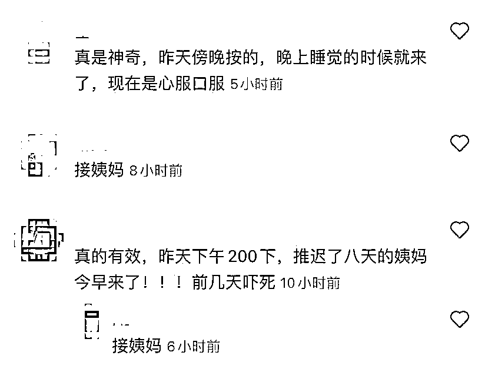****

******当然也不排除一些副作用，以及看教程的时候可能发现自己又被骗进了屠狗场。******

****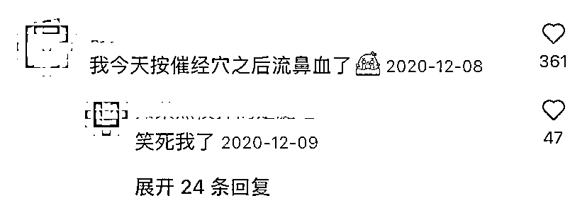****

*****吃点下火的吧....*****

****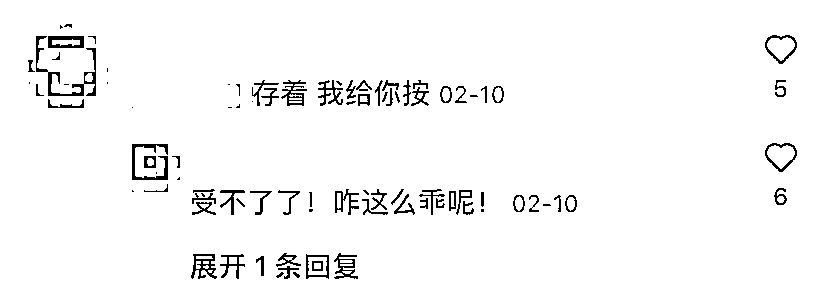****

*****受不了了！咋这么腻歪呢！*****

****奈何个人体质不同，尽管这个方法有些方法几年前就有人尝试，但即便她把大拇指按得红红的宛若刮过痧时，姨妈也倔强着不来。****

****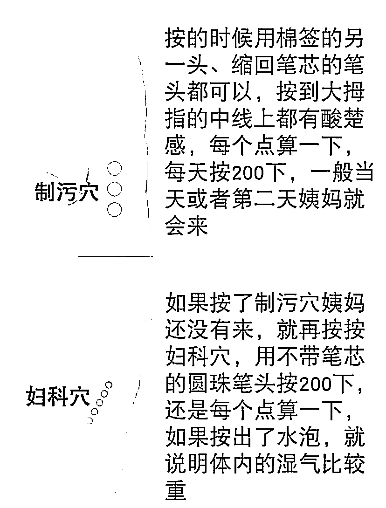****

*****这大概就是所谓的“人各有命"吧*****

****除了外部按摩，内补食疗也不能落下。****

****在小红书上搜“催经”，你可以看到屏幕上一碗碗红兮兮有有带着点黑色的“催经汤”：****

******桂圆红枣老生姜，当归枸杞红糖，豪华的还会给你加个蛋。******

****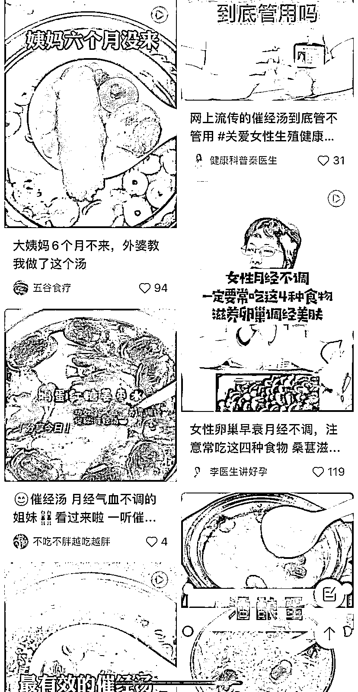****

*****六个月姨妈不来不去看医生？？？*****

****从评论区看，效果或许还是有的，甚至连黄体酮这种处方药都要拜倒在这碗药汤的面前。****

****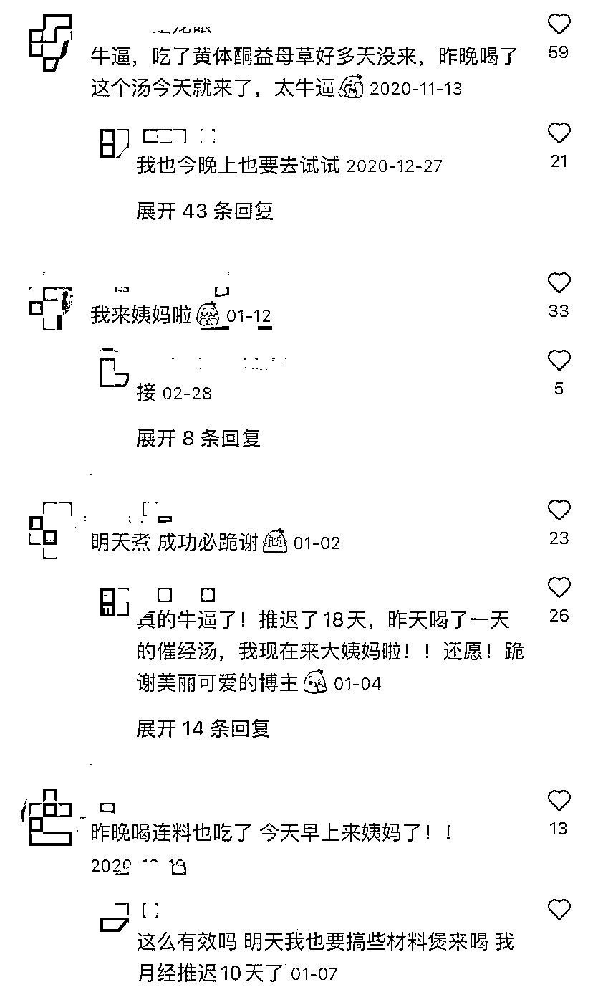****

*****只能提醒一句，红糖水喝多了会变胖*****

****且不论每个人体质不同怎能喝一样的药，其实停留在食补阶段都是新手，真正的老中医们已经开始自己吃药。****

****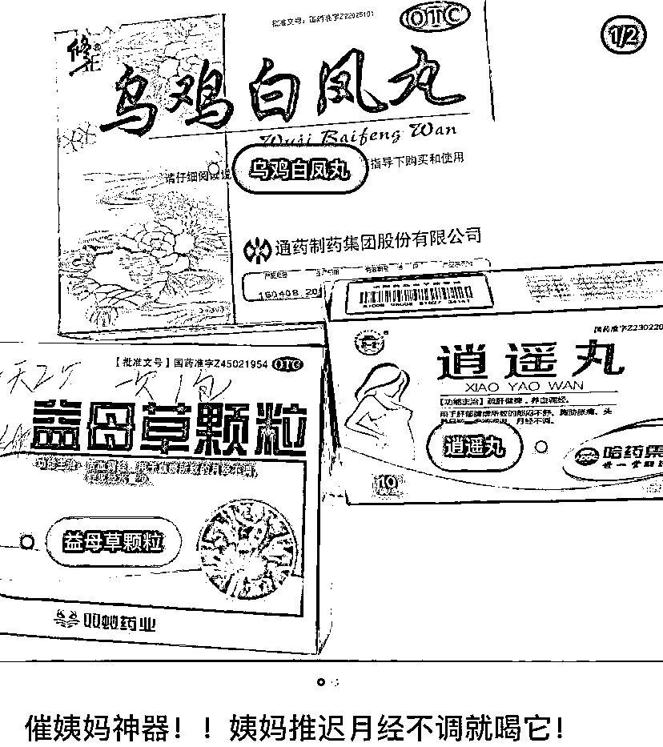****

*****感情中医讲究的“望闻问切”都是假的*****

****不过，女孩们 duck 不必嘲笑咱这些民科老中医，毕竟姨妈迟迟不来，你们应该确实不舒服。****

****不过话又说回来，虽然它来不来是一门玄学，但在一些求姨妈的帖子里发现有一些女孩其实自己也要付一点责任——****

******在“意外怀孕”吧里，几乎每小时都有男女发帖求姨妈，一时间让我怀疑义务教育是不是没有普及到位。******

****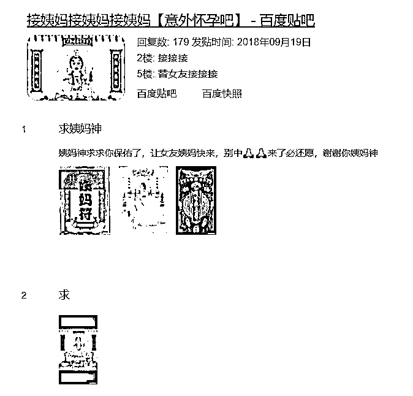****

****在另一个记录经期的 app 里，也有不少女孩分享自己的漫长的接姨妈之旅。****

******她们之所以把自己当小白鼠一样试各种偏方，只是因为为爱鼓掌前没有做安全措施。******

****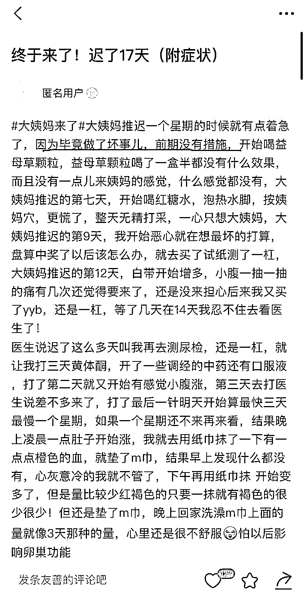****

*****？？？*****

****……2021 了，“情侣生活注意安全” 这句话我已经说累了。****

****虽然我国性教育确实有待改进，但是我相信网上这些发帖的男女们绝对不会不知道戴套可以防止意外怀孕。****

****但凡渣男们把努力撒谎的这股劲儿用在事业上，怕不是中国能多好几个人进福布斯。****

****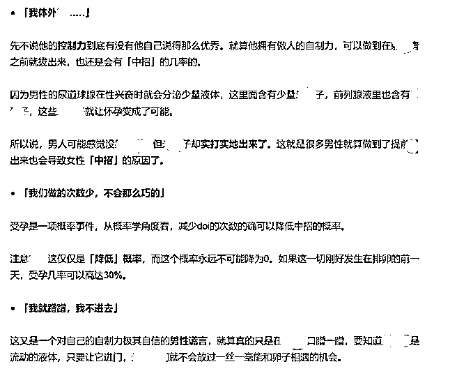****

*****拳 头 硬 了***** 

****不管是出于什么原因，在意外怀孕对女孩带来的伤害前，不做安全措施带来的“好处”都不值一提。****

****一想到人工流产给女孩们带来的身心伤害，看到这些帖子我都怒向胆边生，恨铁不成钢。****

****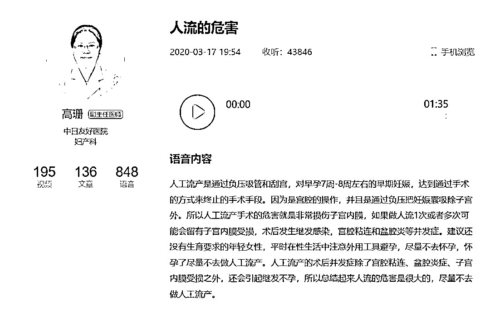****

*****来看看挂号费都要 100 的医院医生是这么说的*****

****ballball 大家爱自己一点。****

****它真的很娇贵，据说睡不好吃不好精神不好都有可能让它迟到？！****

****女孩们能做的，除了情侣生活注意安全之外，就是睡前少刷短视频、平时多运动、少独自生闷气之类老生常谈但你们就是做不到的事情。****

********

****以及，如果姨妈推迟过久，就别一个劲儿试小红书上的偏方，赶紧去医院妇科挂个号。****

****如果人人能自医，在教室里一边秃头一边背书的医学生们会哭的。****

******毕竟，在姨妈这门玄学面前，与其念叨着天上掉下个男人来给自己按穴熬汤，还不如自己爱惜自己来的有效。******

# 

****来源：不惑先生 ****

****************

****← 向右滑动与灰产圈互动交流 →****

********