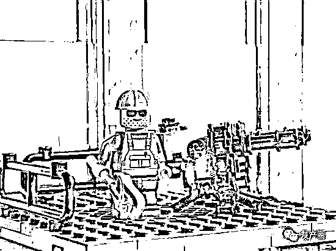
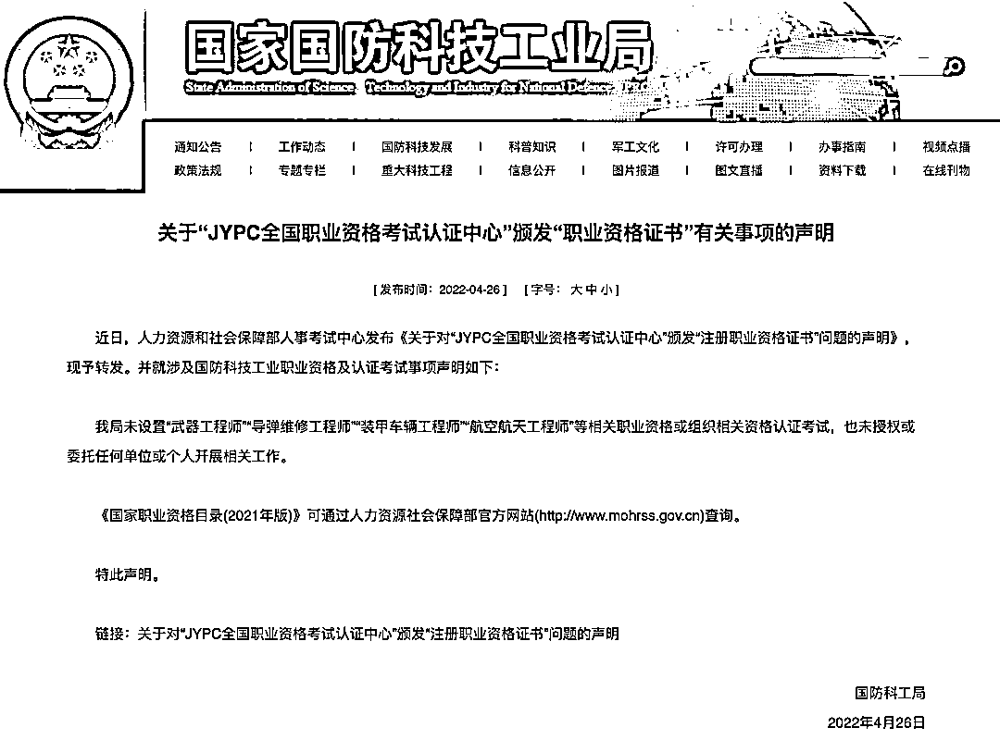
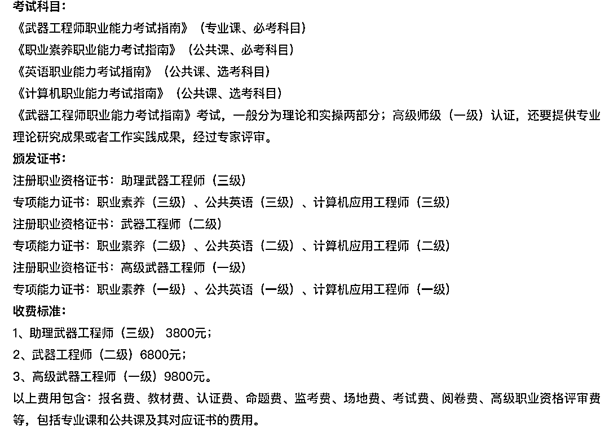

# 笑掉大牙！花 2 万能考“武器工程师”？！

> 原文：[`mp.weixin.qq.com/s?__biz=MzIyMDYwMTk0Mw==&mid=2247535570&idx=6&sn=442bbcffa1e0e483c20870a68c18f7d4&chksm=97cb80eaa0bc09fc393b4cb31f2f2827180f5321ccdd5cd47e7cf27f73aead87b776b63218eb&scene=27#wechat_redirect`](http://mp.weixin.qq.com/s?__biz=MzIyMDYwMTk0Mw==&mid=2247535570&idx=6&sn=442bbcffa1e0e483c20870a68c18f7d4&chksm=97cb80eaa0bc09fc393b4cb31f2f2827180f5321ccdd5cd47e7cf27f73aead87b776b63218eb&scene=27#wechat_redirect)

人社部职业技能鉴定中心近日声明，江苏英才职业技能鉴定有限责任公司以“JYPC 全国职业资格考试认证中心”名义颁发“注册职业资格证书”，不属于国家认可的职业资格证书，该机构也不是经人力资源社会保障部门备案的职业技能等级认定机构。

 人社部职业技能鉴定中心还称，江苏英才公司颁发印有“全国”“职业资格”等字样和国徽标志的证书，声称政府认可，违反了国办 73 号文、人社部 68 号文相关规定，严重扰乱了我国技能人才评价市场秩序，我中心保留追究相关单位和责任人法律责任的权利。

澎湃新闻 5 月 6 日以来连续刊文[**《考“易学风水师”要花三万多，江苏一教培机构被部委点名警告》**](http://mp.weixin.qq.com/s?__biz=MzIyMDYwMTk0Mw==&mid=2247535300&idx=5&sn=b72f7428554768e7dbd9e61fee63bc3e&chksm=97cb81fca0bc08ea2e23c282e0de05a080df7bdcb4f029b7262039350251755452e4362632f6&scene=21#wechat_redirect)《校名为何出现在被警告教培机构的宣传资料里？多所院校撇清关系》关注了这一事件进展。

 5 月 6 日下午，人力资源和社会保障部人事考试中心旗下网站中国人事考试网正式开通专栏“‘山寨证书’专项治理”，剑指当前山寨证书滥发乱象。

 澎湃新闻记者注意到，国家国防科技工业局（简称国防科工局）官网在今年 4 月 26 日发布了一则《关于“JYPC 全国职业资格考试认证中心”颁发“职业资格证书”有关事项的声明》。

 国防科工局在声明中表示：近日，人力资源和社会保障部人事考试中心发布《关于对“JYPC 全国职业资格考试认证中心”颁发“注册职业资格证书”问题的声明》，现予转发。并就涉及国防科技工业职业资格及认证考试事项声明如下：我局未设置“武器工程师”“导弹维修工程师”“装甲车辆工程师”“航空航天工程师”等相关职业资格或组织相关资格认证考试，也未授权或委托任何单位或个人开展相关工作。

国防科工局声明 

在声明中，国防科工局还表示：《国家职业资格目录(2021 年版)》可通过人力资源社会保障部官方网站(http://www.mohrss.gov.cn)查询。

 澎湃新闻记者注意到，上述国防科工局声明提到的“武器工程师”“导弹维修工程师”“装甲车辆工程师”“航空航天工程师”等相关职业资格或组织相关资格认证考试，在前述江苏英才职业技能鉴定有限责任公司名下的“JYPC 全国职业资格考试认证中心”官网上赫然在列。

例如，该中心官网 2019 年 9 月就发布了一则“武器工程师招生简章”。该简章描述“武器工程师”的课程为：“信息对抗系统分析与设计、信息对抗策略、电子对抗技术、光电对抗技术、网络对抗技术、微波工程基础、计算机软硬件对抗技术、信息网络安全防护技术、信息战战区虚拟现实技术等。就业领域：在科研单位、高等学校、信息产业及其使用管理部门从事系统设计、技术开发、操作管理和安全防护方面工作。” 

该简章还将“武器工程师”资格分成三级：助理武器工程师、武器工程师、高级武器工程师，发证机构则是“JYPC 全国职业资格考试认证中心”。在收费部分，上述简章介绍：“1、助理武器工程师（三级） 3800 元；2、武器工程师（二级）6800 元；3、高级武器工程师（一级）9800 元。”

JYPC 全国职业资格考试认证中心”官网发布的“武器工程师招生简章”。 

5 月 8 日下午，对于这份招生简章，一位在南方某知名军工研发单位任职的工程师向澎湃新闻记者表示，所谓“武器工程师”资格证书就是“一张废纸”，没有任何单位、机构会凭此招聘用人。

 这位工程师分析，“武器工程师招生简章”经过精心设计，“打了两个擦边球。”第一，该简章刻意混淆了职务与职称的概念，将从事武器相关工作和“工程师”的职称名称相联系，事实上在国家认可的职称体系中并无任何“武器工程师”这类的名词。第二，该简章虽挂名“武器”，但实际课程几乎全部放在“计算机技术”“信息安全”领域，这些课程规避了涉军涉密的问题，实际上可能只是公开的“Java”“C++”等编程课程，这样的课程要卖 20400 元，“就是个笑话”。

 此外，一名军事博物馆研究人员向澎湃新闻记者表示，上述简章还提到了“提供专业理论研究成果或者工作实践成果，经过专家评审”，这就涉及机构、专家的资质问题，发证机构要是不能出示相关资质，“就相当于买身军装冒充军人。”

澎湃新闻记者注意到，类似“武器工程师招生简章”的“导弹维修工程师招生简章”“装甲车辆工程师招生简章”“航空航天工程师招生简章”均能从前述江苏英才职业技能鉴定有限责任公司名下的“JYPC 全国职业资格考试认证中心”官网上查到，每本高级证书均需花费 2 万多元参加培训考试。

 《中国劳动保障报》官网 5 月 7 日刊文《放管结合 标本兼治 持续加大“山寨证书”专项治理工作力度》提到：开展“山寨证书”专项治理是巩固“放管服”改革成果的客观要求。

 文章认为，在实践中发现，有些机构和单位在利益驱使下，处心积虑钻法律、政策和改革的空子，打着新职业资格、职业技能等级等名义，发放各类五花八门的“山寨证书”牟利，严重扰乱了技术技能人才评价秩序，破坏了国家职业资格制度改革来之不易的成果。更有甚者，有机构在未经行业主管部门备案的情况下，喊着“人社部证书退出，哪家证书来接盘”的荒唐口号，公然在《国家职业资格目录》之外“另搞一套”，堂而皇之地编造出上千种所谓“注册职业资格证书”，甚至编造出所谓“导弹维修工程师”“装甲车辆工程师”“武器工程师”“部队政治工作师”“警察管理师”“禁毒师”“刑事侦查师”“边防指挥师”“司法鉴定工程师”这些涉军涉警涉法的“注册职业资格证书”，令人瞠目结舌。

 文章指出，要防止某些机构和单位在国家大幅削减职业资格的同时，又打着“职业资格”的幌子，假冒国家信用，谋取不法利益。坚决治理“山寨证书”，规范技术技能人才评价行为，才能避免“李逵退出、李鬼横行”，有效巩固“放管服”改革成果。

来源：澎湃新闻，利箭在行动

← 向右滑动与灰产圈互动交流 →

