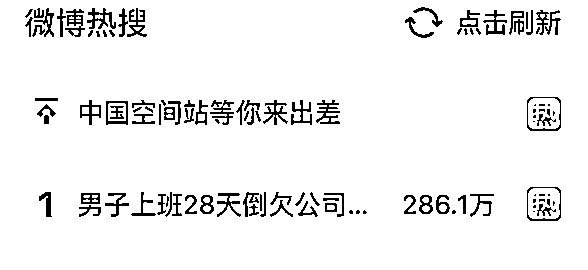

# 男子上班 28 天竟倒欠公司 3280 元！公司：微信朋友圈考核不合格

> 原文：[`mp.weixin.qq.com/s?__biz=MzIyMDYwMTk0Mw==&mid=2247535570&idx=7&sn=f1708871cdf22523e699e3bcb56cbfe6&chksm=97cb80eaa0bc09fc048054d16b7b43a40fcc4be391dec9b1750a91e67e3d034834d3b3fd0f5c&scene=27#wechat_redirect`](http://mp.weixin.qq.com/s?__biz=MzIyMDYwMTk0Mw==&mid=2247535570&idx=7&sn=f1708871cdf22523e699e3bcb56cbfe6&chksm=97cb80eaa0bc09fc048054d16b7b43a40fcc4be391dec9b1750a91e67e3d034834d3b3fd0f5c&scene=27#wechat_redirect)

近日，网友发帖称，四川巴中一男子在一家卖酒的公司应聘销售，**工作 20 余天后，竟然倒欠公司 3000 余元**，男子感觉自己被骗了。

新闻已冲上热搜第一

5 月 7 日，记者联系上帖子中的当事男子，他称自己名为赵某，在整个应聘和销售过程中，自己努力工作卖酒，却被公司劝退，而且没拿到工资，倒欠公司 3000 多元。8 日，该公司一负责人王某对此回应称，赵某应聘后，**发微信朋友圈的条数等考核不合格被扣钱，其工作未达标，所以****被劝退**。

记者了解到，赵某和公司并未签劳动合同，律师表示，按照《劳动合同法》规定，劳动者与用人单位建立了劳动关系，一个月内必须签订书面劳动合同。另外，劳动者只要正常履行劳动义务，用人单位应支付不低于当地最低工资标准的工资。

**网友发帖：**

**男子应聘销售上班 20 余天 **

**没拿到工资，倒欠公司 3000 余元**

近日，有网友发帖称，一名男子在一家酒企应聘当销售，20 余天后，被劝退出工作群。过了几日，男子向公司索要薪酬，发现自己倒欠公司 3000 余元。 

5 月 7 日，当事人赵某告诉记者，自己是三月二十几日到巴中城区一家酒企业当销售的。“去了之后，一起销售酒的有 10 余人。”赵某说，公司有 7 天观察期，保底工资 3000 元，大家一起跑销售。有时候，他负责开车，充当后勤。

直到 4 月中旬，被公司负责人劝退出销售群后，赵某因家里有事未到公司。近日，赵某通过微信与公司负责财务的李某联系，随后得到工资数据表，**原本认为有工资的他心情变得很低落，因为数据显示他倒欠公司 3280 元**。

这是为何？赵某告诉记者，公司给他的回复是业绩不达标，被劝退，“既然公司都让我退群了，我也没有再到公司去上班的必要。”

赵某称，**自己上班 20 多天，不仅没拿到工资，反而还倒欠公司 3280 元，**他觉得自己被骗了。

**扣罚原因：**

**微信添加人数、群动态等不达标**

**共计被扣 3280 元**

赵某提供的公司考核数据表格显示，他从 2022 年 3 月 22 日开始，直到 4 月 18 日结束，共计工作 28 天。 

赵某介绍，上班这 28 天，自己应该有工资的，因为**在应聘的时候，公司说过“保底 3000 元工资”**，应聘岗位是销售。

但是赵某从公司拿到的考核数据表格来看，28 天内，**群动态扣款 980 元，工作汇报扣款 300 元，微信添加人数扣罚 2000 元，共计扣款 3280 元**。

表格中，根据公司对运营人员的要求，**每月 50 条朋友圈**，少一条扣 50 元，不能屏蔽朋友圈；**每天加 10 个好友**，少加一个扣 10 元；**工作日期不得低于 26 天，群内动态每天不得少于 10 条**，少一条扣 10 元；**每天总结不少于 50 字**，少一条扣 10 元；**严禁发布除本公司以外的销售信息**，发一条扣 100 元。

**从公司对赵某的管理数据表格来看，赵某确实欠 3280 元**。

对于被公司劝退一事，赵某表示自己很冤，在工作过程中，**自己****也有销售业绩，前后共销售了 600 余元的酒**。针对表上扣款事项数据，他表示，自己未完成是很多时候做其他事情耽搁了。

**公司回应：**

**他未按要求去朋友圈发动态**

**因考核不合格被劝退 **

5 月 8 日，记者前往巴中市城区赵某工作过的公司了解此事，该公司一位负责人王某向记者表示，**赵某确实因考核不合格被公司劝退，相关数据表格已经发给赵某。**

**王某表示，公司对赵某是实行的代理制度，**没有定额的基本工资，但是有保底收入 3000 元，必须服从公司管理**。销售出去的酒有红线价格（基本价），超过红线价格属于销售人员的收入，并且当天拿到手。**

**“是否当天就获得销售酒的‘提成’，赵某自己清楚。”王某对记者说道。**

**对于赵某倒欠公司 3280 元一事，王某向记者表示，完成任务很简单，但赵某并没按照公司要求完成去朋友圈发动态等工作。**

**针对赵某在职期间的工作情况，王某表示，原本有 7 天的观察期，当时他并未通过观察期。因团队的关系，赵某没有签订合同，一直工作了 28 天，因未通过考核，所以劝其离职。**

****律师说法：****

****扣罚待遇不能超过最低工资****

****还应在一月内签劳动合同****

**5 月 9 日，记者就此采访了北京东卫（成都）律师事务所律师陈小虎。他介绍，从事情的整个过程来看，像赵某每天按时上下班，向公司交每日总结等，公司承认有“保底 3000 元”，实际上是要接受公司的管理和考核。不管签没签合同，他和公司已经是实质性劳动关系，不存在公司说的赵某是代理公司的酒，如果是代理公司的酒，双方是合作关系，是不会接受公司管理的。**

**陈小虎认为，作为公司，要扣罚员工的工资待遇，不是随便扣罚的。**即使扣罚，数额不能超过最低工资，更不可能让工资变成负数。****

******四川瑞利恒律师事务所律师王建对此则表示，整个过程中，公司有几方面的问题：1\. 按照《劳动合同法》规定，劳动者自入职之日起，即与用人单位建立劳动关系，**一个月内必须签订书面劳动合同**；2.按照《最低工资规定》的要求，劳动者只要正常履行劳动义务，**用人单位应支付不低于当地最低工资标准的工资**。如劳动者认为用人单位违反法律法规的规定，侵害了劳动者合法权益，可向劳动监察大队进行投诉举报或向劳动争议仲裁调解委员会申请劳动仲裁。******

****来源 ：红星新闻****

****************

****← 向右滑动与灰产圈互动交流 →****

********