# 上海一福利院把活人送殡仪馆后续：私人承包 8 家养老院

> 原文：[`mp.weixin.qq.com/s?__biz=MzIyMDYwMTk0Mw==&mid=2247535638&idx=1&sn=93827f576d73b00e3c33e2edb3567c4f&chksm=97cb872ea0bc0e38c9d3e8dfb2f9ff824aabddf4e81c1191534468ebc088e85401f72debf6d9&scene=27#wechat_redirect`](http://mp.weixin.qq.com/s?__biz=MzIyMDYwMTk0Mw==&mid=2247535638&idx=1&sn=93827f576d73b00e3c33e2edb3567c4f&chksm=97cb872ea0bc0e38c9d3e8dfb2f9ff824aabddf4e81c1191534468ebc088e85401f72debf6d9&scene=27#wechat_redirect)

图源丨电影：《我不是药神》

1998 年，新长征福利院被纳入上海市政府实事工程，总投资 1000 万元，后被刘柱和刘颖骅父子承包下来......

5 月 1 日早上 6 时许，睡梦中的王小梅被一通电话吵醒。

上海新长征福利院的工作人员通知王小梅，她的姐姐“去世”了。

王小梅的姐姐 75 岁了，没有子女，一直都是王小梅在帮忙照顾。

一年多前，年事已高、渐渐力不从心的王小梅将姐姐送入新长征福利院。

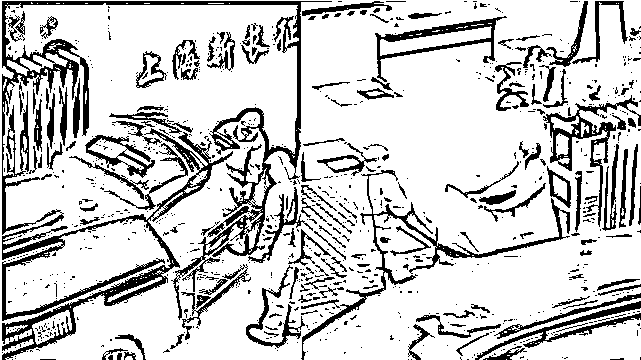

后面的事情，我们都知道了：**（**[**75 岁王阿婆，差一点被当作死人拉走送入殡仪馆**](http://mp.weixin.qq.com/s?__biz=MzIyMDYwMTk0Mw==&mid=2247535007&idx=1&sn=2bdff9a4ad3a85a3274e8d9ca5aa4d8d&chksm=97cb82a7a0bc0bb1b7379379e8954d3d30fb7823d907046b2450282f202532ae6c8c75a90cbd&scene=21#wechat_redirect)**。）**

<mpvideosnap class="js_uneditable custom_select_card channels_iframe videosnap_video_iframe" data-pluginname="videosnap" data-id="export/UzFfAgtgekIEAQAAAAAA3OUUwN8I_wAAAAstQy6ubaLX4KHWvLEZgBPEoqMIYxBdfMeDzNPgMIvXJKyfbJK6zyUMo1vTC2eA" data-url="https://findermp.video.qq.com/251/20304/stodownload?encfilekey=rjD5jyTuFrIpZ2ibE8T7YmwgiahniaXswqzWqNDiaicTqBLZjHHFTPwQkicuiabT2FBciay8abEFwB1PCdmTJIj7d1jDgp14uXQqHhwKwAHicUibYMfico685493ZN8bg&amp;adaptivelytrans=0&amp;bizid=1023&amp;dotrans=0&amp;hy=SH&amp;idx=1&amp;m=&amp;scene=0&amp;token=AxricY7RBHdVD5Rsibl3cEu16CwLJSliaUnMJkL1tVU6IfwY1stziaLtiaSrIUU9OC9IibcaM24sibDtCg" data-headimgurl="http://wx.qlogo.cn/finderhead/ibq4aVwOt6HNqrr8OD3sCviaytF3B8TqCwHicxsuIanAJo/0" data-username="v2_060000231003b20faec8c6e48a1acbd3ce04ef33b077a1e41d0d3794ed88ea537878dbe65910@finder" data-nickname="灰产圈+" data-desc="【最新】该福利院承认确有此事并“已致歉”，目前老人送入医院救治；普陀区成立调查组介入。

上海普陀区一福利院（院名请见视频）没有确认老人是否死亡，就请相关机构的人将老人“大体”拉走，结果在装车的时候，殡仪馆工作人员发现老人还活着。#上海疫情@灰产圈+ " data-nonceid="14240448828192658922" data-type="video" data-width="1080" data-height="1872"></mpvideosnap>

事发之后，上海市的处理速度还是非常快的。

第二天通报，医生被吊销执业资格，新长征福利院院长葛芳被免职并政务立案。同时负有管理责任的上海普陀区民政局党组书记、局长张建东被党纪立案。主管副局长黄耀红，养老服务科科长刘颖华，长征镇社会事业发展办公室主任吴友成，3 人均被免职并立案。

随着记者的调查深入，越来越多的真相浮出水面。 

**1.在殡仪馆工作人员发现老人还在动，福利院工作人员试图重新将毛巾盖住老人面部。** 

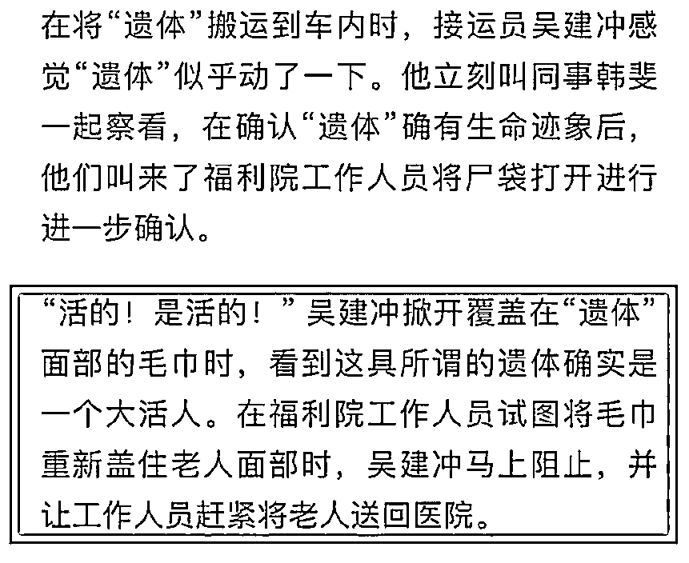

据宝山区殡仪馆通报，因挽救老人生命，吴建冲和韩斐两人分别被予以 5000 元的奖励。

**2.社区片警赶到后拍下视频，老人眼睛睁得很大，还在眨眼，精神头还不错。**

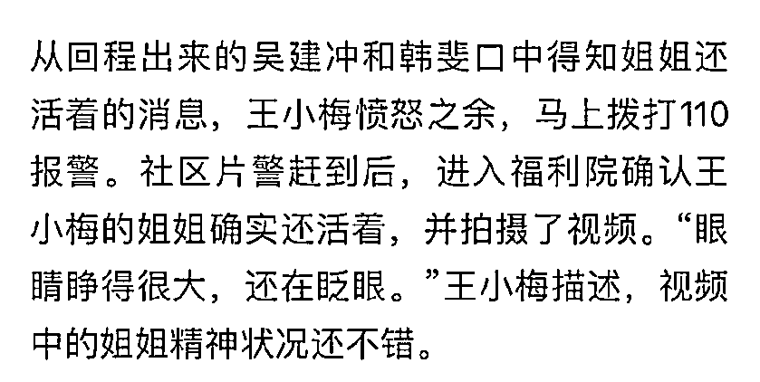

**3.养老院实际负责人刘颖骅，区民政局养老服务科科长刘颖华（已被免职）。** 

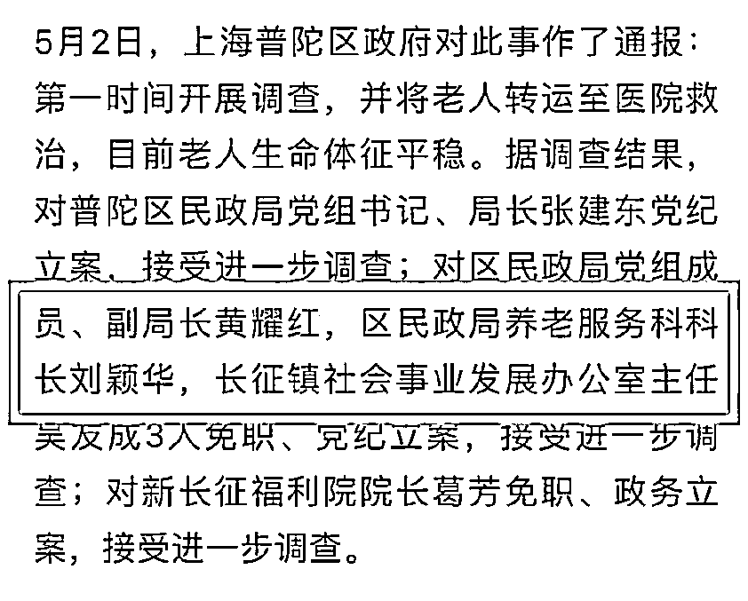

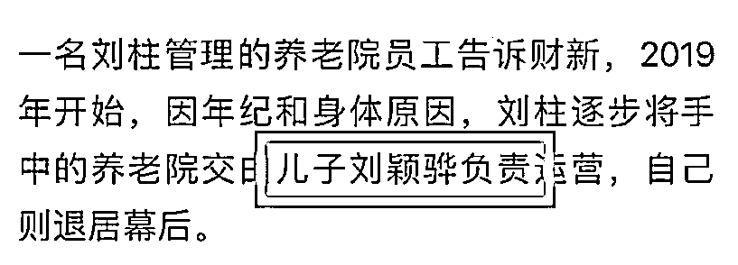

名字仅一字之差，真是巧啊。

这是两个人还是同一个人？有没有关系？ 

**4.刘柱家族已控制 8 家养老院。**

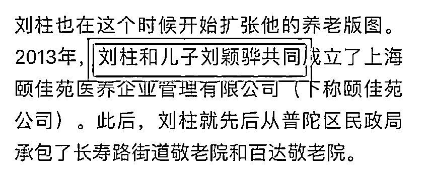

资料显示，新长征福利院成立于 1983 年，原本属于普陀区民政局管理的公办福利院。1998 年，该福利院还被纳入上海市政府实事工程，总投资 1000 万元。

之后新长征福利院被刘柱和刘颖骅父子承包下来，以“公建民营”的方式在管理。

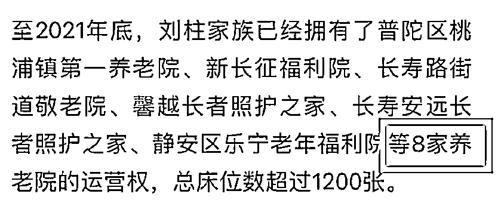

**这种福利院一方面领着国家的补贴，一方面收取病患家属的高额护理费。**

这些年来，多少人都误解是公立机构，但且不知早已经变成盈利的民营机构了。

**5.养老院护工 24 小时住院模式，即全天 24 小时住在养老院，每月假期只休息一两天。**

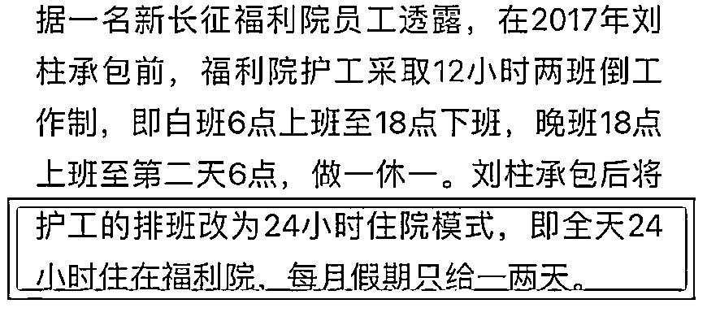

**6.原本一名护工要照顾 6 名老人，刘柱接管后要照护 9~10 名老人，老护工受不了这种工作强度。** 

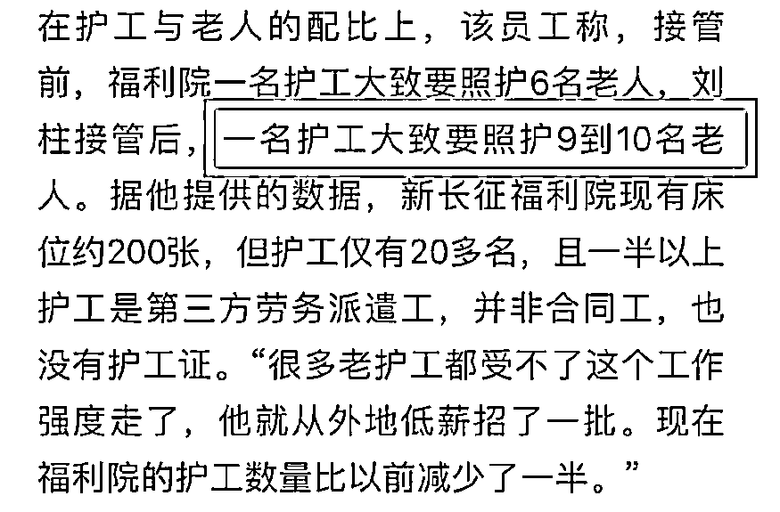

连轴转的大年纪护工，管的老人也多，长时间得不到休息，也容易精神恍惚，各种服务肯定跟不上。

**受苦的，还是老人。**

**7.被吊销医师资格的医生田某某，之前是在农村诊所行医。**

虽然拥有医师执业证，但是并不具备临床诊断的能力，最好的医疗能力就是帮病人配药和挂水。 

**8.被免职并政务立案的福利院院长葛芳，他以前只是一名福利院的会计，因前院长生病才临时顶班成为院长，没有任何专业运营能力。**

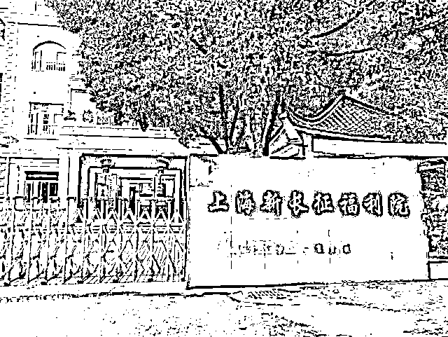

**9.2015 年 7 月，刘氏斧父子控制的百达敬老院，一名老人入院第 3 天就坠楼身亡。**

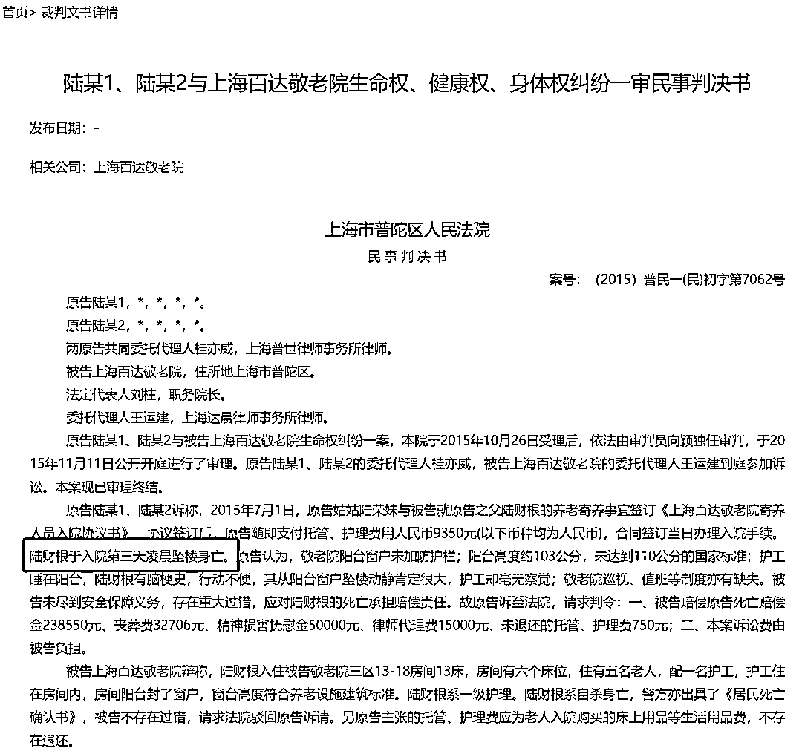

最终上海市第二中级人民法院以护理上存在疏漏，判决百达敬老院赔偿死者家属 2 万元。

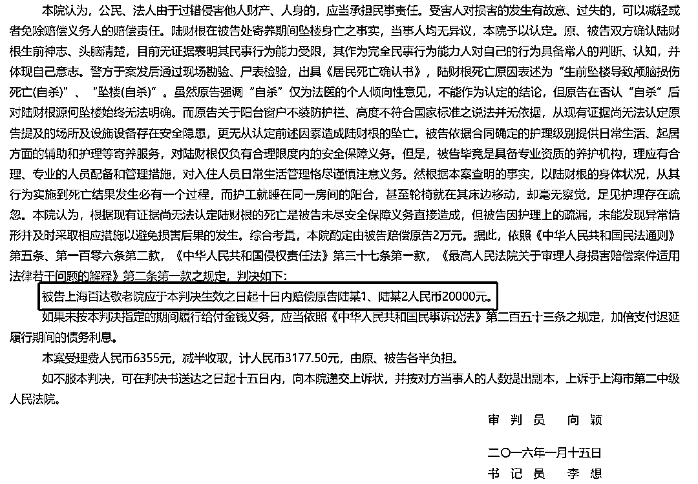

**是的，老人坠楼身亡，只用赔 2 万；学生意外坠楼，学校都不止赔这个价格......**

**10.看上去，只能赚辛苦钱的基层福利院生意，却被刘氏父子做到风生水起，为何总能获得相关部门的青睐？**

从 2013 年到 2021 年，短短 8 年，他们已经获得了 8 家养老院的运营权，总床位数超过 1200 张。

为何能获得相关部门的青睐呢？可能从员工采访的一段话得知了，“每次区里来检查，刘柱父子都能“提前几天知道”，并做出相应安排”。

所有的质疑写到这里，很多东西不用明说，大家也清楚，福利院问题重重，涉及上上下下的利益链。

**20 多年来，这黑了心肠的父子二人究竟赚了多少昧心钱，又用这些钱养肥了多少贪官？究竟谁是他们的保护伞？**

再联想送活人去殡仪馆的离谱事，好像也不那么离谱了。

**最让人感到后怕的是，没有疫情的时候，家属可以不定期探视；上海疫情严重都封闭了，所以福利院也为所欲为。**

有多少老人，在无声中“正常”去世了？ 

此刻，我不敢想。

来源：昌南大队长

← 向右滑动与灰产圈互动交流 →

