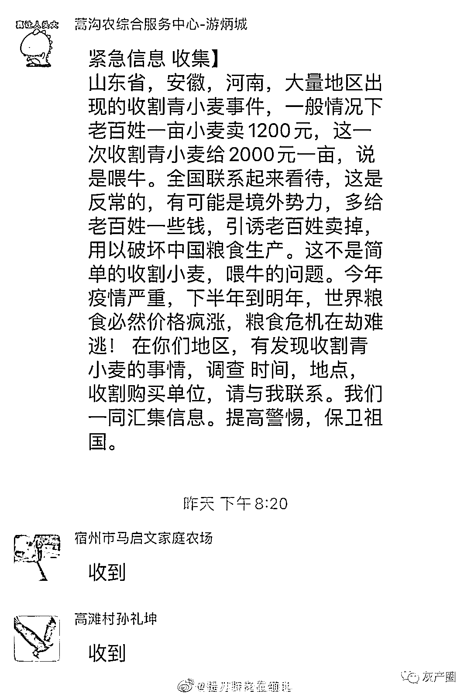
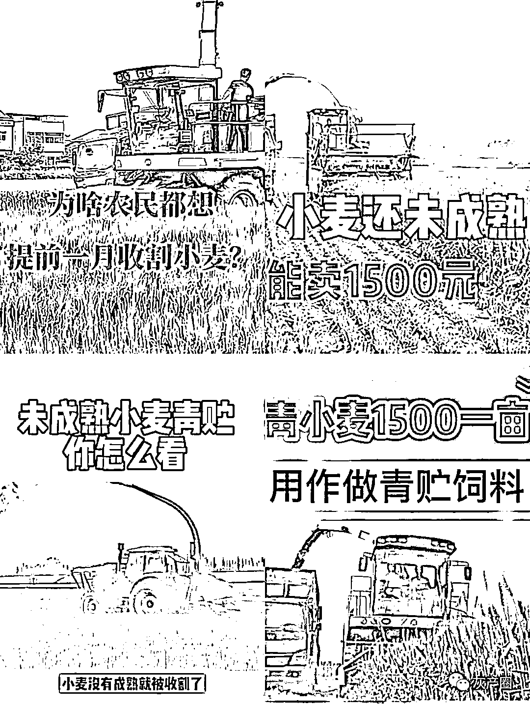

# 小麦青储惹上“大麻烦”，农民要尽快停止这种行为，背后有何猫腻

> 原文：[`mp.weixin.qq.com/s?__biz=MzIyMDYwMTk0Mw==&mid=2247535638&idx=3&sn=95a70c4140958d044e5195f590faf913&chksm=97cb872ea0bc0e388213ed2168dc05ffcdb7904960d695ed4d85ba78fb214c5ab0fe6ca2c0e0&scene=27#wechat_redirect`](http://mp.weixin.qq.com/s?__biz=MzIyMDYwMTk0Mw==&mid=2247535638&idx=3&sn=95a70c4140958d044e5195f590faf913&chksm=97cb872ea0bc0e388213ed2168dc05ffcdb7904960d695ed4d85ba78fb214c5ab0fe6ca2c0e0&scene=27#wechat_redirect)

近期，愈演愈烈的“小麦青储饲料事件”引起了人民群众的广泛关注。不仅如此，青储小麦事件也引起了农业部的重视，并且于昨日下发了重要通知，各地要全面排查此类毁麦苗事件，违规行为立马处理。

同时，小麦种植大省河南也发表了声明，小麦原则上不能用作青储饲料，禁止此类事件发生，维护国家粮食安全。当然，这意味着小麦青储要被管控了，农户应该停止这种行为了，否则损失要自负了。

一时间，人们议论纷纷，小麦青储怎么了？到底是动了“谁的蛋糕”？小麦青储有何“阴谋论”？小麦青储背后真的有不可告人的“秘密”吗？

显然这不是我们考虑的范畴，我们能做的就是相信国家，相信相关部门会彻查清楚，并且会给农民以及广大群众一个交代；并且要秉着不信谣、不造谣的态度去理性看待这个问题。

按市场规则来说，农民选择小麦青储无可厚非。因为人都是逐利的，在利益面前都会选择利益。如果粮食能赚钱，想必农民不会卖青苗；侧面也反映了农民确实不赚钱。如果非得牺牲农民利益，想必农民也会听国家的。

<mpvideosnap class="js_uneditable custom_select_card channels_iframe videosnap_video_iframe" data-pluginname="videosnap" data-id="export/UzFfAgtgekIEAQAAAAAAMgAtrFPDkQAAAAstQy6ubaLX4KHWvLEZgBPEwaMgVFAeEMmDzNPgMIsCBJK1itdwOQtc7bAbNPaT" data-url="https://findermp.video.qq.com/251/20304/stodownload?encfilekey=rjD5jyTuFrIpZ2ibE8T7YmwgiahniaXswqzk28ZP5ZcC54TPTCxHVypABq3WgQHDW4bvXPvvX9N2piczKqIdDzXpSL6FfQn8PjyFuicfunuuymD5UicDibMC4BYew&amp;adaptivelytrans=0&amp;bizid=1023&amp;dotrans=0&amp;hy=SH&amp;idx=1&amp;m=&amp;scene=0&amp;token=AxricY7RBHdVD5Rsibl3cEu69kibI1C3Qoj2Vo8SaAHEWhHdXopevf6ibtBuiboX6y8JdJ2iablZNDvibA" data-headimgurl="http://wx.qlogo.cn/finderhead/ibq4aVwOt6HNqrr8OD3sCviaytF3B8TqCwHicxsuIanAJo/0" data-username="v2_060000231003b20faec8c6e48a1acbd3ce04ef33b077a1e41d0d3794ed88ea537878dbe65910@finder" data-nickname="灰产圈+" data-desc="河南等地有农民收割青小麦做饲料？农业专家：不划算，属个别现象:近日，一些河南等地的种植户在短视频平台发布收割青小麦做青贮饲料的“广告”，引起网友关注。5 月 7 日，专家接受海报新闻记者采访表示，用小麦做青贮饲料并不合适，小麦做饲料的转化价值不如玉米，生物量也不比玉米高。除非因雨水多、小麦播种晚、种植不当等情况导致产量预估极低；否则做青贮饲料不划算，也不合适。#粮食#三农#青储#小麦@灰产圈+ " data-nonceid="11341392188173292251" data-type="video" data-width="3832" data-height="2160"></mpvideosnap>

# 小麦青储，别让种粮农民背锅

粮食这个东西作为商品又有点特殊。市场经济下，这两年化肥、农药等农资涨幅不小，要想平衡好参与耕耘的农民(或租赁承包土地个人企业）利益与种植积极性，需要政策制定者的智慧。

1、小麦青储不是新鲜事

以前，每年秋收的前几天，村里许多家庭都会将地里的还没成熟的玉米连同绿色的杆一起砍掉，卖给附近的养牛场，养牛场用粉碎机粉碎，堆积如山，储存起来供一年中牛的饲料，因为里面既有牛需要的秸秆叶子成分，也有玉米颗粒，因之是一个不需要再增加任何其它成分就可以满足牛生长的饲料。玉米大概是青储饲料这一个词的最早来源。随着时间的推移，出现了小麦青储。

不过，有专家表示，小麦做青储饲料其实并不是特别合适，主要是转化价值不如玉米，而且产能也不比玉米高。对于那些小麦种植过程中受恶劣天气影响或者预估产量不高的情况是可以做青储的；否则不太合适。

    

2、青储和卖粮的一笔账

2021 年我国小麦平均单产为 390.9 公斤/亩。我们按照高产田来进行计算，一亩地算作 500 公斤，按照今年小麦价格 1.35-1.46 元/斤计算，等成熟后收割卖了（毛利），最多还卖不到 1500 元；而目前小麦青储每亩地却高达 1500 元。

是不是不可思议。但是这样一算，去年燕麦草一吨长到了 2700，虽然是干草，但一亩也能达到 600 到 700 公斤，去年的尿素一吨最高 2700，平均 2500，今年现在就已经突破 3000 了，钾肥涨得更夸张，大家还觉得小麦青储一亩 1500 高吗？

<mpvideosnap class="js_uneditable custom_select_card channels_iframe videosnap_video_iframe" data-pluginname="videosnap" data-id="export/UzFfAgtgekIEAQAAAAAAsCQANqielgAAAAstQy6ubaLX4KHWvLEZgBPEwqNgaXs0EcmDzNPgMIuvo5ErrcmorFuKomUcjx73" data-url="https://findermp.video.qq.com/251/20304/stodownload?encfilekey=S7s6ianIic0ia4PicKJSfB8EjyjpQibPUAXol2uPyxcfOJkLuwCj9WnibFYn81NwJSI5k0gPjW5AfWu5xDAFCnlqFjgB18km8r9gZlFO5B5Uw8SPFhk69yYKicsRQ&amp;adaptivelytrans=0&amp;bizid=1023&amp;dotrans=0&amp;hy=SH&amp;idx=1&amp;m=&amp;scene=0&amp;token=x5Y29zUxcibCaricbN3jdcrYhwA64HKODqfXWK99s8u2AMEvBvL15MFr4FQ0iaicZBdk6XB1qNujqicg" data-headimgurl="http://wx.qlogo.cn/finderhead/ibq4aVwOt6HNqrr8OD3sCviaytF3B8TqCwHicxsuIanAJo/0" data-username="v2_060000231003b20faec8c6e48a1acbd3ce04ef33b077a1e41d0d3794ed88ea537878dbe65910@finder" data-nickname="灰产圈+" data-desc="警惕！到底是谁在割青苗，谁在预谋制造粮食危机？#青储#小麦#粮食危机#粮食@灰产圈+ " data-nonceid="7016979729682228853" data-type="video" data-width="540" data-height="1168"></mpvideosnap>

2000 年的时候小麦是六七毛钱一斤，现在过去二十年了，小麦价格是一块三左右，确实翻了两倍呀。可让我们比较一下同时期，经过二十年房价翻了二十几倍，工资收入翻了十倍，然而我们的农民的粮食只翻了两倍。这是何其巨大的剪刀差？

市场经济下，农民有自主管理权，不能说农民只有种庄稼的本分，没有卖庄稼的权利。种地卖粮有多难，或许只有农民才知道。那些批判农民为了多赚几百块钱就把快成熟小麦卖做青储饲料的，就好比现代版的“何不食肉糜”。

3、小麦青储不合时宜

小麦青储收购很少有五月初收的。一般来说，青储小麦收购期在五月下旬到六月初到乳熟期之后收购最佳。这时候，麦穗籽粒已形成，并且已经是正常大小的麦穗了，颜色呈淡绿色，内部充满乳浆。而现在的小麦青苗，麦穗全是空壳，蛋白质和淀粉都不达标，属于劣质青饲料。这时候收购不免让人起疑。

而且，当前俄乌两个产粮大户的战争导致粮食本来就减产，其他地区因为“口罩”事件和天气原因导致粮食产量也不及往年，世界粮价上涨已成定势；而且现在的石油宁涨价不增量的做法，也很容易让人想到这是人为加剧粮食需求紧张，然后可搞的事情就更多了。

总之，小麦做青储饲料，从粮食保障角度，是存在很大的不合理，小麦是主粮，是我们十几亿人口生活的基础保障之一，如果大范围的将小麦用作青储饲料，势必减少粮食产量，与目前的粮食形势大相背离。

当然，保证粮食安全，人人有责。但首先得保证种粮人的收入能满足日常生活，目前农村种粮收入太低。每年 1 号文件，都是支持农业的，怎么支持，有没有让几亿农民得到实惠，能不能满足农民对美好生活的向往呢。

农业这个东西关乎国家安全，粮食安全不容小觑。但是怎么提高种粮、收粮、储粮积极性，让农户收益，这个是关键，也是保证粮食安全的根本。无论是保护耕地，建立长效的耕地保护措施，还是降低建筑使用耕地面积，亦或者提高粮价，这都是为粮食量产而增加效益。

<mpvideosnap class="js_uneditable custom_select_card channels_iframe videosnap_video_iframe" data-pluginname="videosnap" data-id="export/UzFfAgtgekIEAQAAAAAATIAhR3bkxwAAAAstQy6ubaLX4KHWvLEZgBPEyqNUMlAUE8mDzNPgMItpcOBgHNMyzgrhBBpRV2GS" data-url="https://findermp.video.qq.com/251/20304/stodownload?encfilekey=S7s6ianIic0ia4PicKJSfB8EjyjpQibPUAXolYib1Qp9B3QicA4P4BVaUDO6Y2Zk0Q8WsDPTQIFo9t7Pox0C0wI0dAqIlZYpRSRLC6a9P5ELYJffXVkiatOeB4uBkw&amp;adaptivelytrans=0&amp;bizid=1023&amp;dotrans=0&amp;hy=SH&amp;idx=1&amp;m=&amp;scene=0&amp;token=AxricY7RBHdUEEuiaBJsYMbxPvqjCdNDZcuq055bFkbVmSY5MzR0ZwlPiarGfwc9HZB9ALeAWcDRas" data-headimgurl="http://wx.qlogo.cn/finderhead/ibq4aVwOt6HNqrr8OD3sCviaytF3B8TqCwHicxsuIanAJo/0" data-username="v2_060000231003b20faec8c6e48a1acbd3ce04ef33b077a1e41d0d3794ed88ea537878dbe65910@finder" data-nickname="灰产圈+" data-desc="最近河南小麦被收储为饲料的问题在抖音上不断发酵，粮食安全问题再一次呈现。
粮食问题呈现一次，就想起这个老公知一次。
庆幸我们当初没有相信这样一批竟然要把中国人的饭碗交给美国和俄罗斯的人。#
如果当初信了这些人，今日之中国还不知道什么样子。#青储#小麦#农业@灰产圈+ " data-nonceid="9943528534582891607" data-type="video" data-width="1856" data-height="4096"></mpvideosnap>

来源：似风撩动 

← 向右滑动与灰产圈互动交流 →

