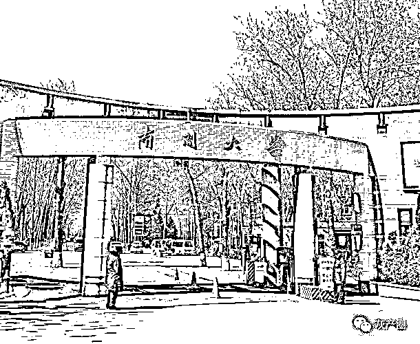

# 南开回应多名教师被实名举报：正在调查

> 原文：[`mp.weixin.qq.com/s?__biz=MzIyMDYwMTk0Mw==&mid=2247535638&idx=5&sn=42c6d60f8a35281f3ad622bda299bc2e&chksm=97cb872ea0bc0e38a68475c450e55530b4461204a9929dacb10974db6891e0959ea4f3ae2c1c&scene=27#wechat_redirect`](http://mp.weixin.qq.com/s?__biz=MzIyMDYwMTk0Mw==&mid=2247535638&idx=5&sn=42c6d60f8a35281f3ad622bda299bc2e&chksm=97cb872ea0bc0e38a68475c450e55530b4461204a9929dacb10974db6891e0959ea4f3ae2c1c&scene=27#wechat_redirect)

近日，

南开大学多名老师被实名举报，

引发社会广泛关注

**（****相关报道：**[**女生实名举报南开大学李文韬教授，请不要让第二个“房思琪”的悲剧发生！**](http://mp.weixin.qq.com/s?__biz=MzIyMDYwMTk0Mw==&mid=2247535510&idx=1&sn=75c500fc754b06195c8277734da93f20&chksm=97cb80aea0bc09b8539b0b000dad76644bf5b9af5ff2601954168dc33700e9c2afb104a161b8&scene=21#wechat_redirect)**）**。

5 月 10 日，

南开大学党委教工部相关负责人回应称，

**学校已经关注到此事，**

**非常重视，**

**已收到对于****尹某某、陈某某、李某某**

**三位教师的实名举报，**

**目前正在调查处理中。 **

[`mp.weixin.qq.com/mp/readtemplate?t=pages/video_player_tmpl&action=mpvideo&auto=0&vid=wxv_2392173044892041216`](https://mp.weixin.qq.com/mp/readtemplate?t=pages/video_player_tmpl&action=mpvideo&auto=0&vid=wxv_2392173044892041216)

这三件实名举报，分别是：

网友@无敌 xxx 实名举报南开大学教师陈某某，举报内容包括该名教师“**违反教学纪律、欺瞒大众杜撰年龄、公权私用、道德败坏、打击报复实名举报人**”等；

网友@不被 xxx 实名举报南开大学 APEC 研究中心李某某,称其存在“**学术不端、贪腐公款、嫖娼、腐败、婚内诱骗成年少女”**等问题；

网友@南开 xxx 实名举报南开大学教师尹某某，内容包括“**该名教师将女学生灌醉侵害，随后以博士录取对其进行安抚”**等。

此外，今年 2 月份，曾有媒体报道过网友发文举报南开大学博士生导师尹某某**诱骗女博士考生，婚内出轨作风糜烂。举报内容称，尹某某利用导师身份将其灌醉，趁其无力反抗之际与其发生性关系。**尹某某对此回应称，举报人是在造谣，未发生性关系，已报警。南开大学相关部门工作人员称对此事并不了解。

据以上三位举报人称，

**她们已向南开大学多次举报，**

**但始终没有收到学校的正面答复。**

来源：央视网综合中国新闻周刊、极目新闻、澎湃新闻

← 向右滑动与灰产圈互动交流 →

