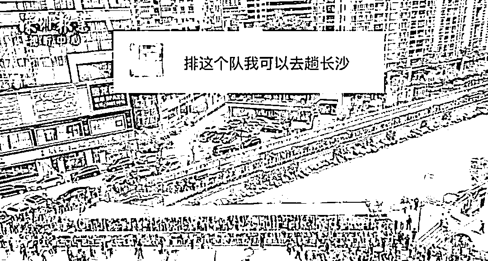
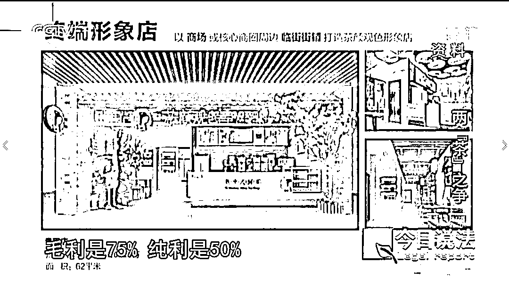
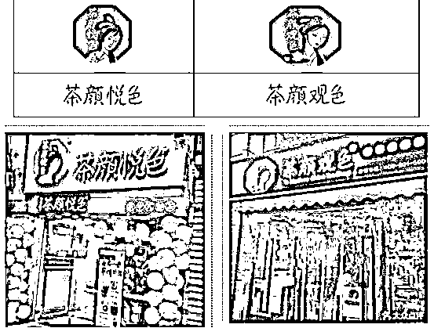
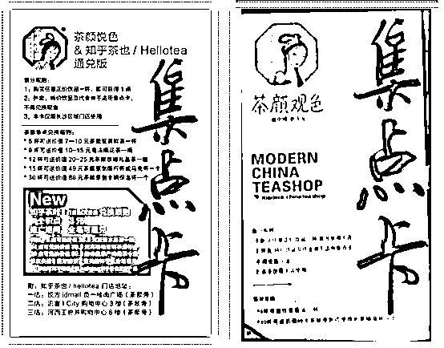

# “我就蹭你热度，你管我”？！

> 原文：[`mp.weixin.qq.com/s?__biz=MzIyMDYwMTk0Mw==&mid=2247535638&idx=6&sn=c87fb9a4bb68764e3f5b43296d3d48a2&chksm=97cb872ea0bc0e389df2b35379aa171ed985924b8cda6e6154cb84e8d1f798cd79116324b163&scene=27#wechat_redirect`](http://mp.weixin.qq.com/s?__biz=MzIyMDYwMTk0Mw==&mid=2247535638&idx=6&sn=c87fb9a4bb68764e3f5b43296d3d48a2&chksm=97cb872ea0bc0e389df2b35379aa171ed985924b8cda6e6154cb84e8d1f798cd79116324b163&scene=27#wechat_redirect)

2021 年 4 月 2 日，

网红奶茶“茶颜悦色”快闪店在深圳开业。

据报道， 

**当天排队预约的人数甚至突破 5 万。**

**而购买茶颜悦色的代购费或者黄牛号，**

**被炒到 200 至 500 元人民币不等。**

**网友戏称：**

**“坐飞机去长沙买可能更快些。”**

有人迷惑了：

**“茶颜悦色有这么难买？**

**我家门口就有啊，天天喝。”**

恭喜你， 

大概率是买到了“**茶颜观色**”

**相似度极高的店名、包装、装潢......** 

**“茶颜悦色”和“茶颜观色”，** 

**谁是“李鬼”？**

2022 年 3 月 8 日，

最高人民法院在第十三届全国人民代表大会

第五次会议上的工作报告中，

提到**“茶颜悦色”奶茶诉“茶颜观色”不正当竞争一案。**

一家奶茶店的维权案， 

为什么能和众多关乎国计民生的案件一起

进入最高法的工作报告？

其背后是国家对**“李逵 vs 李鬼”、**

**“劣币驱逐良币**”等市场问题的关注，

以及维护市场公平竞争的决心。

2022 年 5 月 11 日，

中央广播电视总台央视《今日说法》

播出节目《两“茶”之争》，

对这起案件进行了详细拆解。

**明目张胆蹭热度，**

**欺骗消费者，**

**“李鬼”为何如此嚣张？**

**“茶颜观色”：**

**加盟店到处开，利润高达 50%**

雷同的装潢设计， 

真假难辨的店面招牌

...... 

随着茶颜悦色名气逐渐打响，

市场上出现了不少山寨模仿的品牌，

**其中打“擦边球”最明显的就是“茶颜观色”。**

[`mp.weixin.qq.com/mp/readtemplate?t=pages/video_player_tmpl&action=mpvideo&auto=0&vid=wxv_2393409775557541891`](https://mp.weixin.qq.com/mp/readtemplate?t=pages/video_player_tmpl&action=mpvideo&auto=0&vid=wxv_2393409775557541891)

“茶颜观色”是广州洛旗餐饮管理有限公司

旗下的加盟品牌，

该公司的工作人员表示： 

**“（茶颜观色）可以有 50％的利润。”**

**“李鬼”不惧李逵：**

**“就蹭热度，你管我？”**

“茶颜悦色”深耕长沙本地市场，

“茶颜观色”则开在其他城市，

二者本来相安无事。

然而，

**在“茶颜悦色”开店第六年，**

**店铺斜对面赫然出现一家“茶颜观色”。** 

**无论是外观还是广告，** 

**二者都极为相似。**

很多游客慕名去买“茶颜悦色”， 

却买到了“茶颜观色”。 

对此，

这家 “茶颜观色”的店长直言不讳：

**“我就蹭热度，你管我。”******

[`mp.weixin.qq.com/mp/readtemplate?t=pages/video_player_tmpl&action=mpvideo&auto=0&vid=wxv_2393529454200487938`](https://mp.weixin.qq.com/mp/readtemplate?t=pages/video_player_tmpl&action=mpvideo&auto=0&vid=wxv_2393529454200487938)

**“李鬼”反告：**

**“茶颜悦色”侵权**

2019 年 10 月， 

洛旗公司起诉“茶颜悦色”，

称其使用的商标、字体与自家商标相似，

构成侵权，

要求“茶颜悦色”方**赔偿损失、发表致歉声明**。

然而，

**“茶颜悦色”商标注册于 2015 年，**

而洛旗公司成立于 2017 年，

2018 年从第三方处受让获得“茶颜观色”商标。

对此，

洛旗公司代理律师表示，

**“茶颜观色”商标在****受让前，**

**已于 2008 年成功注册，**

**比“茶颜悦色”更早。**

法庭认为，

“茶颜观色”商标在注册后几乎无人知晓。

2018 年，原告洛旗公司在

理应知晓“茶颜悦色”知名度的情况下，

仍然受让使用注册商标“茶颜观色”，

**并以此提起商标侵权诉讼，**

**主观恶意明显，**

**驳回了洛旗公司的诉讼请求。**

[`mp.weixin.qq.com/mp/readtemplate?t=pages/video_player_tmpl&action=mpvideo&auto=0&vid=wxv_2393495856231612417`](https://mp.weixin.qq.com/mp/readtemplate?t=pages/video_player_tmpl&action=mpvideo&auto=0&vid=wxv_2393495856231612417)

**“茶颜悦色”怒诉：**

**洛旗公司属于****不正当竞争**

2020 年 8 月， 

“茶颜悦色”将洛旗公司、刘琼饮品店等

一并起诉，

理由是“洛旗公司使用与茶颜悦色相似的装饰装潢进行宣传，容易造成消费者混淆，构成不正当竞争。”

长沙市天心区人民法院经过审理，

一审判决被告洛旗公司和凯郡昇品公司

**停止在全国范围内****与“茶颜悦色”**

**相同或近似装潢的广告宣传、**

**虚假宣传等不正当竞争行为，**

**并赔偿“茶颜悦色”的经济损失**

**及合理维权费用****累计 170 万元。**

一审判决后， 

“茶颜观色”众多加盟商也受到牵连。

有的加盟店被当地商场劝退， 

有的加盟店被市场监管局要求进行整改。

加盟商称，

**洛旗公司曾宣传“与茶颜悦色是一家公司”：** 

**“觉得自己被骗了，又不敢承认，**

**很丢脸的感觉”** 

**“很担心，不敢再开下去****，**

**怕茶颜悦色告我们”。**

当他们前去维权时，

洛旗公司早已人去楼空。 

**两“茶”之争，**

**“李鬼”为何如此猖狂？**

中国人民大学刘俊海教授表示， 

一个原因是，

部分经营者唯利是图，

**当违法收益高于违法成本，** 

**有些企业就会铤而走险；** 

另一方面，

部分受害品牌企业**只注重市场拓展，** 

**而忽视了权益保护**，

或是**考虑到自身体量不大，**

**便漠视了侵权行为，**

**甚至希望山寨企业给自身带来影响力，**

这是非常危险的想法。

**被侵权企业如何避免被“李鬼”盯上？** 

*   品牌企业应趁早申请专利、注册商标； 

*   品牌企业可通过大数据、大分析等现代技术手段**及时跟踪、固定和保全侵权证据**，将侵权行为扼杀在萌芽状态，避免侵权企业发展壮大后增加维权成本。 

**加盟商受到企业的诱导、欺骗，是否可以提出索赔？**

中国人民大学刘俊海教授建议，无过错的加盟商**可以凭借合同、证人证言等相关书证、物证进行维权**，向侵权的企业总部提起民事责任诉讼，追究其违约责任。

**那么问题来了：**

**你喝的是“茶颜悦色”，**

**还是“茶颜观色”？**

****

来源：央视网综合最高人民法院、新闻联播、澎湃新闻

← 向右滑动与灰产圈互动交流 →

