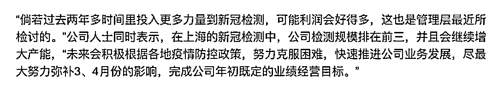

# 核酸检测出错“被”进方舱 涉事公司润达医疗曾检讨投入少致赚钱少

> 原文：[`mp.weixin.qq.com/s?__biz=MzIyMDYwMTk0Mw==&mid=2247535715&idx=1&sn=f99f74ab2a6981eff0532985305888db&chksm=97cb875ba0bc0e4d0a6eb6b4881fb8049dfbaa7655b0a3c4787276b16e8a85ddc6cb740dd56e&scene=27#wechat_redirect`](http://mp.weixin.qq.com/s?__biz=MzIyMDYwMTk0Mw==&mid=2247535715&idx=1&sn=f99f74ab2a6981eff0532985305888db&chksm=97cb875ba0bc0e4d0a6eb6b4881fb8049dfbaa7655b0a3c4787276b16e8a85ddc6cb740dd56e&scene=27#wechat_redirect)

上市公司润达医疗旗下的核酸检测机构上海中科润达医学检验实验室（后文简称：中科润达）正在面临频繁出具“假阳性”报告的指控。 

凤凰网《风暴眼》联系到两位身处上海的爆料人，根据其提供的材料可以确认，的确存在同一名被检测者在短时间内被中科润达出具“阳性”报告，但其他检测机构出具“阴性”报告的案例。

不仅如此，由于居民对中科润达检测结果准确性投下不信任票，上海黄浦区五里桥街道直接将中科润达更换为其他核酸机构。

面对汹涌的舆情，上交所对润达医疗下发监管工作函，而该公司股价今日遭遇跌停。值得注意的是，就在不久前，润达医疗刚刚因 4 月 29 日、5 月 5 日、5 月 6 日连续三个交易日股价波动过大而收到上交所问询函。

随着事件不断发酵，凤凰网《风暴眼》还发现，中科润达是 2020 年初新冠疫情爆发以来，首批被上海官方纳入核酸检测正规实验室的其中之一。

2020 年 3 月 18 日，中科润达是首批通过上海市临床检验质量控制中心《2020 新型冠状病毒（2019-nCov）核酸检测能力验证》的实验室，该公司正式成为输入型新冠病毒核酸检测的受委托第三方检测机构。

有网友对此担忧：这是否意味着，长达两年多时间以来的核酸检测服务中，中科润达或许还存在其他潜在的“假阳”风险？尤其是在疫情防控的关键时刻，在政治局强调人民至上、生命至上，毫不动摇坚持“动态清零”的时刻，因为核酸检测机构的不准确数据，会给疫情防控带来多大影响，值得深究。

**1、核酸检测“阴阳之变”，中科润达准确性遭质疑**

一位身处上海黄浦区的爆料人王先生向凤凰网《风暴眼》爆料称，自己 4 月 17 日通过上海中科润达医学检验实验室（后文简称：中科润达）进行核酸检测，4 月 18 日得知结果为阳性。但自己在 4 月 18 日中午、19 日中午及晚上连续三次进行抗原检测均为阴性。

不仅自测抗原为阴性，4 月 20 日和 4 月 21 日，王先生在青浦区国家会展中心方舱医院经由上海兰卫医学检验所所做的核酸检测结果亦均为阴性。只是在 4 月 22 日，王先生进入方舱 2 天时间后，才再次被出具阳性报告。

王先生在社交媒体上公布的自己核酸检测结果截图

无独有偶，另一位身处上海的李先生亦向凤凰网《风暴眼》表示，自己一位同事在经中科润达检测呈阳性后进入方舱，但此后连续几次核酸检测均为阴性。之后，该同事由方舱出院转为居家隔离。而在居家隔离期间，该同事连续核酸检测阴性之后，变为阳性。而对于这次阳性检测报告，“到底是本身确诊的复阳还是方舱感染的阳是个谜”。

微博平台上，“中科润达核酸检测结果准确性遭质疑”成为热搜话题词。多位网友评论表示自己或身边人遭遇了相似的情况。

微博网友截图

有网友发文表示，五一期间，其所在小区进行单人单管核酸检测，其中一女孩结果呈阳性。在没有复检的情况下，该女孩三小时内转运至四叶草方舱医院。但在方舱期间，该女孩每次核酸检测结果都是阴性，三天后被获准回家。

还有网友表示，其于 2022 年 4 月 12 日在中科润达检测出阳性之后，被转至方舱医院。在连续三次“阴性”结果后，第四次才被确诊为“阳性”，该网友质疑，“等于就是因为这家中科润达的阳性报告让我去方舱得了一遍奥密克戎的”。

值得注意的是，由于居民对中科润达核酸结果投下不信任票，上海黄浦区五里桥街道更是直接将中科润达更换为其他核酸检测机构。

凤凰网《风暴眼》查阅上海五里桥街道海悦小区公众号“爱满海悦”发现，在文章的留言处，该公众号证实已经将核酸检测机构换成核子华曦。

凤凰网《风暴眼》就此事致电润达医疗，截至发稿前，电话无人接听。

行业专家对凤凰网《风暴眼》表示，核酸检测出现假阳性的原因有很多，比如在采样、转运、检测等某个环节受到环境污染，或者采样的医护人员同时是疫苗接种人员，医护人员在开启疫苗瓶、抽取疫苗液体、注射疫苗等过程中，身体，设备，器械等受疫苗（不致病，但核酸检测结果会显示阳性）“污染”时，可能会检测出假阳性结果。

值得注意的是，面对群众的质疑，在 5 月 10 日的上海市新冠肺炎疫情防控工作新闻发布会上，上海市卫健委副主任赵丹丹表示，针对网上部分市民对核酸检测结果的情况反映，已开展对相关第三方检测机构的调查，如果发现违法违规问题，将依法依规从严查处，绝不姑息。

而对于“假阳”报告知否可以追偿索赔，一名不愿具名的律师向凤凰网《风暴眼》透露，目前由于“损失”多少无法界定，也没有相应救济渠道，因此是否追究赔偿、能不能实现赔偿还需要看事态的进一步发展，“目前看还不能下定论”，该律师表示。

5 月 11 日上午，上交所对润达医疗下发监管工作函，就媒体报道相关事项提出工作要求。

润达医疗 5 月 11 日早间公告称，中科实验室为公司持股 48.43%的上海中科润达精准医学检验有限公司之全资公司，日常严格按照实验室规范流程进行检测。对于上述舆情，公司高度重视。公司已要求中科实验室就相关情况启动内部自查并配合有关部门调查。如有需澄清或说明的相关情形，公司将及时履行信息披露义务。

**2、去年新冠检测业务收入翻倍，曾后悔“因投入晚致利润增厚少”**

公开资料显示，上海润达医疗科技股份有限公司成立于 1999 年 1 月 6 日，法人刘辉，公司系医学实验室综合服务商，主要为各类医学实验室（包括医院检验科、第三方医学实验室、体检中心、疾控中心和血站等）提供体外诊断产品、技术服务支持、实验室运营管理等。

天眼查数据显示，润达医疗前三大股东分别是杭州市拱墅区国有投资控股集团有限公司、朱文怡、刘辉，持股比例分别为 20.02%、9.48%、7.25%。其中杭州市拱墅区国有投资控股集团有限公司由杭州市拱墅区财政局 100%持股。另外，上海润达医疗旗下还有 56 家控股参股企业。

图源：天眼查

公司主营业务包括两大板块：商业综合服务板块（IVD 传统供应链业务、集约化业务/区域检验中心业务、第三方实验室检测业务）和工业板块（IVD 产品研发生产业务、数字化检验信息系统业务）。

据润达医疗 2021 年年报，去年公司实现营业收入 88.60 亿元，同比 2020 年增长 25.33%；实现归母净利润 3.80 亿元，同比 2020 年同期增长 15.23%。其中，第三方实验室业务去年实现营收 3.53 亿元，同比增长 125.60%，轻松实现翻倍，在各类核心服务型业务中增速最快。

资料显示，润达医疗旗下目前共有两家第三方实验室，分别为此番涉事的中科润达和黑龙江龙卫精准检验中心。其中，中科润达成立于 2017 年 9 月，注册资本 3000 万元，而黑龙江龙卫精准检验中心则成立于 2016 年 5 月，注册资本 6000 万元。

尽管新冠检测业务在公司整体营收中的占比不高，但却格外受到公司重视。在 2021 年年报中，润达医疗就明确表示，去年业绩增长原因“主要系新冠检测业务带来的业绩增量和常规检测业务的逐步恢复。”

值得注意的是，在今年 4 月 28 日召开的 2021 年年报业绩交流会上，润达医疗相关负责人还对新冠检测业务开展时间晚流露出“悔意”：“倘若过去两年多时间里投入更多力量到新冠检测，可能利润会好得多，这也是管理层最近所检讨的。”

图源：《证券时报》报道

**3、核酸检测规模上海第三，4 月新冠检测收入超 2 亿元**

与此同时，其年报显示，润达医疗业务虽然遍布全国，但主要创收来自华东地区。

2021 年，润达医疗在华东地区实现营收 52.40 亿元，占公司全年总营收的 59.18%。润达医疗在年报中指出，“华东地区作为集约化和区检业务客户最多的区域，通过多元化服务组合所产生的协同效应助力毛利率增长。”

另据润达医疗在 2021 年年报业绩交流会上透露，在上海的新冠检测中，公司检测规模排在前三。

凤凰网《风暴眼》梳理发现，核酸检测业务或将是润达医疗接下来的业务重点，这一点从公司多次公开表态中可见一斑。

在 4 月 28 日公告说明中，润达医疗表示，在今年上半年，受上海、东北等地区疫情影响，各地严格执行“动态清零”的方针政策，采取全域静态管理等措施，上述地区终端医院正常就诊活动出现阶段性的大幅下降，导致院内常规检测需求阶段性下滑。

为改善业务，值此上海疫情之际，润达医疗也积极开拓了气膜实验室业务，并在上海建成首个核酸检测气膜实验室。据了解，为跟上黄浦区的核酸筛查能力，该气膜实验室初期设计产能每天 10 万管，并为后期预留了约 5 万管的储备产能。

据《上海证券报》报道，相对于方舱实验室，气膜实验室的产能几乎是它的 6 到 7 倍。而中科润达已在虹口区、黄浦区、浦东新区、宝山区已落地首批近 300 个“核酸检测便民采样点”。

此外，今年一季报数据显示，润达医疗今年 1-3 月总营收实现 21.7 亿元，同比增长为 7.34%，但净利润却大幅下滑 44.81%，仅为 7987 万。对此，公司表示，今年一季度公司净利润出现阶段性下滑的原因是受今年 3 月份上海、东北等地疫情影响。

“4 月份开始，我们的检测能力得到了大幅度的提升，从 3 月份的几万管提升到数十万管”润达医疗人士介绍，“目前每天我们实验室检测量能达到 30-40 万管左右，这对我们在上海院内常规检测业务的受损可以有些业绩上的弥补。”

据《证券时报》此前测算，按照上海单管 28 块/管的收费标准，以及润达医疗目前日检测超 30 万管的检测量计算，公司每天在新冠检测的收入能达到 800 万元左右，估计 4 月份单月公司新冠检测收入将超过 2 亿元。

润达医疗相关负责人亦表示，未来会继续增大核酸检测产能，“未来会积极根据各地疫情防控政策，努力克服困难，快速推进公司业务发展，尽最大努力弥补 3、4 月份的影响，完成公司年初既定的业绩经营目标。”

**4、为何第三方检测机构“假阳”屡禁不止？网友质疑处罚过轻**

润达医疗赚得盆满钵满背后，检测准确性如何保证？数据源头错误对防疫大局的破坏，是潜在的巨大风险。更令人担忧的是，这样的数据错误，不止润达医疗一家。

今年 4 月 23 日，合肥官方通报称，合肥和合医学检验实验室、合肥诺为尔医学检验实验室因在蜀山区区域核酸检测中，超能力承揽检测业务、严重超过承诺时间出具检测报告，影响合肥市对疫情形势及时研判。更为严重的是，此前已多次发生类似情况，有的还几次出具“假阳性”报告，严重干扰了合肥疫情防控大局。

通报表示，经研究，决定对上述两家实验室给予警告，立即暂停两家实验室在合肥市范围内的合作业务，合肥市各县(市)区、开发区和市直各单位要立即按此要求严格执行。今后无论哪家检测机构，如有类似情形，一律照此处理。

然而对于这一处罚，不少网友却表示“处罚过轻”——出具“假报告”却仅仅只是被“警告”？

无独有偶，2021 年 1 月，第三方机构济南华曦医学检验有限公司在河北隆尧县进行第二轮全员核酸检测中，在未检测完毕情况下先向当地卫健部门谎报全部阴性，两日后又报告有阳性样本，对当地防疫造成很大被动和损失，公安机关对涉事机构业务代表翟某某采取刑事强制措施，除此之外未有其他处理。

诸如此类的核酸报告“失真”和令人不满的处罚结果加速侵蚀着人们对于第三方核酸检测机构的信任，也引发了人们对长期疫情防控的隐忧。

有网友向凤凰网《风暴眼》表达了自己的担忧：在“动态清零”防控疫情的关键时刻，因为核酸检测机构的错误数据，会给疫情防控带来多大影响？

一方面是频频加码升级的防疫措施，入室消杀、连续核酸、停工停产、方舱隔离......另一方面，对于数据源头错误的处罚却轻轻放下，没有回溯和校正，没有严格管控。“源头数据错误会引发一连串链条反应，危害不是更大吗？”

“我十分不理解”，这位网友说。

*参考资料：*

*1、《润达医疗将扩大新冠检测产能 力争完成全年既定业绩目标》，证券时报 e 公司*

凤凰网《风暴眼》出品 作者：凤凰网财经 琢絮 南阳

← 向右滑动与灰产圈互动交流 →

