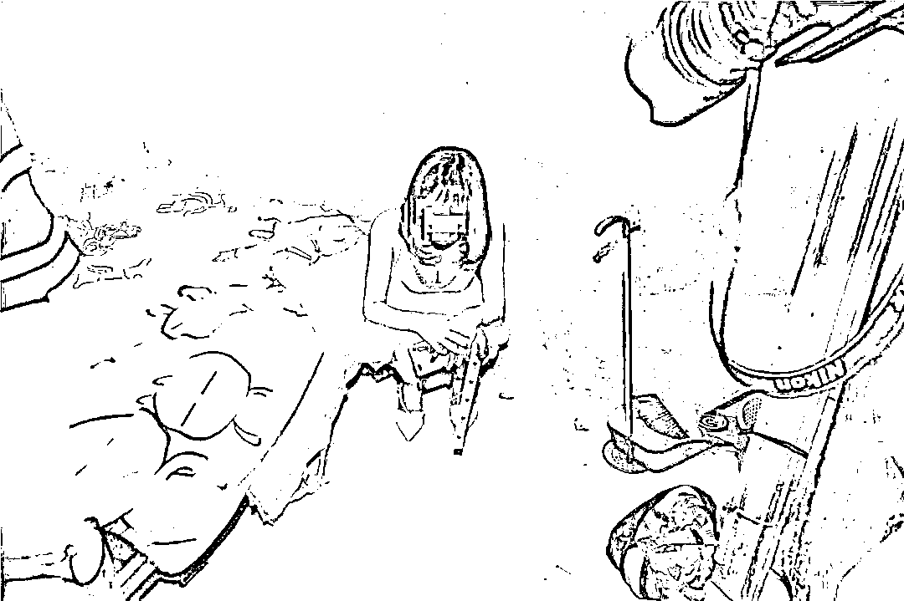
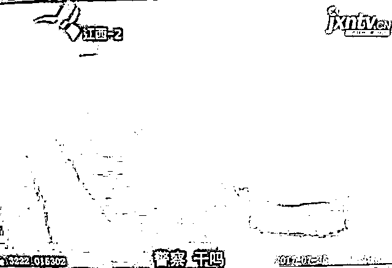
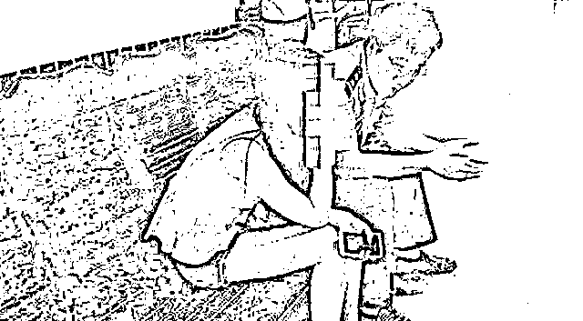
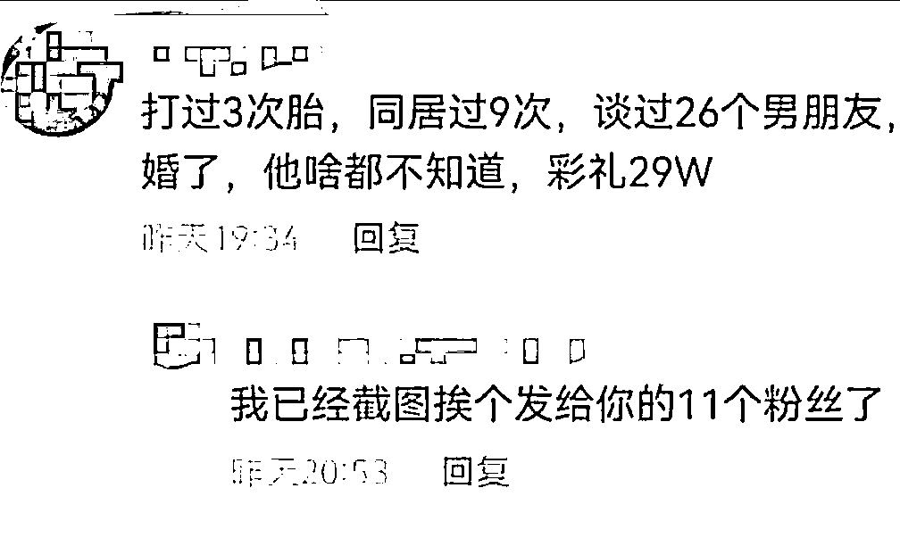
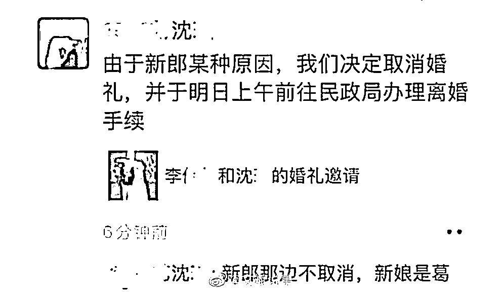

# 男子住旅馆耐不住寂寞，打小卡片上的电话，结果来的人竟是自己老婆

> 原文：[`mp.weixin.qq.com/s?__biz=MzIyMDYwMTk0Mw==&mid=2247535715&idx=2&sn=e2de5be034e282eda833b51b18c31c3d&chksm=97cb875ba0bc0e4d8d56290193ae08d5264829c0f4d3f94fcc310f2c40809595d88a06efeaec&scene=27#wechat_redirect`](http://mp.weixin.qq.com/s?__biz=MzIyMDYwMTk0Mw==&mid=2247535715&idx=2&sn=e2de5be034e282eda833b51b18c31c3d&chksm=97cb875ba0bc0e4d8d56290193ae08d5264829c0f4d3f94fcc310f2c40809595d88a06efeaec&scene=27#wechat_redirect)

最近看到一个酷似段子的奇葩新闻。

去年春节，长期在外地务工的张某回家过年，中途回到老家县城的时候，已经是凌晨一两点了。

而且县城距离他家还有一段不近的距离，当晚回家已不可能，张某就在县城附近找个旅馆住一晚上，第二天再回家。

就在张某准备休息的时候，房间门缝下面突然塞下一张小卡片。

本来张某都打算睡觉了，这一下可就不困了。 

他看着那些卡片上一个个花枝招展的女性心里直痒痒，心想长夜漫漫难以入眠，不如找一个。

于是打电话过去叫了一个过来，半小时后就说到楼下了。

张某心想还挺快，远远的看了一眼，来的还挺漂亮，心里感觉美滋滋的。

但走近一看，张某顿时说不出话来。

**原来这个花了自己 200 元叫来的人，竟然是自己的老婆。**

自己在外打拼，老婆居然在家背着自己干这种事情。

张某越想越来气，直接按住老婆就是一顿痛打。

隔壁的住户听到这么大动静直接选择报警，警方赶到现场之后带走了张某夫妇。

而警方最终也以张某涉嫌 PC 张某老婆涉嫌卖 Y 将两人行政拘留并罚款。

有网友评论这 P 自己老婆也违法吗？

其实如果是正常的夫妻生活肯定不违法的，但是张某是通过卡片付钱叫来的老婆，并且之前并不知道，哪怕还没开始也算 PC。

敲黑板，划重点：

**不特定的异性或者同性之间以金钱、财物为媒介发生不正当性关系的行为，包括口 x、手 x、鸡奸等行为都属于卖淫 PC 行为。**

所谓不特定是指双方或某一方具有不特定性，双方都具有特定性那叫包养。

本案，特殊之处在于，张某 P 到的是自己的妻子，老夫老妻，怎么会具有不特定性呢？

本案中，张某老婆与不特定的对象从事性交易，完全符合不特定性的要求。

因此，张某与其老婆的行为均具有可罚性，即张某 P 到自己老婆的行为违法。

同样是 PC 叫到自己老婆，另一位男子的遭遇要更惨一些。

男子吴某因为妻子出差一个人在家，因为感到无聊发闷于是想偷偷干坏事。

他找到了一张小卡片，通过卡片上的电话联系上了对方，想要找点乐子。

对方看到有生意上门，急忙向客户推荐自己手底下的优秀员工，并且还给出了新人优惠：每小时一百元。

吴某听到之后还挺开心的，于是让对方把所有员工的照片全部发来让他仔细挑选。

挑着挑着，吴某居然在那一堆照片中发现了自己的妻子，这让他感到难以置信。

妻子不是正在出差吗？怎么会有个人资料在这种地方？

吴某询问对方这资料是不是本人，但对方认为吴某想砍价便直接删了好友。

最后吴某只能给妻子打电话询问是不是她的个人资料泄露了，没想到的是妻子并不意外，反而直接承认了自己就是在干这个。

这下吴某有点不理解了，按理说自己事业有成，妻子也有稳定的工作没必要做这个。

不仅如此，吴某希望妻子能够金盆洗手的时候妻子想都没想就拒绝了，表示自己不会听吴某的话。

最终，伤心的吴某选择报警举报妻子和那个中间人，同时希望警方能帮他劝劝自己的妻子。

最近，某短视频平台上，一名女网友的评论，引起了网友的热议。 

事情是这样的，在一则视频底下，女网友略带骄傲的回复：

**“打过 3 次 T，和别人同居过 9 次，谈过 26 个男朋友，马上也要订婚了，他啥也不知道，彩礼 29 万。”**

网友们觉得她这样却瞒着未婚夫非常不应该。 

女子不该对未婚夫隐瞒了自己的感情经历，更不该在评论区，大肆炫耀未婚夫因不知情，所以给自己 29 万彩礼。

这句话的潜台词，无时不刻不透露出，这名未婚夫好似一名“大冤种”。

也无怪乎评论区的网友们因此生气，更有网友直言：

已经将她的这段话，截图发给了她的 11 名粉丝。

而事件的后续，网络上流传了一张未婚夫发朋友圈表示已退婚的截图。

虽然不知道是否属实，但是隐瞒与欺骗，一定不会迎来美好结局。

每个人心里都有一杆秤，刻着自己的良知和行为标准，做错了选择，那就要为之买单。

婚姻就是两个相交的圆，相交之外，你可以遵循自己内心的想法；

相交之内，那是你们重合的部分，每一次你自以为无所谓的越界行为，都是往对方身体上扎针。

因为婚姻关系的本质就是一种相互协作的契约关系。

**而忠诚与信任就是维系夫妻持续“履约”的前提条件。**

来源：我不是一条鱼

← 向右滑动与灰产圈互动交流 →

