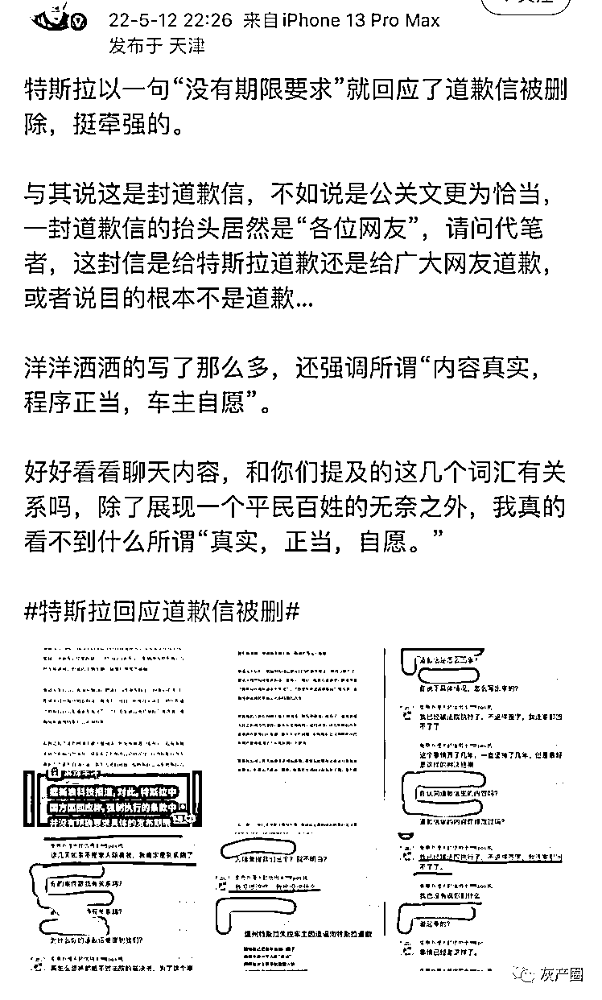
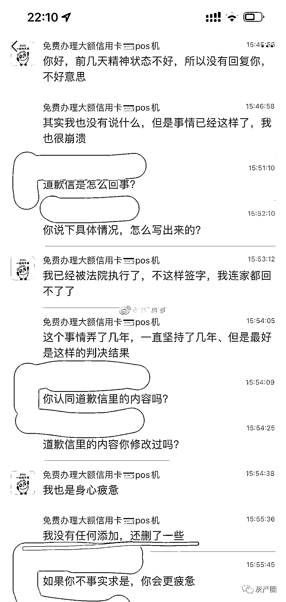
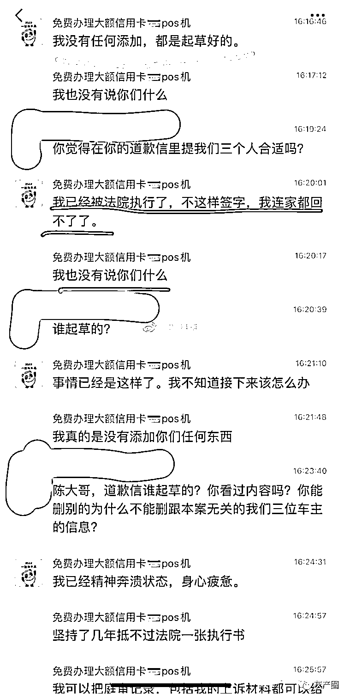
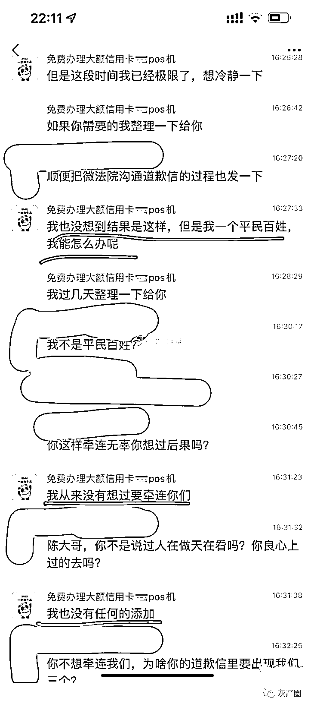

# 道歉信删除了，温州特斯拉车主疑发声：都是起草好的，不签字家都回不了

> 原文：[`mp.weixin.qq.com/s?__biz=MzIyMDYwMTk0Mw==&mid=2247535715&idx=3&sn=dca34cb614c04d0236476c4bc97cbde9&chksm=97cb875ba0bc0e4dfc3e9a6503dd527665fe029d1ffd5f18e4e1593fca753cd20daa6578c524&scene=27#wechat_redirect`](http://mp.weixin.qq.com/s?__biz=MzIyMDYwMTk0Mw==&mid=2247535715&idx=3&sn=dca34cb614c04d0236476c4bc97cbde9&chksm=97cb875ba0bc0e4dfc3e9a6503dd527665fe029d1ffd5f18e4e1593fca753cd20daa6578c524&scene=27#wechat_redirect)

三言财经今日发现，温州特斯拉失控车主陈某在其微博发布的道歉信已消失。

对此，据新浪科技报道，**特斯拉中国回应称，强制执行的条款中并没有明确要求具体的发布期限。**

另据凤凰网汽车报道，拿到一份录音表明，温州车主曾被告知：**如不发布道歉信，其将会被拘留并处以 2 万元罚款。**这或许是温州车主几番改口并引发道歉信事件的重要原因。

不过，对于特斯拉“没有期限要求”的回应，**特斯拉“退一赔三”案涉事车主韩潮认为十分牵强。** 

韩潮表示，与其说这是封道歉信，不如说是公关文更为恰当，一封道歉信的抬头居然是“各位网友”，请问代笔者，这封信是给特斯拉道歉还是给广大网友道歉，或者说目的根本不是道歉。

韩潮还晒出了疑似与温州车主的聊天内容。聊天截图显示，温州车主被问到道歉信的内容里为什么提及到韩潮等其他车主，**该车主强调“没有任何添加，都是起草好的”、“我从来没有想过要牵连你们”，还表示“不这样签字，我连家都回不了了，我也没有说你们”。** 

对于特斯拉此前强调道歉信“内容真实，程序正当，车主自愿”的说法，韩潮很是质疑，**“好好看看聊天内容，和你们提及的这几个词汇有关系吗，除了展现一个平民百姓的无奈之外，我真的看不到什么所谓‘真实，正当，自愿’”。**

不过，让人好奇的是，温州车主为什么删了那个道歉信？是主动还是被动呢？

对此，你怎么看？

来源：三言财经

← 向右滑动与灰产圈互动交流 →

