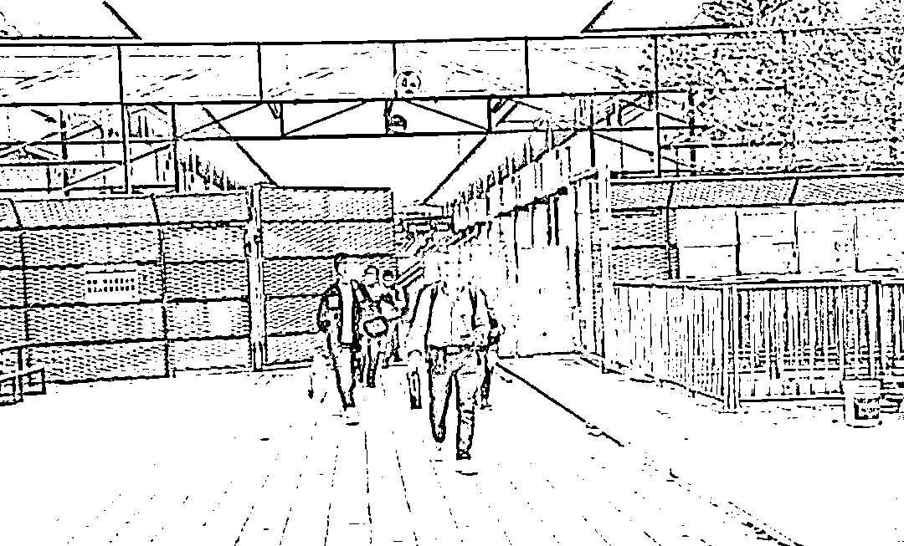
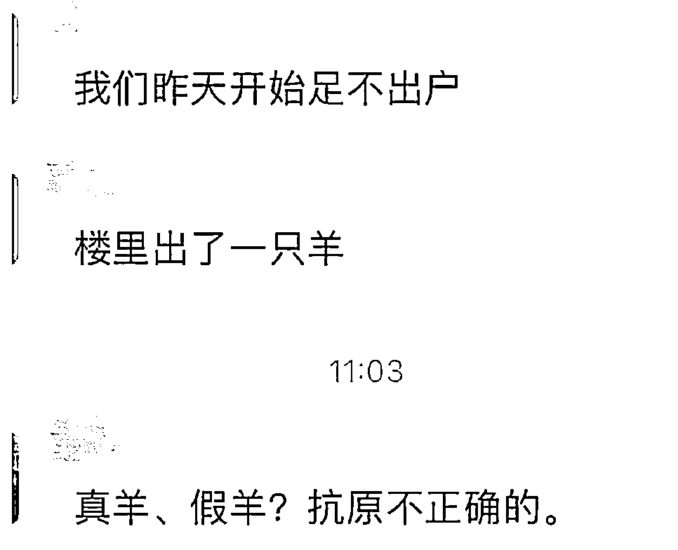
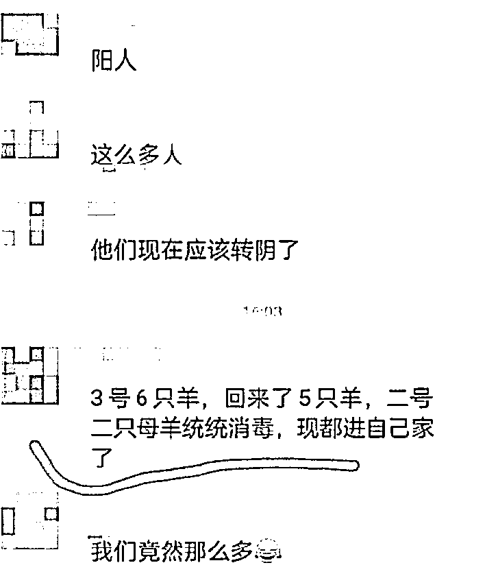
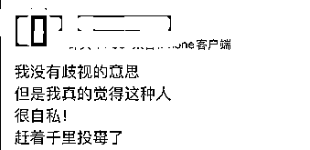
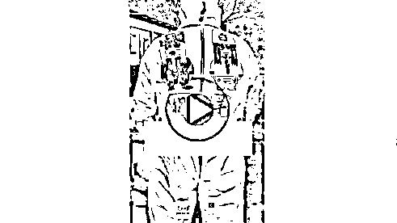
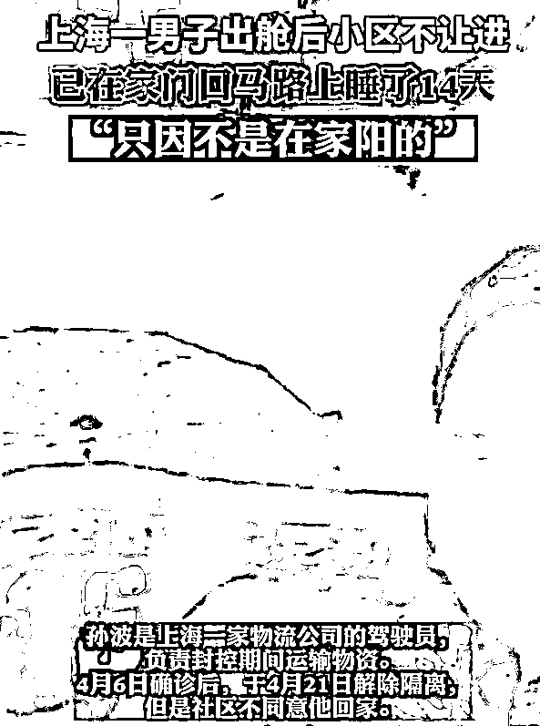
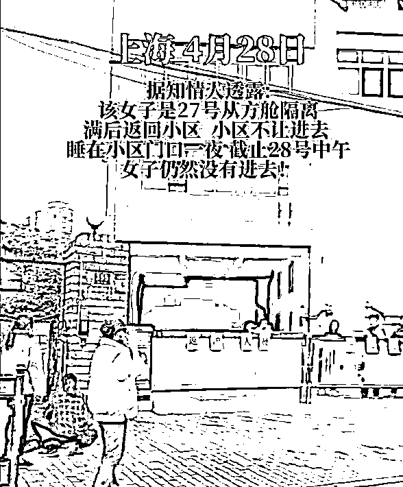
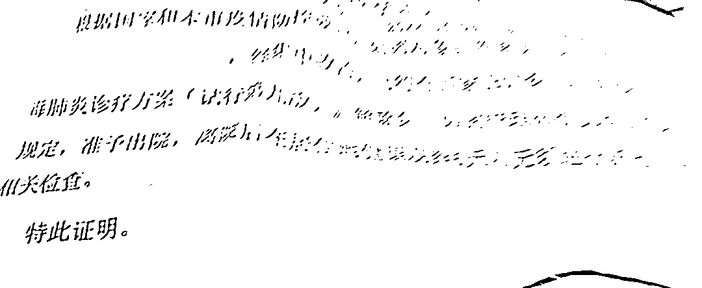
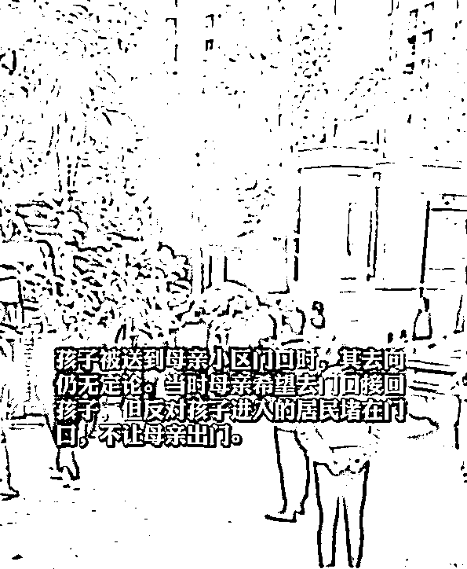

# 他们是患者，是人，不是“羊”

> 原文：[`mp.weixin.qq.com/s?__biz=MzIyMDYwMTk0Mw==&mid=2247535715&idx=4&sn=e3a22e107784e08ce8f11c532bcb029b&chksm=97cb875ba0bc0e4d3d630385ecbfbbe71811d66dbe823bc6aa4d1e952baa4a5517ebe0b81b37&scene=27#wechat_redirect`](http://mp.weixin.qq.com/s?__biz=MzIyMDYwMTk0Mw==&mid=2247535715&idx=4&sn=e3a22e107784e08ce8f11c532bcb029b&chksm=97cb875ba0bc0e4d3d630385ecbfbbe71811d66dbe823bc6aa4d1e952baa4a5517ebe0b81b37&scene=27#wechat_redirect)

哥写文章有几个底线，要规避脏话屎尿屁，不对疾病患者使用戏谑代称，以及杜绝使用非人化的蔑称……

所谓非人化的蔑称，这几天你一定听说过了。

先是把新冠阳性患者称为小阳人，即便这位患者可能是位老人，小阳人三个字已经让他做人矮一截。

随后阳变成了羊，出现了公羊、母羊、老羊、小羊、两脚羊，做不成一个人。

患者配合防疫措施服从管理集中隔离的举动，成了被牵走。

“昨天对门楼一只母羊两只小羊，今天早上才牵走了”

“那两个老羊关起来了？”

“捉羊了，大家小心。”

不知道的还以为在内蒙大牧场。

再这么丑化下去，非得把患者开除人类族群不可。

今天哥看了一篇健康时报的的文章《把新冠感染者称作“羊”，是歧视的次生伤害》，就在想，对确诊病例的歧视丑化，从什么时候开始的？

大概是从“毒王”开始的吧。

无论是国内不知自己被感染而返乡的人，还是疫情期间回国的留学生、跨境商人……一顶“千里投毒”的帽子扣过去，充满了跳脚的恶意。

疫情是面镜子，可分人的智愚善恶。

如何看智愚？

将科学防疫必须面对的人员流动可能导致的疫情传播问题，简简单单归结为感染者的主观恶意，似乎这么想，病毒就成了手拿把掐可以轻松控制的事情。

如何看善恶？

将他人当做羊，防疫愣是防出了优越感，甚至有了幸存者的小确幸。

一旦身边出现了阳性，只要不是自家人，立即做精神切割，必须表现出多看一眼都嫌晦气的决绝，态度越坚决，言语越蔑视，似乎就觉得病毒距离自己越远。

这样还不够，不仅要精神切割，还要努力寻找阳性患者身上的异类点，从工作身份、生活作风到饮食习惯，但凡他有与常人不一样的地方，统统归结成为他的“不足”，成为活该的证据，以此反照自己所谓的长处，于是收获了安全感。

只要自己不那么做，疫情就不会落到自己身上。

或许有同学觉着哥说话矫情，但这就是事实。

如果将医护人员说成大白，以《超能陆战队》的医生管家附体防疫工作者，代表亲切。

羊，则走向了另一个极端，彻底不把疫情患者当人了。

就这样，一而再，再而三，先冠个黑名，再将他们非人化，一黑再黑层层加码，最终狠下心来让他们流浪街头也在所不惜。

毕竟代价又不是自己。

并非哥危言耸听，我在自己的文章中提到过多次，网上检索也能轻易找到，多少阳性患者转阴后，合规离开方舱，回到自己合法的居住地，却被保安、物业甚至其他业主拦着不让进。

上海一男子出舱后小区不让进，在家门口马路上睡了 14 天。

这还是公开报道的，记者帮忙联系社区，皮球踢了一整圈，显然没用。

要是有用，他也不至于流落街头 14 天。

你看这奇怪的逻辑，在外面确诊转阳再转阴，依旧不干净。

只有小区原生原装纯新冠，转阴之后才能住。

还有一位大姐在租住小区外面嚎啕大哭，同样是从方舱出来，小区就是不让进，你能有什么办法？

一位大爷握着方舱医院开具的出院证明，愣是进不了儿子为他租赁的小区住处。

居委会给出的理由是没登记造册的人就是不能进。

再有几天前，一个 12 岁的小孩离开方舱，回妈妈的住处时，被一帮叔叔阿姨爷爷奶奶堵在门外……

你们发现了没有？

走出方舱的康复者，面对的每个人都对他们有一票否决权。

从门卫到物业，从业主到居委会，无论是谁，只要站出来说“他被感染过，不能进”，就能阻拦一个人的回家路。

虽然那句话没有逻辑，不讲科学，但就能震慑所有人。

即便官方一次次强调，不得阻挠方舱出院者的回家路，还给出了科学的防控指导：“关于新冠病毒感染者符合标准出院后，不列入社区筛查对象，居家健康监测 6 天内，无需进行新冠病毒核酸检测或抗原检测，第 7 天开展 1 次核酸检测。”

[`v.qq.com/iframe/preview.html?width=500&height=375&auto=0&vid=k33353crg25`](https://v.qq.com/iframe/preview.html?width=500&height=375&auto=0&vid=k33353crg25)

But，显然发言人的影响力覆盖不到一线门卫，后者说了才算。 

这样的后果又是什么呢？

所有人只能更害怕。

人的本性趋利避害，哥当然不会异想天开，以为所有人会突然讲文明讲礼貌讲科学，毕竟不现实。

哥只是讲道理，无论门卫、物业、业主、居委会怎么阻拦，要知道他们没有权力阻挠一个人回家。

而住进方舱的人，每一个都曾配合防疫，主动隔离，一如他们当初登上大巴前往方舱时的自觉。

所以，当他们离开方舱时，保证他们顺利回家，起码能走进被严防死守的那道大门，并不是过分的要求。

总不能让他们一个人面对阳性被污名后的所有恶意。

来源 ： 新闻哥 ID：newsbro

← 向右滑动与灰产圈互动交流 →

