# 5 块钱能买到什么？

> 原文：[`mp.weixin.qq.com/s?__biz=MzIyMDYwMTk0Mw==&mid=2247535715&idx=6&sn=2ef36c809191988f9780cbeb14277362&chksm=97cb875ba0bc0e4d7474558acf3f872c5131ab69a26ba6f8312b0fadfa317e4e41d8ac98231e&scene=27#wechat_redirect`](http://mp.weixin.qq.com/s?__biz=MzIyMDYwMTk0Mw==&mid=2247535715&idx=6&sn=2ef36c809191988f9780cbeb14277362&chksm=97cb875ba0bc0e4d7474558acf3f872c5131ab69a26ba6f8312b0fadfa317e4e41d8ac98231e&scene=27#wechat_redirect)

如果说你的身份信息和当下行程正在以几块钱的价格被买卖，会不会感到一丝不安和恐怖。

如果再被跟踪呢？

这种现象，在我国明星身上时有发生，甚至到了家常便饭的程度。

饭圈有个词叫**“私生饭”**，专指**为了追星而侵入明星私生活的粉丝**。

他们不仅把明星逼得心力交瘁。

更以“爱”的名义，把偷窥、跟踪、监视等丑陋恶行，冠冕堂皇地美化成一桩桩功勋。

这背后，都涉及一个愈演愈烈的棘手问题——**个人信息泄露**。

近日，央视网在社交平台发布视频，揭示了非法获取艺人行程的买卖内幕。

在这些买卖交易中，艺人信息被明码标价。

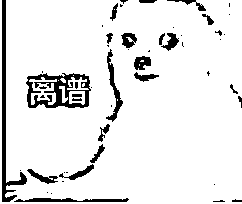

粉丝甚至**仅需 5 元**就可以查询到**艺人的航班信息**。

花**100-200 元**就可以获得**身份证信息**。 

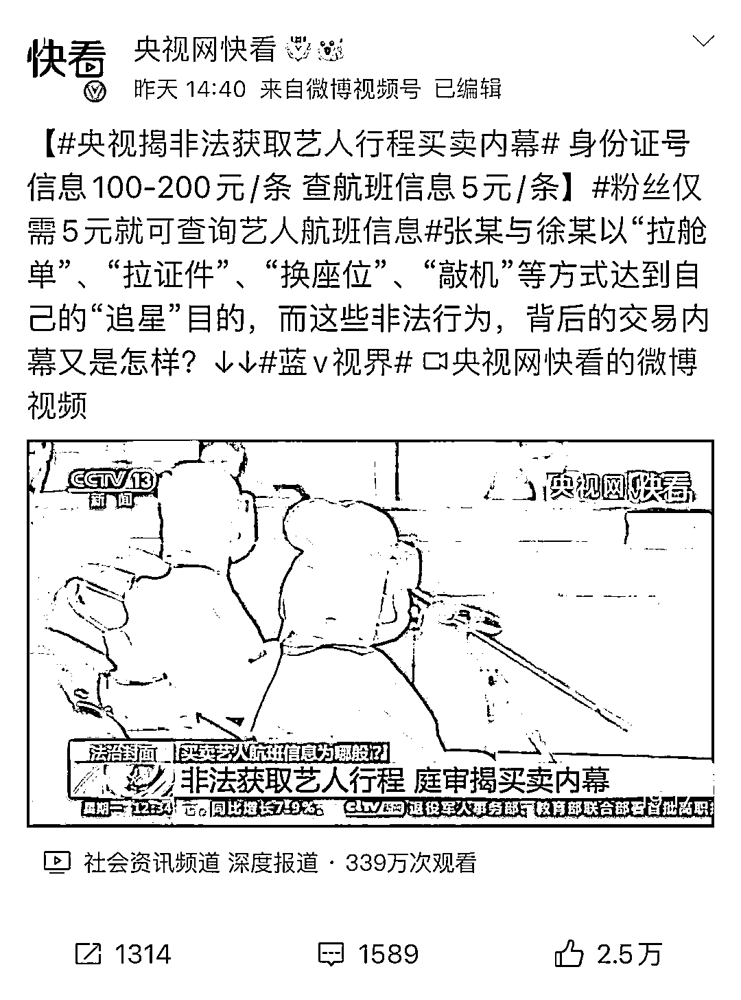

据视频讲述，消息的泄露源头来自**航空公司的外包客服人****员**。

而买卖这些信息的就是“私生饭”，他们为了**帮明星“值机”，或者通过了解明星座位和换座，达到近距离接触的目的。**

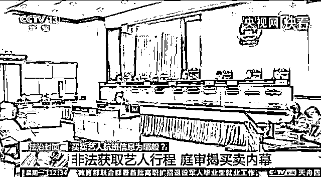

其实近年来，明星因航班信息泄露，引发公共舆论事件并不少见，航班信息泄露**甚至发展成为一条成熟的黑色产业链。**

主要是粉丝大量需求在，航班客服也有“内鬼”拉单。 

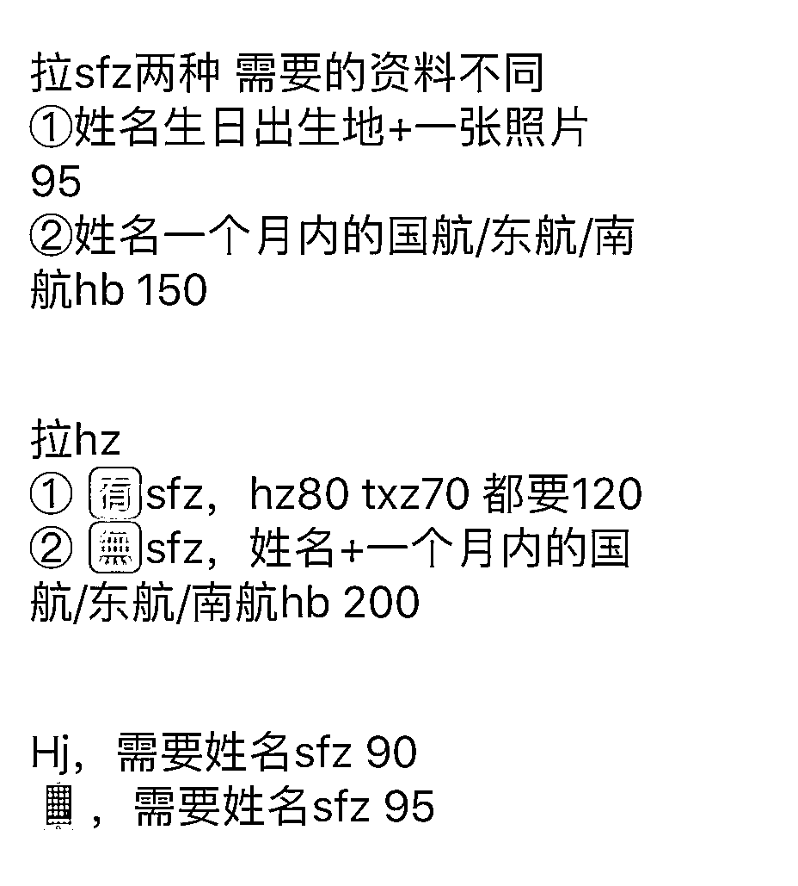

▲明星信息的交易夹杂的饭圈“黑话” 

在某社交平台上**以明星名字、“Sfz”（身份证）等作为关键词进行搜索，售卖明星个人信息的内容随处可见**。

从此前报道看，明星信息在网上被公然售卖，让众多粉丝“触手可及”，由此也**衍生出不少粉丝狂热追星的乱象。**

大部分粉丝拿到航班号，只为送机接机，也有一些土豪粉直接买头等舱，强行实现和爱豆一起出行的愿望。

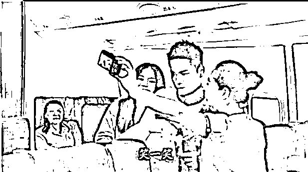

如果明星已值机，粉丝们甚至能获得准确的座位号，所以很多明星被迫取消值机。

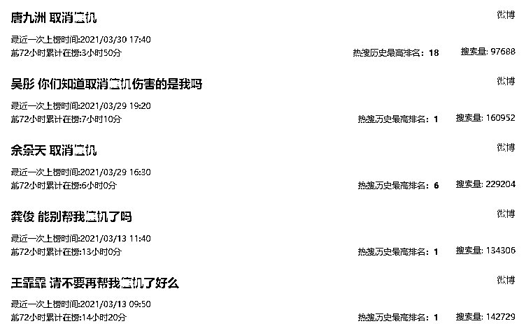

很多明星在公开社交平台叫苦不迭。

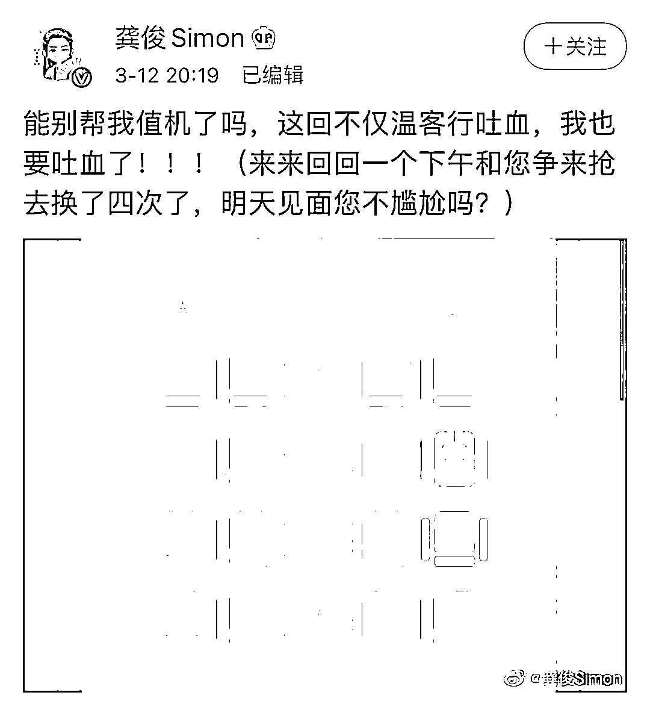

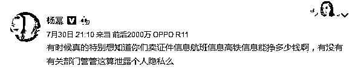

之前，明星吴磊的某粉丝晒出与航空公司工作人员的对话音频，爆料称吴磊的某位站姐，从 2017 年至 2020 年连续三年盗用吴磊国航及南航名下的里程积分，为自己和朋友们兑换免费机票，前后多达 12 次，总计约 23 万里程，用于追吴磊及其他艺人行程，严重侵害吴磊利益。

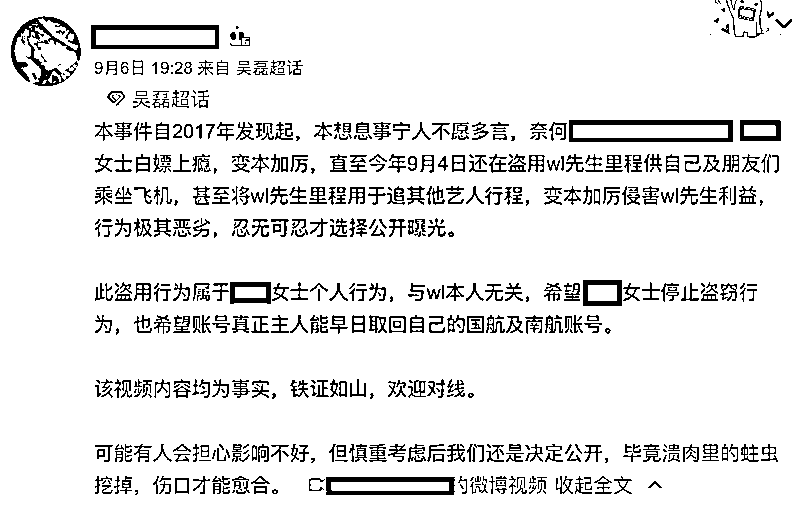

▲ 曝光者发布的博文

被暴露行程的明星们，将会被为爱发电的粉丝们围堵。

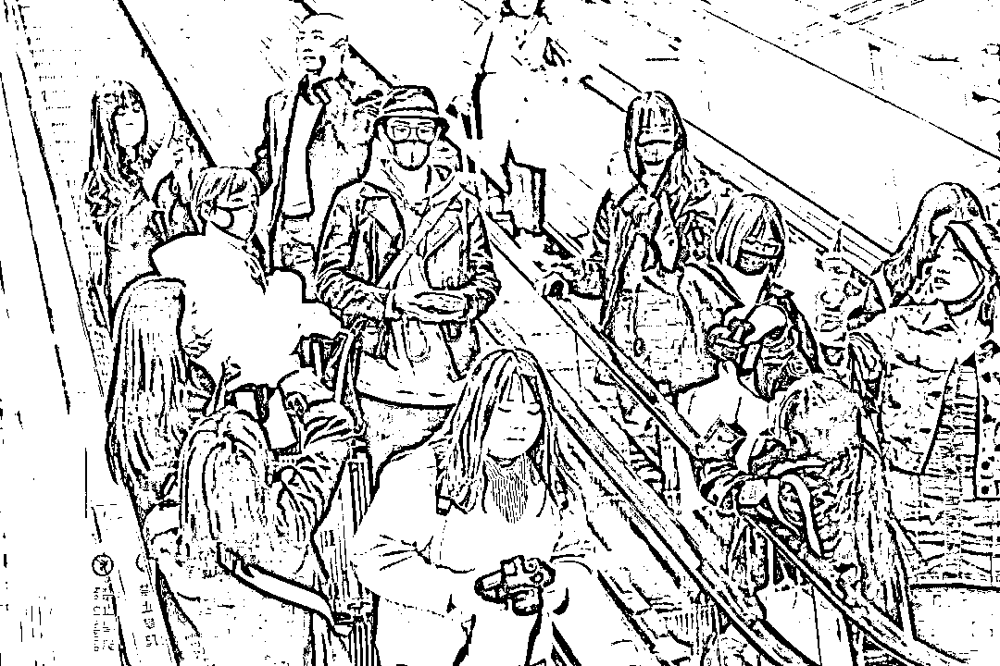

▲ 肖战遭粉丝举手机近距离拍脸/图源网络

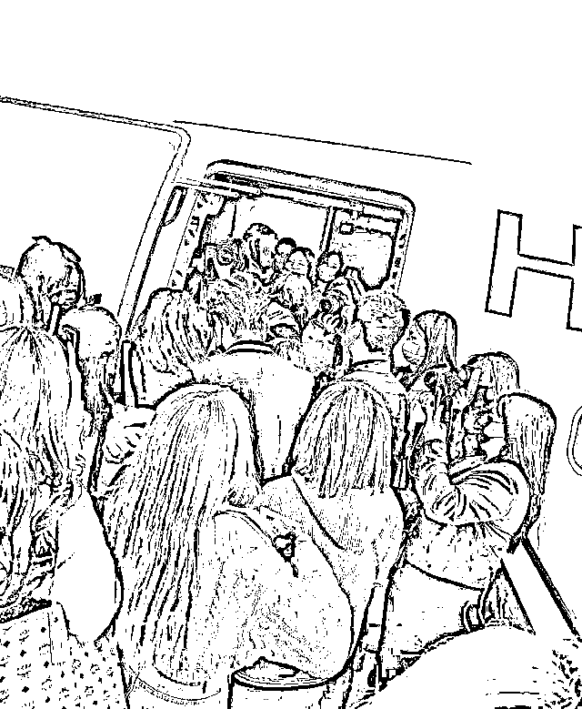

▲《青 3》学员的粉丝围堵登机口

某些疯狂的粉丝，还会入住明星刚刚退房的酒店，达到窥探偶像隐私、接近偶像的目的。

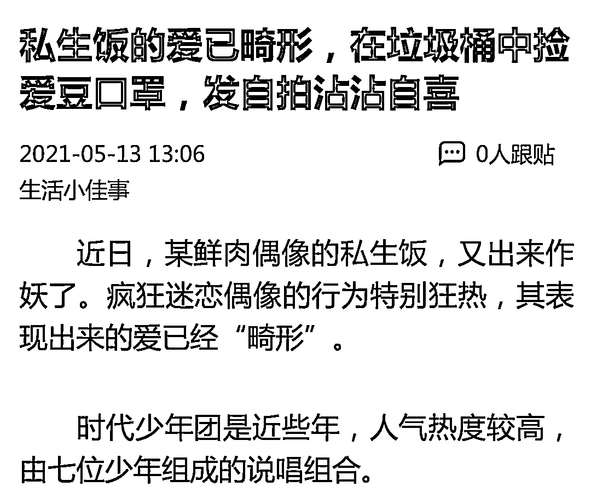

此外，**手机号泄露**是明星信息泄露的又一重灾区。 

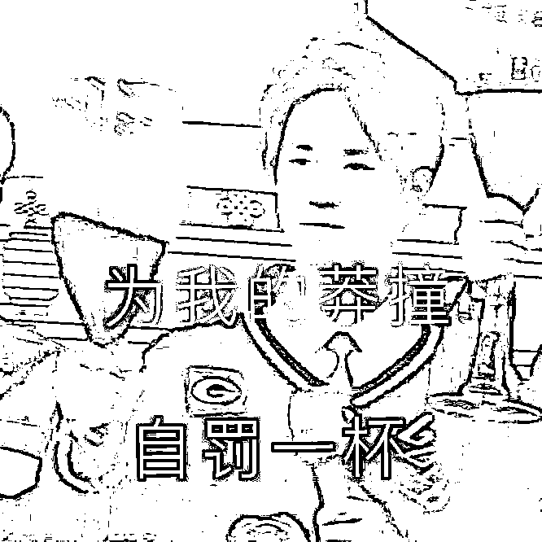

之前，明星王一博手机号泄露，手机不断接到陌生号码来电，通过手机号异地登录 APP 的提醒也不断闪现。

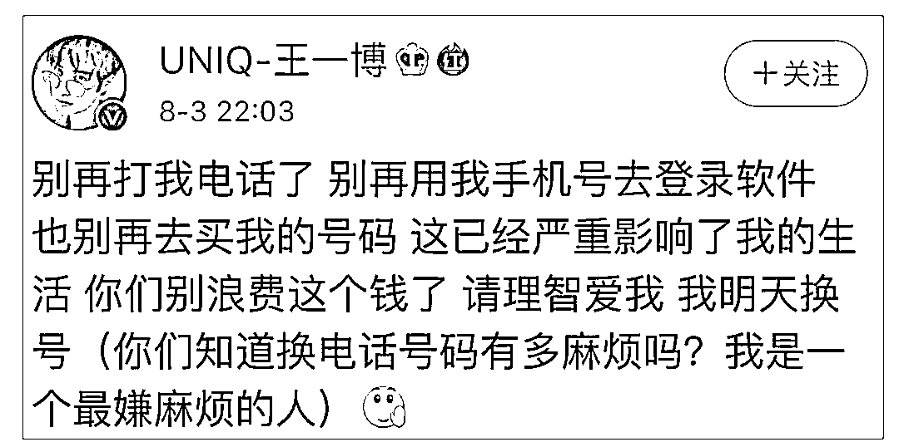

一天的骚扰电话就多达 194 个。

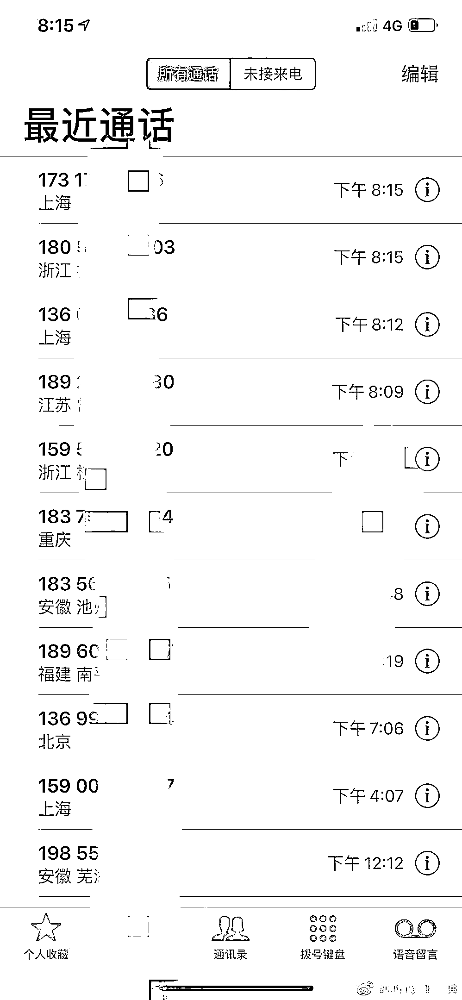

我国法律明文规定，**买卖个人信息属违法行为**，国家网信办也在严厉打击。

6 个月前，中央网信办发布《关于进一步加强娱乐明星网上信息规范相关工作的通知》，要求严把娱乐明星网上信息内容导向，加强正面引导，建立负面清单，进一步加强娱乐明星网上信息规范。

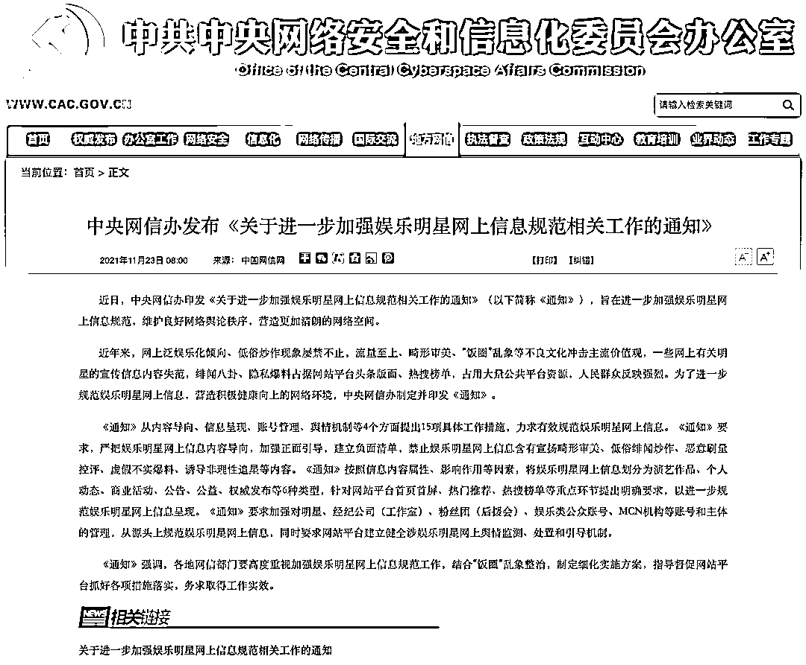

在严把内容导向中，特别强调了**“不得未经授权曝光、买卖明星身份信息、家庭住址、行程信息等个人隐私”**。

前文提到的央视网曝光的视频案件中，买卖明星个人信息的 4 人都**被****罚款和判刑**！ 

[`v.qq.com/iframe/preview.html?width=500&height=375&auto=0&vid=e3151kjgdme`](https://v.qq.com/iframe/preview.html?width=500&height=375&auto=0&vid=e3151kjgdme)

此案的判决也向社会昭示，无论泄露抑或买卖公民个人信息，都是公然的违法行径，非法获取、提供公民个人信息，**会被以侵犯公民个人信息罪追究刑事责任**。

同时，小珊想说，该案的判决，也在给依然热衷于值机、跟机，并费尽心力收集、购买偶像航班信息的广大粉丝们敲响警钟。

明星炎亚纶在此前访谈中对私生饭窥探偶像隐私的行为，有过回应——

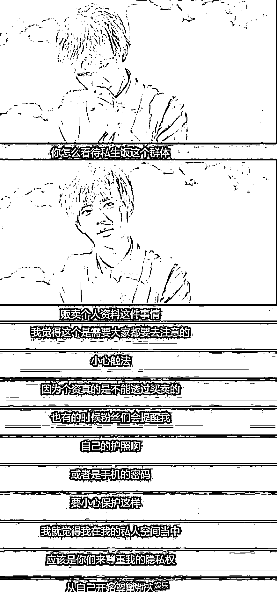

**没有一个人应该因为职业而舍掉隐私，也没有一个人可以因为热爱而伤害旁人。**

咱就是说，**亲近偶像可以，但要合理合法，要有边界尺度。** 

来源：微信珊瑚安全

← 向右滑动与灰产圈互动交流 →

