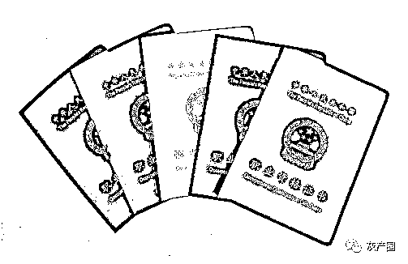
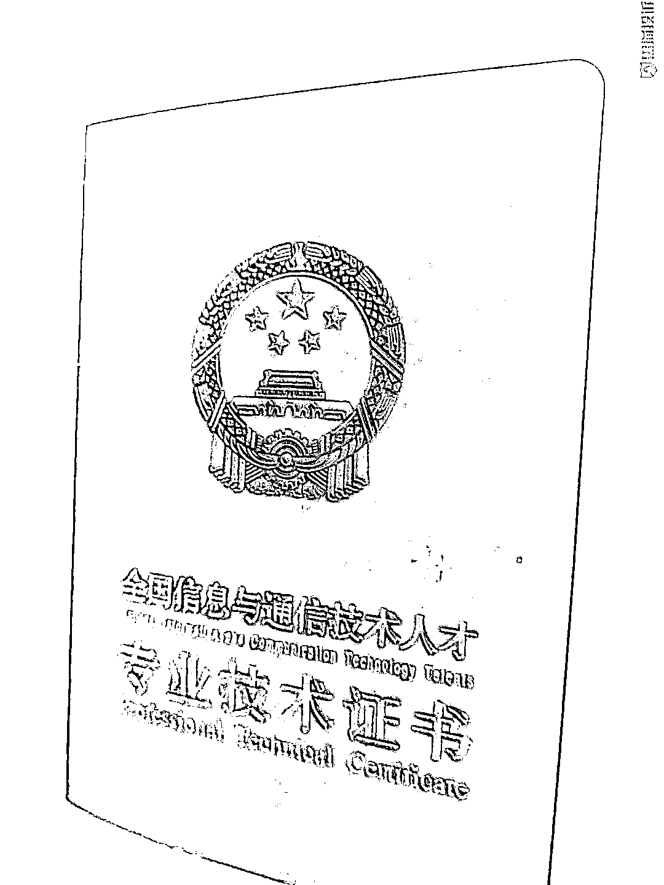
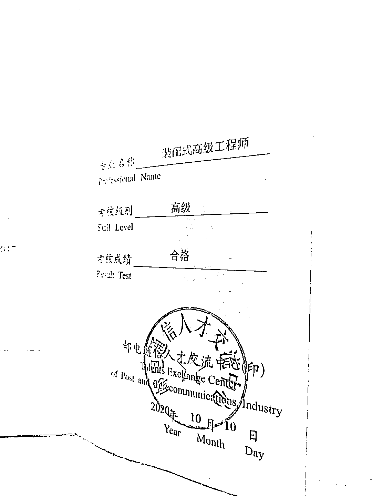
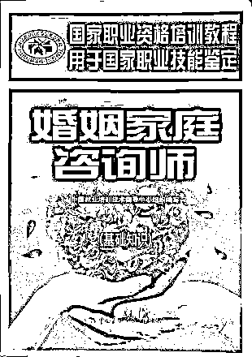
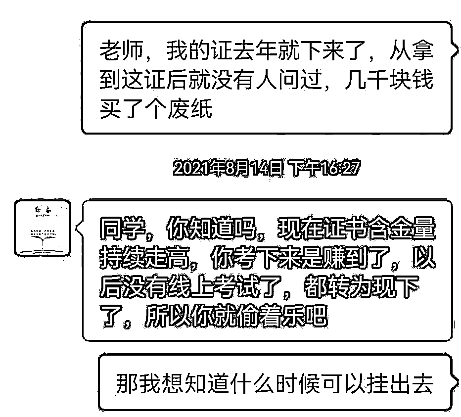

# 这类证书，别考！

> 原文：[`mp.weixin.qq.com/s?__biz=MzIyMDYwMTk0Mw==&mid=2247535715&idx=7&sn=8fa387590a92212dbf78f3ad63d03808&chksm=97cb875ba0bc0e4d115bf843608e9e1f4906b2cd1b570ad378ebddce935b01e6fcace31b25bb&scene=27#wechat_redirect`](http://mp.weixin.qq.com/s?__biz=MzIyMDYwMTk0Mw==&mid=2247535715&idx=7&sn=8fa387590a92212dbf78f3ad63d03808&chksm=97cb875ba0bc0e4d115bf843608e9e1f4906b2cd1b570ad378ebddce935b01e6fcace31b25bb&scene=27#wechat_redirect)

日前，人力资源和社会保障部在其官网通报，有关部门严肃查处了两个打着“职业资格”的幌子发放“山寨证书”谋取不法利益的典型“山寨网站”。其中一个冒用“中国人事考试网”网站名称和单位标识，另一个假冒网站为“国家专业技术人才网”，违规使用国徽标识，网页上还有“官方认证”等欺骗性字样。

**交了钱，零基础也能拿证书？** 

**学员：证拿到了，就跟废纸一样**

近日，人力资源和社会保障部、中央网信办印发《关于开展技术技能类“山寨证书”专项治理工作的通知》，针对面向社会开展的与技能人员和专业技术人员相关的培训评价发证（含线上）的活动，展开四个方面的治理。关停“中国人事考试网”和“国家专业技术人才网”，就是此次专项治理行动的初步成果。《通知》中，列出了四种情况：

是否存在违规使用有关字样和标识等情况；

是否存在虚假或夸大宣传等情况；

是否存在违规培训、违规收费等情况；

是否存在故意混淆概念、误导社会的炒作和涉嫌欺骗欺诈等。

具体来说，使用“中华人民共和国”“中国”等，以及“职业资格”“岗位合格（凭证）”“专业技术职务”等字样；使用国徽、政府部门徽标等标识，宣称“包过”、不培训（评价）或培训（评价）走过场直接发证等情形，都是不允许的。

记者在某投诉平台查询，今年三月以来，与“山寨证书”相关的投诉有上百条。湖南的一位投诉者王芯告诉记者，早在 2020 年，她在老乡的劝说下，报了“装配式高级工程师”培训班，同时预付了“中级消防设施操作员”的部分资金。 

尽管王芯此前没有任何相关的工作经历和知识储备，但该机构承诺，只要交钱就能顺利拿到证书，以后挂靠出去一年可以收入三万至五万元。王芯告诉记者：“机构给我们一个网址之后，我们在那里听课，就只是听了一下而已。线上考，他们会发给你答案。”

两个月后，王芯拿到了证书，在她展示的照片上，深蓝色证书封面上，印有国徽图案，下面写着“全国信息与通信技术人才专业技术证书”字样，证书内考核级别为“高级”，证书印发机构为“邮电通信人才交流中心”。

**▲****王女士获得的证书封面** 

不过，说好的挂靠却始终无法兑现。“我一直在跟他们联系，现在还跟我说 3 到 6 月份可以帮我安排挂靠。我觉得不对，我在网上看到有一批人投诉。这个证是拿到了，但是就跟废纸一样。”

另有学员表示，多方查询发现，该证书并不是国家承认的职业资格类证书；记者在人力资源和社会保障部门备案的职业技能等级认定机构中也未查询到这一中心。

**▲王女士获得的证书内页** 

虚假宣传、滥发证书等乱象重重

王芯报考的这两个项目，只是种类繁杂的证书中的冰山一角。

近年来，我国陆续取消了 400 多项职业资格，同时将职业技能等级认定的职能下放给在人社部门备案的用人单位、社会培训评价组织。

但在此过程中，却被一些不法分子和机构钻了空子，打着各种名号颁发证书：航空航天工程师、碳排放管理师、武器工程师、装甲车辆工程师、家庭教育指导师……

**▲五花八门的证书**

一家培训机构的老师跟记者说，买心理咨询师课程，还可以附赠家庭教育指导师课程，通过率 95%以上。“考前我们也会有一些真题、押题发给您。我们可以给学员推荐就业，像工作半年的，每个小时可以达到 200 元左右，工作一年以上的，每个小时可以达到 500 元以上。”

但是当记者询问所谓“家庭教育指导师”证书的颁发机构是哪里，对方几次避而不答。

在记者咨询的几家培训机构中，夸大宣传、虚假宣传、误导炒作、滥发证书等同样存在。这些情况，不仅损害消费者的合法权益，更伤害了技能培训的健康发展。

**▲** **培训机构一直以来以包挂靠来宣传** 

**专家：要认准经备案的颁发机构** 

**整治“山寨证书”还需发挥市场淘汰机制**

面对五花八门的证书，有考证需求的劳动者该如何辨别？

江苏省人社厅职业技能鉴定中心主任杨进保介绍，一定要认准“经备案的用人单位、第三方评价机构颁发的职业技能等级证书”。“经过人社部门备案的评价考核机构所发的证书，享受人社部门在人才评价、人才激励、人才晋升这方面相应的政策，也享受就业培训、创业以及评价这方面财政补贴政策。而没有经过政府认定的机构也可以发相应的证书，但是不享受政府相应的政策。”

中国人民大学中国就业研究所研究员丁大建认为，整治“山寨证书”，除主管部门严管严抓，长远还需要充分发挥市场的淘汰机制。“职业证书是一种技能评价，国家要把入门的标准建立起来。企业也要建立一些社会标准，让市场去淘汰那些假证。”

来源：中央广电总台中国之声

← 向右滑动与灰产圈互动交流 →

