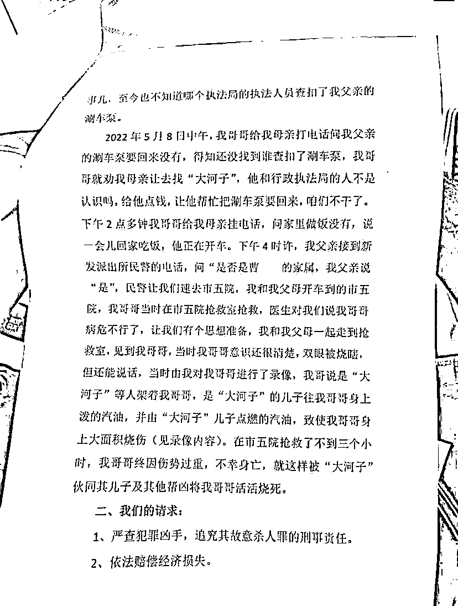

# 扑朔迷离！警方回应哈尔滨男子烧伤死亡！是自带汽油和打火机

> 原文：[`mp.weixin.qq.com/s?__biz=MzIyMDYwMTk0Mw==&mid=2247535789&idx=1&sn=8f16525eb49a57d212602f2ec9ac429c&chksm=97cb8795a0bc0e8300a0febfcd54588dacec2743ad32c4cb3cb07dddbe84ea2fed6e02be7275&scene=27#wechat_redirect`](http://mp.weixin.qq.com/s?__biz=MzIyMDYwMTk0Mw==&mid=2247535789&idx=1&sn=8f16525eb49a57d212602f2ec9ac429c&chksm=97cb8795a0bc0e8300a0febfcd54588dacec2743ad32c4cb3cb07dddbe84ea2fed6e02be7275&scene=27#wechat_redirect)

夹杂在上海的“静默”相关新闻里，今天刷到这件前几天发生在哈尔滨的事情。

简单点说就是：**因有矛盾，自带了汽油和打火机去找人理论，结果烧了自己，并最终死亡。**

****

**5 月 12 日下午的时候，网传的还是这样的：“哈尔滨一洗车摊老板疑被同行泼汽油烧伤身亡”**

**********<mpvideosnap class="js_uneditable custom_select_card channels_iframe videosnap_video_iframe" data-pluginname="videosnap" data-id="export/UzFfAgtgekIEAQAAAAAAywMCP4A_UQAAAAstQy6ubaLX4KHWvLEZgBPEz6McOQljS8qDzNPgMIuUEi_nkO3GDYFN8ivBg1j-" data-url="https://findermp.video.qq.com/251/20304/stodownload?encfilekey=rjD5jyTuFrIpZ2ibE8T7YmwgiahniaXswqzo9jNb4WU1icyxYHfPahLzXM6x1SbOwXKnEuHsiax3FJL7MhNkzsRrQNyEZSnyR0icGwhvftws0WqqVwhI0x9822Ew&amp;adaptivelytrans=0&amp;bizid=1023&amp;dotrans=0&amp;hy=SH&amp;idx=1&amp;m=&amp;scene=0&amp;token=AxricY7RBHdWVk8SEMIvJYfJwL8U6We6BgyyHItmpW6bdj3JRSHiavTyDibyWkicJFSap3VnW7toDjU" data-headimgurl="http://wx.qlogo.cn/finderhead/ibq4aVwOt6HNqrr8OD3sCviaytF3B8TqCwHicxsuIanAJo/0" data-username="v2_060000231003b20faec8c6e48a1acbd3ce04ef33b077a1e41d0d3794ed88ea537878dbe65910@finder" data-nickname="灰产圈+" data-desc="【#哈尔滨洗车摊一男子烧伤身亡#】#哈尔滨洗车摊烧伤男子家属发声# 近日，网传哈尔滨一洗车摊男子烧伤身亡。当事人家属曹女士告诉@中国新闻周刊，5 月 7 日她父亲在路边摆洗车摊时，被附近一名外号“大河子”的洗车摊主威胁，不许其父摆摊。当日下午收摊时，有身着制服人员前来将其父刷车水泵收走，据称价值 2600 元。当晚，家人曾前往道里区执法局寻找水泵未果。8 日下午，曹女士哥哥欲找“大河子”帮忙要回水泵。当日下午 4 时许，家人接到派出所电话，称其哥哥在哈尔滨市第五医院抢救。

曹女士回忆，哥哥当时意识清晰可以说话，身体大面积烧焦，“他说哥求你，给哥来口凉的雪碧。” 曹女士称，其父在医院看到哥哥手腕处绑有绳子，并向护士要剪刀剪掉，“我父亲说绳子很难剪，上面有皮肤组织和被烧的衣服。” 在医院里，哥哥让她录下口述视频，视频中称：“我去找他理论，他不听，把我架在那，就不让我干，他儿子将汽油倒在我身上，我想跑跑不了。” 当晚，哥哥医治无效去世。

现场目击者对@中国新闻周刊 回忆，5 月 8 日下午看到着火冒烟，有人拿着刷车水泵在灭火。目击者称，现场围着很多人，只能看见伤者身体下半部分，“腿都在动，那时候还活着。”

截至发稿，#周刊君现场#多次致电相关部门均未回应。@灰产圈+ " data-nonceid="2360944966569416957" data-type="video" data-width="3832" data-height="2160"></mpvideosnap>**

**关于此事，在网上流传的，有两条视频。一条是事发现场的视频，可以看到：** 

****有人，在街边洗车摊上，被烧成了黑色。还有一个人在边上，拿着水枪在试图灭火。****

********

****还有一条，是烧伤男子进医院之后的自述视频，其中提到一个叫“大河子”的人。**** 

********

****据烧伤男子的家属，烧伤男子在进医院的时候，眼睛已经烧没了，脚已经是“一碰就掉渣”。****

********

******但烧伤男子在医院的时候，还能神志清晰地说事情的经过，并且要家属给他一口凉雪碧喝。****** 

************

******除此之外，还有一份烧伤男子家属向哈尔滨公安局道里分局递交的报案材料在网上流传，从烧伤男子家属的角度，讲述了一遍案件的始末。******

******大致意思就是：**“父亲的洗车工具不知道被谁无故没收后，哥哥被残忍烧伤、并致死”**，矛头也是指向一个叫“大河子”的人。******

************************

******当地的一些微信群里，还有**“寻找目击证人”**的消息在到处转。******

************

******从现场视频画面看，的确是有几辆出租车在现场的，但好像也没有人关注到烧伤男子啊。。。******

******只要看过视频，内心就真的...！@#￥%&* ... 震惊、不敢相信、同情... 各种情绪全都掺在一起。******

************************

******在烧伤男子自述视频的最后，他在说 **“一定要把这些坏蛋绳之以法呀” **的同时，还把双手合起来作揖。。。******

************

********不过 5 月 12 日下午的时候，网上就有博主说：********

********是烧伤男子的洗车工具被收走后，怀疑是“大河子”举报，自己倒汽油，自己点燃。“大河子”和“大河子”的媳妇是在救他，但方法欠妥，最后也没有救回来。********

****************

********这倒是和警情通报的说法是契合的，6 张聊天记录都在这里，供参考。********

****************

****************

****************

****************

****************

****************

********回头再看一遍官方通报，张某某应该就是“大河子”吧？********

********可是大家脑袋里的问号还是很多的：**双方在此之前有什么矛盾？烧伤男子去找理论之后，双方说了什么？做了什么？卢某某被烧伤男子搂住之后，有没有被烧伤？……**********

********************

**********其实烧伤男子自带汽油打火机是蛮合理的，只是可能普通人不知道汽油到底有多易燃，烧伤科医生告诉你：**********

********************

**********然后有网友对前因，猜测了两种可能：**********

**********一种，烧伤男子平时蛮横惯了，就拿着汽油去吓唬人、讨说法；另一种，烧伤男子平时太老实，被欺负得不行了，就拿着汽油拼命去了。**********

**********这样的事情，大家看到之后，都很想知道事情全貌的，可惜 5 月 12 日的警情通报还不够详细。既然已经有很多人在关注此事了，**希望之后警方能够给出更多信息。************

******************************来源：上海全知道（ID：iknow-021）分享：吃瓜不吐葡萄皮（ID：xbzavi）**************************************************

**********← 向右滑动与灰产圈互动交流 →**********

********************