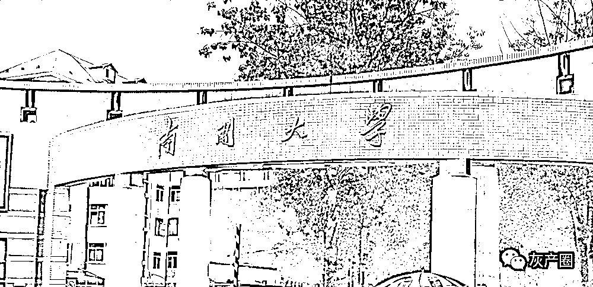
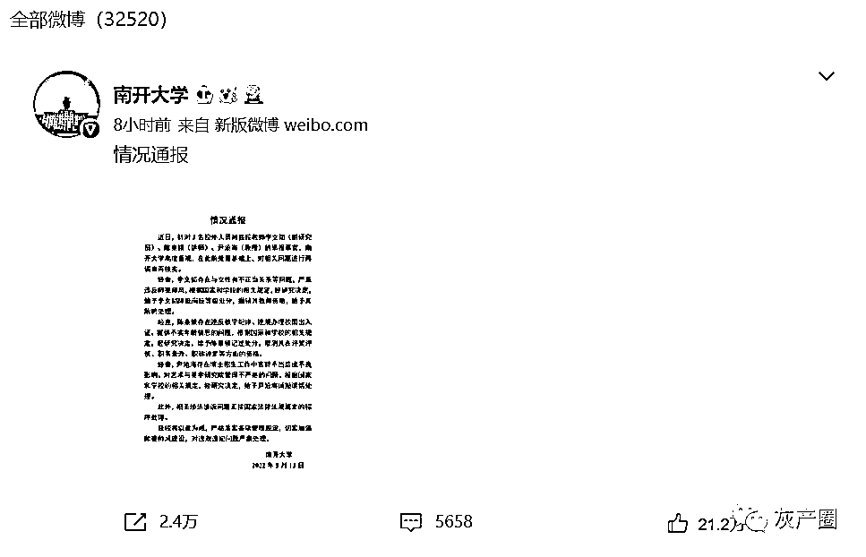
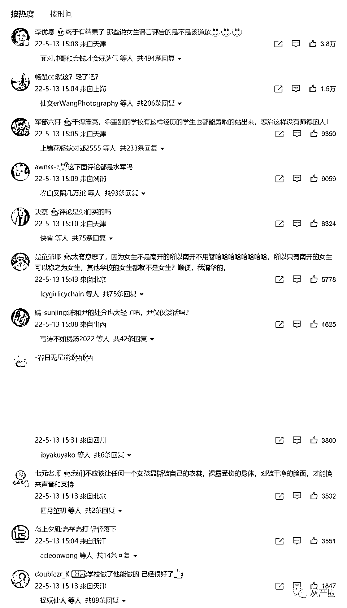
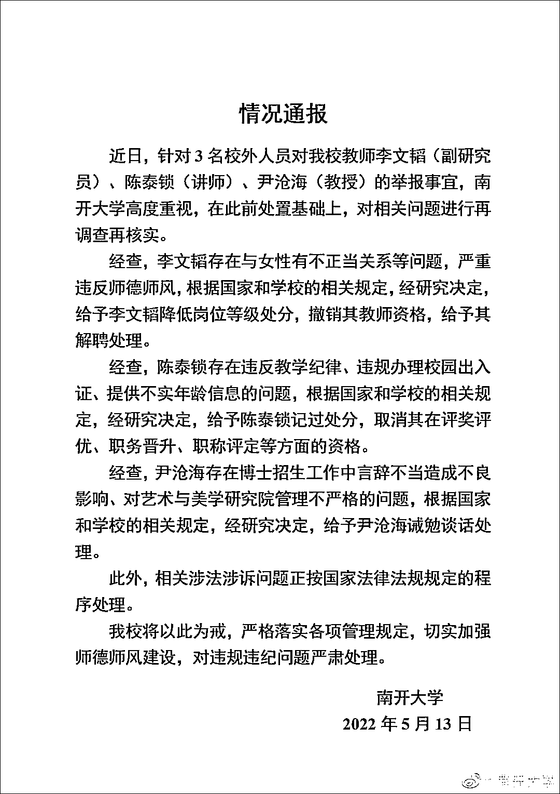
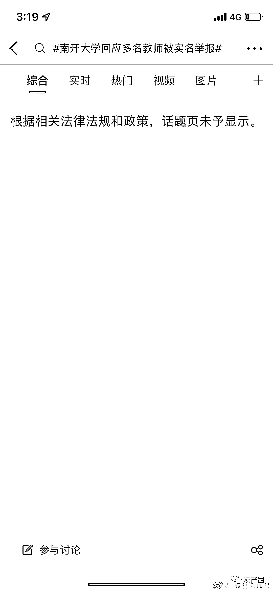

# 南开大学通报"3 名教师被举报"

> 原文：[`mp.weixin.qq.com/s?__biz=MzIyMDYwMTk0Mw==&mid=2247535789&idx=4&sn=50286db36193aafccf94f9bfef0016a4&chksm=97cb8795a0bc0e835f110f1d3d1761bc0ecd70a845bf75e3bb05084b1075463a549b227e9a9f&scene=27#wechat_redirect`](http://mp.weixin.qq.com/s?__biz=MzIyMDYwMTk0Mw==&mid=2247535789&idx=4&sn=50286db36193aafccf94f9bfef0016a4&chksm=97cb8795a0bc0e835f110f1d3d1761bc0ecd70a845bf75e3bb05084b1075463a549b227e9a9f&scene=27#wechat_redirect)

5 月 13 日，@南开大学 发布情况通报：近日，针对 3 名校外人员对我校教师李文韬（副研究员）、陈泰锁（讲师）、尹沧海（教授）的举报事宜，南开大学高度重视，在此前处置基础上，对相关问题进行再调查再核实。

网友评论：

经查，李文韬存在与女性有不正当关系等问题，严重违反师德师风，根据国家和学校的相关规定，经研究决定，给予李文韬降低岗位等级处分，**撤销其教师资格，给予其解聘处理。**

经查，陈泰锁存在违反教学纪律、违规办理校园出入证、提供不实年龄信息的问题，根据国家和学校的相关规定，经研究决定，**给予陈泰锁记过处分，取消其在评奖评优、职务晋升、职称评定等方面的资格。**

经查，尹沧海存在博士招生工作中言辞不当造成不良影响、对艺术与美学研究院管理不严格的问题，根据国家和学校的相关规定，经研究决定，**给予尹沧海诫勉谈话处理。**

此外，相关涉法涉诉问题正按国家法律法规规定的程序处理。

我校将以此为戒，严格落实各项管理规定，切实加强师德师风建设，对违规违纪问题严肃处理。

南开大学

2022 年 5 月 13 日

目前，微博相关话题已被和谐。

****

[`v.qq.com/iframe/preview.html?width=500&height=375&auto=0&vid=n3337lf8dbk`](https://v.qq.com/iframe/preview.html?width=500&height=375&auto=0&vid=n3337lf8dbk)

**此前报道：**

[女生实名举报南开大学李文韬教授，请不要让第二个“房思琪”的悲剧发生！](http://mp.weixin.qq.com/s?__biz=MzIyMDYwMTk0Mw==&mid=2247535510&idx=1&sn=75c500fc754b06195c8277734da93f20&chksm=97cb80aea0bc09b8539b0b000dad76644bf5b9af5ff2601954168dc33700e9c2afb104a161b8&scene=21#wechat_redirect)

[南开回应多名教师被实名举报：正在调查](http://mp.weixin.qq.com/s?__biz=MzIyMDYwMTk0Mw==&mid=2247535638&idx=5&sn=42c6d60f8a35281f3ad622bda299bc2e&chksm=97cb872ea0bc0e38a68475c450e55530b4461204a9929dacb10974db6891e0959ea4f3ae2c1c&scene=21#wechat_redirect)

来源：观察者网综合

← 向右滑动与灰产圈互动交流 →

