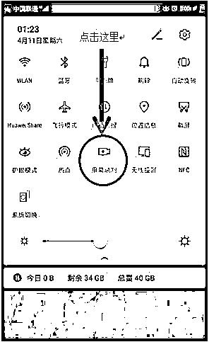

# 发现被骗后，一定要这样保存手机上的证据！

> 原文：[`mp.weixin.qq.com/s?__biz=MzIyMDYwMTk0Mw==&mid=2247535789&idx=7&sn=7ba3eccfdf6309aae2572588d88d5ab0&chksm=97cb8795a0bc0e832bc25d65969b9ca715fa83db213b73cd89cec64e52044f3ed056742cc87e&scene=27#wechat_redirect`](http://mp.weixin.qq.com/s?__biz=MzIyMDYwMTk0Mw==&mid=2247535789&idx=7&sn=7ba3eccfdf6309aae2572588d88d5ab0&chksm=97cb8795a0bc0e832bc25d65969b9ca715fa83db213b73cd89cec64e52044f3ed056742cc87e&scene=27#wechat_redirect)

发现自己被骗 

来到派出所报案

警察蜀黍总是打断你喋喋不休的讲述

并不是警察态度不好

而是

你提供的无效信息

**正在浪费止付账户的黄金时间**

那么，被骗了 

**提供什么样信息是有效的**

**手机上应该保存哪些证据**

这些知识点虽然不希望你能用到

但是有备无患

**被骗后如何取证？**

**接到诈骗电话和短信**

**电话号码、通话时间，通话记录截图是必须的**，然后详细描述通话内容。但是最关键的，还是骗子诱导你进行具体操作，一般来说，**电话诈骗都是以骗取你的个人信息和验证码为主要目的，少数也会诱导你注册 APP，登录网页，或者转入聊天软件进行后续诈骗行为**。

短信诈骗与电话诈骗不同，直接诱导受害人登录骗子准备好的钓鱼网站是最常见的，少数诱导受害人回电话或者添加骗子账号进行聊天。

那么第一步当然是截图诈骗短信。

比如这样的

还有这样的

接到任何诈骗短信息或者电话都不要急着清空，先把号码截图下来留存，有时候一张截图号码不全，也可以分别截图，能充分证明来源即可。

**登录的诈骗网站** 

诈骗分子通过发送**不明链接、二维码、安装包**，诱导受害人登录诈骗网站，或下载安装 APP，很多受害人意识到被诈骗时，提供的往往是几张简单登录截图，**其实这样是无效的，如下图所示：**

那么正确的打开姿势是什么样子呢？如果保留图片，记住重点是，**要带着网站的域名信息，**像下面这样：

**还可以点击右上角的“...”，点击复制链接，这样就会将页面的链接复制下来。**

还有，我们要注意保存诈骗的**客服聊天记录**，因为里面往往带着银行卡号等重要信息，有时候甚至会有嫌疑人的联系方式。

客服（诈骗分子）收割完毕后，往往会提出删除聊天记录，当你看到这样的要求时，基本可以断定是遇到骗子了，这时候，一定不要退出聊天对话界面，最好将聊天内容完整保存下来。

一些 APP 的聊天功能，专门为骗子设计了“退出即逝”功能，所以，不要退出，不要退出！

同时使用浏览器的时候，在“地址栏”位置也是可以进行截图的，尽量保证截图中显示完整的网址信息，同理可以运用到电脑端的证据截图保留。

**录像录屏或者是翻拍也是记录被诈骗过程的直接有效证据，**智能手机可以如下图所示，直接点击“屏幕录制”，启动屏幕录像功能。

当然，这种取证也不局限于手机自带的截屏、录屏功能，我们还可以使用其他摄录设备（手机，相机等）进行记录。

不明链接、二维码、安装包，**有哪个提供哪个，最好都提供。****可能你会问：安装在我手机上的 APP 可不可以作为证据？答案是当然可以。**

有条件最好是保留操作过程的录像（录屏或者翻拍）。

固定涉诈网址和域名

如果骗子使用的是微信公众号，要看一下这个号的归属:点击微信公众号名称，如下图的“售后理赔”，进入关于公众号，点击账户主体，进入账号主体，查看微信公众号账号信息，并将相关信息截屏或录像。 

**被骗资金证据的保存**

如果是通过微信支付的，要导出微信账单 

我们可以通过微信调取微信转账交易记录，正确的取证，可以节省办案时间，并为下一步向公安机关提供证据做好准备。具体步骤为：

①微信左下角“我的”；

②点击“支付”；

③点击“钱包”；

④选择右上角“账单”；

⑤点开右上角“…”，选择“账单下载”；

⑥“用做证明材料”，选择相应时间段，填入收件邮箱地址，确认本人身份；

⑦收到邮件后，根据“微信支付”提供的相应密码打开。

如果是支付宝支付的，可以这样操作： 

手机端

①打开支付宝 APP，选择“我的”；

②点击”总资产”；

③点击右上角的“服务”→“资产证明”；

④选择“余额收支明细”（注意，如果使用余额宝内资金进行转账，请将每一笔交易详单进行截图）。

电脑端

打开电脑进入支付宝官方网站后，输入账号和密码。点击我的支付宝，点击转账，选择时间，点击下载查询结果，注意，这里最长可以调取一年的交易流水。

①截图，将聊天记录及信息，一张一张进行截图，按照时间顺序和类别分开保存；

②利用微信、QQ 等聊天工具自带的备份功能进行保存，并将保存好的备份文件提供给公安机关。

③证据固定好，还需要根据案情提供给公安机关相关线索材料。

**大家是否学会了呢？当然了，小编希望这一切你都用不上，请主动学习防骗知识，从一开始就不要上当受骗。**

如果真的有一天掉进了电信网络诈骗的陷阱，切记： 

一定要保存好相关证据，并及时报警！！！

来源：反欺诈金钟罩，沈阳公安反电信网络查控中心

← 向右滑动与灰产圈互动交流 →

