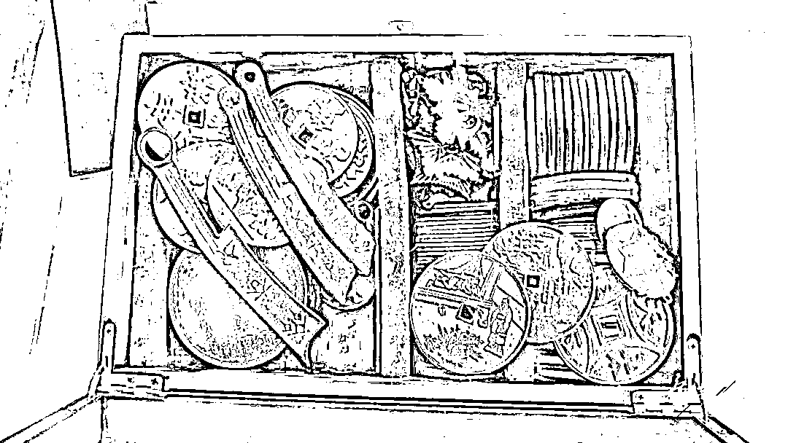
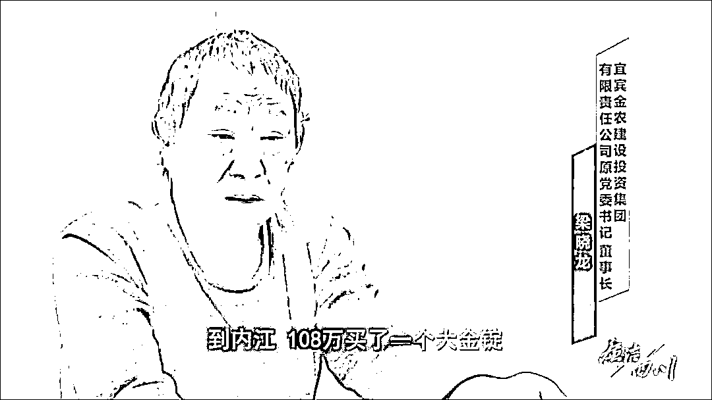
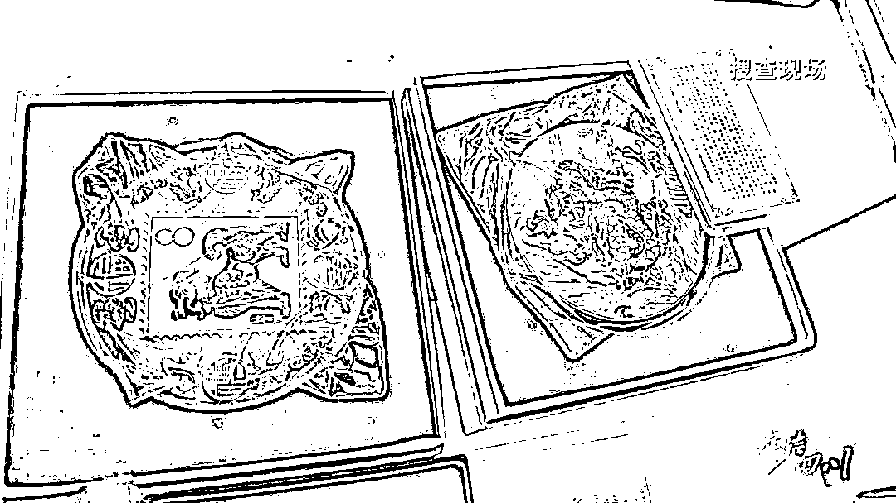
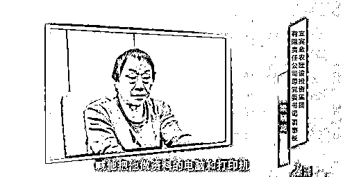
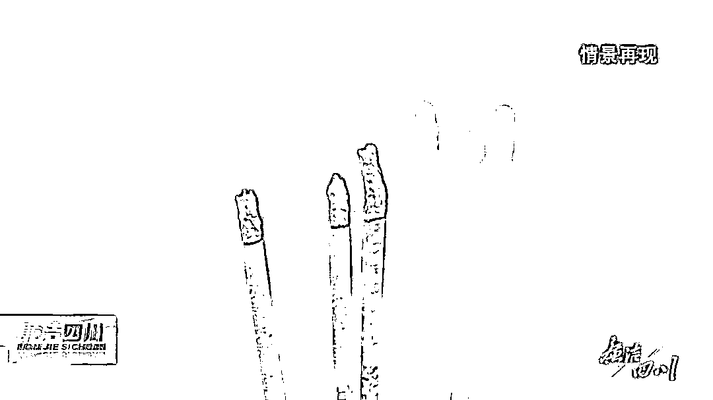
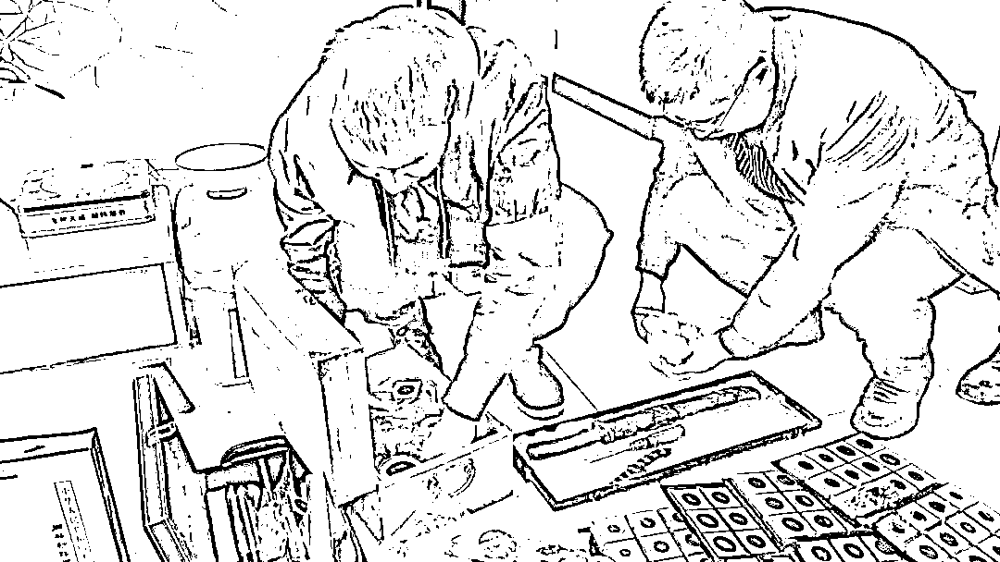
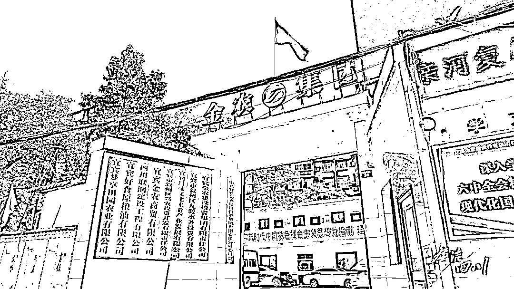
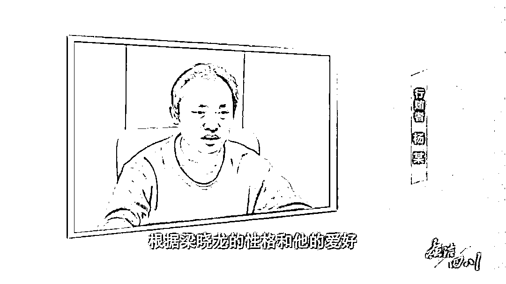

# 沉迷古玩的国企董事长落马！500 多万买了一堆“假货”

> 原文：[`mp.weixin.qq.com/s?__biz=MzIyMDYwMTk0Mw==&mid=2247535789&idx=8&sn=e3e0109047205e17c49e69331c622e9a&chksm=97cb8795a0bc0e83f642cfbbf206f042ebecb6eba2959e69113bbaf4a869d67c6ffaaf9d939c&scene=27#wechat_redirect`](http://mp.weixin.qq.com/s?__biz=MzIyMDYwMTk0Mw==&mid=2247535789&idx=8&sn=e3e0109047205e17c49e69331c622e9a&chksm=97cb8795a0bc0e83f642cfbbf206f042ebecb6eba2959e69113bbaf4a869d67c6ffaaf9d939c&scene=27#wechat_redirect)

“对古玩的痴迷，完全是由一个‘雅趣’，最后变成了套在自己脖子上的枷锁，不知不觉这个枷锁越套越紧，自己也走向深渊、走向灭亡。”近日，四川省纪委监委披露了宜宾金农建设投资集团有限责任公司原党委书记、董事长**梁晓龙**受贿详情，**其在职期间收受贿赂达 1000 余万元，先后收藏古玩 700 多件，花费 500 多万元。**然而，**梁晓龙冒着违法犯罪风险购买的所谓“古董”，多数为造假仿古工艺品，实际价值并不高**，最终竹篮打水一场空。

古玩、邮票、奇石、字画……这些看似高雅的收藏品来路不正，其实质乃是权钱交易，其所有者中不少更是所在单位的“一把手”。

十九届中央纪委六次全会指出，强化对“一把手”和领导班子的日常监督，强化对贯彻执行民主集中制、依规依法履职用权、担当作为、廉洁自律等情况的监督，坚决查处享乐奢靡行为，对违规收送名贵特产和礼品礼金等深挖严治。

沉迷古玩收藏 
他把爱好当做敛财手段

**“人家是玩物丧志，我是玩物丧德。”**梁晓龙对古玩的喜好由来已久，钱币、金锭、银锭、玉器，均有涉猎。

据梁晓龙交代，2018 年底到 2019 年上半年，他发现金银锭，特别是明代以前的大银锭具有较高的升值空间，胃口越来越大，看上的古玩价格越来越高。

2019 年初，四川横竖生物科技股份有限公司时任董事长王正武请托梁晓龙在金农集团入股 4000 万元方面提供帮助。资金到位后，梁晓龙以“恩人”自居，直接“安排”王正武准备 120 万元，并一起到内江购买所谓的“明朝大金锭”。王正武也未食言，兑换返点承诺，先后 6 次送给梁晓龙现金共计 295 万元。

熟悉梁晓龙的人，都知道他有个习惯，交往应酬中总爱带上古玩藏品，席间高谈阔论、夸夸其谈，吹嘘藏品价值不菲。**“他这么做，一方面为掩饰其赃款去向，另一方面是向行贿人暗示，要对方投其所好。”**宜宾市叙州区纪委监委办案人员说。

这项“烧钱”的爱好，推着梁晓龙在违纪违法道路上越走越远。任金农集团董事长期间，梁晓龙在工程项目招投标、转分包、资金款项划拨等方面大搞权钱交易，用于古玩的受贿金额就高达 600 余万元。其中，直接安排管理对象支付的资金达 300 余万元。

[`mp.weixin.qq.com/mp/readtemplate?t=pages/video_player_tmpl&action=mpvideo&auto=0&vid=wxv_2355599623605551107`](https://mp.weixin.qq.com/mp/readtemplate?t=pages/video_player_tmpl&action=mpvideo&auto=0&vid=wxv_2355599623605551107)

爱好无度，由“好”而“腐”，**梁晓龙先后收藏古玩 700 余件，花费 500 余万元。**据专案组介绍，在案发前的一年多时间里，**因担心暴露，梁晓龙就把这些古玩转移到了重庆老家。**因深知无法回头，接下来，梁晓龙对抗组织调查的行为更是花样百出。

大搞封建迷信活动，四处求助
鬼神庇护、请大仙端碗看水

2020 年底，梁晓龙违规帮助某企业老板在某工程项目设备招投标中标。随后不久，梁晓龙得知相关部门正在开展招投标系统治理，并需要对该项目招投标过程进行复查，**做贼心虚的他，第一时间指挥该老板处理相关资料和设备，“将电脑和打印机扔到金沙江”。**

因为害怕问题被发现，心中忐忑的梁晓龙还**大搞封建迷信活动，四处求助鬼神庇护，请大仙端碗看水，随身携带多种迷信物品，妄图逃避组织的调查。**“希望通过求神拜佛，封建迷信来减轻自己的压力，来求神佛保佑，逃避被组织调查。”梁晓龙说。

无论什么“神灵”，也保佑不了违法乱纪行为。2021 年 9 月，宜宾市叙州区纪委监委通报，宜宾金农建设投资集团有限责任公司党委书记、董事长梁晓龙涉嫌严重违纪违法，正接受纪律审查和监察调查。

经查，梁晓龙在担任宜宾金农建设投资集团有限责任公司党委书记董事长期间，收受贿赂达 1000 余万元。**2022 年 2 月，宜宾市叙州区纪委监委给予梁晓龙开除党籍，开除公职处分，**其涉嫌受贿犯罪行为移送检察机关依法处理。

在专题片中，**梁晓龙追悔莫及，称愿意拿命去换“后悔药”。**“对古玩的这个痴迷，完全是由一个‘雅趣’，最后变成了套在自己脖子上的枷锁。”梁晓龙称。

[`mp.weixin.qq.com/mp/readtemplate?t=pages/video_player_tmpl&action=mpvideo&auto=0&vid=wxv_2355593165132365825`](https://mp.weixin.qq.com/mp/readtemplate?t=pages/video_player_tmpl&action=mpvideo&auto=0&vid=wxv_2355593165132365825)

然而，**梁晓龙冒着违法犯罪风险购买的所谓“古董”，多数为造假仿古工艺品，实际价值并不高，最终竹篮打水一场空。**

无独有偶，长期痴迷集邮，重庆市南岸区公路养护管理中心原主任**罗常平**，也走上了违纪违法的不归路。

痴迷集邮，违纪违法所得
绝大部分用于购买邮票

**罗常平**是一位不折不扣的集邮“发烧友”。“他是营业厅的老集邮客户，每年都会在我们这里预定和购买很多邮票及邮品。”据中国邮政巴南片区分公司集邮营业员何某回忆，渐渐熟悉后，2015 年至 2019 年，其为罗常平代理买卖邮品达 450 余万元。

办案机关从罗常平处起获 14 箱邮票。据罗常平供述，案发时家里的邮票、明信片、连号小额人民币等收藏品，价值 80 万元左右；西邮商城账户上另有 20 余万元市值，其中 6 万元为他人所有。后续调查发现，罗常平违纪违法所得 66.97 万余元绝大部分用于购买邮票。

**由于邮票市场行情波动剧烈，出现巨额亏损后，罗常平在抵御不法商人的“围猎”时毫无招架之力。**经查，罗常平违反廉洁纪律，因私向管理服务对象借款 12 万元，案发时仍未归还。违反国家法律法规，违规设立、使用小金库，滥用职权、徇私舞弊，收受某大学下属工程质量检测中心桥隧检测项目返点费，收受某公司好处费 30 万元。

2019 年 11 月，罗常平被判处有期徒刑三年，并处罚金 20 万元。那 14 箱被他视若珍宝的邮票，最终被法院拍卖，所得款项用于归还其违纪违法退缴缺口。

从“破心”“破纪”到“破法”
既暴露对“一把手”教育监督不力
也暴露个别单位
经营管理、职能履行中存在漏洞

梁晓龙、罗常平为何屡屡得逞，值得反思。

金农集团作为宜宾三大国有平台公司之一，主要负责涉农相关项目建设、物资采购和投融资等。2016 年起，梁晓龙到金农集团任职后，选人用人一言而决，项目招标一意孤行，资金划拨一人审批，“官”威大、作风蛮横霸道，俨然“一霸手”。

从“破心”“破纪”，再到“破法”，梁晓龙的堕落既暴露出对国企负责人教育监督不力的问题，也暴露出少数国企经营管理中存在党的领导弱化、体制运行不畅、制度执行不力、监督监管缺位等漏洞。

集团党委不开展民主生活会、不举行中心组学习会议、不参加党内活动已成为常态，党组织严重软弱涣散，党委有名无实，致使梁晓龙脱离党组织管理和监督，最终堕入违纪违法犯罪的深渊。

除任集团董事长外，梁晓龙还兼任下属 6 个子公司的董事长，**权力过分集中，大事小情一把抓。**同时，单位内部体制机制不完善，部分重要部门如审计、风控等未设置或工作不力，不能发挥应有作用。

再看罗常平，专横独断方面与梁晓龙并无二致。其担任养护中心主任期间对于重大事项从未经相关决策程序，经常搞“一言堂”，甚至不开任何会议，直接口头决定关键事项。

罗常平为什么对邮票情有独钟？据办案人员分析，**一是**认为集邮既能娱乐、陶冶情操，又能增值赚钱，一举多得；**二是**将集邮作为人生价值“支点”，动用大额资金买卖、炒作邮票，甚至不惜采用抵押房屋贷款、网络小额贷款、民间借贷等方式，孤注一掷、深陷泥潭，每月偿还各类借款在 3 万元以上；**三是**玩物丧志、走火入魔，甚至在被留置期间还在琢磨出狱后要让亏损的邮票彻底翻盘。

古玩、邮票、玉石、字画
变现手段隐蔽多样
调查难度大，容易逃避监管

透过现实案例不难看出，领导干部一旦有所“雅好”，行贿送赃者即可窥见“门径”。浑然不觉中，个别领导干部就实现了“由好而贪、由雅而腐”的转变。

据梁晓龙自述，2018 年下半年，他发现了传说中的明代以前的五十两大银锭具有很高的收藏价值和升值潜力，“赶紧找钱，拿下并收藏”的想法便在脑子里挥之不去。于是，在这一年启动的泥溪高铁客运站及站前广场道路、横楼大桥等诸多项目中，他以收受礼金、债务转嫁等手段，多次接受老板的利益输送。“贪欲战胜了理智，雅趣变成了绞索，加上老板们有的吹嘘他们有关系、有的吹嘘他们有骨气、有的吹嘘他们有预案，我就心存侥幸地笑纳了。”

事实上，**无论是直接接受“雅贿”，还是收受财物用于“雅好”，本质都是权钱交易，附庸风雅的“艺术”背后隐藏着巨大的利益输送。**古玩、邮票、玉石、字画变现手段隐蔽多样，调查难度大，更容易逃避监管，“雅腐”的隐蔽性引得一些人趋之若鹜。

如果喜欢收藏，就硬要获取价值不菲的名人字画、珍品孤本；爱好摄影，非得置办数套专业装备，动辄远赴名山大川、风景名胜采风；雅擅丹青，就得出版个人书画集，或送或卖……如此这般，一旦超出公职人员的正常消费水平，与其收入和身份不符，必然会有人投其所好，主动“买单”，逐步将其拉下水。

党员领导干部有些兴趣爱好，原本无可厚非，但决不能用手中权力换取利益、满足私欲。

专家建议，必须加强监督力度，把权力关进制度的笼子，减少权力寻租空间，规范权力运行。领导干部必须厘清雅好与公权的关系，坚决抵制借雅好之名行腐败之实的“雅腐”。

来源：中央纪委国家监委网站、廉洁四川、红网

← 向右滑动与灰产圈互动交流 →

