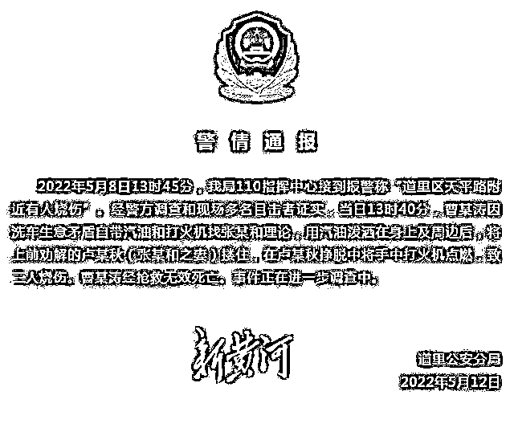
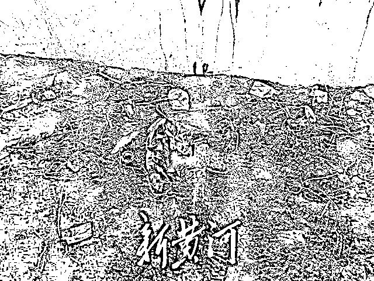
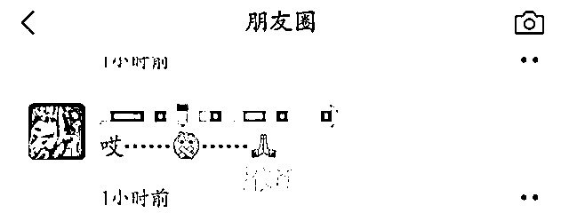

# 哈尔滨烧伤死亡男子家属：不认可通报，警方建议悄悄火化遗体

> 原文：[`mp.weixin.qq.com/s?__biz=MzIyMDYwMTk0Mw==&mid=2247535862&idx=2&sn=a75e907fc5372f437f4afa2b891f88bf&chksm=97cb87cea0bc0ed8edecbc55016a7463cf72c11867914785be6d08c3725f5576f0d064d1e19a&scene=27#wechat_redirect`](http://mp.weixin.qq.com/s?__biz=MzIyMDYwMTk0Mw==&mid=2247535862&idx=2&sn=a75e907fc5372f437f4afa2b891f88bf&chksm=97cb87cea0bc0ed8edecbc55016a7463cf72c11867914785be6d08c3725f5576f0d064d1e19a&scene=27#wechat_redirect)

日前，哈尔滨洗车摊一男子烧伤身亡事件登上热搜，引发广泛关注。

<mpvideosnap class="js_uneditable custom_select_card channels_iframe videosnap_video_iframe" data-pluginname="videosnap" data-id="export/UzFfAgtgekIEAQAAAAAAywMCP4A_UQAAAAstQy6ubaLX4KHWvLEZgBPEz6McOQljS8qDzNPgMIuUEi_nkO3GDYFN8ivBg1j-" data-url="https://findermp.video.qq.com/251/20304/stodownload?encfilekey=rjD5jyTuFrIpZ2ibE8T7YmwgiahniaXswqzo9jNb4WU1icyxYHfPahLzXM6x1SbOwXKnEuHsiax3FJL7MhNkzsRrQNyEZSnyR0icGwhvftws0WqqVwhI0x9822Ew&amp;adaptivelytrans=0&amp;bizid=1023&amp;dotrans=0&amp;hy=SH&amp;idx=1&amp;m=&amp;scene=0&amp;token=x5Y29zUxcibBkbILcsxbMicbmbOobKGySRj9nQ707zn1sUrj047zsdsa6O5Cc9s0Pmoz2ykt5CZH4" data-headimgurl="http://wx.qlogo.cn/finderhead/ibq4aVwOt6HNqrr8OD3sCviaytF3B8TqCwHicxsuIanAJo/0" data-username="v2_060000231003b20faec8c6e48a1acbd3ce04ef33b077a1e41d0d3794ed88ea537878dbe65910@finder" data-nickname="灰产圈+" data-desc="【#哈尔滨洗车摊一男子烧伤身亡#】#哈尔滨洗车摊烧伤男子家属发声# 近日，网传哈尔滨一洗车摊男子烧伤身亡。当事人家属曹女士告诉@中国新闻周刊，5 月 7 日她父亲在路边摆洗车摊时，被附近一名外号“大河子”的洗车摊主威胁，不许其父摆摊。当日下午收摊时，有身着制服人员前来将其父刷车水泵收走，据称价值 2600 元。当晚，家人曾前往道里区执法局寻找水泵未果。8 日下午，曹女士哥哥欲找“大河子”帮忙要回水泵。当日下午 4 时许，家人接到派出所电话，称其哥哥在哈尔滨市第五医院抢救。

曹女士回忆，哥哥当时意识清晰可以说话，身体大面积烧焦，“他说哥求你，给哥来口凉的雪碧。” 曹女士称，其父在医院看到哥哥手腕处绑有绳子，并向护士要剪刀剪掉，“我父亲说绳子很难剪，上面有皮肤组织和被烧的衣服。” 在医院里，哥哥让她录下口述视频，视频中称：“我去找他理论，他不听，把我架在那，就不让我干，他儿子将汽油倒在我身上，我想跑跑不了。” 当晚，哥哥医治无效去世。

现场目击者对@中国新闻周刊 回忆，5 月 8 日下午看到着火冒烟，有人拿着刷车水泵在灭火。目击者称，现场围着很多人，只能看见伤者身体下半部分，“腿都在动，那时候还活着。”

截至发稿，#周刊君现场#多次致电相关部门均未回应。@灰产圈+ " data-nonceid="2360944966569416957" data-type="video" data-width="3832" data-height="2160"></mpvideosnap>

5 月 12 日晚，哈尔滨市公安局道里分局发布警情通报称，5 月 8 日 13 时 45 分，道里分局 110 指挥中心接到报警称“道里区天平路附近有人烧伤”。经警方调查和现场多名目击者证实，当日 13 时 40 分，曹某涛因洗车生意矛盾自带汽油和打火机找张某和理论，用汽油泼洒在身上及周边后，将上前劝解的卢某秋（张某和之妻）搂住，在卢某秋挣脱中将手中打火机点燃，致二人烧伤。曹某涛经抢救无效死亡。事件正在进一步调查中。

针对警方通报，5 月 14 日上午，死者曹某涛的妹妹曹爽告诉新黄河记者，她表示不认可通报内容。“我和母亲从前天（12 日）开始，每天被带到警察局，不是白天在那待一天就是下午待到凌晨两三点钟才能回来，警方就一两个同样问题整日反复询问。”她表示，哈尔滨市道里区公安局连续两天把她和母亲叫到公安局问询，并要求家属配合警方向公众承认自己先前接受媒体采访时所说内容不实。

**手机上交，回家后才看到通报** 

曹爽告诉记者，她和母亲在公安局期间，通信设备需要上交，不能与外界沟通，并且需要提供给警方解锁密码。“现在警方的重点不是侦查案件到哪一步，而是他们说舆论压力很大，让我出面跟媒体跟公众说一些话，给他们澄清。”曹爽表示，“我哥临终之前所说的话是不是真实的？这个案件有没有进展，他们没有给我明确的答复，只是说还在侦查当中。”

对于 5 月 12 日晚，道里区公安局发布的警情通报，曹爽表示，“我是回到家中后，经热心人士转给我，我才看到通报的，我不认可。我问警方，对方说只是为了暂时压住舆论，我说你们没有下定论，为什么要发？警方没有吱声。”

**警方建议今日悄悄火化遗体** 

曹爽告诉记者，5 月 13 日警方建议将曹某涛的遗体火化，“他们说尸体已经没有价值了，14 日是我哥走的第七天，让我们火化，一开始我和我母亲是同意的。他们说安排悄悄到万宝镇那边的火化场火化，但是他们一再强调让我出面跟媒体记者和群众说一些事情，我们就拒绝了。”曹爽在电话里小声告诉记者，“我想他们一会还会来找我和我母亲说话。”

“我恳求你把我的信息传递出去，而且我朋友圈也希望群众能知道什么意思。”曹爽对记者说。

令曹爽不理解的是，曹某涛跑货运的小货车一直停在群力派出所里，但车里的金戒指却找不到了。

“我哥哥生前我母亲送给他的金戒指，一直放在他车里，昨天我们去取我哥车的时候，在派出所里边竟然不见了。”曹爽告诉记者，曹某涛生前，在急诊室里多次告诉曹爽和父母，贵重的财务放在车上，如今却没找到，“我们不会因为一个金戒指去诬陷什么，但确实没找到。”

**事发前天哥哥还计划给外甥买生日礼物** 

“我哥是开货拉拉的，平时不喝酒。有人说他是不是精神不好，没有!我和我哥是左邻右舍看着长大的。”曹爽告诉新黄河记者，“我们家是很幸福的家庭，家里有四台货车，住着 500 多平方米的房子，还有一个 loft，我哥最近在忙着复式的装修。”曹爽介绍，曹某涛出生于 1988 年，从事货运工作，曹某涛的孩子今年 9 岁，跟着妈妈生活。

事发头一天（5 月 7 日）晚上，曹某涛还在跟即将过生日的外甥研究买什么样的生日礼物。“我哥当时问我儿子，想要啥蛋糕，是小汽车蛋糕还是海绵宝宝蛋糕还是奥特曼蛋糕。两个人还在一起玩耍。”曹爽介绍，5 月 8 日早上 6 点多，曹某涛在家吃完饭准备出门，送货时外甥还在身后送他，惦记着自己刚买的麻花还在舅舅车上，曹某涛答应晚点回来给外甥带着。

据曹爽回忆，5 月 7 日晚上 11:00 多，曹某涛还曾劝说父亲手上有风湿不能沾凉水，水泵找不回来就不要了，给父亲再买台车一起去跑货拉拉。

“我父亲现在在家非常难过，舅舅和我姨他们在照看我父亲，他现在很虚弱。”曹爽说完挂断了电话。

<mpvideosnap class="js_uneditable custom_select_card channels_iframe videosnap_video_iframe" data-pluginname="videosnap" data-id="export/UzFfAgtgekIEAQAAAAAAd4Mw89YkiwAAAAstQy6ubaLX4KHWvLEZgBPEvKNMJh5sM9WDzNPgMIvF1DavASRmIMAzSuKROocI" data-url="https://findermp.video.qq.com/251/20304/stodownload?encfilekey=rjD5jyTuFrIpZ2ibE8T7YmwgiahniaXswqzUE8naO6GDVFXv7A1qiaIRbfsB9r1gw9x4hTQlVPKsT5Tg6mPERn9WXick6JCK5icWPF67ria0O5b9KkpffUjO1M5sQ&amp;adaptivelytrans=0&amp;bizid=1023&amp;dotrans=0&amp;hy=SH&amp;idx=1&amp;m=&amp;scene=0&amp;token=AxricY7RBHdUgS2uXEKaxxOUqKrvyFxYP8JGGy6hrDhLiaXMrfQ0TyarBPEouANZd6rjW65r3r48M" data-headimgurl="http://wx.qlogo.cn/finderhead/ibq4aVwOt6HNqrr8OD3sCviaytF3B8TqCwHicxsuIanAJo/0" data-username="v2_060000231003b20faec8c6e48a1acbd3ce04ef33b077a1e41d0d3794ed88ea537878dbe65910@finder" data-nickname="灰产圈+" data-desc="【#哈尔滨烧伤身亡男子家属再发声#：不认可通报内容，警方建议悄悄火化遗体】5 月 14 日上午，死者家属告诉新黄河记者，哈尔滨市道里区公安局连续两天把她和母亲传唤到公安局问询，并要求其配合警方向公众承认自己先前接受媒体采访时所说内容不实。家属称：“我和母亲从前天（5 月 12 日）开始，每天被带到警察局，不是白天在那待一天就是下午待到凌晨两三点钟才能回来，警方就一两个同样问题整日反复询问。”

家属表示，她和母亲在公安局期间，通信设备需要上交，不能与外界沟通，并且需要提供给警方解锁密码。对于 5 月 12 日晚，道里区公安局发布的警情通报，家属表示，“我是回到家中后，经热心人士转给我，我才看到通报的，我不认可。我问警方，对方说只是为了暂时压住舆论，我说你们没有下定论，为什么要发？警方没有吱声。”

家属告诉记者，5 月 13 日警方建议将曹某涛的遗体火化，“他们说尸体已经没有价值了，14 日是我哥走的第七天，让我们火化，一开始我和我母亲是同意的。他们说安排悄悄到万宝镇那边的火化场火化，但是他们一再强调让我出面跟媒体记者和群众说一些事情，我们就拒绝了。”" data-nonceid="16511385033373410444" data-type="video" data-width="1920" data-height="1080"></mpvideosnap>

（新黄河记者：刘海奎）

来源：新黄河客户端

← 向右滑动与灰产圈互动交流 →

