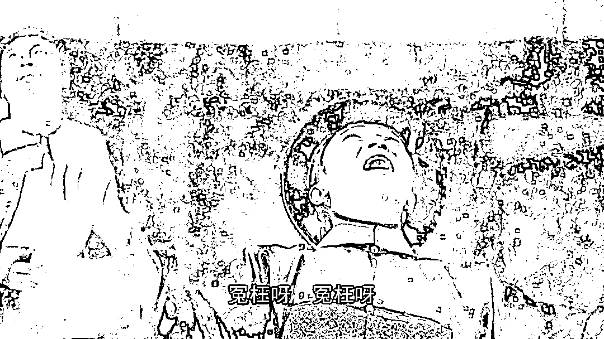
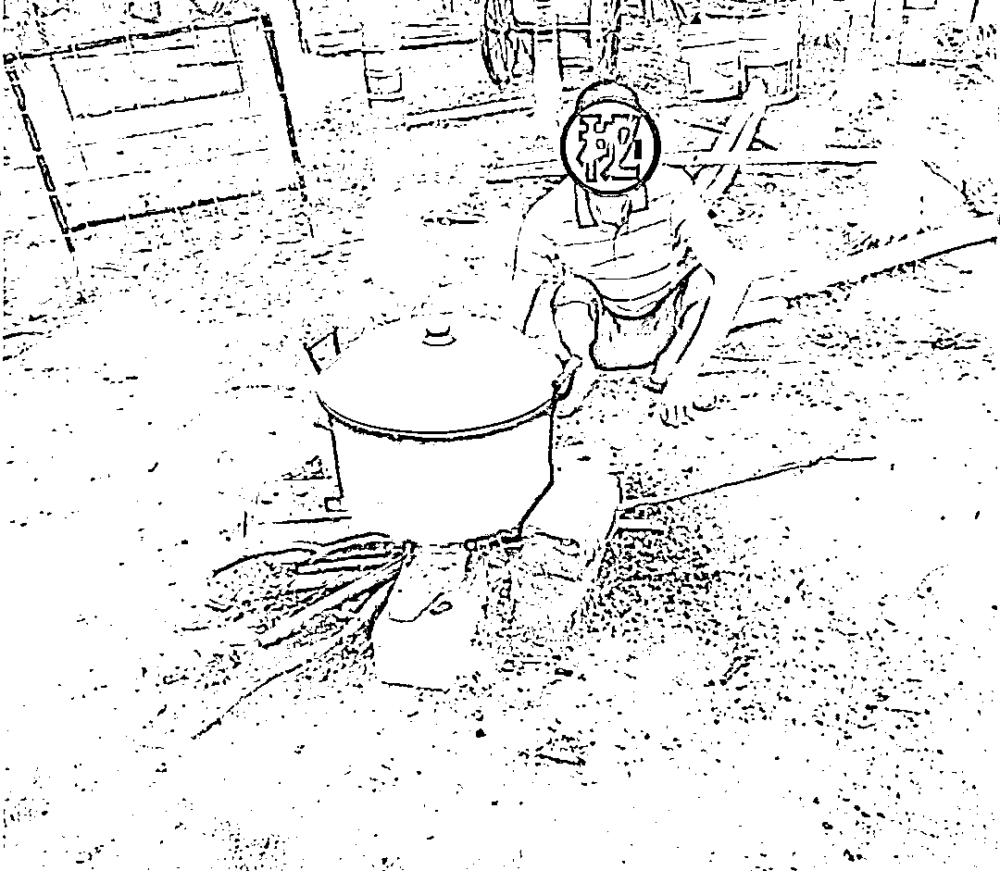
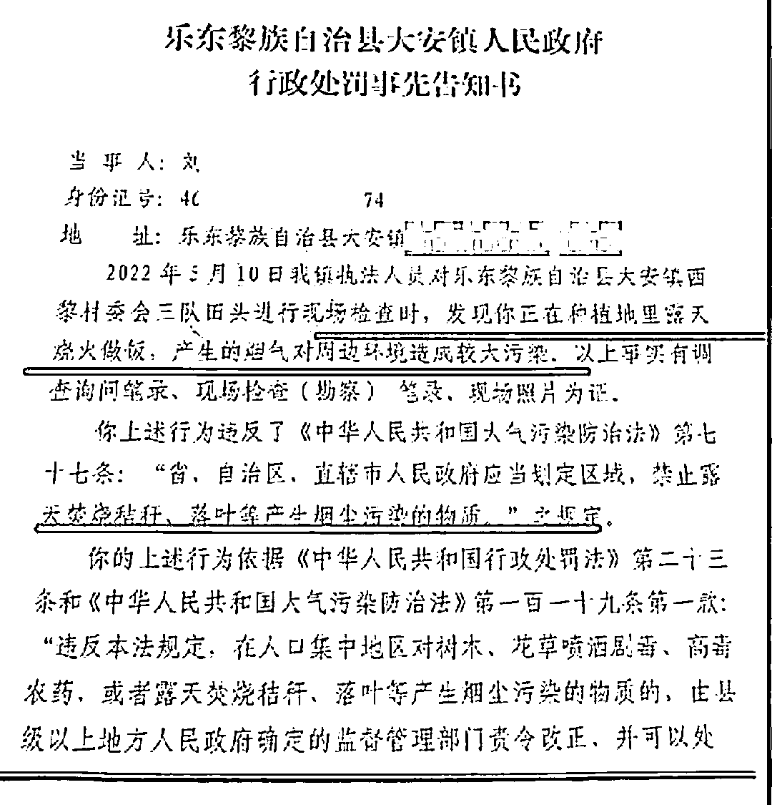
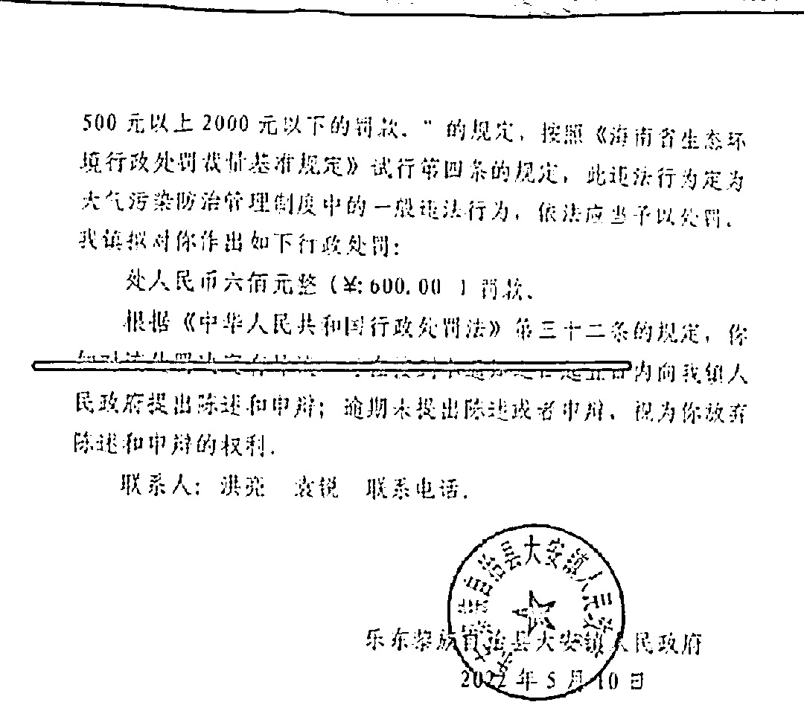
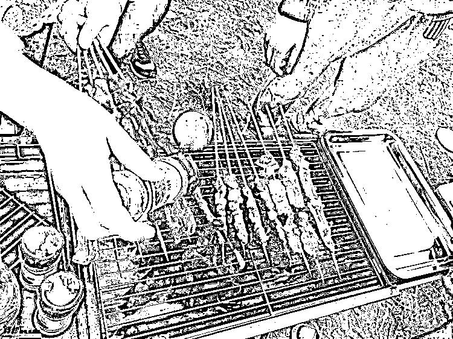
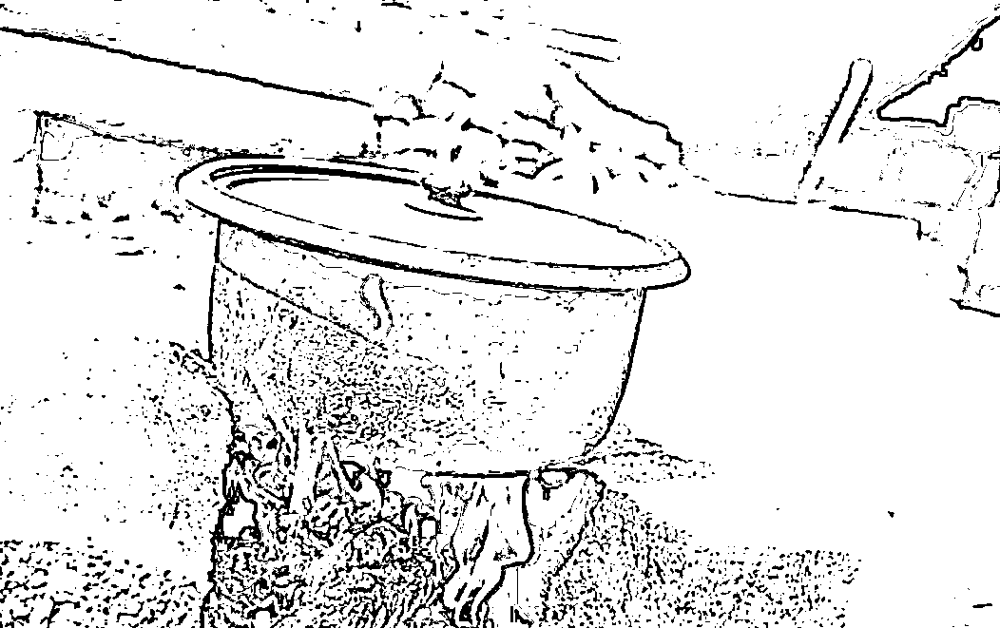
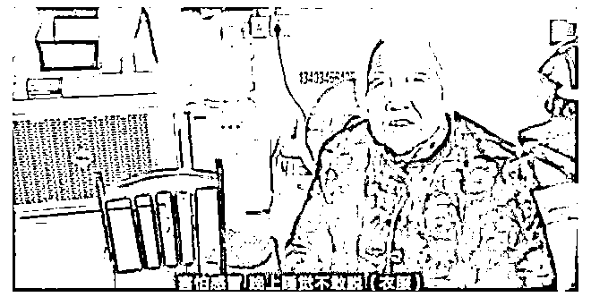
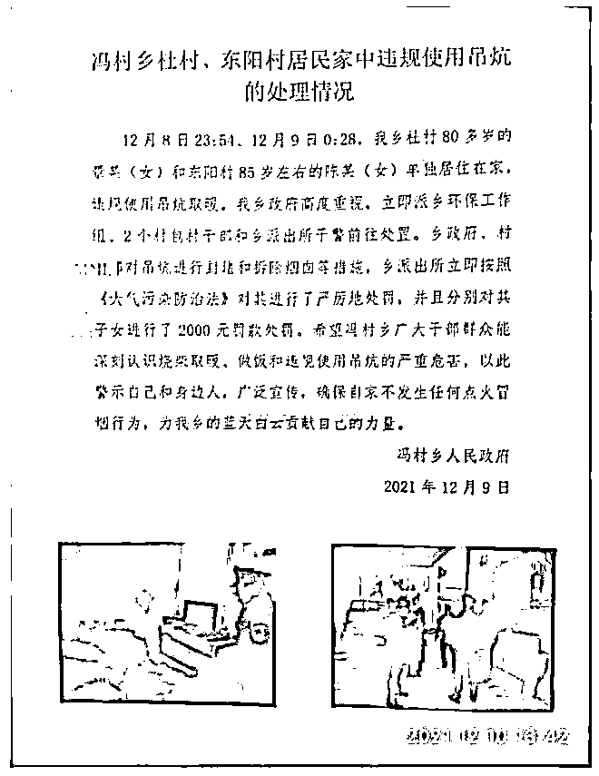

# 老人露天生火做饭被罚 600 元：乡镇执法人员不是瞎扯淡吗？

> 原文：[`mp.weixin.qq.com/s?__biz=MzIyMDYwMTk0Mw==&mid=2247535862&idx=3&sn=f6104df6f3eb75a0a1d503ef015e5624&chksm=97cb87cea0bc0ed88179fb75cac71e8550eea3a4f7210d33d68cb743fb62f2de5157dcb3c3a4&scene=27#wechat_redirect`](http://mp.weixin.qq.com/s?__biz=MzIyMDYwMTk0Mw==&mid=2247535862&idx=3&sn=f6104df6f3eb75a0a1d503ef015e5624&chksm=97cb87cea0bc0ed88179fb75cac71e8550eea3a4f7210d33d68cb743fb62f2de5157dcb3c3a4&scene=27#wechat_redirect)

图源：电影《九品芝麻官》

烧个火做饭都能造成较大污染，那多放几个屁是不是也得罚款？

5 月 12 日，一份行政处罚告知书让我吃惊不已：

海南乐东黎族自治县一名老人，因露天做饭产生的烟气，对环境有污染被罚款 600 元。

5 月 12 日，当地大安镇相关领导出面回应，告知书属实，事发时执法人员对相关政策把握不到位，执法存在瑕疵，**罚款事后并没有向老人收取，而是由村委会和驻村干部承担，希望以此起到警示作用。**

**滑天下之大稽，工业废气废水不管，管生火做饭，牛！** 

城里的烧烤摊所产生的烟气污染，远远要比老人做饭所产生的烟气要大吧？管不管？

告知书中的村民就住在他家槟榔地旁边的房子里，当地村民在收割完农作物后焚烧秸秆会导致空气污染，所以村里在田地里安装了摄像头监测。

这名老人的槟榔地正好离摄像头很近，所以他在田里露天烧火煮饭的烟雾就被监控到了。

在告知书中，表明了处罚是根据《大气污染防治法》的第 77 条规定。

查询了相关资料，该规定中指的焚烧应该是大面积、集中焚烧。

那生火做个饭怎么就成了较大污染呢？

防止村民焚烧秸秆污染环境可以理解，但不能禁止村民日常生活用火，**大家都是吃五谷杂粮的，又不是神仙，不生火做饭，难道让他们饿死？**

照这逻辑：

**露天烧饭，罚款 600 元 ；**

**电梯里放屁，罚款 60 元 ；**

**露天放屁，罚款 6 元****。**

**对了，我去年在野外烧烤，我污染环境了，我自首。**

其实在行政执法中，要考虑执法的“比例原则”以及行政处罚的“首违不罚原则”，老人烧饭这种小事，最多以劝阻为主，完全没必要罚款。

**综上，可以说是对法律理解得完全不到位。**

最神奇的操作来了，村支书说村委会原本就准备好了罚款，如果 5 天内这名老人不提起申诉，村委工作人员会去帮他缴纳罚款。

**意思是，只是吓唬吓唬老人而已……**

可我的疑问，这 600 块钱罚款，如果不是引起网络热议，是会向老人收取还是村委会承担呢?

**既然这项处罚不合理，那为什么不是直接撤销，而是由村委会和驻村干部承担呢？**

村委会愿意代人受过，既不合法理，也让人觉得可疑。

非要解释，那就是做错了还不想承认，但黑锅一定要有人背。 

说了要罚，但舆论上来又朝令夕改，想要解释却越抹越黑。

忽然想起农村贴的标语：见火就抓，见烟就罚。

**在此背景下，乡镇执法人员形成了“点火就罚”的思维惯性。**

很多时候，地方的一些“一刀切”政策真的让人很无奈。

不由让人想到几年前，一些地方政府以环保的名义，封了农民做饭的锅头、封了农民的火炕。

2021 年 12 月，山西运城盐湖区冯村乡政府两名 80 多岁老人烧炕取暖，当地乡政府两老人的吊炕封堵并拆除烟囱，对子女罚款 2000 元。

**至于农民是否能吃上饭，是否受冻，他们不管，只是一罚了之。**

其实所有人都明白得很，温室效应怎么来的，漫天黑烟不管，逮着农民烧饭、烧炕搞事情，到底是谁在秀谁的智商？

立法的初衷是防治大气污染，是防止大面积焚烧秸秆造成浓烟和有害物质，不是要和农民的生活习惯过不去。

环保很重要，环保执法也很必要，但这一切要建立在法治和科学的基础上。

**知屋漏者在宇下，知饭熟者在民间。**

**再坚决的环保政策都得设身处地地为老百姓着想，请做到有事实、有根据、有法依法。**

基层不容易，农民也不容易，就别去为难一个想要吃口饭的老人了。

来源：昌南大队长

← 向右滑动与灰产圈互动交流 →

