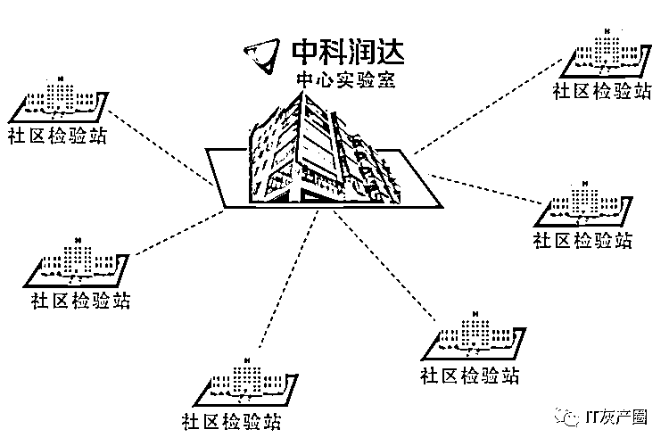

# 关于魔都魔幻般的核酸检测

> 原文：[`mp.weixin.qq.com/s?__biz=MzIyMDYwMTk0Mw==&mid=2247535926&idx=1&sn=58f902a0467a77f96e55d1bc594fcf5c&chksm=97cb860ea0bc0f18bdf0172a4eebafce2d705169235af2fcda415d696f9b49d75696fb73b78b&scene=27#wechat_redirect`](http://mp.weixin.qq.com/s?__biz=MzIyMDYwMTk0Mw==&mid=2247535926&idx=1&sn=58f902a0467a77f96e55d1bc594fcf5c&chksm=97cb860ea0bc0f18bdf0172a4eebafce2d705169235af2fcda415d696f9b49d75696fb73b78b&scene=27#wechat_redirect)

**此前报道：**

**[被质疑多次测出假阳性，中科润达疑似“情况说明”流出，上海卫健委已开展调查](http://mp.weixin.qq.com/s?__biz=Mzg3OTExNDYyOQ==&mid=2247484944&idx=1&sn=beac71e44b5b16e06237882f6e8a3911&chksm=cf0826faf87fafecb97c3d24e4bdf264a4cfe9abc0f0533c65fb313f71157593ad68d204f710&scene=21#wechat_redirect)**

此事件不久，上海又一检测机构核酸准确性遭质疑！男子核酸阳性报告入方舱后转阴！

**点击图片查看**

← 向右滑动与灰产圈互动交流 →

