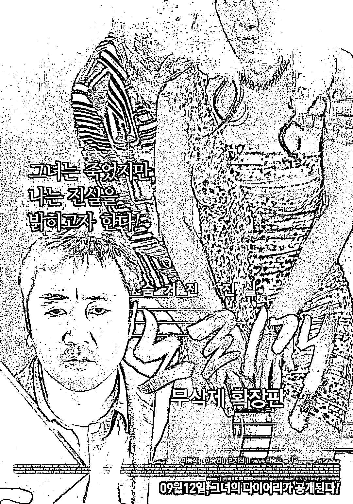

# 韩国扫黄，越扫越黄

> 原文：[`mp.weixin.qq.com/s?__biz=MzIyMDYwMTk0Mw==&mid=2247535926&idx=2&sn=a069a289bbed4be30771fcf71bf493fd&chksm=97cb860ea0bc0f187ccba7e29ffa3355c543da1bf4ecc0c7457f038ec97bf6c143f626d50fd0&scene=27#wechat_redirect`](http://mp.weixin.qq.com/s?__biz=MzIyMDYwMTk0Mw==&mid=2247535926&idx=2&sn=a069a289bbed4be30771fcf71bf493fd&chksm=97cb860ea0bc0f187ccba7e29ffa3355c543da1bf4ecc0c7457f038ec97bf6c143f626d50fd0&scene=27#wechat_redirect)

如果让你选出“性”最开放的国家，八成你要脱口而出：“日本”。 

实际上，这老大哥的位置早就坐不稳了。

早在 2002 年，韩国犯罪学协会就曾公布过一组数据，在所调查的 1050 名韩国男性中，一半以上去过大保健。在 20 岁以上的男性中，20%以上每周至少一次大保健。

到了 2016 年，韩国成年男性的嫖娼率稳步上升，达到 55%

2011 年《日本时报》的一份调查显示，韩国男性在色情行业的人均消费为 527 美元，力压日本的 370 美元成为亚洲乃至全世界的冠军，韩国人每年性交易的付费金额达 14 万亿韩元（约合 746 亿元人民币），人类有史以来之最。

韩国色情产业发展数据 

2021 年 5 月 4 日，首尔市立大学的一份研究报告显示，在韩国的母亲河汉江里，伟哥成分超标，每到周末，汉江内壮阳药的含量就会飙升，可谓相当离谱。

伟哥超标，和汉江两岸众多的夜店脱不了干系

但这离谱倒也有迹可循，毕竟这不大点的地方，每年就要卖出 1576 亿韩元（约合 8.3 亿人民币）的壮阳药。

韩国政府官方数据显示，该国从事色情行业的人数约 50 万，妇女组织不同意这个数据——她们认为至少在 100 万以上。

反正都算够多的，韩国总人口只有 5000 万。

虽然在某种程度上已经超越了日本，但韩国情色产业如今的这个局面，和日本脱不了干系。 

二战期间，为了满足士兵的生理需求，日本号召女人们奉献身体犒劳前线军人，也就是臭名昭著的“慰安妇”制度。 

韩国慰安妇 

自己人不够，就从中国和韩国抢，日军打到哪，慰安所就开到哪。

据统计，当时至少有 14 万韩国少女被迫成为慰安妇。她们很多人都因此染上性病，不得不切除子宫，导致终身不孕不育。

后来，日本投降，朝鲜半岛一分为二，美国扶持李承晚成立大韩民国。

成立初期经济惨不忍睹，人均 GDP 不到朝鲜的三分之一，大量国民拖家带口往朝鲜跑。政府为了拉升 GDP 无所不用其极，比如支持民女卖春，甚至鼓励之前的“慰安妇”们重操旧业。

生活在美军基地旁的韩国妇女

这命算上续上了，但想起飞还得靠美国爸爸的经济援助，为了留住美国大兵，韩国政府把 60%的妓院开在美军军营周围。

登记在册的“洋公主”有 2 万人，当时驻韩美军才 6 万人

当时全民穷困潦倒，当妓女甚至算是“轻松”的高薪职业，越来越多年轻女孩加入其中。据统计，1953 年韩国有超过 35 万失足妇女，她们的营业额，占全国 GDP 的四分之一。

1961 年，朴正熙发动军事政变推翻了张勉政府。美国爸爸不高兴了，为了伺候好驻韩美军赚取更多外汇，朴正熙政府批准了性交易合法化。

朴正熙还有个日本名字：高木正雄

为了让韩式大保健打败日式服务，政府建立了“性”旅游区，为妓女们解决住房问题，定期为她们体检，甚至出钱大搞培训班，让妓女们学习英文、西方礼仪和姿势……此外，还衍生出了飞机屋、玻璃屋、亲吻屋、公交室等五花八门的特色项目。

通过政府的洗脑，妓女成为了一份受人尊重的职业，地位甚至比某些官员还要高

在政府的大力支持下，色情行业为韩国创造了 1000 万美元的财富，相当于当时韩国 GDP 的 4%。

1966 年韩国《新东亚》杂志写到：只要利用好女人的肉体，就能振兴韩国。韩国政府也点赞道：性工作者用身体拯救了国家经济，是美韩两国的民间外交官，更是真正的爱国英雄。

性工作者，是“汉江奇迹”的奠基人。

“汉江奇迹”，指韩国在朴正熙的领导下实现工业化和经济腾飞，人均 GDP 从 1960 年的 82 美元增长到 1980 年的 1592 美元

虽然夹杂着血泪，但“汉江奇迹”之后韩国人民的腰包确实鼓起来了，饱暖思淫欲，欧巴们决心雄起：当年鬼子和美国佬玩得起，我们现在也要玩！于是，韩国男人开始接力成为最大消费群体。 

90 年代中后期，庞大的色情市场仅靠韩国女性已经撑不起来了，大量欧洲和东南亚的失足妇女涌入。2003 年的一项统计显示，韩国人每年花在性交易上的金额占到韩国全年 GDP 的 4.1%

欧巴们对于肉体欲望的追逐确实凶猛，对于有钱有势的人来说，大保健是满足不了他们的，有买卖就有杀害，职场、演艺圈、政界，充斥着各种“性贿赂”。 

当然，“出口”也并没有停止。 

2009 年美国军务部发布了《韩国肉体交易现状报告书》，将韩国定义为“性出口国家”，每年有超过 5000 名韩国女性通过加拿大进入美国，很多都在从事性交易，平均每天的工作时间长达 13 个小时。

报告发布的同年，还发生了震惊韩国的张紫妍案。

经纪公司给她开了个 VIP 包房，迷晕后让达官贵人们对其施行性侵。张紫妍报警后警察不但毫不作为，还对其花式羞辱。经纪公司眼见没事后更是越发丧心病狂，据统计，张紫妍至少向 31 位韩国要员提供了上百次性服务，甚至连父母忌日时，她都要被拉出去陪睡。最终，不堪忍受的她选择在家中自尽。

以张紫妍为故事原型的电影《玩物》

张紫妍并不是个案，2010 年韩国女性政策研究院对 111 名女演员进行了关于“潜规则”的问卷调查，其中有 45.3%坦言自己曾被要求陪酒；58.3%曾受到过语言和视觉上的性骚扰；遭遇过肢体性骚扰的达到 31.5%，有 21.5%被要求发生性关系，甚至惨遭性侵犯(6.5%)。

李胜利的夜店内，充斥着毒品和性交易，连未成年人都不放过 

值得一提的是，韩国文化传媒行业的审查尺度相对宽松，R 级片百花齐放，虽然其中不乏艺术成就很高的经典。

《色即是空》

《奸臣》

《霜花店》

《下女》

《布拉芙夫人》 

《娼》

但很大一部分还是低俗粗俗的劣质产品。除此之外，各类直播性喜剧小电影小黄油甚至是擦边球女团都做得有声有色。

比麻豆传媒强点有限

这个领域我们不太了解，就不展开聊了。

当然，也不是所有韩国人都希望色情行业泛滥，前总统卢武铉尝试过改变。

他一上台就颁布了《性买卖特别法》，正式宣布性交易非法，4 年内取缔了 5 万多家色情场所，抓获从业女性 30 多万人。

然而，韩国的色情业和韩国财阀高度绑定，说到底，他们的蛋糕动不得。扫黄运动很快就受到了强大的阻力，最终卢武铉不得不妥协，将色情产业转移到了黑暗的角落里任其野蛮生长。

没多久后，韩国色情业就重回巅峰。

文在寅上台后，也曾对色情业重拳出击，不过他的对象不是财阀，而是平民罪犯，所以 N 号房主犯赵主彬被判了 40 年。

2020 年 3 月韩国爆出 N 号房事件，N 号房运营者用威逼利诱等残忍手段，强迫受害者进行色情直播、拍摄色情图片和视频

虽然这样的判决大快人心，但对财阀阶层没什么影响。

对此文在寅表示无奈：“法律已经阻止不了他们了，除非我们能改变整个文化和态度。”

哪有那么容易呢，色情文化早已深入骨髓。

韩国偷拍产业猖獗，多次爆出各类“不雅视频”“偷拍门”事件，娱乐圈是重灾区 

从业者什么年龄段都有，满头白发的老人为了揽客，常常需要站街六七个小时的公众号。她们也觉得不好意思，但为了活下去又没别的办法。一位 78 岁的妓女叹道：“如果可以的话，没人想干这行，今天我们沦落至此，是整个社会的错。”

《酒神小姐》 

宝佳适（Bacchus）韩国知名功能性饮料，当地一些老年性工作者的拉客暗语 

2014 年，120 余名曾经为驻韩美军提供性服务的妓女将状告韩国政府索要赔偿，声称韩国当局曾积极支持她们的工作，但现在她们老了，当年的“制度”令她们穷困潦倒

总而言之，只要财阀还控制着这个国家，韩国的色情业可能永远也治不好，汉江水里的伟哥浓度也只会越来越高。

来源：乱码，ID：luanma4，我不是一条鱼

← 向右滑动与灰产圈互动交流 →

