# 上海浦东一小区，消杀后残留大量消毒片，导致小区居民出现眼睛疼、头疼、喉咙痛，且有儿童呕吐等不良反应！

> 原文：[`mp.weixin.qq.com/s?__biz=MzIyMDYwMTk0Mw==&mid=2247535926&idx=3&sn=c6f24f418e07aed325fdf35f564cf749&chksm=97cb860ea0bc0f189475fec9cfee69170d8ad6187b332fa92544970e01582333e92adfcdf4ac&scene=27#wechat_redirect`](http://mp.weixin.qq.com/s?__biz=MzIyMDYwMTk0Mw==&mid=2247535926&idx=3&sn=c6f24f418e07aed325fdf35f564cf749&chksm=97cb860ea0bc0f189475fec9cfee69170d8ad6187b332fa92544970e01582333e92adfcdf4ac&scene=27#wechat_redirect)

[`mp.weixin.qq.com/mp/readtemplate?t=pages/video_player_tmpl&action=mpvideo&auto=0&vid=wxv_2399450580890075137`](https://mp.weixin.qq.com/mp/readtemplate?t=pages/video_player_tmpl&action=mpvideo&auto=0&vid=wxv_2399450580890075137)

5.13 日，浦东新区一小区在消杀过程中，疑似抛洒大量消毒片，导致小区居民出现眼睛疼、头疼、喉咙痛，且有儿童呕吐等不良反应！

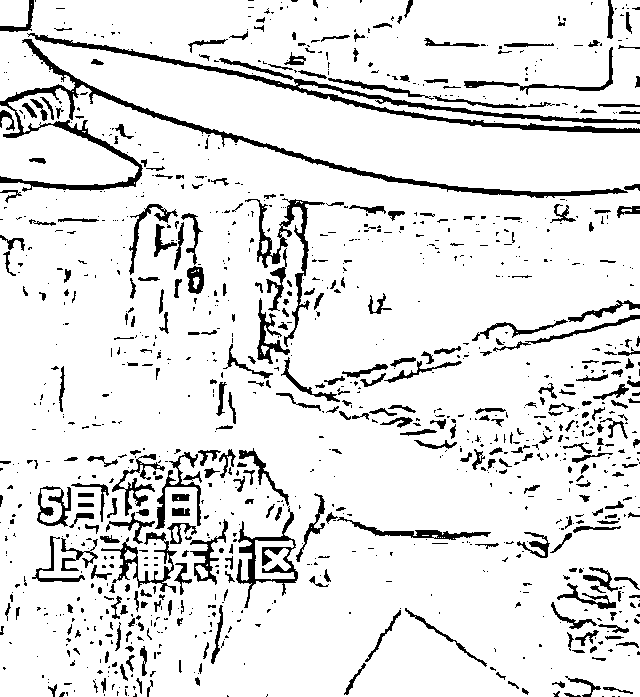

5.14 日，媒体连线该居委会工作人员，该工作人员自己也出现喉咙不适症状！目前小区地面上，多处地面还有这样的白色消毒片！至于为什么还会留存那么多消毒片在小区地面上，在于前一天小区做消杀时候留下来的，本以为当天会下雨冲散，结果没下雨，于是就出现了这样的场景！ 

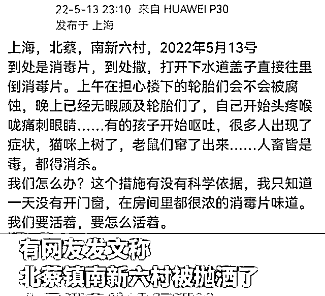

当居委会联系消防部门去处理地面的消毒片时，消防部门建议居委会寻求北蔡镇防疫办去处理此事！

媒体也联系了北蔡镇街道，该街道工作人员表示已经接到居民反映，情况也已经上报，目前也在等上级部门答复！

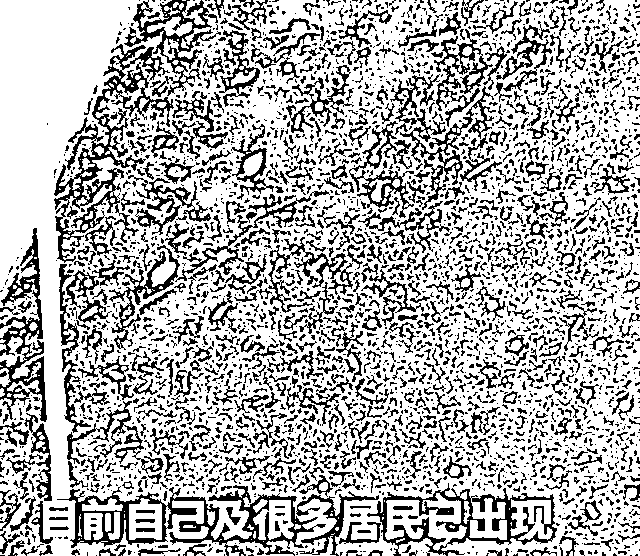

居委会工作人员表述情况

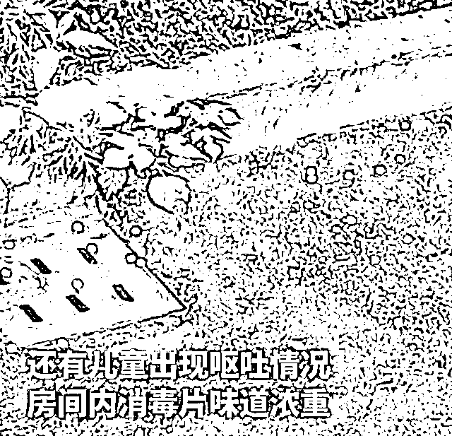

居委会工作人员表述情况

这么重要的事情，已经关乎小区所有居民的健康状况，既然已经疑似这么多消毒片对人体有副作用危害，那就应该尽早清理干净，毕竟多等一分钟，就有居民症状加重的风险出现！对此各位怎么看？

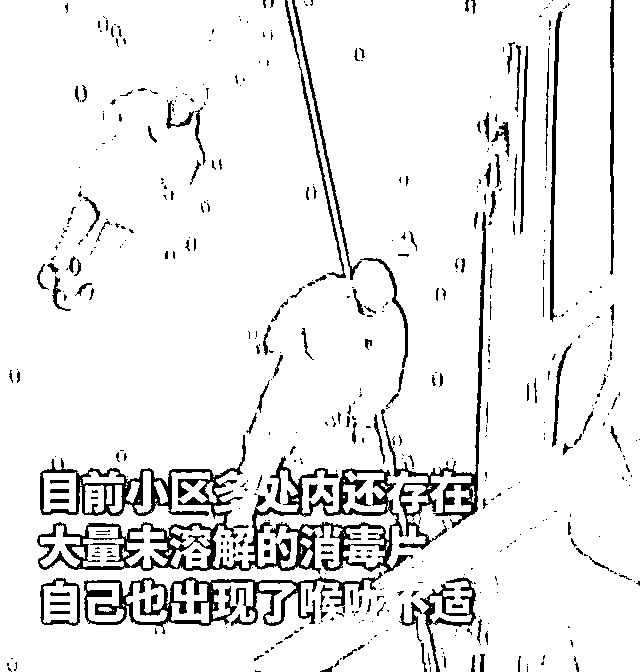

地面还有很多未溶解白色颗粒消毒片

微博网友@追逐黎明 Vitory 发布：

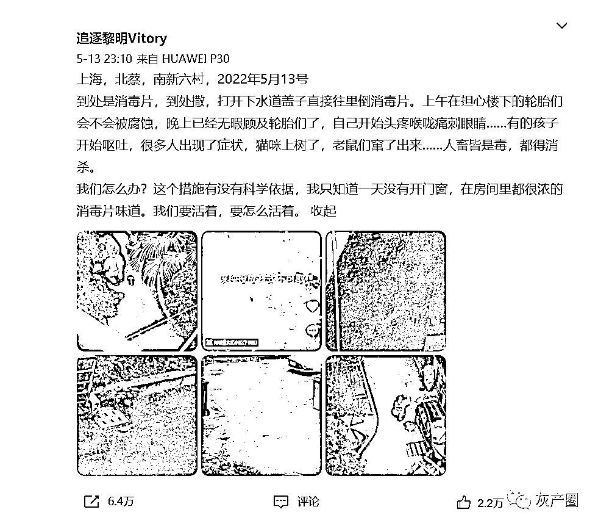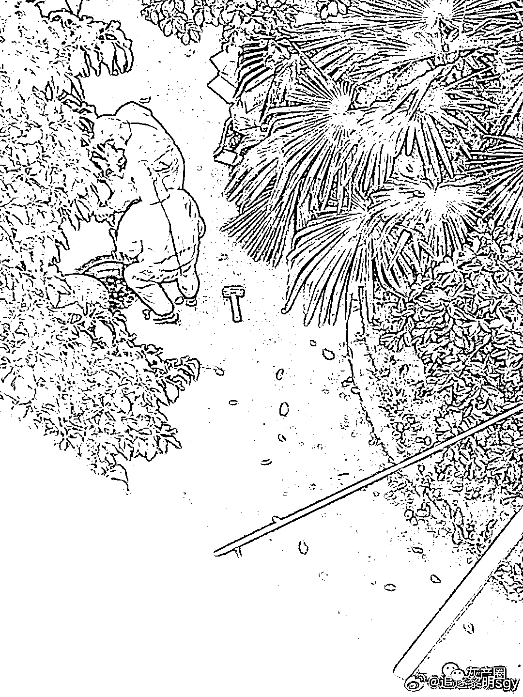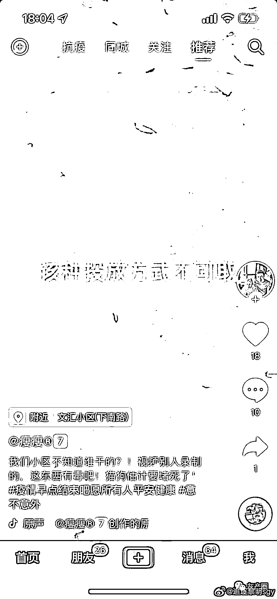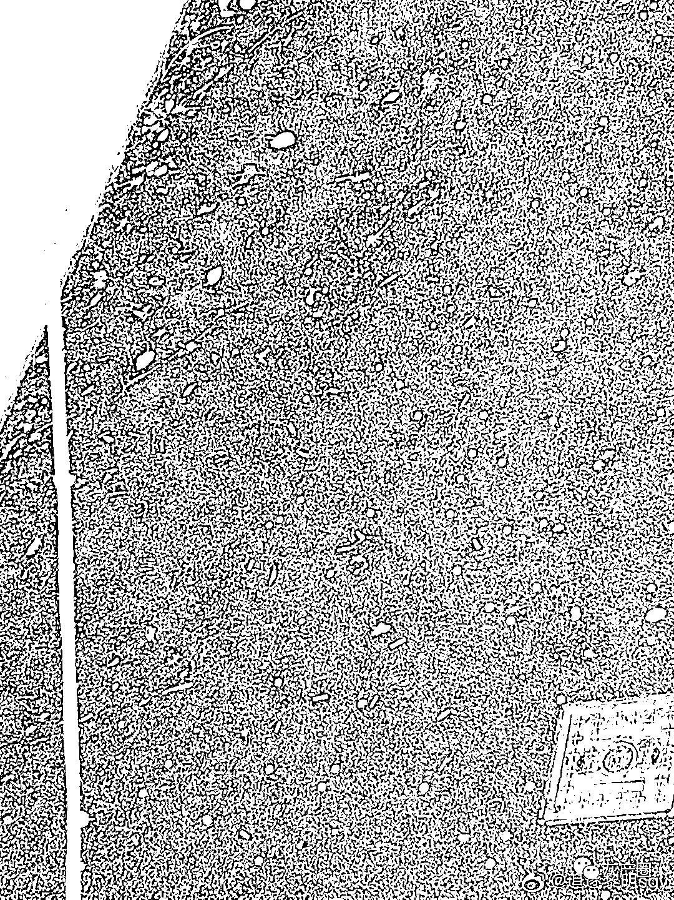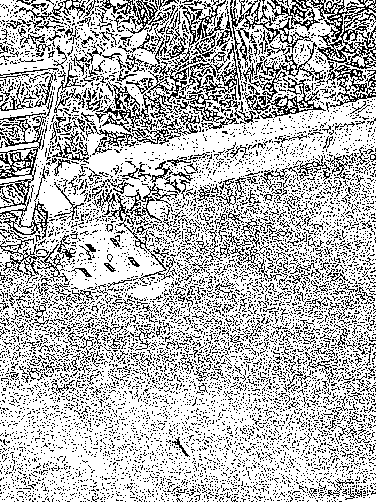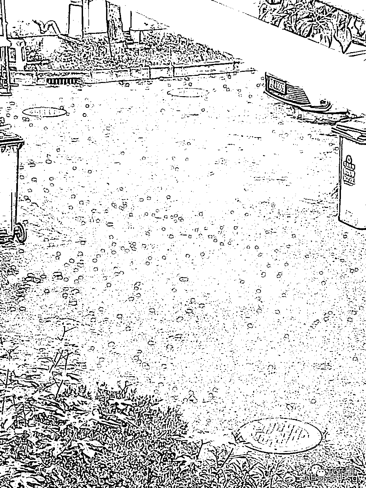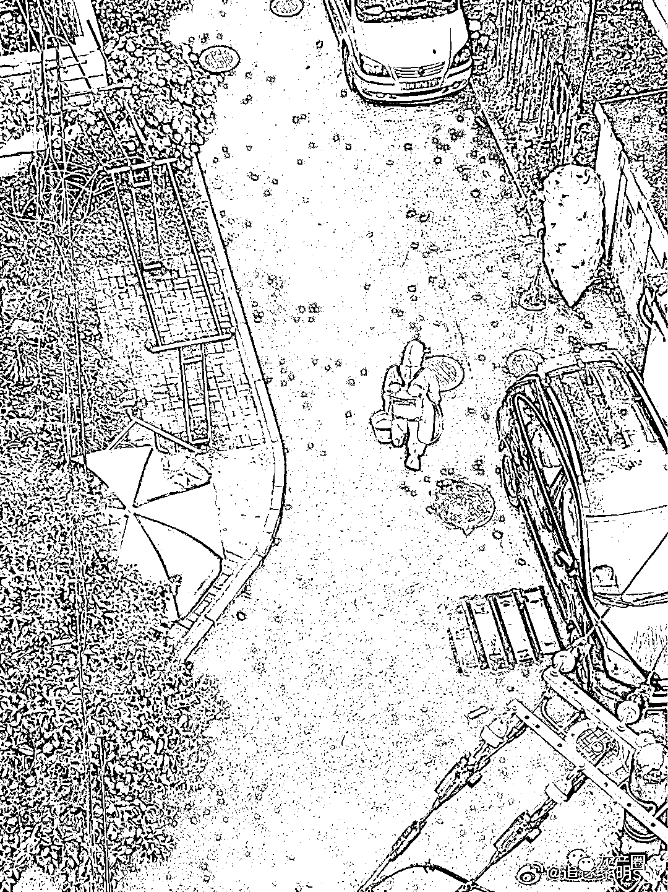

5 月 14 日，公众号北蔡家园发布通告：南新六村居民反映的问题，已责成整改。

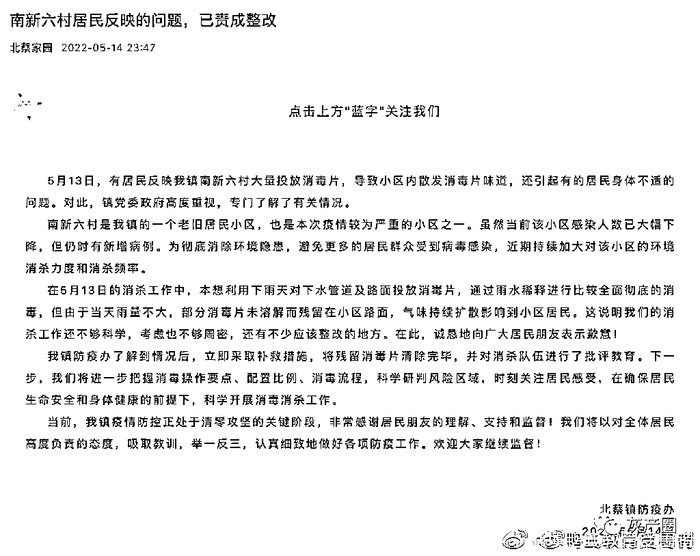    来源：微博@追逐黎明 Vitory ，八点视野

← 向右滑动与灰产圈互动交流 →

