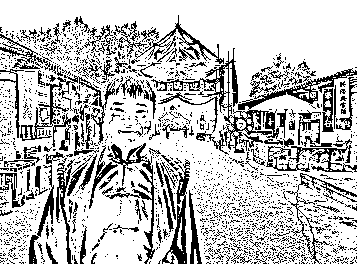
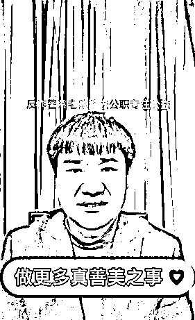
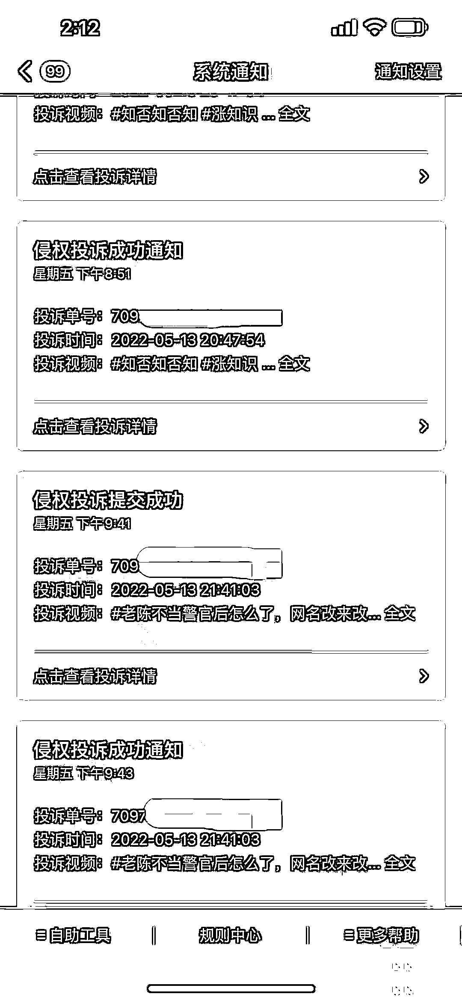
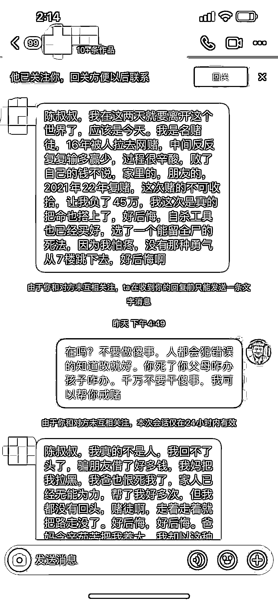

# “干什么都被骂！”前反诈民警老陈辞职后拍戏：顺便旅游散心

> 原文：[`mp.weixin.qq.com/s?__biz=MzIyMDYwMTk0Mw==&mid=2247535926&idx=4&sn=6ed71df1fd6ee064ccfa1c29266b1ac2&chksm=97cb860ea0bc0f182da235c4723cf7d5998130b625820e4b19d864a92be339479ab740a24397&scene=27#wechat_redirect`](http://mp.weixin.qq.com/s?__biz=MzIyMDYwMTk0Mw==&mid=2247535926&idx=4&sn=6ed71df1fd6ee064ccfa1c29266b1ac2&chksm=97cb860ea0bc0f182da235c4723cf7d5998130b625820e4b19d864a92be339479ab740a24397&scene=27#wechat_redirect)

因遭网暴辞职一个多月后，前反诈民警老陈没有得来想象中的清净。5 月 15 日下午，陈国平告诉潇湘晨报记者，因为网暴还在持续，最近他来到浙江金华旅游散心，并在朋友张浩导演的邀请下到横店影视城拍电影。

2021 年 9 月，因宣传“国家反诈中心”APP，“反诈警官老陈”陈国平走红网络。但与网友的支持同时到来的还有质疑与否定。今年 3 月，陈国平遇到了两次网暴，其中一次“百万打赏”引发巨大争议，即使最后他将收款记录、捐赠证书等详细展示，还是遭到不少网友质疑。因担心单位受牵连，4 月 8 日，陈国平宣布已辞去民警职务，将以个人身份继续从事公益事业。

5 月 15 日下午，陈国平告诉潇湘晨报（报料微信：xxcbbaoliao）记者，这段时间以来，他“干什么都被骂”，这让他压力很大，“我都不知道我干了什么伤天害理的事儿”。看到不少自媒体发文章和视频造谣，他统统投诉举报，但更多的时候，他不想看手机。

陈国平介绍，他的身体一直不太好，“严重透支，很多病：风湿、颈椎问题，还有眼睛、嗓子都不行。”即使如此，有时间他还是会回复一些必要的信息。5 月 14 日，一名广西梧州 27 岁的网友给陈国平留言，称自己多年前被人带入网赌，反复赌博负债 45 万，对不起朋友和家人，想要结束自己的生命。

看到网友的消息，陈国平急忙劝对方不要做傻事，“人在就有很多机会”，他还说自己在外旅游散心，和对方一样压力也不小，希望对方能等到他回去后好好聊聊。陈国平称，以前他有过连麦直播劝慰网友的类似经历，见到这位网友没有回复，15 日下午，他又给对方发了条消息，十分担心对方的情况，但暂未收到回复。

“我干什么都被骂，所以就不能在乎别人说什么了，越想得到好的口碑越不会得到。自己对得起良心得了。”陈国平称，5 月 10 日，他收到朋友张浩导演的邀请来到浙江横店影视城拍电影，顺便旅游散心，因为戏份不多，空闲时间他还会到附近逛逛，接下来他希望能做自己喜欢的事，不去在意别人的想法。

**此前报道：**

**[反诈老陈称被网暴逼着辞职](http://mp.weixin.qq.com/s?__biz=MzIyMDYwMTk0Mw==&mid=2247534387&idx=3&sn=0eeec84498ae359987b979e05498603d&chksm=97cb8c0ba0bc051d01f79813f8e6e2f963ee9748b0f52b60861e54db6db2f01a00ec8ce5cddc&scene=21#wechat_redirect)**

**[交警小哥也来宣传 APP，"西厂公公"忙坏了](http://mp.weixin.qq.com/s?__biz=MzIyMDYwMTk0Mw==&mid=2247520439&idx=2&sn=23ab5b73fc4ac3f3335c5a3783cc1ef8&chksm=97cb5b8fa0bcd299cad251179fde3a2cddb67f659492e010a6306e3b72238c2ccd1fbb7f9be2&scene=21#wechat_redirect)**

**[在柬中国网红小 6 被疑电诈分子，与反诈警官老陈连线诉说被网暴。](http://mp.weixin.qq.com/s?__biz=MzIyMDYwMTk0Mw==&mid=2247532139&idx=3&sn=1318ca03d89bfca9f757e0e812562b61&chksm=97cbb553a0bc3c45dee4c526f4d4bdd5c7e434dfbe01e255fdd2f0d293e0e2596720c0ac5def&scene=21#wechat_redirect)**

来源：潇湘晨报 记者： 蒋紫雯

← 向右滑动与灰产圈互动交流 →

