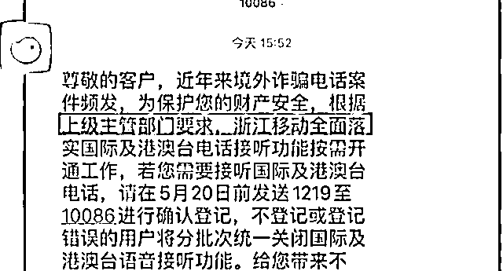
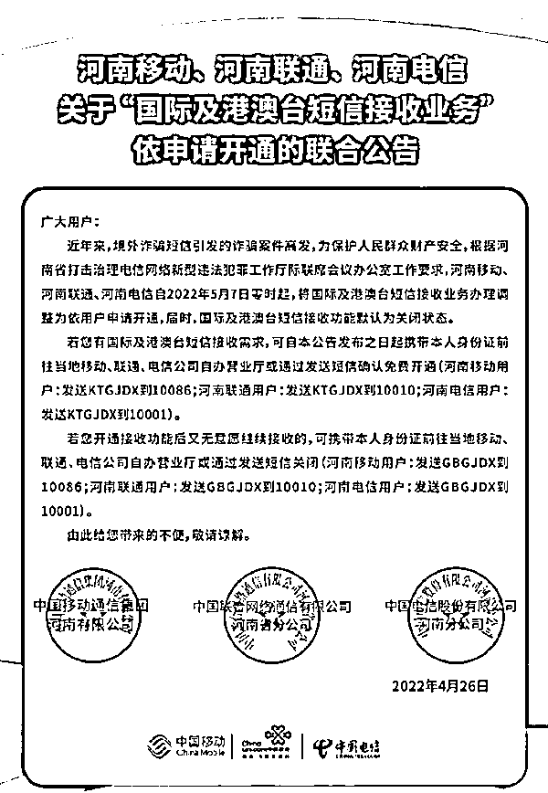

# 浙江移动回应默认关闭接听国际及港澳台电话：属实

> 原文：[`mp.weixin.qq.com/s?__biz=MzIyMDYwMTk0Mw==&mid=2247535926&idx=8&sn=231ca14a174b1f75e6c5dc476253011b&chksm=97cb860ea0bc0f187768114ca09ca0f248ccf4c782a13c02a94868a4e9a721ff2f8b089c8039&scene=27#wechat_redirect`](http://mp.weixin.qq.com/s?__biz=MzIyMDYwMTk0Mw==&mid=2247535926&idx=8&sn=231ca14a174b1f75e6c5dc476253011b&chksm=97cb860ea0bc0f187768114ca09ca0f248ccf4c782a13c02a94868a4e9a721ff2f8b089c8039&scene=27#wechat_redirect)

据蓝鲸财经，近日，有网友反映收到了来自中国移动浙江的一则短信，短信内容显示，根据上级主管部门要求，为防范境外电话诈骗，保护客户财产安全，浙江移动将默认关闭接听国际及港澳台电话。

图片来源：蓝鲸财经视频截图

中国移动浙江相关负责人回应称，此事属实，公司正通过短信形式分批次通知客户。若用户需要接听国际及港澳台电话，需发送 1219 至 10086 进行确认登记。

**全国多省已关闭国际短信接收** 

据上游新闻，目前全国已有多家省市实施这项操作。

日前，河南移动、河南联通、河南电信发布公告，自 5 月 7 日已将国际及港澳台短信接收功能默认为关闭状态。

公告指出，因境外诈骗短信案件高发，根据河南省打击治理电信网络新型违法犯罪工作厅际联席会议办公室工作要求，为保护人民群众财产安全，2022 年 5 月 7 日零时起，将国际及港澳台短信接收业务办理调整为依用户申请开通，届时，国际及港澳台短信接收功能默认为关闭状态。

对于有国际及港澳台短信接收需求的河南省用户，可携带本人身份证前往当地移动、联通、电信公司自办营业厅或通过发送短信确认免费开通。

3 月 22 日工信微报报道，江西电信、江西移动、江西联通发布联合公告，为严控境外诈骗短信，自 3 月 28 日起，江西省内用户国际及港澳台短信接收业务调整为依用户申请开通。

此外，辽宁自 2022 年 1 月 25 日零时起实施关闭国际及港澳台短信接收功能；贵州已于 2021 年 11 月 27 日零时实施；浙江已于 2021 年 8 月 10 日零时起实施。

有报道称，上述几个省份只是试点，未来关闭国际及港澳台短信接收功能或扩大至全国。5 月 9 日，上游新闻记者致电工业和信息化部公共服务电话咨询，工作人员表示，目前尚未登记有上述相关信息和计划安排的通知。

记者又致电重庆市通信管理局，询问重庆是否对三大运营商有类似安排。一位工作人员表示，通信管理局并未有相关工作安排，建议用户直接致电所属运营商询问。

上游新闻记者随后又拨打了重庆联通、重庆电信和重庆移动的客服电话，三大运营商的客服均表示没有收到关闭国际短信业务的通知。当记者询问用户是否可以申请关闭国际短信接收业务功能时，重庆联通的客服表示，会把该问题记录下来，再由相关工作人员联系处理。重庆电信和重庆移动的客服均表示，国际短信接收与国内短信接收是整体化业务，无法为用户单独关闭国际短信接收业务，建议用户安装垃圾短信屏蔽软件来过滤垃圾短信。

**诈骗犯罪团伙大量盘踞在国外** 

据新华日报，随着打击力度持续加大，电诈犯罪在国内生存空间被大大挤压，不少诈骗犯罪团伙已经转移到境外。

“目前江苏警方办理的案件中，有近 80%的电信诈骗团伙盘桓在东南亚国家，他们通过企业化运作、分散多国网络化管理实施诈骗，其中以投资类的居多。”省反诈中心民警告诉记者，诈骗分子可以将犯罪集团“行政部”“财务部”设在菲律宾，“客服部”“风控部”设在泰国等地，“市场部”“技术部”设在老挝等地，网站、数据库的服务器放在美国等地。他们对境内被害人实施诈骗后，就将被骗资金通过“地下钱庄”非法掌握的众多资金账户迅速转移、提取。

这种变化，进一步加大了警方打击的难度和成本。“受诸多客观因素限制，公安机关在境外通过警务合作或司法协作等方式取证，执法难度极大。”省反诈中心民警说，要想抓到诈骗团伙的头目和首要分子更是难上加难，很难一网打尽。“2019 年，蒙古国警方将抓获的 700 多名中国籍电信诈骗犯罪嫌疑人移交我国警方，由江苏公安机关立案管辖、侦办，我们查办下来，基本上都是团伙里最底层的‘马仔’，中层的都很少，头目一个都没有。”他坦言，这种情况现在依然很难破解。

来源：每日经济新闻，蓝鲸财经

← 向右滑动与灰产圈互动交流 →

