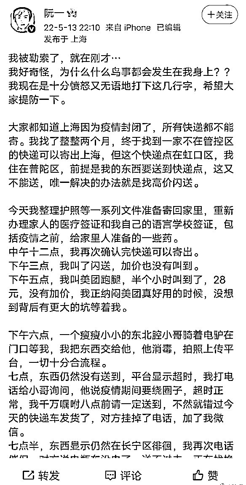
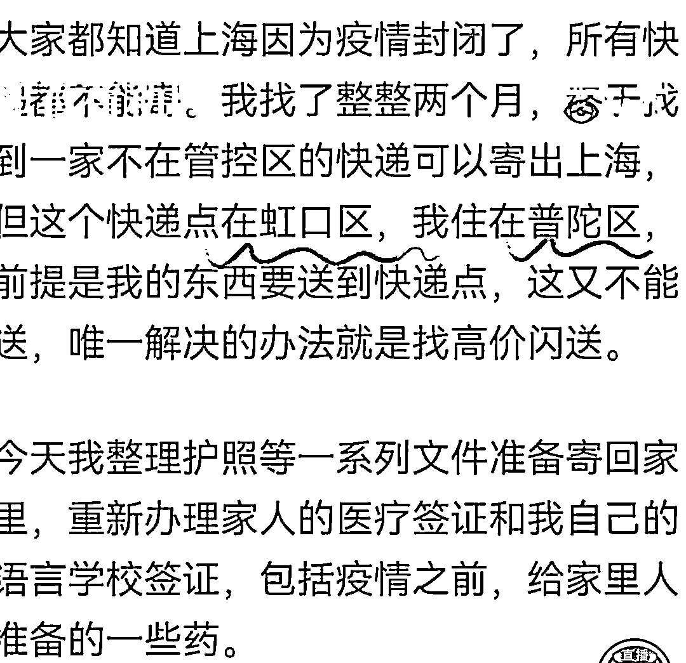
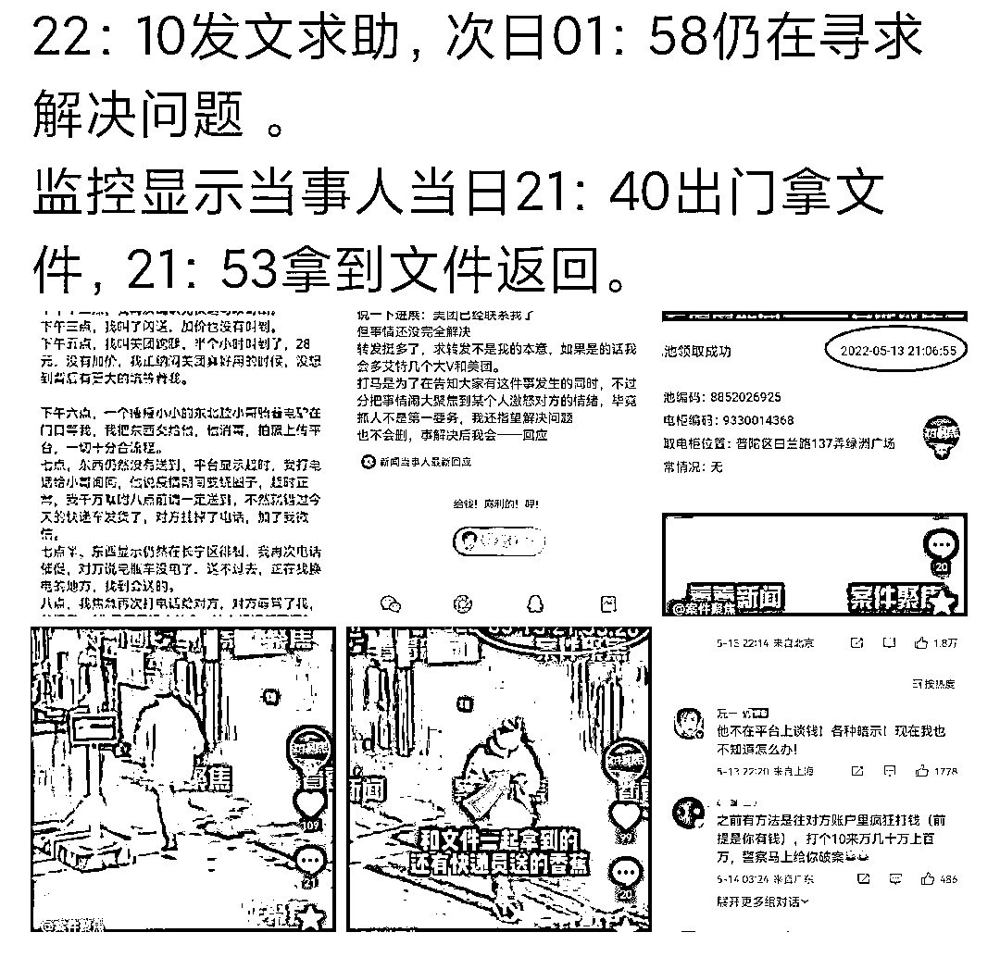

# 反转！博主“阮一”造谣卖惨称自己被跑腿小哥勒索？还好有监控！

> 原文：[`mp.weixin.qq.com/s?__biz=MzIyMDYwMTk0Mw==&mid=2247535969&idx=4&sn=5392a202a02b0caa7bb453ccd386accc&chksm=97cb8659a0bc0f4f1e3eb7a6694dc4e9ec516c0876f60c15d33bdaf580beb9bc1c1f5cab9120&scene=27#wechat_redirect`](http://mp.weixin.qq.com/s?__biz=MzIyMDYwMTk0Mw==&mid=2247535969&idx=4&sn=5392a202a02b0caa7bb453ccd386accc&chksm=97cb8659a0bc0f4f1e3eb7a6694dc4e9ec516c0876f60c15d33bdaf580beb9bc1c1f5cab9120&scene=27#wechat_redirect)

前两天，上海基本上还都是“静默”状态

然后在网上冒出来一个

所谓的“叫跑腿送重要文件后被勒索”的事

引起轩然大波！

一个微博名叫**@阮一**的博主

在**5 月 13 日晚上 10 点左右**发了一篇小作文

声称自己**被一个跑腿小哥勒索**

疫情防控... 跑腿... 被勒索...

多重影响下，此事迅速在网上发酵

阮一的文章引发了网友们的同情

事件中出现的跑腿小哥瞬间成为众矢之的

遭受到了网友们的激烈指责

然而到了阮一发文的第二天

也就是 5 月 14 日

美团和警方就此事发布了通报：

**跑腿小哥既没有所谓的勒索**

**也没有所谓的克扣了他的重要文件**

**而是在当天晚上九点（阮一发长文前）**

**就将文件送到了阮一手上**

可以说是

和阮一之前发的小作文大相径庭

看完这个故事，只想感叹一句：

这年头喜欢造谣的巨婴可真多

视频 2 分半 ⬇️

[`mp.weixin.qq.com/mp/readtemplate?t=pages/video_player_tmpl&action=mpvideo&auto=0&vid=wxv_2400720048853254145`](https://mp.weixin.qq.com/mp/readtemplate?t=pages/video_player_tmpl&action=mpvideo&auto=0&vid=wxv_2400720048853254145)

视频来自：上海电视台案件聚焦

**发文称被勒索，真相查明秒打脸  **

事情还得从 5 月 13 日的晚上说起

晚上 10 点 10 分时

@阮一 在微博上发了条超长文

控诉他在使用美团跑腿时的不愉快经历

原文超长，总结一下就是：

他要从普陀区

送一份重要文件去虹口区的快递点

**文件需要在八点前送达**

然而因为特殊时期的缘故

直到下午五点才有小哥接单

**下午六点**跑腿小哥成功取到了他的文件

然而文件并没有如他所愿的及时送到

据阮一文中所说，跑腿小哥不仅超时

而且还以电瓶车没电了为由

**擅自取消了订单**

在他爆出的聊天记录中，阮一表示

跑腿小哥在取消订单后

他要求他把文件送回，他叫别人送

**但跑腿小哥不但不愿意将文件送回**

**还向他暗示要加钱才退回**

**否则就将文件扔掉**

阮一在长文中，痛诉跑腿小哥的行为

并将自己描述得非常惨

文件没有准时送出去，也拿不回来

自己甚至还被跑腿小哥勒索

还在长文中称

**他现在****已经联络不到跑腿小哥了**

**文件也没有要回来**

希望网友们能够替他主持公道

这篇微博长文被传开之后，不得了！

他的遭遇，被同情！

跑腿小哥的无耻行为，被指责！

**然而事件仅仅是过了一天就反转**

美团与警方在事件发生后

就联系了当事人跑腿小哥

并在跑腿小哥那里得知了事件的全貌

跑腿小哥表示，当时的情况是

**他手上不止阮一一个人的单子要送**

**因此要在 8 点前送到快递点实在不可能**

加上电瓶车突然没电

他只能取消订单

至于暗示收费这点，跑腿小哥也承认的

他认为眼下上海疫情

大家都要吃饭的，都不容易

他这一晚上为阮一跑来跑去

也多少**希望他能帮他出点运费**

但没有说具体的数额

而当时阮一也是同意多给运费的

只是跑腿小哥表示

**他并没有从阮一这收到过一分钱**

也就是说

**阮一文中的“多次发红包稳住对方”这点**

**其实是谎言**

阮一撒的谎也不止这一个

跑腿小哥其实也没有勒索他

所谓的威胁把文件丢水沟

也只是希望不要再催促

**如果是脾气差的快递员**

**可能就真的一气之下把文件丢了**

**并不是像阮一想的那种**

**“如果不给钱，就把文件撕了”**

如果前面这话

可以说是阮一情急之中理解错小哥的意思

那下面的这个就纯属造谣了

跑腿小哥表示

**当天的晚上九点**，他成功给电瓶车充好电

**于是在当天晚上**

**就把文件送还到了阮一的手中**

**不仅如此，还送了他一根香蕉**

而且这一幕在监控里是可以看到的

的确是铁证如山的

然而在**拿到文件的 20 分钟后**

阮一却在微博发了那篇引人同情的小作文

声称自己受到了勒索

重要文件被跑腿小哥扣下

现在的人

真是造谣都不打草稿了？

**事情反转之后，评论也反转 **

真相水落石出后

网友们立马调转矛头对准阮一

纷纷指责他的造谣行为

希望警方能够严惩

阮一本人也是厚脸皮到了极点

在铁证面前还在为自己的行为做辩解

甚至连夜发了两篇长文

表示自己当时气昏了头

但对自己造谣煽动网友去网暴跑腿小哥的事

只字不提

总结一下就是这八个字：

**我有错，但没有犯罪。**

看到这句话，想起罗翔老师的这段话：

**“法律只是对人最低的道德要求”**

随着“阮一事件”的扩散

越来越多的人挖出了阮一的各种黑料...

其中就有他小区的人表示

**阮一平时就会在微博上造谣**

**称自己在抗疫期间受到了不公的对待**

以此来博取流量、哗众取宠

事后

阮一也曾经因为心虚而销号跑路

而眼下账号又回来了

最好笑的是

他前一秒收了跑腿小哥送的香蕉

后一秒就在网上造谣跑腿小哥

在眼下这种特殊时期里

在网上造谣、煽动这样的负面情绪

博取眼球，浪费公共资源

实在是可恶！

大快人心的是

网传阮一已经被公安机关带走

希望能给予阮一应有的惩罚！

来源：看看新闻 KNEWS、上海电视台案件聚焦、脊梁 in 上海 SH

← 向右滑动与灰产圈互动交流 →

