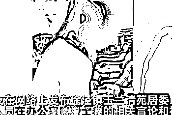
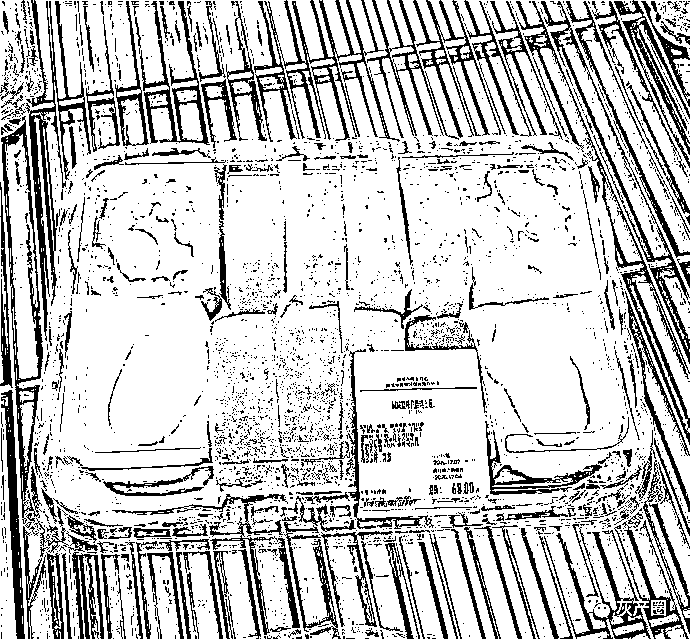
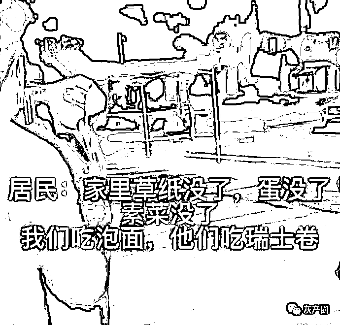
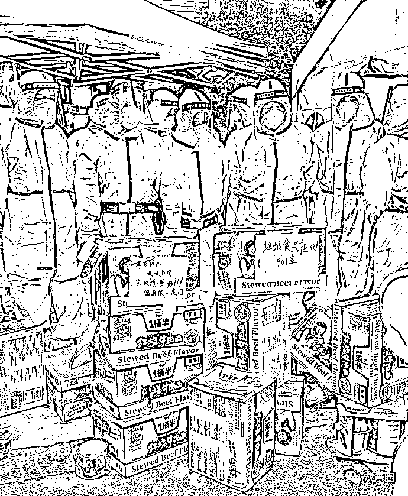
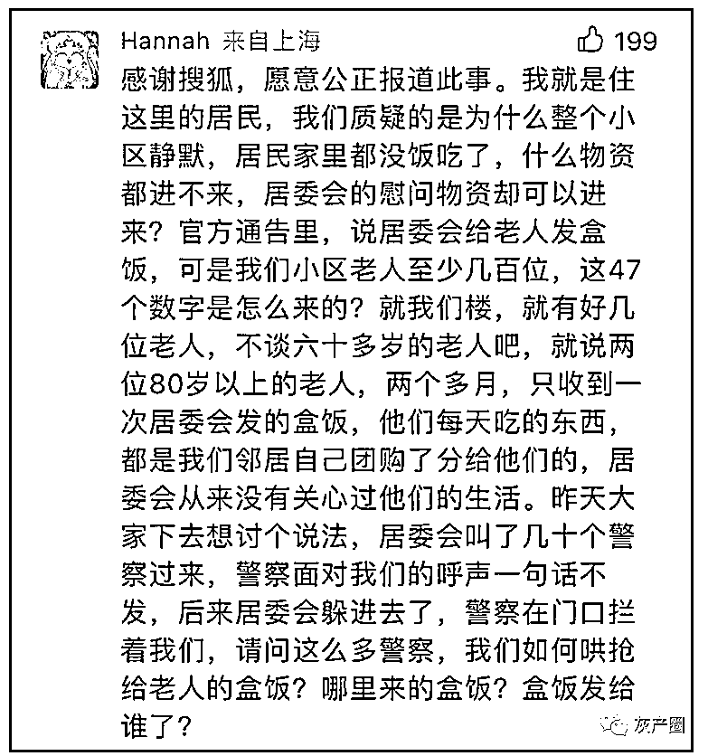
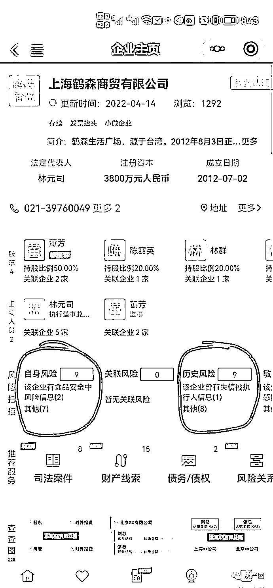
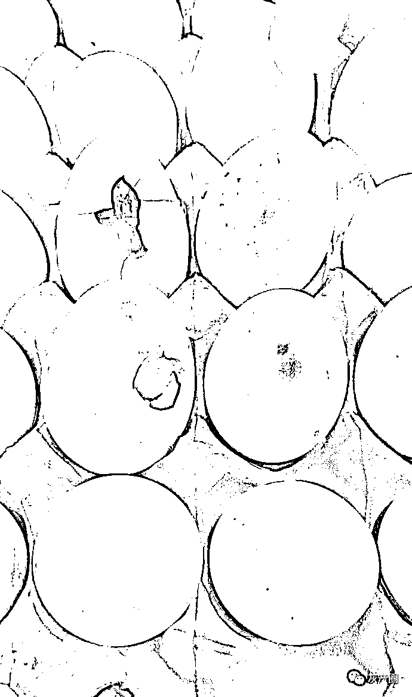
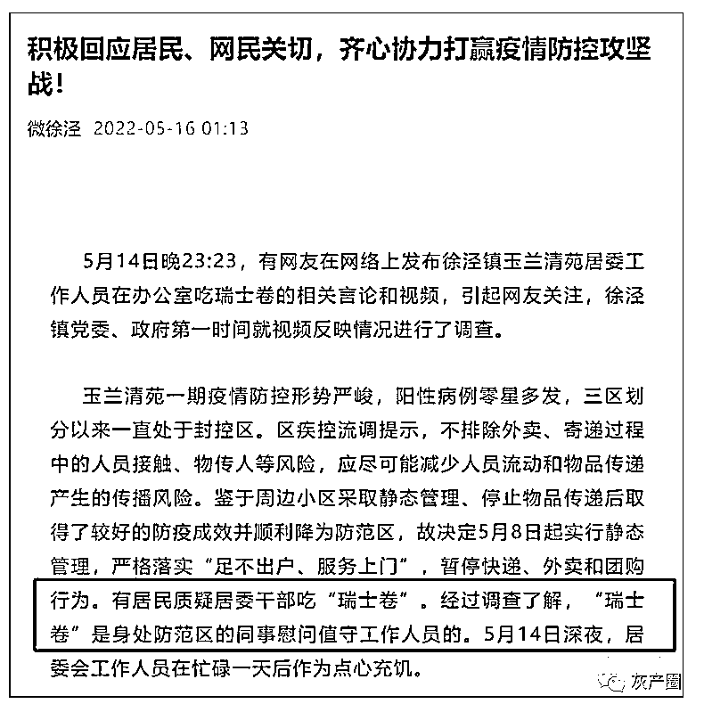
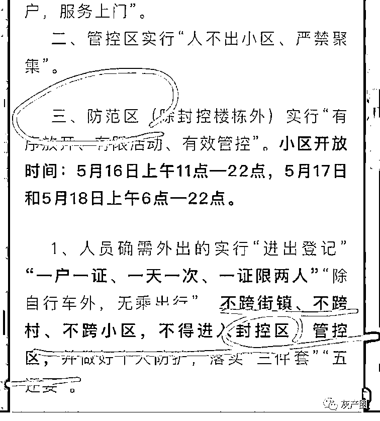

# 上海瑞士卷事件后续，居委被洗白，居民成刁民，网友：要的是公平

> 原文：[`mp.weixin.qq.com/s?__biz=MzIyMDYwMTk0Mw==&mid=2247536024&idx=1&sn=3cd2b966af615e3460b86df91137a768&chksm=97cb86a0a0bc0fb6a892ba81302337f012823dea76c3089a9d5e8a8d68f5a4e16c15ea1ddd4e&scene=27#wechat_redirect`](http://mp.weixin.qq.com/s?__biz=MzIyMDYwMTk0Mw==&mid=2247536024&idx=1&sn=3cd2b966af615e3460b86df91137a768&chksm=97cb86a0a0bc0fb6a892ba81302337f012823dea76c3089a9d5e8a8d68f5a4e16c15ea1ddd4e&scene=27#wechat_redirect)

近日，上海一静默小区居委办公室吃瑞士卷事件饱受热议（此前报道:[居民挨饿没东西吃，居委会却能吃到山姆瑞士卷？网友：不患寡而患不均](http://mp.weixin.qq.com/s?__biz=MzIyMDYwMTk0Mw==&mid=2247535969&idx=1&sn=1d856e1f42cb0e27ab4120b3336821cd&chksm=97cb8659a0bc0f4fe62a33e72930f50eb160ae383abdf9c51f716058dd2ae5b6c74b5f04a3fa&scene=21#wechat_redirect)），有替居委鸣不平的，有替居民感同身受的，小编也谈谈我的想法。

### **事件始末**

先介绍下事情始末，网传 5 月 6 日该封控小区实行静默。

14 日深夜居民去居委求助，正巧撞见工作人员在吃瑞士卷，尤其是工作人员把瑞士卷藏起来的动作，很让人生疑！

<mpvideosnap class="js_uneditable custom_select_card channels_iframe videosnap_video_iframe" data-pluginname="videosnap" data-id="export/UzFfAgtgekIEAQAAAAAANIkWCTu9FgAAAAstQy6ubaLX4KHWvLEZgBPEoKMkT2M0T9eDzNPgMIsRFwPIvP-Ft5vRNcuMFMEs" data-url="https://findermp.video.qq.com/251/20304/stodownload?encfilekey=S7s6ianIic0ia4PicKJSfB8EjyjpQibPUAXolCktXSf5mSVzxRvibglMNeAMazXb9Zfm0CAJPz9lZ1N5A8IUngfH4myic6q2NaRWdtL2IvFe7CAHnqlic17cBqC1QA&amp;adaptivelytrans=0&amp;bizid=1023&amp;dotrans=0&amp;hy=SH&amp;idx=1&amp;m=&amp;scene=0&amp;token=AxricY7RBHdXF3icrMFlV8C7sPLrpDyAGCRrKZt1tdnic97TWibSsy7SCHkYfDibNH3W4qsIrK5wJwmE" data-headimgurl="http://wx.qlogo.cn/finderhead/ibq4aVwOt6HNqrr8OD3sCviaytF3B8TqCwHicxsuIanAJo/0" data-username="v2_060000231003b20faec8c6e48a1acbd3ce04ef33b077a1e41d0d3794ed88ea537878dbe65910@finder" data-nickname="灰产圈+" data-desc="这就是我们的好居委~好书记！居民挨饿没东西吃，物资发泡面，她们晚上躲在办公室里吃山姆瑞士卷。这就是青浦徐泾玉兰清苑一期龙联路 58 弄，居委干部干出来的好事！怎么招也要给你上个热搜吧！想出名还不简单嘛！大家帮她们一把" data-nonceid="600516144421802215" data-type="video" data-width="1080" data-height="1904"></mpvideosnap>

提一句，山姆的瑞士卷 68 元 12 个，冷藏保持，保质期 3 天。

网传当晚，居民就在楼前与工作人员理论：我们吃泡面？你们吃瑞士卷？要给一两岁的孩子、卧床的老年人，都吃泡面吗？

15 日，网传视频显示，居民把居委发的泡面扔在了小区门口，并喊话“**我们要同款瑞士卷！我们要吃饭！**”

网传图片中，防疫人员站在一箱箱泡面后面，泡面上的字条写着：“垃圾食品拒收！”；“家有幼儿嗷嗷待哺，需换肉蛋奶！”

### **部分居民成刁民**

通报显示部分居民在看到居委专门给老年人分发的盒饭时进行了哄抢？

某网友爆料称“因 200 块跑腿费被网爆自杀的女子父亲就在该小区，起因恰好是因为居委无法提供盒饭”。

对此，有疑似该小区网友也做出了说明：

还有疑似该小区的网友配图称“静默期间唯独物业作为法人的一亩秋田可以卸货到小区，并在静默期配送，前期该公司菜价高，后期菜品低劣”。

菜品如何低质？也有网友跟帖配图称“鸡蛋都发霉了！”

### **后续一**

16 日，官方做出回应：瑞士卷是防范区同事慰问封控区同事的。

但是有网友发出疑问，防范区是怎么进入封控区的，防疫规定，防范区不得进入封控区。

对此，有网友回应防范区人不能进，东西可以进，做好消毒工作就好，问题不是瑞士卷比泡面高级，而是居委能团瑞士卷，居民不能团购？

也有网友表示，工作人员比较辛苦，累了一天吃点点心充饥不行吗？

注意，这是在偷换概念，居委工作辛苦，防疫人员不是更辛苦，为什么只有居委有瑞士卷呢？再说，这是本职工作，是本分。

居民要的不是瑞士卷，而是公平！

公则四通八达，私则一偏而隅，瑞士卷不是关键，多辛苦也是说辞，居民想要的只是公平！

### **后续二**

有网友称拍视频的居民被拘留 5 天，具体消息是否属实还没得到官方回复。

### **结语**

大家有没有发现，上海这次，发声的频率特别高，比如入户消杀，可能在别的城市不算问题，轮到上海，就变得挑剔起来了？

其实原因是上海市民的权力意识高，经济越发达的地方，权力意识越高，上海市民敢发声，勇于守住自己的权利，从这种角度讲，上海人值得佩服！

来源：iitm，实测 作者：TKCPMALL

← 向右滑动与灰产圈互动交流 →

