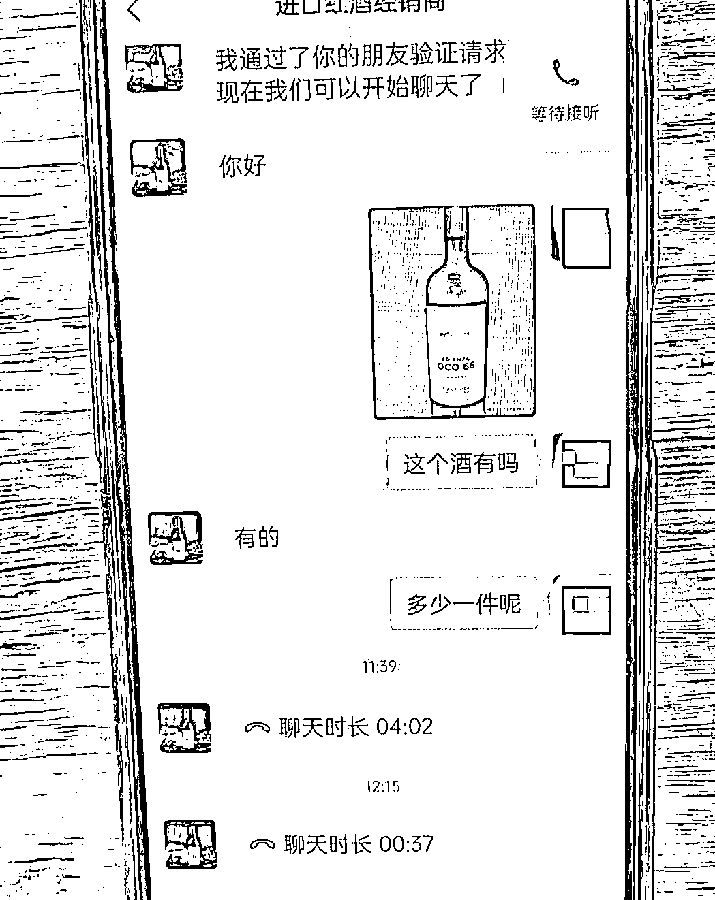
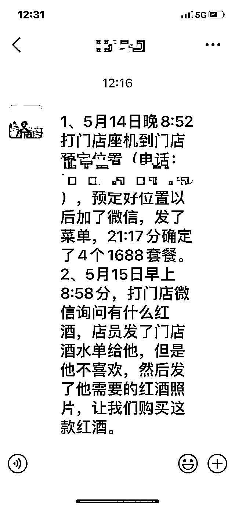
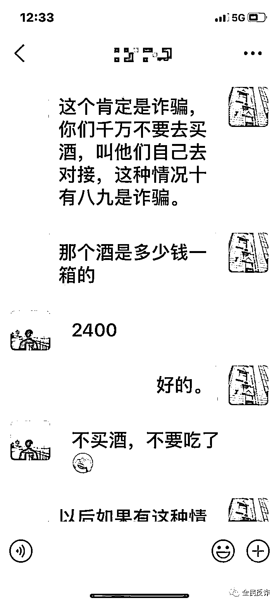
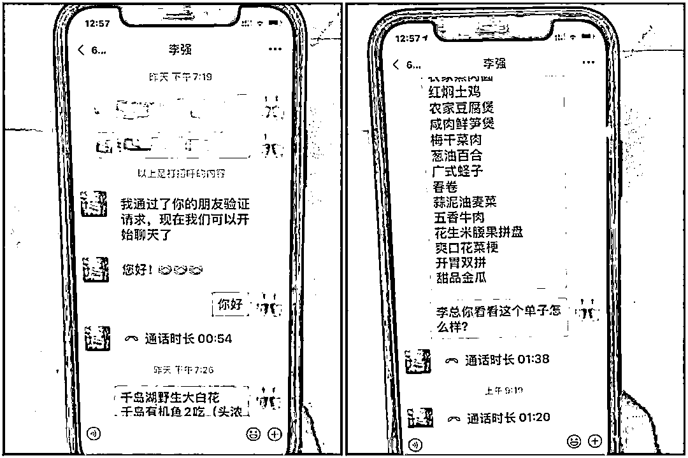
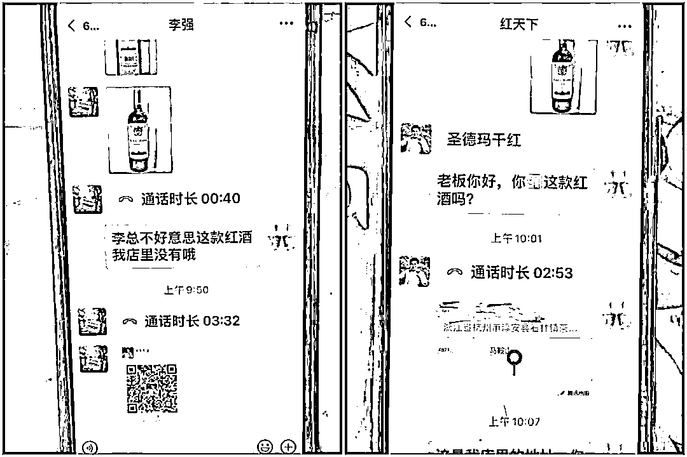
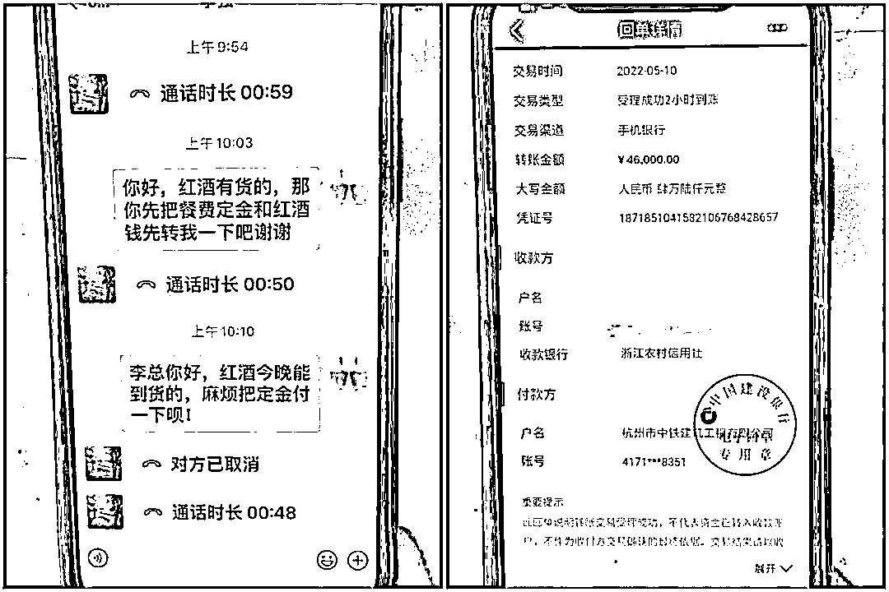
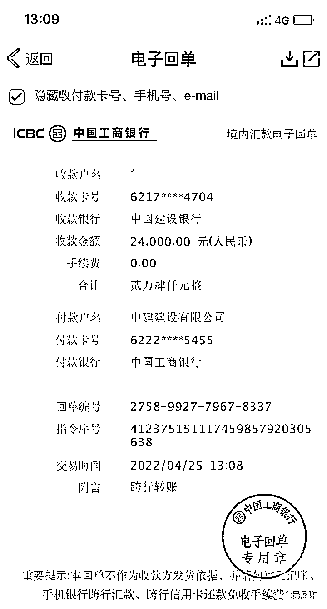

# OCO66 有吗？酒店盼来了大订单，客户点名要喝一款红酒，真相来了！

> 原文：[`mp.weixin.qq.com/s?__biz=MzIyMDYwMTk0Mw==&mid=2247536024&idx=2&sn=49cf5a69100adae32813bafa1950c1e6&chksm=97cb86a0a0bc0fb642f5da072cab396e4f1962c5db82033cefabaa923a2b9b61415a0a3fb1ef&scene=27#wechat_redirect`](http://mp.weixin.qq.com/s?__biz=MzIyMDYwMTk0Mw==&mid=2247536024&idx=2&sn=49cf5a69100adae32813bafa1950c1e6&chksm=97cb86a0a0bc0fb642f5da072cab396e4f1962c5db82033cefabaa923a2b9b61415a0a3fb1ef&scene=27#wechat_redirect)

前几天，杭州滨江某酒店王经理接到一个客户的订餐电话。

客户自报家门是某事业单位的负责人。客户先问了问菜品和环境，然后表示自己需要定 4 桌，每桌餐标 1688 元的套餐。

王经理热情招呼，加了微信。对方在微信上对酒店其他服务都很满意，但提了一个小要求：用餐的客户比较特殊，所以需要提前准备好一款指定品牌的进口红酒，这是决定是否会最终下单的关键。

王经理一看，这款红酒的品牌，确实自家并没有。不想错失订单的王经理还是找人托关系，想问问看有没有货源。问了一圈，都没人说起进过这个牌子的红酒。

第二天早上，客户又打电话来了，问王经理红酒能否安排。王经理真尴尬，只好说这款酒太冷门了，确实进不到货。

客户听起来有些恼怒，不过并没有把话说死，而是“好心”向王经理推荐了一位供应商，说你实在找不到，可以从这个供应商那里进货。

王经理蛮高兴，感谢对方帮忙解决了“燃眉之急”。

就这样，王经理按照客户张某的推荐，添加供货商微信，询得这种红酒一箱售价为 2400 元。

王经理和订餐的客户进行二次确认，还催王经理尽快下单。

这样的大客户，王经理不想有丝毫怠慢。准备订购时，毕竟不是一笔小钱，王经理有点犹豫了，就截了几张聊天记录截图，发给社区辅警詹伟问问情况。

“这是诈骗”，詹伟在电话里，跟王经理解释了这类诈骗的套路。

无独有偶，淳安县做民宿生意的张老板近日也遭遇到了同样的骗局。

5 月 9 日晚，一名自称是中铁建筑公司的“李总”打来了电话，称因公司做建筑工程会在石林镇待一段时间，听说张老板家菜烧得好，准备在他家店里预订工作餐：10 人一桌，每天 3 桌，每桌 1000 元的标准。

张老板当然高兴，“建筑工程没有那么快结束，这可是一个好几万的大单子。”张老板和这位“李总”互加微信，李总很爽快地就敲定了菜单，只是在酒水方面提出了一个要求：他们的领导只喜欢喝一款红酒，让张先生准备好。

李总还发来了那款红酒照片，张老板看了之后，表示店里没有这款红酒。

李总便“好心”地推送了他们单位日常采购红酒供应商的微信，让张老板自己联系供应商采购。 

张老板联系上了“红酒供应商”，对方表示要先付款才能配送。

张老板跟李总说，红酒今晚就能到货，希望李总先把定金和酒钱支付。李总很爽快就答应了，说会把 46000 元餐费定金和酒钱一起“转账”过去，过了会，在微信上把转账电子回执发了过来。

但半个小时过去，张老板见钱迟迟没有到账，而李总和红酒供应商一直催他转账。他有点吃不准，向石林派出所打电话求助，“这是诈骗”，民警这么一说，张老板松口气。

**如果真的订了酒，会怎样？** 

上述两家店幸亏在临门一脚前停下了，如果他们真的去订了酒，会怎样？拿沈阳李女士的遭遇来说吧。

李女士是沈阳一家中等级餐厅的老板，前段时间因为疫情，沈阳餐饮也关门了一段时间，4 月 25 日，是允许饭店堂食的第一天。

当天下午，她接到了一个订餐电话，对方称是某大型企业的工作人员，准备在她的店里预定 3 桌酒席，每桌预计消费 1500 元。 

开门第一天就接到大订单，真是大吉大利！于是她添加了对方微信……

这位客人提出，他们只喝某品牌的干红葡萄酒，但是李女士的店里并没有这种酒，对方向李女士推荐了一个经销商，大方地"预付"了 24000 元，并把付款截图发给了李女士。

李女士见迟迟没有收到入账信息问对方，对方说，可能是银行系统的延时到账导致。

为了这笔大买卖不跑单，李女士马上添加了“红酒经销商”的微信……

李女士加了经销商微信后，客人指定的那款红酒原价每箱 2400 元，经过几翻讨价还价，最后以每箱 2000 元的价格，李女士订了 10 箱。 

这样一算下来，李女士每箱还赚了 400 元差价。

红酒经营商要求付全款，李女士起先也不放心，提出：先预付 9600 元，余款要等收到酒之后付清。

李女士刚转完 9600 元，订餐的客人又说了：“我们现在再订 20 箱酒，准备用完餐带走，这是订酒的钱，马上转给你”，说完把转账记录也发来了。

李女士看到汇款截图之后，再次联系经销商，把剩下的 15000 元转给了对方，她本来以为自己前后两次订酒还能赚不少差价呢。

订完酒，李女士抓紧时间开始备菜，准备晚上的三桌酒席。

但到了当天午 4 点多，订的 20 箱红酒迟迟没有送到，微信联系经销商，对方也不再回复信息，她又联系订餐的那位，结果已被对方拉黑。

她查询自己的银行账户，只有出账 24600 元，没有任何进账。

**多了解一点：这款 oco66 红酒到底什么来路？**

为了告诉给大家讲清楚这个骗局，我去查了下这款 OCO66 到底存不存在？

百度上关于这款 OCO66 信息介绍，是产自西班牙纳瓦拉的一款丹魄红葡萄酒。

丹魄葡萄酒的酒精度比歌海娜葡萄酒（也是产自西班牙的红酒）低，单宁较为突出，酸度较低。在当地，酿酒师用美国橡木桶或者法国橡木桶进行陈酿。

但与从法国引进的赤霞珠（Cabernet Sauvignon）和梅洛（Merlot）等品种相比，丹魄并没有前两者有名气，在纳瓦拉等众多产区，丹魄只是混酿葡萄酒中较小的一部分。

目前，在国内市场，它属于冷门红酒，在几家网购平台都没找到，也正是因为冷门，所以被骗子用来做了幌子。

淳安民宿张老板遇到的骗子问的是另一款红酒，其实不管是什么酒吧，就是骗子做了骗前功课，去现在一些热门的网络平台搜几个“新名词”来骗骗人忽悠的。

**采购物资诈骗的升级版，针对餐饮老板 **

这种订餐诈骗，和之前冒充军警采购物资诈骗本质上是一样的，是这类诈骗的再次升级，换汤不换药，骗子的最终目的还是骗钱。

之前的冒充军警采购物资诈骗是这样的：骗子冒充武警部队、消防、公安等单位工作人员，以单位采购程序特殊，需要采购指定品牌的高低床、牛肉罐头等物品，提供“指定供货商”的联系方式，受害人一旦与“供货商”联系，对方就会以“定金”“货款”为由实施诈骗。

订餐诈骗，骗的都是餐饮店老板，最近餐厅生意都受到了疫情影响，骗子拿捏到了接到大订单，经营者都会很开心，不想放弃的心理，这类骗局分四步：

1、骗子 1 冒充顾客，下大额订单骗取信任。骗子以订购餐饮大单为诱惑，借助电话、微信等联系餐饮业老板，制造虚假的转账截图来迷惑当事人，从而引导当事人落入骗子“陷阱”。

2、在获取受害人信任后，骗子 1 便会声称需要某些特定的酒水或食材产品，让老板准备。为了这笔大订单，很多受害人都会选择铤而走险，陷入了骗子精心设计的圈套。

3、骗子 2 冒充“供应商”出现，骗子 1 会为受害人提供“供应商”联系方式，诱导通过“供应商”进货，其实这些所谓的“供应商”就是骗子同伙或本尊。受害者在与“供应商”联系过程中，对方便会要求收取“定金”或“货款”，还不支持“货到付款”。 

4、一旦转账就会拉黑闪人，如果受害人反诈意识较弱，答应支付，骗子收款后会立即消失。 

来源：全民反诈，沈阳公安反电信网络犯罪查控中心

← 向右滑动与灰产圈互动交流 →

