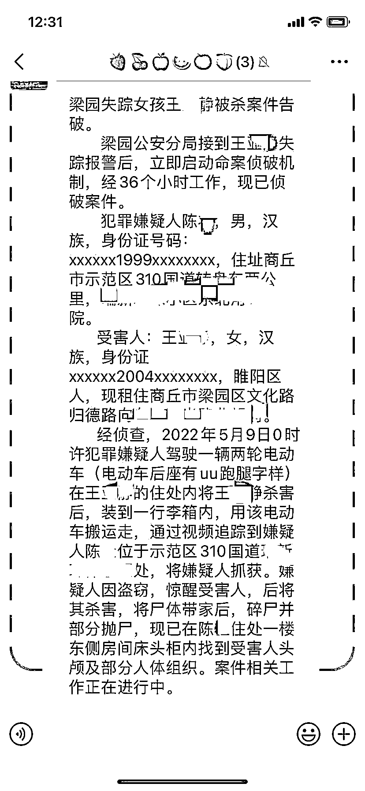
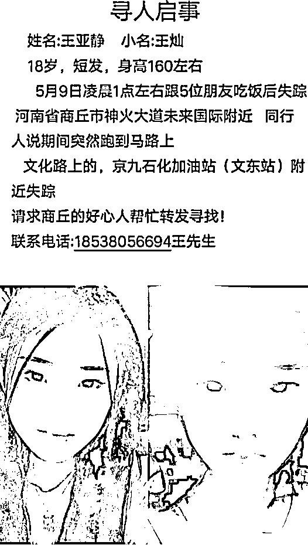
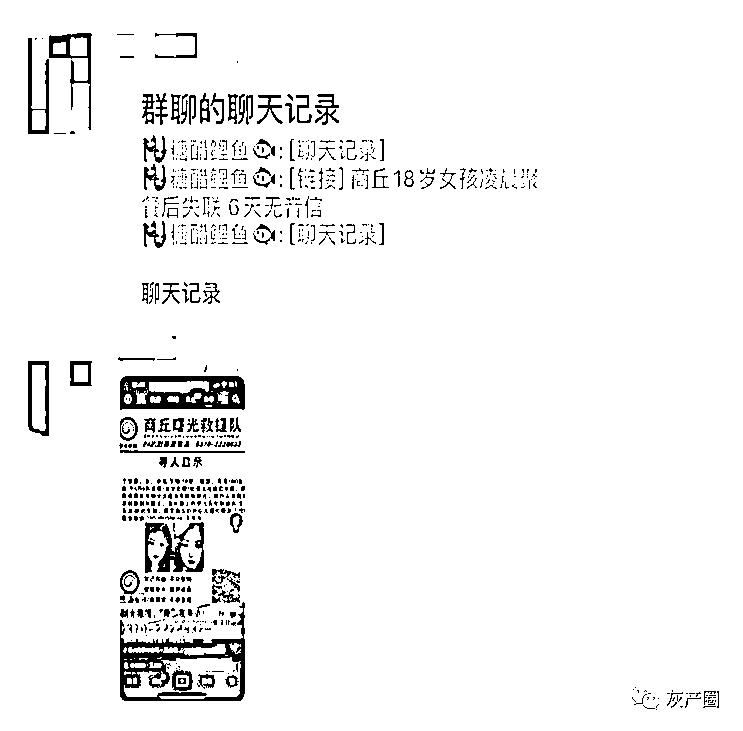
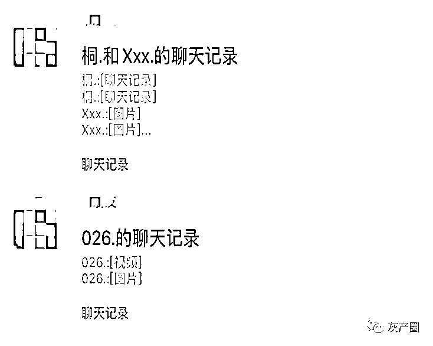

# 商丘 18 岁女孩凌晨聚餐后失联遇害。警方最新通报：犯罪嫌疑人被抓获

> 原文：[`mp.weixin.qq.com/s?__biz=MzIyMDYwMTk0Mw==&mid=2247536024&idx=4&sn=95110594aaa971835630254da2a1f8d6&chksm=97cb86a0a0bc0fb6b2dbc9cb3ab34069577d16202eab23ef8395fb20813e17f7f13d9b4075ac&scene=27#wechat_redirect`](http://mp.weixin.qq.com/s?__biz=MzIyMDYwMTk0Mw==&mid=2247536024&idx=4&sn=95110594aaa971835630254da2a1f8d6&chksm=97cb86a0a0bc0fb6b2dbc9cb3ab34069577d16202eab23ef8395fb20813e17f7f13d9b4075ac&scene=27#wechat_redirect)

2022 年 5 月 10 日，商丘市公安局梁园分局接到王某某失踪的警情后，立即开展调查、侦查，于 5 月 15 日将犯罪嫌疑人陈某抓获。

经查，犯罪嫌疑人陈某于 5 月 9 日凌晨尾随进入王某某住处实施盗窃时被王某某发现，遂将其杀害，并将尸体转移。目前，案件正在进一步侦办中。

商丘市公安局梁园分局

2022 年 5 月 17 日

此前，商丘朋友圈和微信群在传一则消息，说是失踪女孩的案子告破了，凶手被抓。

之前，河南和商丘市多个媒体 18 岁女孩失踪进行了报道。下面是大象新闻的报道——

5 月 9 日，商丘 18 岁女孩王亚静在凌晨与朋友聚餐后失联。5 月 14 日，王亚静堂哥王先生告诉大象新闻记者，目前警方已介入调查，至今还未找到。

[`mp.weixin.qq.com/mp/readtemplate?t=pages/video_player_tmpl&action=mpvideo&auto=0&vid=wxv_2397995600153001985`](https://mp.weixin.qq.com/mp/readtemplate?t=pages/video_player_tmpl&action=mpvideo&auto=0&vid=wxv_2397995600153001985)

王亚静同事回忆，5 月 9 日当晚，几人一起吃饭时都喝了酒，饭局还未结束，王亚静就独自先行离开。与她同住的同事本以为她会回到住处，但第二天早晨同事找王亚静一起去上班时，却发现她并没有在家。5 月 10 日，同事们仍未联系上王亚静，便委托店长帮忙报警。

王亚静堂哥王先生表示，家属也是最近才得知她在商丘一网吧工作，失踪前并没有任何异常行为，根据警方透露给他的消息，王亚静并没有相关购票信息，警方推测她在市区的可能性仍然很大。

据了解，王亚静走失时身穿黑色长裙，黑色外套。目前，商丘警方和家属还在搜寻王亚静的下落。

群里有传言女孩被分尸，说得很离谱。目前，案件正在进一步侦办中，具体情况等官方通报。********

来源：商丘市公安局梁园分局、大象新闻

← 向右滑动与灰产圈互动交流 →

