# 「逃离」大上海：倒卖离沪火车票的生意，破译了

> 原文：[`mp.weixin.qq.com/s?__biz=MzIyMDYwMTk0Mw==&mid=2247536071&idx=1&sn=7bfc208be654ca2be564aa3199fa248d&chksm=97cb86ffa0bc0fe92292ab884899113c9a381a4d803c3c9339b5e310dd041826675be96b36d4&scene=27#wechat_redirect`](http://mp.weixin.qq.com/s?__biz=MzIyMDYwMTk0Mw==&mid=2247536071&idx=1&sn=7bfc208be654ca2be564aa3199fa248d&chksm=97cb86ffa0bc0fe92292ab884899113c9a381a4d803c3c9339b5e310dd041826675be96b36d4&scene=27#wechat_redirect)

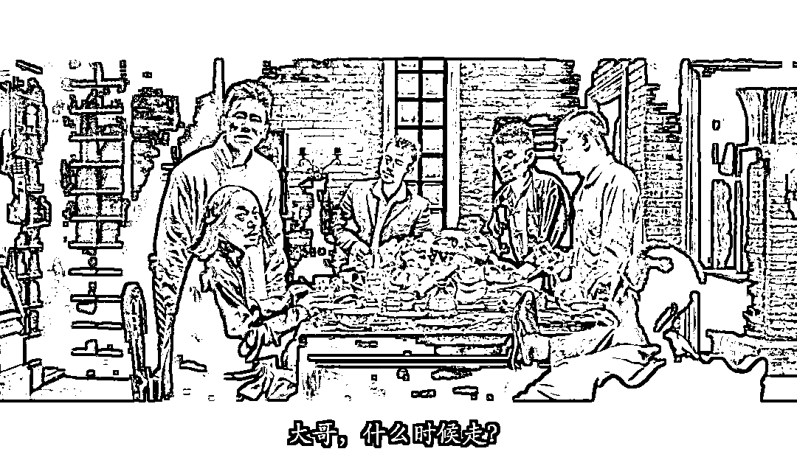

图源：电影《让子弹飞》

如今的上海，有人选择留下，有人选择离开，不管如何抉择，终究是为了一个目的：活下去，更好地活下去。

2022 年 5 月 17 日，上海疫情形势进一步明朗，16 个区社会面清零。

随之而来的，是大批外地务工人员的离沪，挤满了上海虹桥火车站。

对一个普通人来说，当下想要离沪，需满足以下三项条件：**持有 48 小时核酸检测阴性证明；处于防范区内；属地居委同意接受。**

三个条件缺一不可。

5 月 16 日起，上海宣布，将分阶段推进复商复市，按照“有序放开、有限流动、有效管控、分类管理”原则，严格落实各项疫情防控措施。

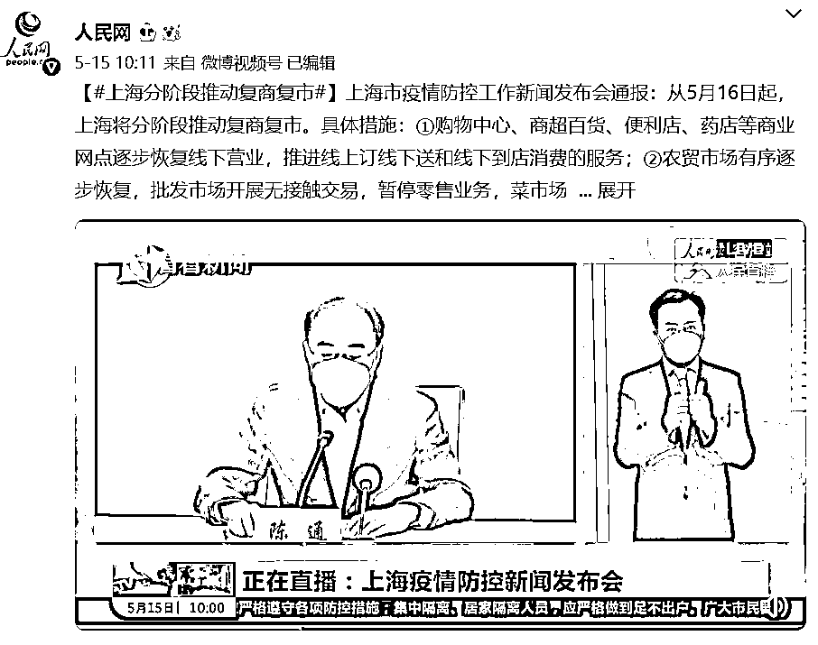

但按照目前上海各区的情况，从“分阶段”到“全面开放”，还需要一段时间。

不少网友表示：**仍在“静默”中，你所在的小区开放了吗？**

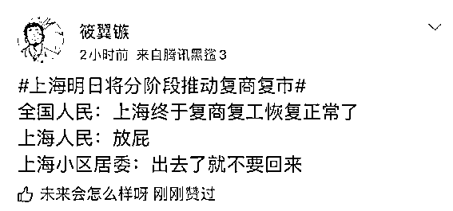

到底什么时候能开放？

专家表示：6 月 1 日至 6 月中下旬，在严格防范疫情反弹、风险可控的前提下，全面恢复全市正常生产生活秩序。

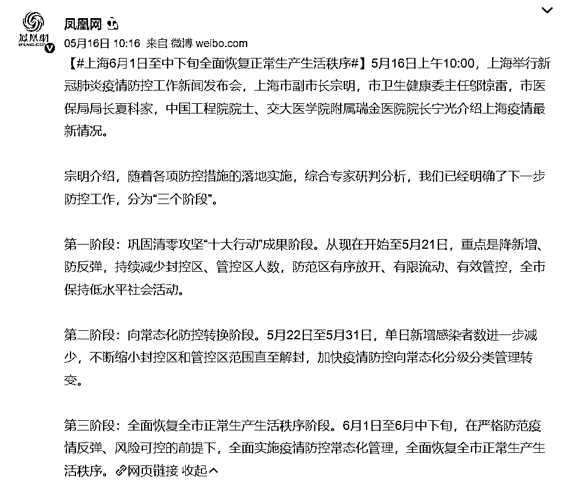

5 月 16 日开始，上海将逐步恢复对外交通，铁路方面将逐步增加上海虹桥站、上海站等车站的到发列车数量。

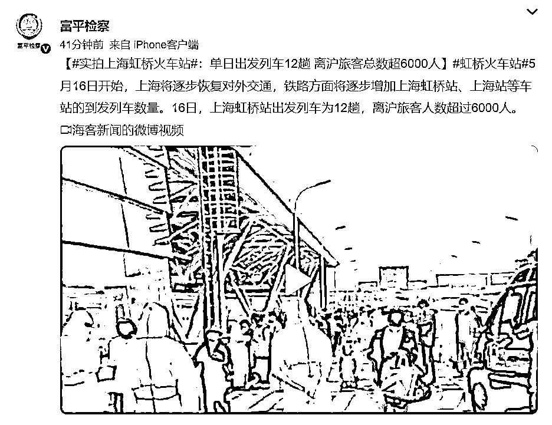

**随着上海疫情“初步解封”，大批的外地人员选择“离开上海”！**

**上海虹桥站出发列车为 12 趟，离沪旅客人数超过 6000 人，虹桥火车站内人流爆满！**

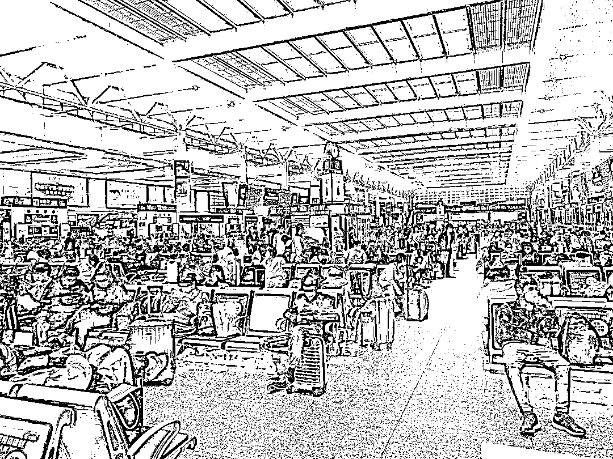

进入虹桥火车站的高架下也排起了长队，在此核验当日车票后、核酸、绿码后方可前往虹桥站。 

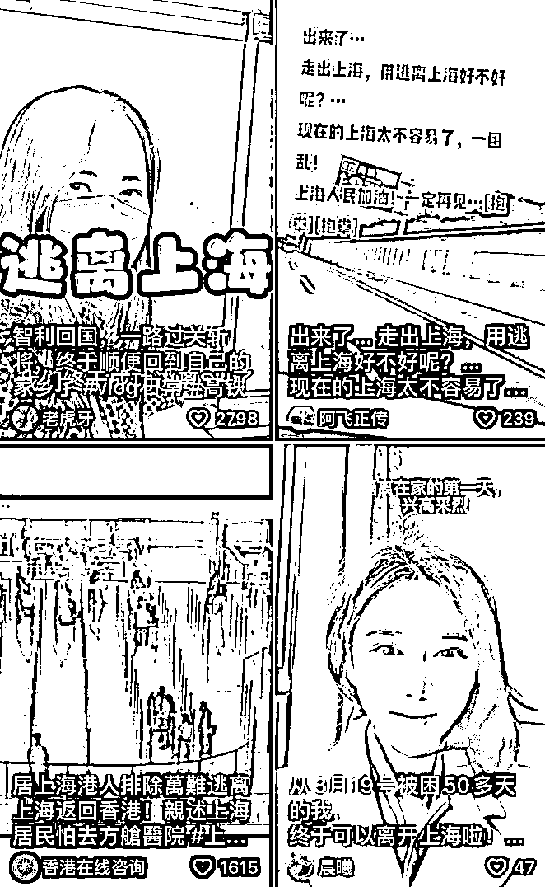

等待离沪的人群，直接排队排到了高架桥。

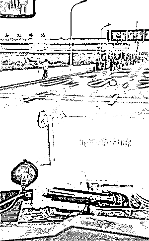

这次离沪大潮中，大部分都是外来务工人员、和放假回家的大学生。

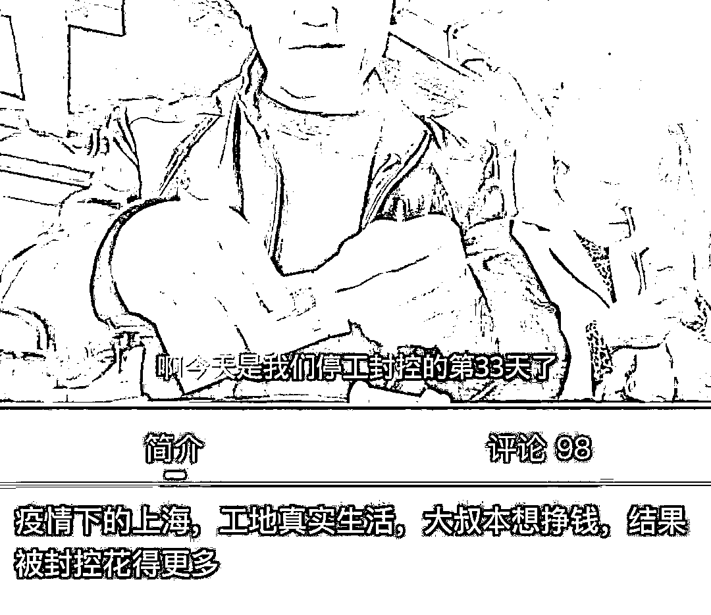

甚至有网友为了回家徒步十几个小时到虹桥火车站，可见大家“回家”心切......

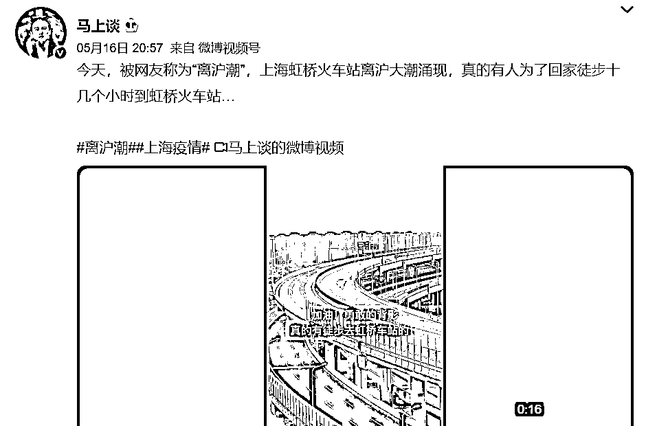

抖音上刷到一个狠人，自制泡沫“船”，打算从上海划回江西，朋友劝阻根本不听。

这群在上海的外地务工人员，实实在在被上海伤透了心。

对比其他省份城市，上海的防疫水平简直不能直视，连给不及格分都是抬举。

**因为无论官媒上如何说复工复产形势大好，但是真的落实到个体上，一切就变得扑朔迷离和未知。**

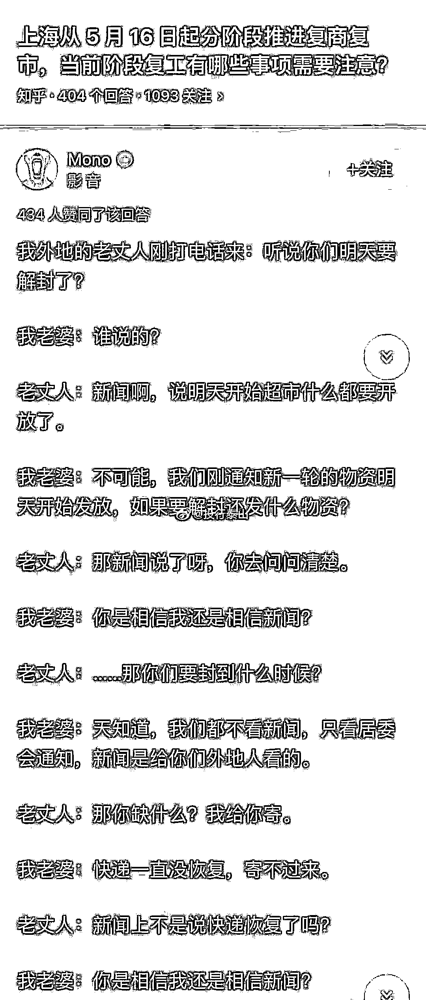

**万万没想到，这群被伤透心的打工人，临走还要被宰一刀。**

有视频显示，有的人步行 10 个小时前往火车站，而到火车站的黑车更是要价到 1500~2000 块。

5 月 17 日，上海警方公布了几起倒卖离沪火车票的案件，目前查处了 5 起，抓获犯罪嫌疑人 6 名，

5 月 13 日，“蓝盾”小分队会同虹桥站派出所抓获倒卖火车票犯罪嫌疑人付某某(男，39 岁)和魏某(女，40 岁)。**经查，付某某加价 2200 余元倒卖 2 张火车票，魏某加价 3500 余元倒卖 7 张火车票。**

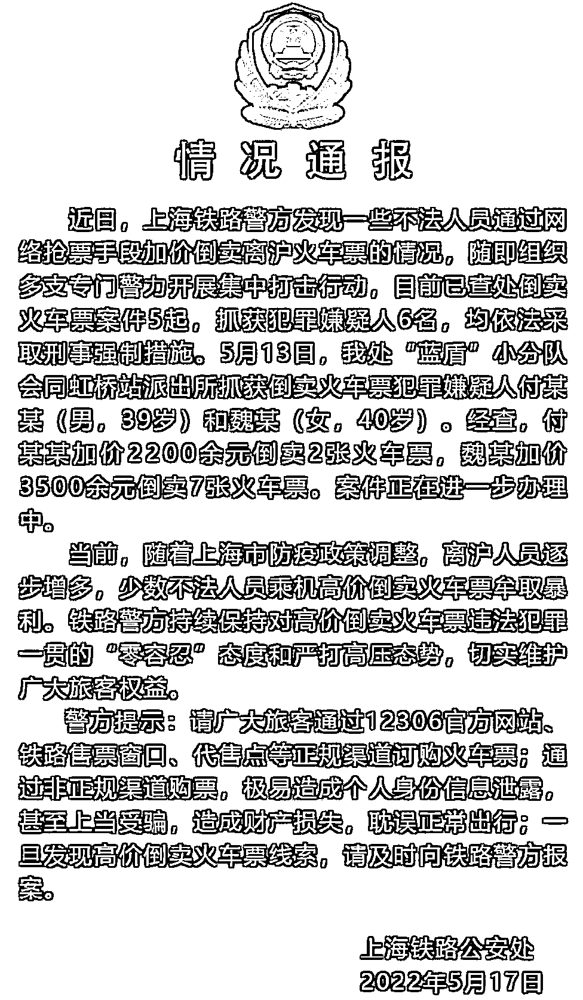

**我在想：火车票实名制，进门刷脸刷身份证，怎么倒卖呢？**

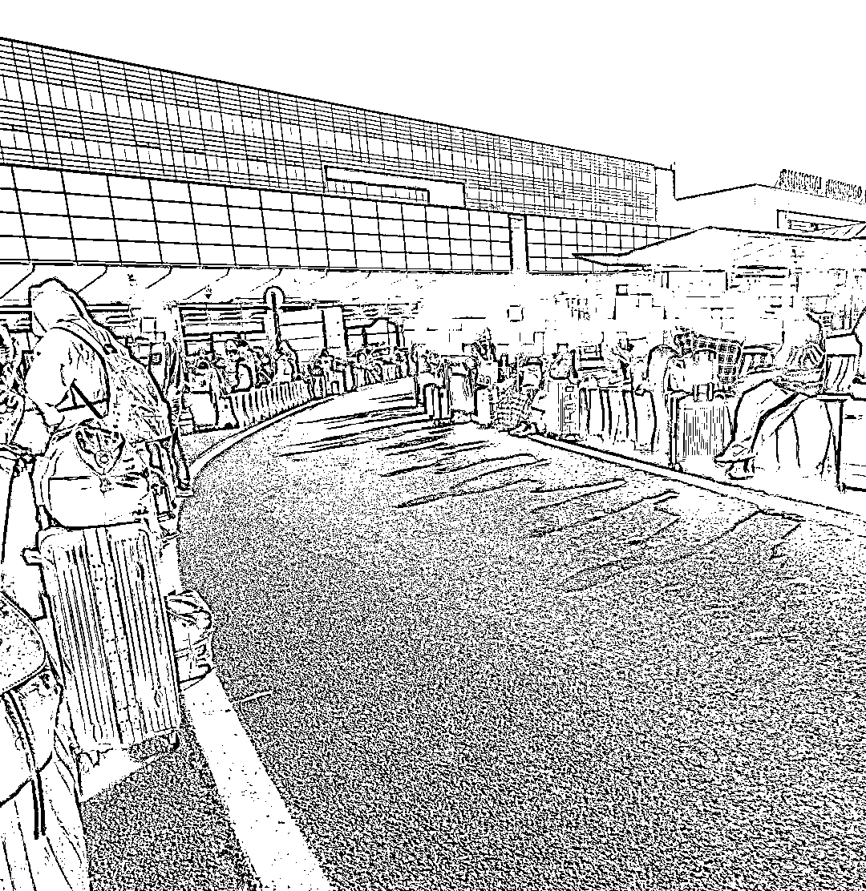

据相关人士透露，黄牛倒卖火车票有一套自己的方法。

**黄牛借用亲戚朋友的 100 个身份证，从有利益关系的售票点上，提前买较多的票。**

当然，这要不停地刷新和守候。

买主来了后，回到售票点。

**两台电脑同时打开，一台电脑负责退票，另一台负责买票。**

在退票电脑将退票信息输送到网络平台之前，购票电脑已经录好车次身份证等信息在那儿等着，然后两台电脑同时操作，一台敲退票，另一台敲买票。

**退订的车票刚一到网络平台上，另一台电脑就直接将它买回……**

但即便是这样，退票也并非 100%能够回收，可这趟车的车票早已告罄，在临开车的前几天，很少有人会去买......

**这就是一个左右倒右手的游戏。** 

**只能说，这群黄牛玩的太高明。**

那些迫不及待离开上海的人，估计有一部分，不会再回来了吧。 

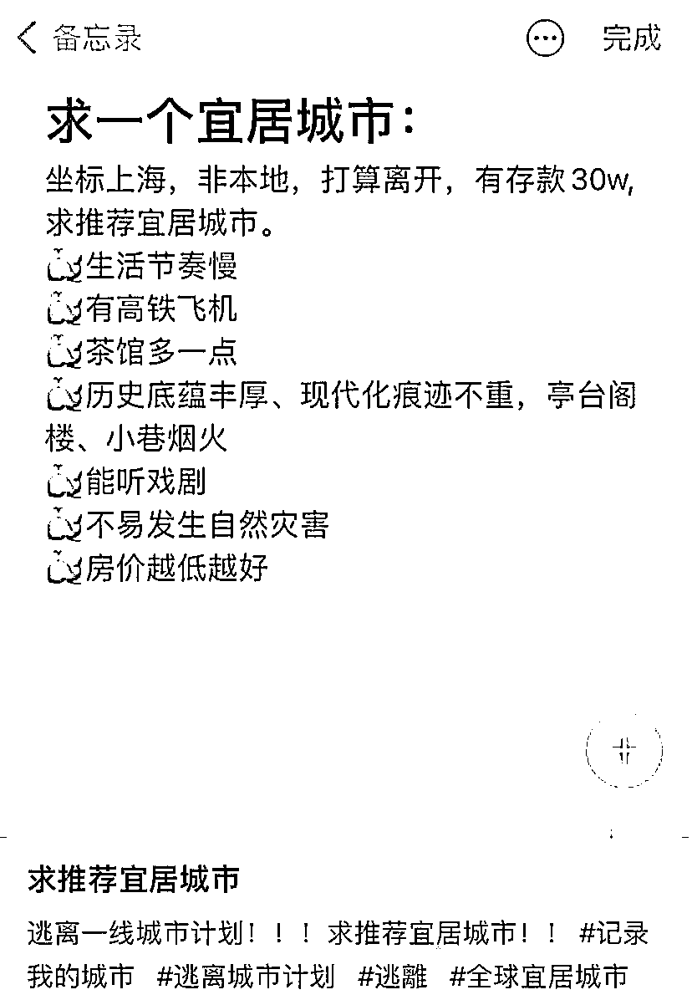

如今的上海，有人选择留下，有人选择离开，不管如何抉择，终究是为了一个目的：

**活下去，更好地活下去。**

**唯愿所有离开的人，都能一路顺遂，平安到家。**

来源：昌南大队长

← 向右滑动与灰产圈互动交流 →

