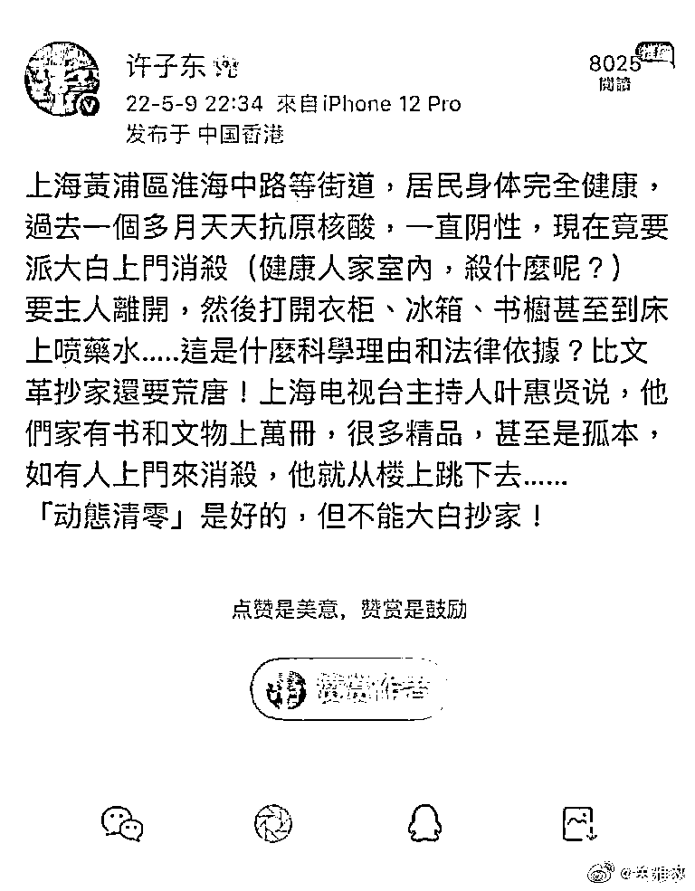
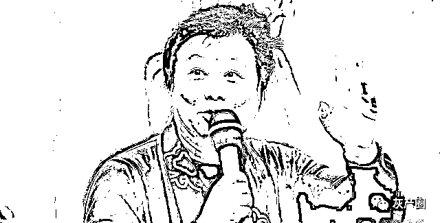
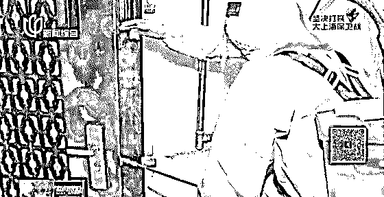
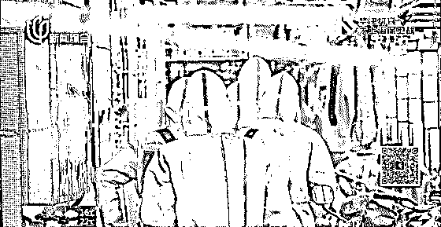
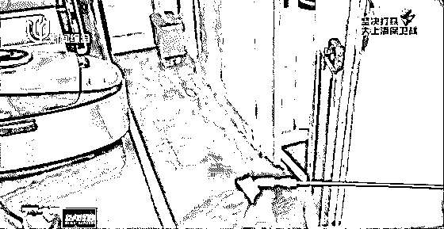
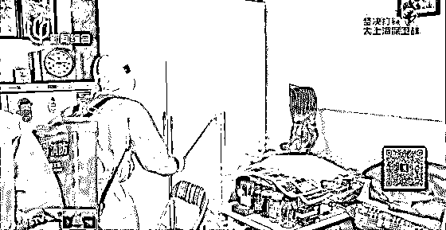
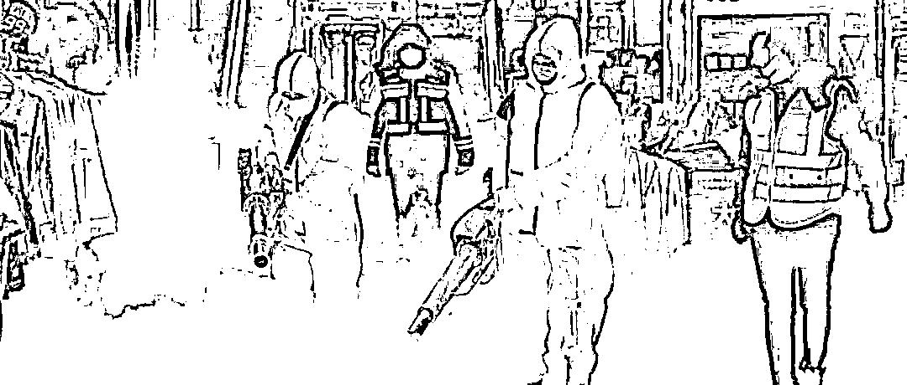
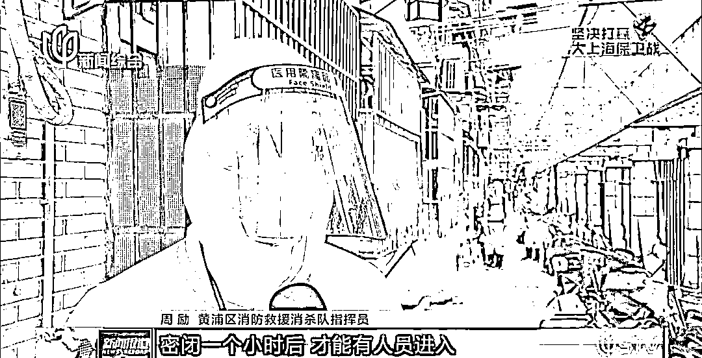
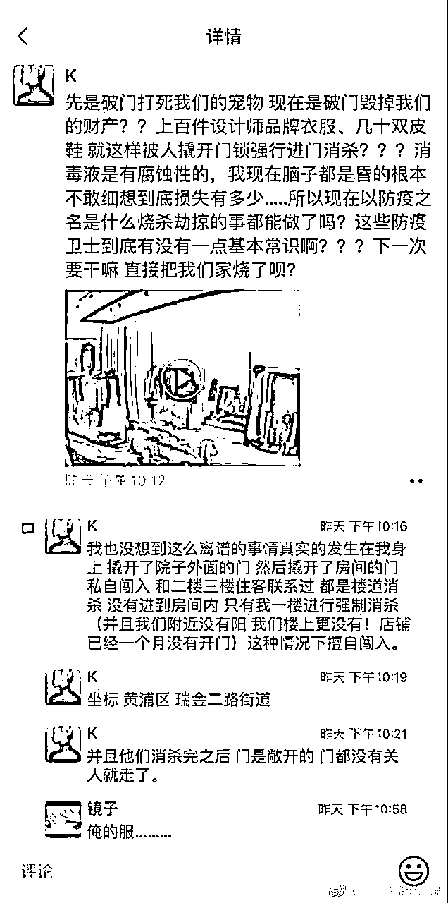
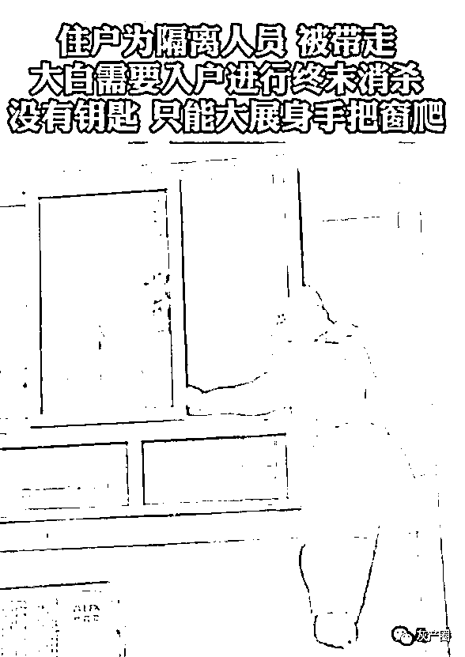

# 浩浩荡荡，入户消杀

> 原文：[`mp.weixin.qq.com/s?__biz=MzIyMDYwMTk0Mw==&mid=2247536071&idx=3&sn=bf63cf828711504cbcb8ed7277aafd6b&chksm=97cb86ffa0bc0fe9007c049edbbb7eba103ad64f1473498964a2b54faccb390259aa0c60bb4c&scene=27#wechat_redirect`](http://mp.weixin.qq.com/s?__biz=MzIyMDYwMTk0Mw==&mid=2247536071&idx=3&sn=bf63cf828711504cbcb8ed7277aafd6b&chksm=97cb86ffa0bc0fe9007c049edbbb7eba103ad64f1473498964a2b54faccb390259aa0c60bb4c&scene=27#wechat_redirect)

[`mp.weixin.qq.com/mp/readtemplate?t=pages/video_player_tmpl&action=mpvideo&auto=0&vid=wxv_2392185196612845569`](https://mp.weixin.qq.com/mp/readtemplate?t=pages/video_player_tmpl&action=mpvideo&auto=0&vid=wxv_2392185196612845569)

近日，关于入户消杀，引起广大网友关注和激烈讨论。

一段防疫人员入户消杀的视频，在网络广泛流传，引发网友们质疑：

[`mp.weixin.qq.com/mp/readtemplate?t=pages/video_player_tmpl&action=mpvideo&auto=0&vid=wxv_2391841240800837633`](https://mp.weixin.qq.com/mp/readtemplate?t=pages/video_player_tmpl&action=mpvideo&auto=0&vid=wxv_2391841240800837633)

5 月 10 日，江苏徐州睢宁县宣传部工作人员回应媒体称，网传视频是根据当地防疫政策，对阳性病例和无症状感染者住所进行终末消毒，消杀全程录音录像，按专家指导意见结合消杀要求执行，冰箱内物品按要求处置，**事后已为居民补偿食品及消毒礼包。**

**  “上海第一名嘴” 以跳楼抵抗上门消杀？ **

近日，网传 “上海第一名嘴”叶惠贤，要以跳楼抵抗上门消杀。

上海人、著名学者许子东透露，叶惠贤家有上万册藏书和珍贵文物，很多是精品，甚至是孤本，**叶惠贤说如果有人上门来消杀，就从楼上跳下去。**

今年 75 岁的叶惠贤，是上海电视台著名主持人，曾主持过《今夜星辰》、《难忘的老朋友》等节目。叶惠贤曾三获金话筒奖，并获得中国电视主持人终身成就奖，被誉为“申城第一名嘴”。

在上海举行的疫情防控发布会上，上海市环境整治消杀工作专班副组长金晨介绍：

根据要求，**对阳性感染者生活居住的场所要开展消毒工作**。

**入户消杀的流程**

5 月 8 日，记者跟随上海黄浦区消防救援消杀队，实地记录了一户阳性感染者，家中的终末消毒过程：

消防救援消杀队分队长介绍，队员们使用的是一款是超低容量喷雾器，主要用于空气消杀，添加的是 1%的过氧化氢。

**入户前**，队员用蓝色的常量喷雾器对入户**门、门把手、地面、台面等硬质物体表面**仔细消杀。

**进入室内后**，除了**衣服、被褥，其他手能触摸的地方**都被仔细喷洒上药水。

完成物品消毒工作后，队员又用白色的超低容量喷雾器**对室内空气进行消杀。**

这户居民家的面积约 20 平方米，终末消毒却持续了**近半小时**，完成入户消杀工作后**需要关门、关窗，密闭一个小时人员才能进入。**

有民众质疑：

过氧化氢又叫双氧水，是一种不稳定的强氧化剂，除了可以用来消毒，还能漂白衣物。

**如果对着衣服或容易褪色的物品喷，会造成衣物脱色而损坏衣物。**

还有，经过一番药物喷洒，家里的**家具、电器、地板、书籍、钢琴、 鞋子、包包、玩具、艺术品**等都基本面目全非。

[`v.qq.com/iframe/preview.html?width=500&height=375&auto=0&vid=v3336vm5guw`](https://v.qq.com/iframe/preview.html?width=500&height=375&auto=0&vid=v3336vm5guw)

**人民日报记者质疑“入户消杀”：** 

# **既不合法，也不科学**

[`v.qq.com/iframe/preview.html?width=500&height=375&auto=0&vid=n3336hq5rcy`](https://v.qq.com/iframe/preview.html?width=500&height=375&auto=0&vid=n3336hq5rcy)

在世界卫生组织的**《非卫生保健环境中针对 COVID-19 对环境表面进行清洁和消毒应注意的事项》**中提到：“针对 COVID-19，**不建议在室内向物体表面例行喷洒消毒液**。如果使用消毒液，应该用浸过消毒液的抹布或湿巾擦拭。”

很多科普文章提到，通常新 guan 病毒通常只能在物体表面存活几分钟、几小时，低温可存活久些，在高温下或者在遇到特定消毒剂时则迅速失活。

哥伦比亚大学公共卫生学院唐德明教授：

> “病毒不是一个完全的生物，它自己无法单独活着，它一定要寄生于一个活体内（宿主），活体可以是昆虫，动物和人体。
> 
> 这也就是病毒不可能在普通物体表面存活的原因。
> 
> 当然病毒的生存和复制还需要合适的温度和湿度，适当的酸碱度等等。
> 
> 若把时间放大，病毒在刚刚离开机体最初几秒可能是活的，不过仅以秒计，到不了分钟。”

> “那怎么会有人检测到病毒在各种表面？这里有一个定义上差距，我们所谈的病毒是否存在，是指有复制能力的活病毒。只有处于这种状态的病毒才会引起传播，造成新的感染。”

香港大学病毒学家金冬雁说：**在香港，消毒一般限于公共场所。**

他介绍：“如果一个办公室有人确诊，会找专业人员进行消毒。早期使用喷雾消毒，后来发现**在房间里使用喷雾会对很多工作设备有损害，**目前已经改成了用消毒水擦拭表面的办法进行环境消毒。”

也有网友质疑，**入户消杀涉及到私有财产的保护问题**。

因为阳性患者都在隔离中，消杀人员没有其房子的钥匙，只能强行入室。 

网络上，这张图流传甚广：

有人说，非常心疼消杀人员，这么爬窗，可是很危险的... 

有人说，强行进入别人的房子不可接受，还非常可怕，因为家是一个人最后的领地...

对此，大家怎么看呢？

来源：和美之声，景来律师

← 向右滑动与灰产圈互动交流 →

