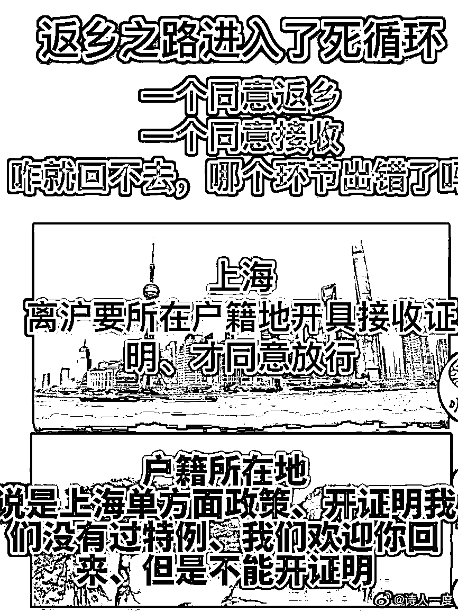
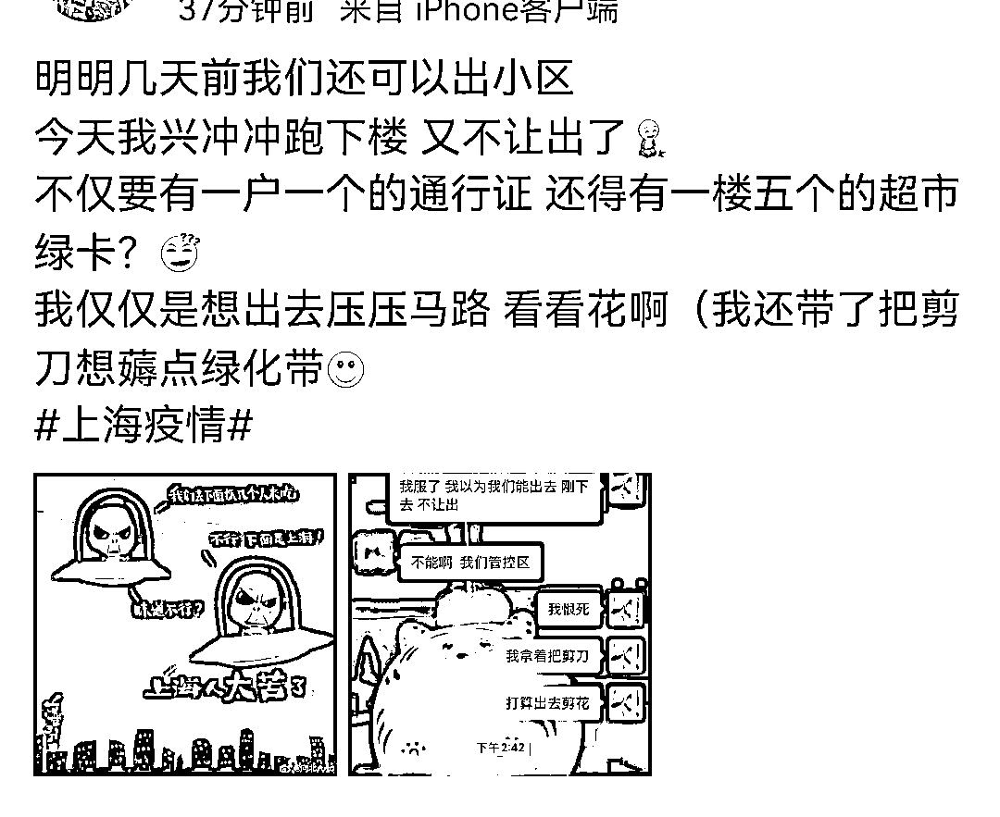

# 您怕是误解了上海解封！

> 原文：[`mp.weixin.qq.com/s?__biz=MzIyMDYwMTk0Mw==&mid=2247536071&idx=4&sn=e56cccef7eeec13987f94296f6177405&chksm=97cb86ffa0bc0fe993d2fa31340c5ee55e3710de7eeb7d6fab6e726f8bf3f51a2c2f9dcdd12b&scene=27#wechat_redirect`](http://mp.weixin.qq.com/s?__biz=MzIyMDYwMTk0Mw==&mid=2247536071&idx=4&sn=e56cccef7eeec13987f94296f6177405&chksm=97cb86ffa0bc0fe993d2fa31340c5ee55e3710de7eeb7d6fab6e726f8bf3f51a2c2f9dcdd12b&scene=27#wechat_redirect)

要怎么解释呢？

我们还是最初那个雷打不动的我们！ 

为什么一定要凭借自己的判断，

而不是相信一个已经困在上海两月有余之人的肺腑之言呢？

3 月份的时候，绝交了一位朋友，因为他爹死了，我没能去！

尽管我一再解释，我们小区 3 月 9 号被封的，比新闻上你们知道上海疫情严重还要早很长时间，但他宁愿相信新闻联播，也不相信我所说的！

今天一个生意上的伙伴打来电话，直接对开怼说：别扯了，虹桥车站人都满了，七宝都人挤人，你说你没解封？

说完，还重重叹一口气，这隔着万重千山的叹息，喷出来的是对我满满失望，是自以为是的认为想放他鸽子，不与之打交道的意味。

隔十分钟，又发来两份文件，一是一个谁安装谁拆除的文件。我不知道他是在哪里弄来的！连我都没看过。

怎么说，看完想说的是，大哥，我这里是宝山，是那份造假的解禁指南上 都不敢预测的地方！

好好看看，上面真的没有宝山，是一个连骗子都懒得骗，预测一下都不敢，连造谣都不敢触及的地方。

他发来的另一个文件，是下面这个警民直通车发布的离沪指示。

文件是优美的。但想说的是，这个通知我比他看到的要早，

我还特意问了居委会，结果人家回复说还没收到！

他能信吗？

就算这份文件靠谱，下面还要经过一系列的标准条件，经过许许多多的小衙门，最终侥幸都能通过的那也一定是很稀有的一小拨人了。最主要的，下面还有个死循环又得晒去一部分人。

能顺利出去的肯定是是极少数的人，我能确定的是，我本人是绝不在这个达标的范围之内，因为我们自始至终，两个多月了，就在上一秒，除了做核酸，楼层都出不去。

当然，就像昨天被骂成狗的那则上海烟火气般，不能拿着金山，崇明等某个街道就代表了整个上海的烟火气！同样的，很多人可能会说，你那里没有解封，也不能代表上海其他的地区也没解封！

的确，上海有的地方是“解封”了！

如果你认为下面这些情况，真的叫解封的话？

譬如，下面这个是奶头猪肉闻名全国的梅陇镇的“解封”，在下面这则通行证上可以看到，解封的时间是 11；00——12；00,。一个小时，一家人只能出去一个，算是解封吗？ 

再看看下面这个唐镇的，稍微好一点，能出去四个小时， 

但要求是这样的，一户一证一人，静默期的住户是不发出入证的，线下也只有永辉和药店是可以采购的！

三林镇的是这样的； 

然而，还没有焐热，就收到了这样子的通知，令人兴奋的自由就这般擦肩而过； 

还有这种情况的，说是可以出去了，结果不行，不仅要有一户一个的通行证，还得有一楼五个的超市绿卡！

有网友说，这是非常魔幻的解封，一家只能出去一个，拿着通行证，排着队，只能不幸，只能在街镇的范围内，就跟放风一样；

是的，可以通行到大门口 zf 组织的车里买菜；

总结一下，就是这样：“一户一人一礼拜出一次，绿码核酸码身份证出入证，定时定点定量定人头。”

现实就是这么魔幻；

吓人吧！ 

如果理个发，都是下面这种情景，那么这也叫解封的话，那么这种解封肯定不是和自由挂钩的！

上面的这些能拿到通行证，能一家一户一人出行的在当下的上海，就是外人眼里解封的这一波。

至于我们大多数，如下图！

这么说，不知各位明白了吗？

现实就是这样。

只差最后一刀了，

望周知。

最后一个好的信息是，早晨下楼去做核酸，上来后去阳台数了数高架上十分钟能过几辆车，这是一个失去自由之人判断获得自由的唯一有效手段。我从不看新闻，也不敢看一些大 V 们的分析，因为我真的怕了。

乐观的是，今天的十分钟过车量，比昨天多了十六辆，这证明的确有向好的迹象，加油！

谢~

来源：我会永远在你身后

← 向右滑动与灰产圈互动交流 →

