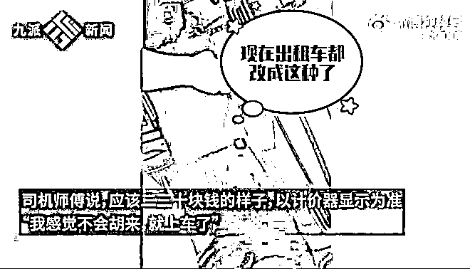
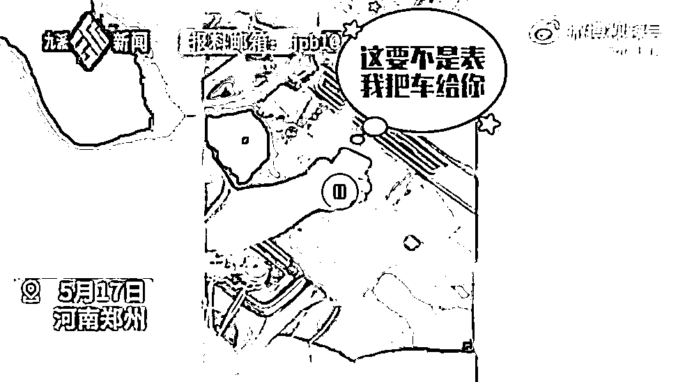
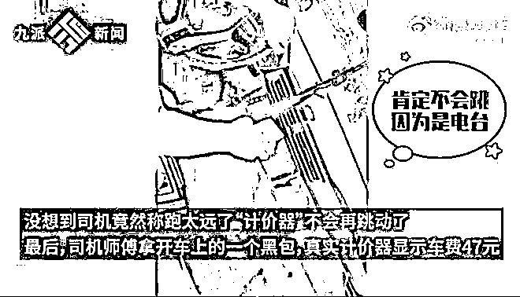
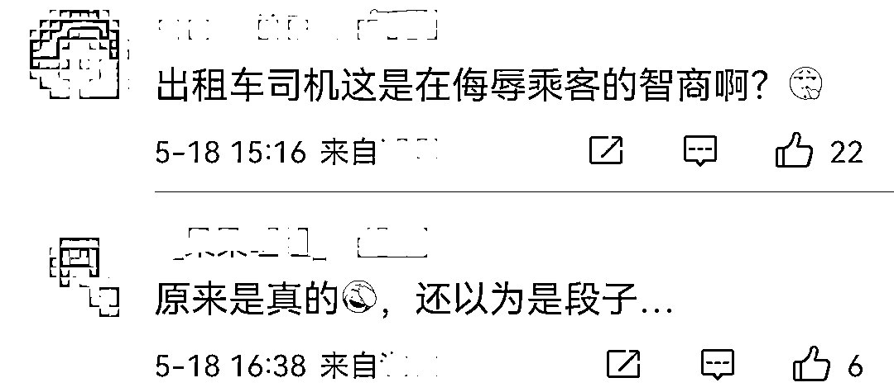

# 离大谱了！出租车司机按收音机频道强行要价

> 原文：[`mp.weixin.qq.com/s?__biz=MzIyMDYwMTk0Mw==&mid=2247536071&idx=5&sn=94de03498ea9c136fbca7d25e698d733&chksm=97cb86ffa0bc0fe90aeeec13b6eb8e3e079c401452b51d2595f7fbb988de9d218107cf8cca60&scene=27#wechat_redirect`](http://mp.weixin.qq.com/s?__biz=MzIyMDYwMTk0Mw==&mid=2247536071&idx=5&sn=94de03498ea9c136fbca7d25e698d733&chksm=97cb86ffa0bc0fe90aeeec13b6eb8e3e079c401452b51d2595f7fbb988de9d218107cf8cca60&scene=27#wechat_redirect)

5 月 17 日，

在河南郑州，

一女子和出租车司机因车费问题发生争执。

[`mp.weixin.qq.com/mp/readtemplate?t=pages/video_player_tmpl&action=mpvideo&auto=0&vid=wxv_2403909690897334274`](https://mp.weixin.qq.com/mp/readtemplate?t=pages/video_player_tmpl&action=mpvideo&auto=0&vid=wxv_2403909690897334274)

视频中显示，

王女士在郑州东站打了一辆出租车。

**上车前，她询问了一下大概要多少钱，**

**司机师傅告诉她大概二三十元左右，**

**以计价器显示为准。**

王女士表示：

**“我感觉不会胡来，就上车了。”**

令王女士没想到的是，

等她到了郑州火车站，

**司机师傅竟指着车上的一个 LED 显示屏说，**

**价格为 87.5 元。**

王女士仔细一看，

**这个“计价器”竟然是收音机的界面，**

**而 87.5 正是收音机的播放频道。**

面对质疑，

司机还坚称是更换了新的计价器，

并反复强调**“我（还）能骗你吗？”** 

**“这要不是表（计价器）我把车给你。”**

之后，王女士要求司机继续往前开，

看看价格还会不会变。

**司机却称****跑得太远了，**

**计价器上的数字不会再“跳动”了。**

最终，

在王女士的坚持下，

司机拿开一个黑包，

真实计价器显示车费为 47 元。

王女士称，

**最后司机因为害怕被看清车牌，**

**开着后备厢跑了******

5 月 18 日，

郑州晨曦出租车公司回应，

**正在严肃处理中，**

**涉事司机已停运。**

**领导要求开除该司机并永不录用，**

**同时建议行业主管部门注销其服务资格。**

网友：

“‘黑出租’我们不是没见过， 

但也不能这样侮辱乘客智商啊”

**你遇到过出租车司机的哪些套路？** 

**评论区聊聊******

来源：央视网综合九派新闻

← 向右滑动与灰产圈互动交流 →

