# 上海一宠物犬陪主人熬过了新冠，熬过了隔离，却死在了消杀...

> 原文：[`mp.weixin.qq.com/s?__biz=MzIyMDYwMTk0Mw==&mid=2247536120&idx=1&sn=1586d307d26ebb8a1ec7a4fcddff6b79&chksm=97cb86c0a0bc0fd6797403d79e1e4fdb97b2acf62cd72c0bf00a6c2f1a4f4d0cdd31f25404ce&scene=27#wechat_redirect`](http://mp.weixin.qq.com/s?__biz=MzIyMDYwMTk0Mw==&mid=2247536120&idx=1&sn=1586d307d26ebb8a1ec7a4fcddff6b79&chksm=97cb86c0a0bc0fd6797403d79e1e4fdb97b2acf62cd72c0bf00a6c2f1a4f4d0cdd31f25404ce&scene=27#wechat_redirect)

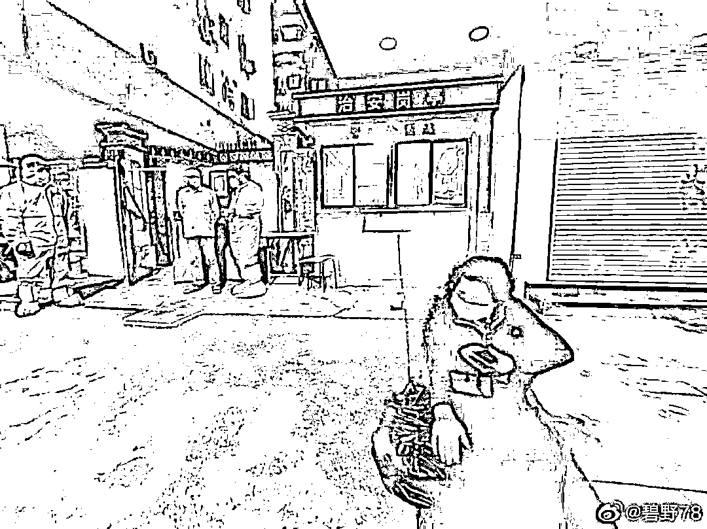

可怜的狗狗，陪着主人熬过了新冠，熬过了隔离，却死在了黎明之前。“狗狗陪伴主人隔离”，这本该是个温馨的故事，却依然以悲剧结了尾。

令人大无语的悲剧又发生了：**5 月 13 日晚，上海一只贵宾犬疑似死于消杀。**

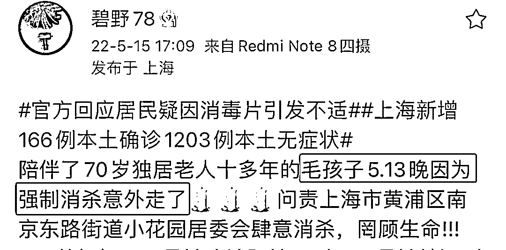

当事人的女儿@碧野 78 在网上维权讨要说法，却始终无果。

**狗主人是一位 70 岁的独居老人，狗狗 coffee 已经陪伴她十多年了。**

4 月 19 号，老人确诊新冠。

4 月 27 日，老人被转运到南京东路街道为特殊人群设立的方舱，当时很人性化地允许狗狗跟随。

经过 16 天的隔离治疗，老人康复，符合出舱要求，期间狗狗一直陪伴在老人身边。

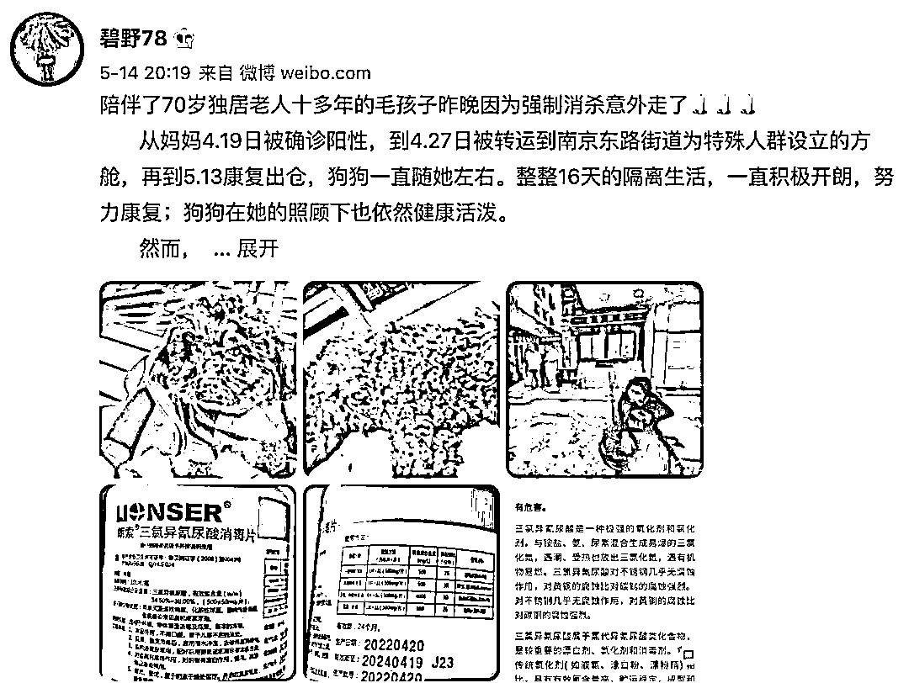

狗狗也在主人照顾下生活得很好，还给主人带去快乐，排解了不少隔离的烦恼。

**“狗狗陪伴主人隔离”，这本该是个温馨的故事，却依然以悲剧结了尾。 **

**挺过了隔离，却没能逃过消杀。**

5 月 13 日晚上，车停至直到小区门口，老人抱着 coffee 下车后，有防疫人员上前通知：

**需要对人和狗，以及随身物品进行消杀。**

虽然之前并没有人通知她，但老人依然积极配合。

**防疫人员要求她把狗狗放在地上，然后用消毒水对着他们猛喷。**

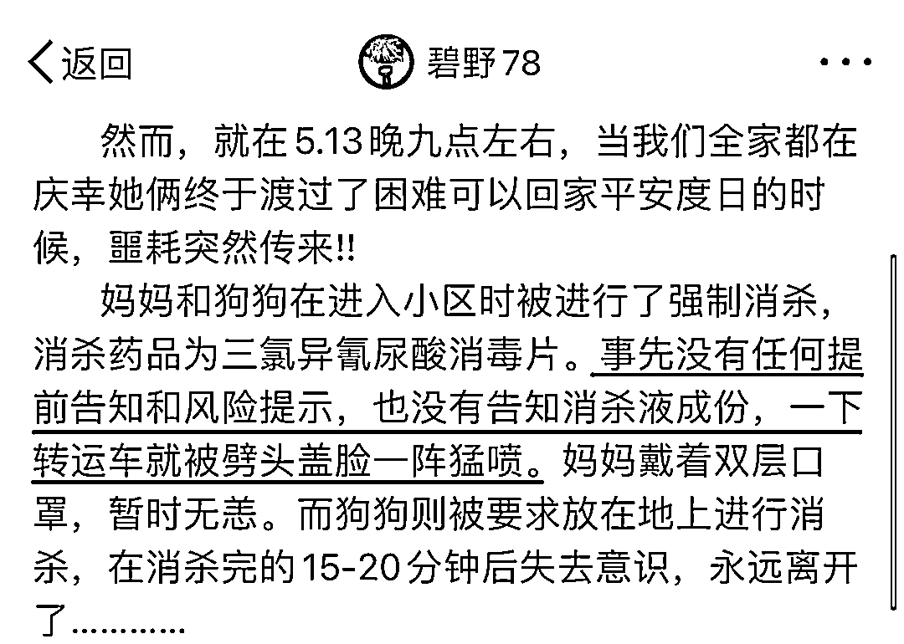

老人因带着双层防护口罩，被消毒后并未感到不适。

**但 coffee 到家后，却出现了无法站立，尿失禁、逐渐失去了意识等症状，甚至没来得及去医院，就停止了呼吸。**

整个过程，不过才 15-20 分钟。

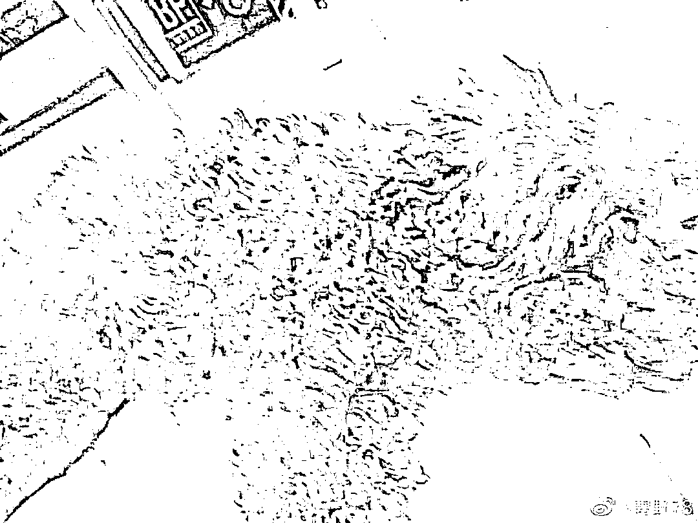

老人伤心欲绝，她和狗相伴了 10 年，早已当成亲人一般看待。

**感染阳性，被拉去方舱，这些就已经让老人承受了很大的心理压力了，现在治好了，可以回家了，好不容易燃起了一点希望，现在又要给她掐灭。**

回来时还活蹦乱跳的，为什么突然就丢了性命？

老人想到了消毒液，于是她抱着 coffee 返回小区大门。

**反复追问下防疫人员才拿出了消杀的瓶子：三氯异氰尿酸消毒片。**

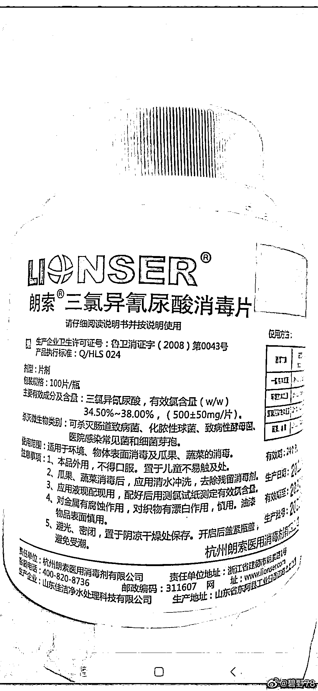

其实早在 2020 年，卫健委就在发布的防控知识里明确写了（含氯消毒剂）口服、吸入、溅入眼中和皮肤接触均可造成损伤。

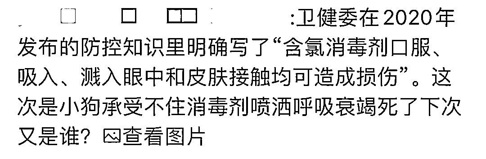

**我们熟悉的 84 消毒液的有效氯含量为 5.5-6.5%，三氯异氰尿酸消毒片有效氯含量高达 45-55%。**

防疫专家也提出含氯消毒剂具有一定的氧化性、腐蚀性以及致敏性，如过量使用，则会导致人体灼伤，甚至引起中毒。

何况是体型远小于人类的狗狗，还是在没有任何防护措施的情况下。

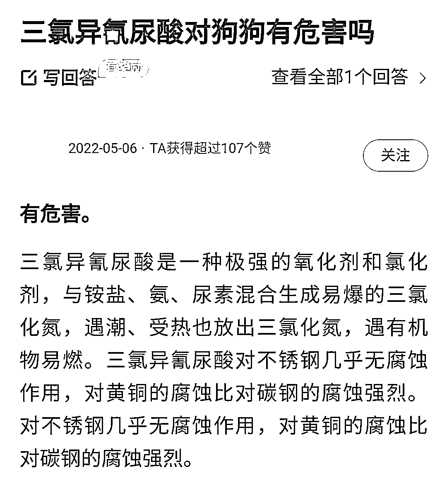

当天晚上，老人抱着狗狗的遗体在夜风里等了 3 个小时，只希望能有人给她一个说法。

等待说法的老人，袋子里装着去世的 coffee

可一条狗的生命，能换来什么答复？

一直到凌晨 12 点，好心的记者开着新闻采访车和居委会代表一起把狗狗送到了宠物医院进行安置，等待解封后火化。

老人的女儿没有停止过申诉：

> **1.消杀工作是否符合程序要求，要求公开居委会消杀工作的指导政策文件；**
> 
> **2.明确消杀药品成分，剂量，和稀释浓度有多少；**
> 
> **3.明确消杀对象:是针对物品、环境，还是人和动物都要消杀；**
> 
> **4.明确事发当晚对老人和狗进行消杀工作的人员隶属哪个机构管理，有无相关从业资质和专业培训。**

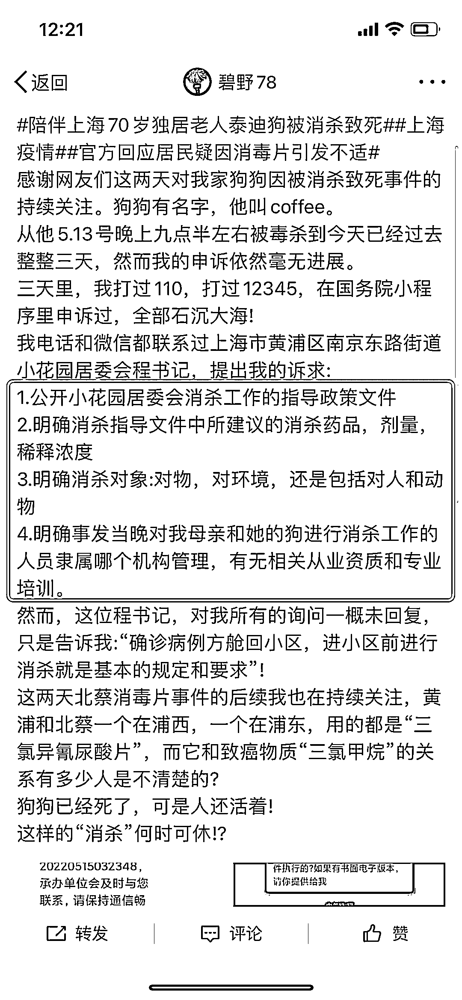

**如果存在过度消杀，则可能发生在任何人身上。**

其实在 5 月 13 号，有人爆料上海北蔡南新六村小区内到处是消毒片，工作人员打开下水道盖子直接往里倒。

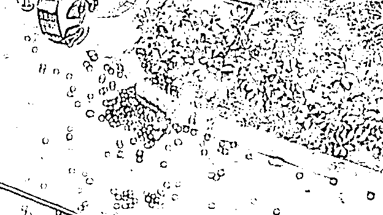

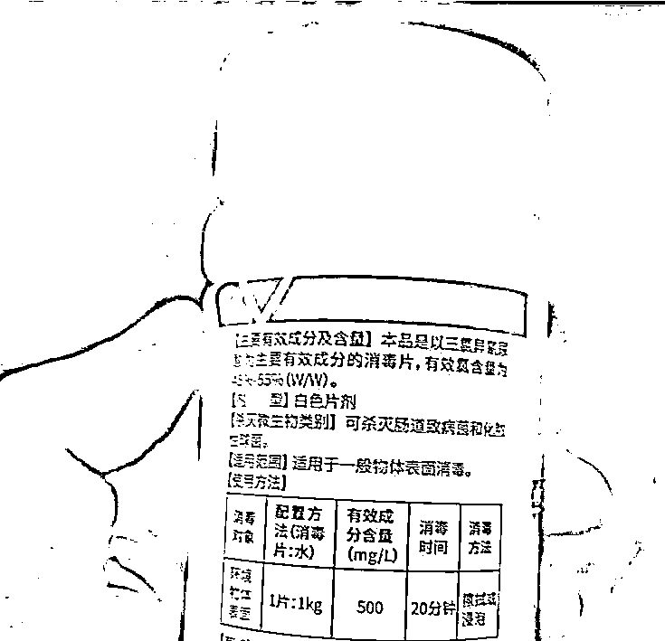

最后的结果呢？

**猫咪上树、老鼠窜了出来，孩子们开始呕吐，大人们开始头疼……整个小区宛若一个大型毒气室。**

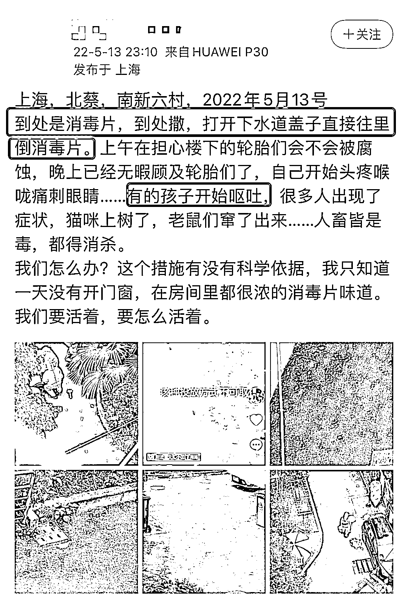

**从居民的不良反应中就可以看出，该消毒物质已然对活体产生了腐蚀作用。**

**这不是在消杀病毒，而已经是在消杀宿主了。**

虽然后续官方出面道了歉，但一次次地亡羊补牢，只会换来更多惊恐和失望。

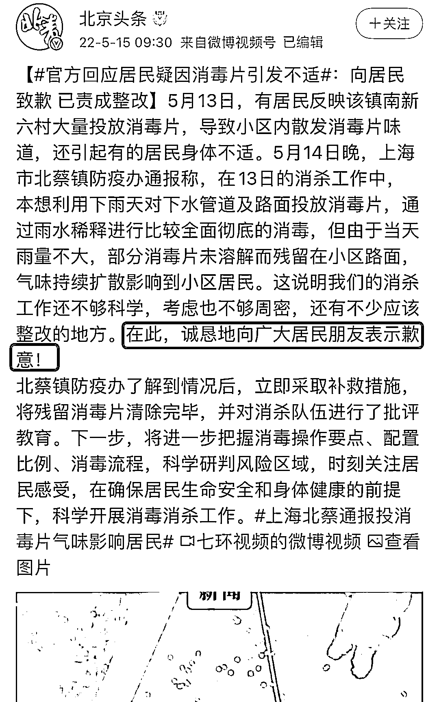

不知道看了这是第几个消杀宠物的新闻了，消杀工作一定要如此简单粗暴吗？

**这件事最让人悲愤的地方在于，它是在上海已经对入户消杀进行反思并纠偏之后发生的。**

上海，因为防疫骂声一片。

我认为是态度粗暴、恶劣的一小群人害了淳朴善良的大部分人。

**大多数防疫人员肯定是很好的，而且很辛苦。**

**但总有一小戳人，他们为了自己的方便，为了自己省事，为了自己的利益，粗暴对待一切，一次次的好事硬是办成了坏事。**

人和人的差距就是这么大，有的人可以上门照顾，有的城市可以有宠物的保管，而有的人就像平日里的流氓，穿上防护服对他们来说简直不要太开心，可以为所欲为。

讲真，在上海的大部分普通人是很无辜。

他们因为疫情被迫卷入，但仍然愿意配合抗疫，愿意配合政府，愿意牺牲小我来保全大局，他们也很不容易。

**但请你们尊重生命，善待生命，哪怕它只是一条宠物狗。**

来源：昌南大队长

← 向右滑动与灰产圈互动交流 →

