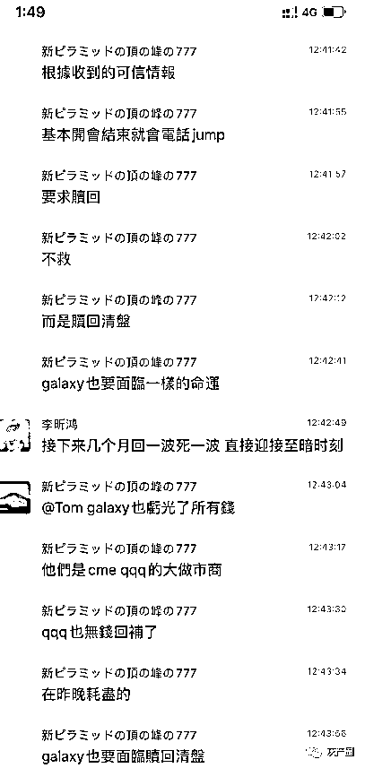
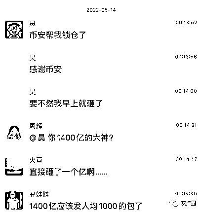

# LUNA 炸雷事件，导致国内明星夫妻直接离婚，赵长鹏更是亏损几十亿美金！

> 原文：[`mp.weixin.qq.com/s?__biz=MzIyMDYwMTk0Mw==&mid=2247536120&idx=3&sn=692d39ac00ad109d384e0a91fbc02d72&chksm=97cb86c0a0bc0fd6cf77ea54f9f8f1bc4e05f894511677c587d41fe9b57d3e0e5f139cef1c69&scene=27#wechat_redirect`](http://mp.weixin.qq.com/s?__biz=MzIyMDYwMTk0Mw==&mid=2247536120&idx=3&sn=692d39ac00ad109d384e0a91fbc02d72&chksm=97cb86c0a0bc0fd6cf77ea54f9f8f1bc4e05f894511677c587d41fe9b57d3e0e5f139cef1c69&scene=27#wechat_redirect)

谈谈前几天的 LUNA 事件，我心中到现在还没缓过劲来，也是因为 LUNA，我越来越焦虑了，不知从何时起，总感觉每天码这两个字，就是没劲了。

近 400 亿美金的市值，说归零就归零了？而且拿出数十亿美金的比特币也救不了？ 

这与其说是 LUNA 事件，还不如说是一次行业内大佬之间的财富转移事件，身边亏损 500 个 W 的兄弟数不胜数，都抄底抄在山顶上，连续 4 天，天天跌幅达到 98%，难怪我赵长鹏大哥，连续发推数 10 条，他也是急坏了。

币圈割的不仅仅是币圈韭菜，还有明星韭菜。 在这里又要谈到我们国内的明星夫妻了，此次该夫妇爆仓 3.5 亿。男方之前也是国内的京城四少之一，因为生意失败，导致欠款数亿，作为花旦的老婆重出江湖，辛辛苦苦拍戏，努力还清债务，并且仍赚有巨款，你说这以后该是夫妻美满、一段佳话了吧？但是老公偏不，其老公仍数次在币圈亏损。

这次 LUNA 的爆仓，女方是真的抗不住了，迫于舆论压力，女方发表了言论，但是，不做亏心事，不怕鬼敲门，为什么要出来澄清？他们是公众人物，炒币这种事在我国影响并不好，所以...

其实一方面，LUNA 本身的策略就存在问题，但是还有一种说法，我之前没有提及到：LUNA 遭遇了索罗斯式的做空狙击战。LUNA 基金会从购入了 10 亿美元的 BTC 开始已经被盯上了。币圈索罗斯（简称币索）准备了 10 亿 UST，并且先建好 BTC 和 LUNA 空仓。

趁 LUNA 从 curve 上 3pool 撤资为即将启动的 4pool 做资金准备的流动性变薄的间隙，币索精准用 3.5 亿 UST 猛砸 curve，造成脱锚。这时，LUNA 出来对抗。卖 BTC 救锚，于是币索用剩下的 UST 砸向币安。

UST 脱锚严重，UST 挤兑。LUNA 战略失误后，却进一步猛砸 BTC 救 UST，BTC 暴跌。且由于 UST 和 LUNA 之间的跷跷板机制，销毁 UST 需要发行 LUNA，LUNA 供应反而增加，LUNA 暴跌。

这也是网上比较流行的说法，其实也可能就是整个事件的真相。

币索的 BTC 和 LUNA 空仓盈利保守估计超过 10 亿美元，整体操作成本在 UST 砸盘部分，却不会超过 2 亿美元。所以如果 LUNA 当初不去沾惹 BTC，又怎么会被币索盯上，庄家想吃的肉太多，自己的韭菜就被偷走了。

除去币安的亏损，网上也流传做市商 JUMP，Galaxy 亏空的信息，圈子的整体状态一般都是这样同步的。

你看，有人亏，就会有人赚，一个科学家，10 万人民币怒赚 1 个亿，真的是天文数字了。

机会把握在每一个人手中，不操作，就不会有；当然你操作了也不一定有。这里面的时间卡得太 si 了，但是风险伴随着高收益，这点谁都知道。我们也还是要恭喜这位兄弟，给兄弟个忠告，赚了钱不要去玩合约，好好的看看世界，回来抄个底就行了。

这还有一个要挨打的人开始鄙视我们这些老币圈人的，一段嘲讽我们的段子：

大家好，我是币圈小白，我是 5 月 4 号才加入币圈的，刚进来，就有人说，做合约很赚钱。叫我充值 1000U，当时我也不知道什么是 U，我就傻傻的相信我的推荐人，打了 6900 元给他，这是我今年去工地搬砖，除了生活费剩下的所有积蓄。我推荐人叫我注册了一个叫币安的交易所，教我怎样做合约。他告诉，有一个叫露娜的币很不错，说可能会大跌，叫我 100 倍杠杆做空。我傻傻的听话了，在 5 月 5 号那天中午，我 100 倍杠杆梭哈做空露娜，我记得当时的价格是 87，我操作完成后，我又去搬砖了，期间我忘记了币安交易所的密码，到了 5 月 11 号中午才想起密码是多少，好不容易登录进去，发现这个露娜只有不到 6u 的价格了，下我一大跳，辛苦搬砖的钱呀，于是我赶紧出手！一出手，感觉走跑得真快，不然喝水的钱都会没了。然后我去问我的推荐人怎么办？他反复问我说：你才出手？至少问了我十遍！我当时非常确定的告诉他，是的，刚出手，这下亏大了！ 

他说，你啥呀，你看看你现在账户里的余额！

我这才想起去看，妈呀，咋变这么多？近 200 万 u！

到了 13 号上午，也就是昨天，我才回过神来，我这是发财了呀！终于不用搬砖了！

 我再去看露娜，价格只有 0.000002 了，我心一横，买了 10000U 的露娜，心想管它的，反正我那么多 U，买了后，我就找人卖 U 去了，昨天我就卖了 20 万 U 出去，得到了 130 多万人民币，然后去买了一辆奔驰 E450。开车回农村老家逛了一圈，然后又回到城里大街上逛了一圈。哪个博士音响针她妈得劲……

 到了今天晚上七点左右，我又打开交易所去看露娜。噫，涨到 0.006 了，于是我又果断卖掉，我现在的账户余额又多了 300 万 U 了！现在总共有 476 万 U，折合人民币大概有 3300 万吧，我决定退出币圈了，说真的，不好玩，赚钱太容易了。我就 6900 元起家的…… 

对上面那是赚钱的，别忘了亏钱的才多呢？负债累累走向极端的比比皆是，luna 成就了一批人，同时毁掉了一大批人。

嗯，是的，我确实靠 LUNA 买了特斯拉，不过就是在元宇宙、在我的梦里罢了。其实这次 LUNA 真正抄到谷底的和做空的人来说都是财富自由了。倒也不用羡慕别人，你说，韭菜也会有春天对不对？下次再把韭菜头伸过去吧...挺好...

[`mp.weixin.qq.com/mp/readtemplate?t=pages/video_player_tmpl&action=mpvideo&auto=0&vid=wxv_2403383198723391491`](https://mp.weixin.qq.com/mp/readtemplate?t=pages/video_player_tmpl&action=mpvideo&auto=0&vid=wxv_2403383198723391491)

[`mp.weixin.qq.com/mp/readtemplate?t=pages/video_player_tmpl&action=mpvideo&auto=0&vid=wxv_2403383920730882051`](https://mp.weixin.qq.com/mp/readtemplate?t=pages/video_player_tmpl&action=mpvideo&auto=0&vid=wxv_2403383920730882051)

来源：资金盘排行

← 向右滑动与灰产圈互动交流 →

