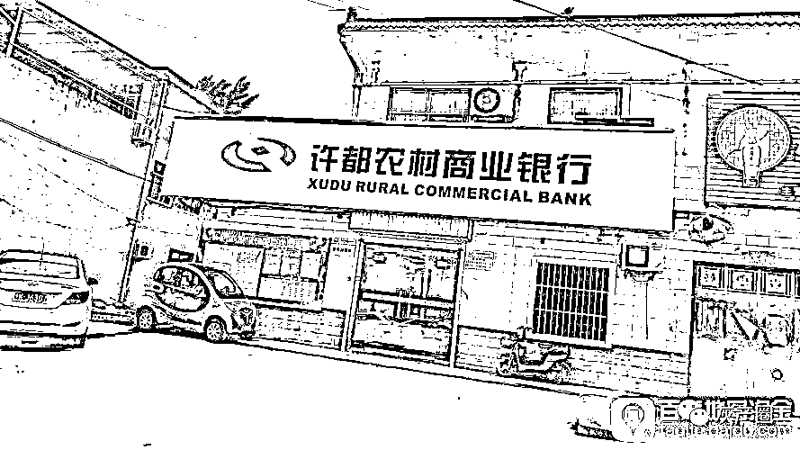
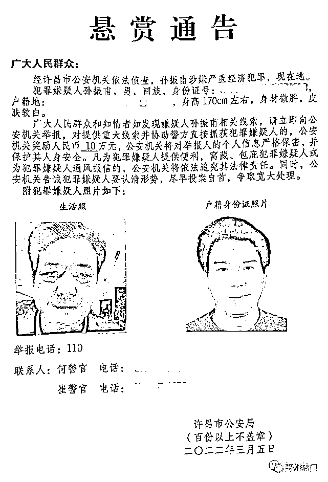
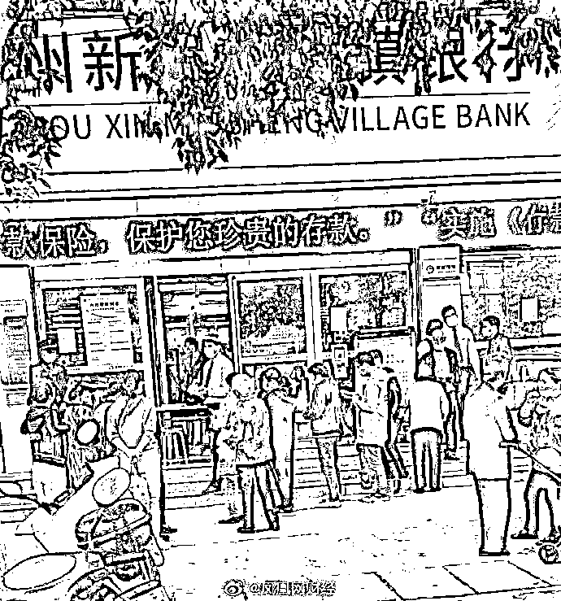
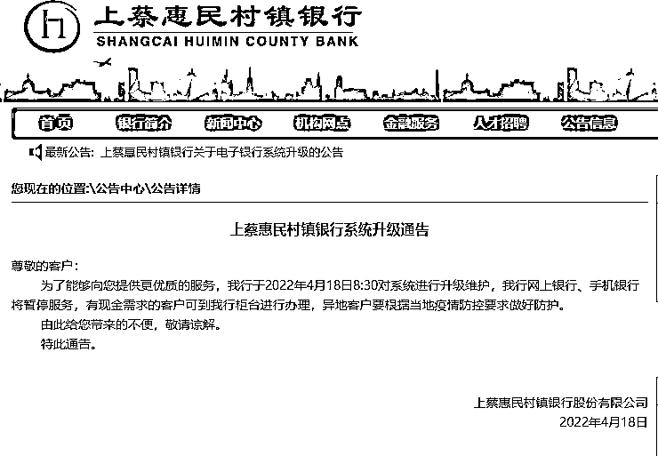
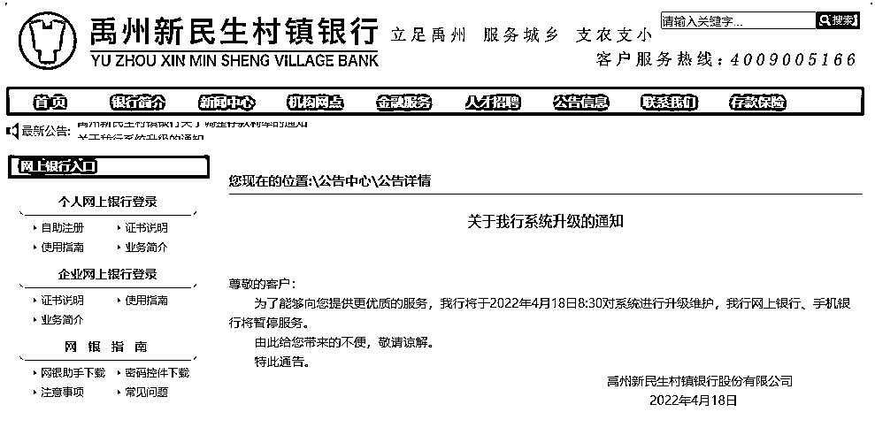
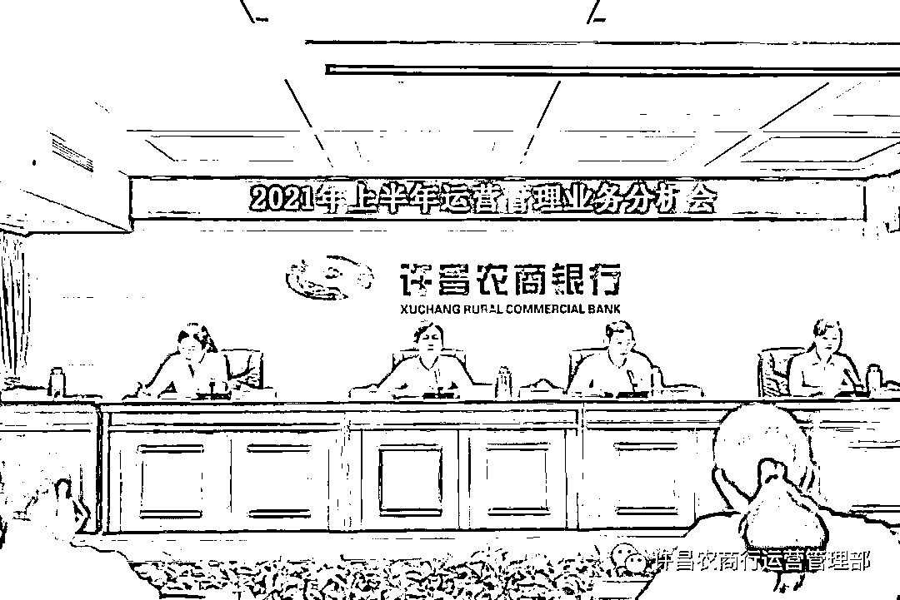
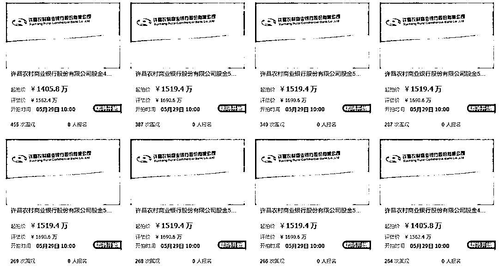
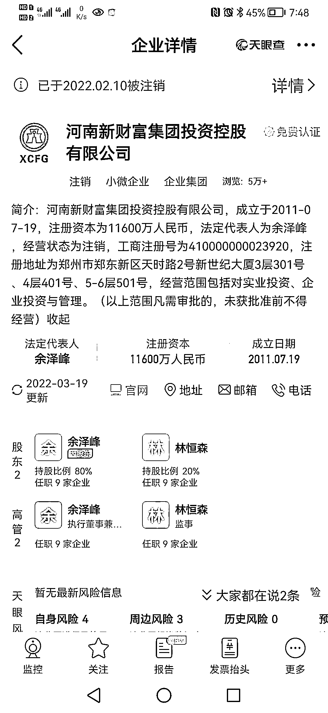
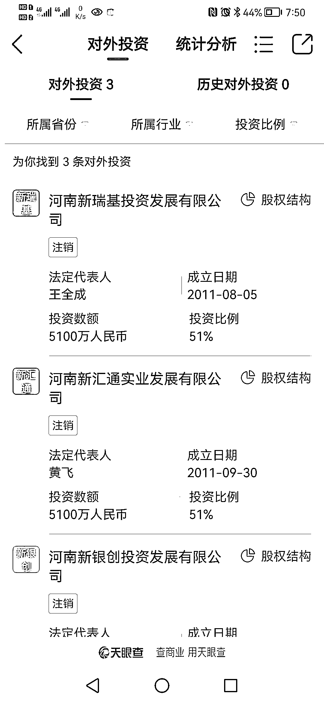

# “银行存款取不出，副行长被通缉了”

> 原文：[`mp.weixin.qq.com/s?__biz=MzIyMDYwMTk0Mw==&mid=2247536120&idx=4&sn=05199f724089dd0b6e5b03f659a2113d&chksm=97cb86c0a0bc0fd65df1b429d2ecadfecf35ee51fc5086d8b9ad6d45b48e7ed5ddab57601761&scene=27#wechat_redirect`](http://mp.weixin.qq.com/s?__biz=MzIyMDYwMTk0Mw==&mid=2247536120&idx=4&sn=05199f724089dd0b6e5b03f659a2113d&chksm=97cb86c0a0bc0fd65df1b429d2ecadfecf35ee51fc5086d8b9ad6d45b48e7ed5ddab57601761&scene=27#wechat_redirect)

整整一个月了，李女士存在银行的 58 万元还是取不出来。

李女士是江苏苏州人，**两年前通过互联网软件在河南的上蔡惠民村镇银行、柘城黄淮村镇银行共存入 58 万元**，这些钱包含她父母的养老金。银行的理财产品让她每月都有些收益，但从今年 4 月 18 日起，她存在这两家银行的钱再无收益入账，后来连本金取款也无法操作了。

和李女士一样担心存款安全的，有六家村镇银行的线上储户。4 月 18 日和 19 日，豫皖两地的六家村镇银行先后发布通告称，因“系统升级”，暂停网上银行和手机银行的服务。截至目前，线上业务尚未恢复。

这 6 家村镇银行包括河南省 4 家、安徽省 2 家，分别是：河南省许昌市的禹州新民生村镇银行、驻马店市的上蔡惠民村镇银行、商丘市的柘城黄淮村镇银行、开封市的新东方村镇银行，以及安徽省蚌埠市的固镇新淮河村镇银行，黄山市的黟县新淮河村镇银行。

上述 6 家村镇银行中，有 5 家银行的发起行和大股东均为许昌农村商业银行（以下简称“许昌农商行”）。值得注意的是，今年 3 月，许昌市公安局曾发布《悬赏通告》，悬赏 10 万元通缉涉嫌“严重经济犯罪”的在逃嫌疑人孙振甫。从 2018 年起，孙振甫担任许昌农商行的副行长。

**悬赏通缉两个月后，孙振甫是否归案？**5 月 16 日，许昌警方的办案民警告诉澎湃新闻，相关案情还不便透露，不过，此前悬赏 10 万元征集线索的《悬赏通告》“已经作废”。

孙振甫涉嫌的“严重经济犯罪”是否与村镇银行相关？目前警方尚未公布。而多家涉事村镇银行的客服热线提示，有不法分子曾利用其线上渠道进行经济犯罪。许昌市公安局 110 工作人员提醒线上储户，应及时向警方登记相关信息；经初步调查，与许昌农商行关联紧密的河南新财富集团投资控股有限公司（以下简称“河南新财富集团”），涉嫌非法吸收公众存款。

银保监会和央行持续关注此事，已责成河南金融监管部门配合相关部门进行稳妥处置。

5 月 18 日，澎湃新闻记者从许昌禹州市公安局获悉，禹州警方已经介入村镇银行的相关案件，目前正在全面侦办中。

**豫皖两地 6 家村镇银行暂停线上业务**

存在两家村镇银行的 58 万元取不出，苏州的李女士很着急。她告诉澎湃新闻，2020 年，她通过手机上的“钱包”软件，在河南上蔡惠民村镇银行和柘城黄淮村镇银行共存入 58 万元，购买了这两家银行的理财产品。今年 4 月 18 日，她打开手机钱包，发现一天前的收益没有入账。

李女士是个谨慎的人，马上想到把 58 万元本金存款取出来。她在手机上操作时，却发现两家村镇银行的电子账户均显示系统正在维护，无法提现。

李女士的遭遇并非个例，而是波及六家村镇银行的线上储户。4 月 18 日和 19 日，这六家村镇银行分别通过网站、微信公号、APP 等途径发布“系统升级通告”，称因系统进行升级维护，其网上银行、手机银行暂停服务。

涉事村镇银行关闭线上渠道后，一些储户到营业点排队取款。图片来源于凤凰网

上述 6 家村镇银行，包括河南省的 4 家：许昌市禹州新民生村镇银行、驻马店市上蔡惠民村镇银行、商丘市柘城黄淮村镇银行、开封市新东方村镇银行；还包括安徽省的 2 家：蚌埠市固镇新淮河村镇银行，黄山市黟县新淮河村镇银行。

据接受澎湃新闻采访的线上储户介绍，通过互联网平台在豫皖两地村镇银行存款理财的，大多是省外人，主要来自广东、江苏、山东等经济较发达地区。虽然相关村镇银行通告称，线下网点可正常取款，但受疫情、交通等因素影响，大多线上储户仍在等待消息，没有去涉事银行网点。

上蔡惠民村镇银行的通告。图片来源于该行官网截图

4 月 19 日，作为互联网智慧银行科技服务商，君正智达（深圳）科技发展有限公司向相关部门递交书面报告，题为《关于禹州新民生银行、柘城黄淮村镇银行、上蔡惠民村镇银行、固镇新淮河村镇银行四家村行关闭一切线上渠道资金支付业务导致互联网平台出现大面积投诉及发生严重挤兑情况的问题反映》。

禹州新民生村镇银行的通知。图片来源于该行官网截图

这份加盖了公司印章的书面报告显示，君正智达公司为上述四家村镇银行提供数字化转型服务，并为银行互联网存款业务对接外部互联网平台。2000 年，该公司应四家村镇银行的要求，帮助其银行系统对接了度小满、京东金融、滨海国金所等互联网平台，四家村镇银行在度小满等合作互联网平台销售各行的存款产品，后因相关规定停止该业务。

君正智达公司在报告中称，4 月 18 日四家村镇银行强制关停线上渠道资金支付业务，导致互联网存款客户无法提现取款，已出现线上线下挤兑情况及大量负面舆情。

“上述四家村行在各大互联网平台的存续互联网存款规模上百亿，涉及客户近百万人。”君正智达公司称，作为银行及互联网平台的合作伙伴，其已多次向四家村镇银行及其发起行许昌农商行反映情况、提示风险，均未给出解决方案，故向相关部门反映，希望“不良舆情及挤兑风险”得到及时化解。

受访的多名涉事银行储户称，他们在一两年前，通过度小满、京东金融等互联网金融平台，购买了相关村镇银行的存款产品，获得的利息收益比一般银行要高。2021 年监管部门出台相关规定后，这些线上储户大多根据村镇银行提示，通过银行的微信小程序或 APP，以网上银行、手机银行的渠道操作。

上述监管规定，是指 2021 年 1 月银保监会和央行下发的《关于规范商业银行通过互联网开展个人存款业务有关事项的通知》，该文件要求，商业银行不得通过非自营网络平台开展定期存款和定活两便存款业务。

5 月 18 日，距离豫皖两地六家村镇银行“暂停”线上业务已整整一个月，这些银行的网上银行、手机银行系统仍未恢复使用。

澎湃新闻记者近日联系了多家银行。安徽黟县新淮河村镇银行营业部工作人员称，“现在系统还在维护”；安徽固镇新淮河村镇银行的客服则称：“因为我行近期线上业务发生了异常，为了保护大家的合法权益，所以暂停关闭线上业务，现在有关部门正在核查。”

河南禹州新民生村镇银行的热线客服提示：“近期有不法分子利用我行线上渠道进行经济犯罪活动，为保护广大客户的合法权益，我们暂停了线上渠道业务，现已报案，有关部门正在调查。”记者按其提示按键询问“进展情况”，则传出一段语音：“公安机关正在全力侦办中……请您耐心等候通知。”

**村镇银行背后的农商行：副行长被通缉，股权频繁出质**

此次关停线上资金业务的 6 家村镇银行，除了开封新东方村镇银行外，其他 5 家的发起行和大股东，均为许昌农商行。

许昌农商行 2021 年举行的工作会议。图片来源于该行运营管理部微信公号。

工商信息等公开资料显示，许昌农商行前身是许昌魏都农商行，成立于 2009 年 11 月。许昌魏都农商行是在原许昌市魏都区农村信用合作联社的基础上，经过股份制改造成立。2017 年 10 月，该行更名为许昌农商行。

在对外投资上，许昌农商行是 5 家村镇银行的大股东。在上蔡惠民村镇银行和柘城黄淮村镇银行，许昌农商行的持股比例均为 51%；在禹州新民生银行，它持股 20.5%；在安徽的固镇新淮河村镇银行和黟县新淮河村镇银行，许昌农商行均持股 40%。

村镇银行是县域地区的法人银行机构。根据银保监会公布的信息，我国自 2006 年启动村镇银行试点，截至 2020 年 9 月末，全国共组建村镇银行 1641 家，已覆盖全国 31 个省份的 1306 个县（市、旗）。

根据《村镇银行管理暂行规定》，设立村镇银行的发起人或出资人中，应至少有 1 家银行业金融机构，且最大股东也必须是银行业金融机构。

在此政策背景下，2011 年至 2016 年，许昌农商行（原魏都农商行）作为发起行，成为禹州新民生村镇银行、上蔡惠民村镇银行等 5 家村镇银行的最大股东。

2022 年 4 月 18 日，许昌农商行控制的 5 家村镇银行，均关停了网上银行、手机银行等线上资金业务。就在一周前，许昌农商行财务部门发生人事变化，银保监部门核准周莹莹担任该行计划财务部总经理。而在一个月前，警方一则《悬赏通告》令许多人“大跌眼镜”——许昌农商行副行长孙振甫竟成为一名逃犯。

3 月 5 日许昌市公安局发布的《悬赏通告》显示，“经许昌市公安机关依法侦查，孙振甫涉嫌严重经济犯罪，现在逃。”通告称，对提供重大线索并协助警方抓获犯罪嫌疑人的，公安机关奖励人民币 10 万元。

孙振甫是许昌禹州人，曾先后担任禹州市开发区城市信用社主任、襄城县农村信用合作联社理事长。中国银保监会河南监管局的官网信息显示，2018 年 6 月，经许昌银监分局核准，孙振甫担任许昌农商行的副行长。此外，孙振甫曾连任多届省、市人大代表。

据许昌市人大常委会网站公布，2021 年 12 月 25 日，许昌市七届人大常委会举行第四十七次会议，表决通过了《关于许可对许昌市第七届人民代表大会代表孙振甫采取强制措施的决定》。两个月后，许昌市公安局发布了通缉孙振甫的《悬赏通告》。

孙振甫涉嫌的“严重经济犯罪”，是否与许昌农商行旗下的村镇银行有关？他目前是否归案？5 月 16 日，澎湃新闻记者根据《悬赏通告》联系上许昌警方的崔警官。该民警表示，此前悬赏 10 万元征集线索的悬赏通告“已经作废”，相关案情还不便透露。

目前，许昌农商行的法定代表人，是 2021 年 3 月接替张金保的邢进军。据工商信息披露，许昌农商行的注册资本为 10 亿元，现有股东 73 名，股权较为分散。目前第一大股东为许昌德亿田农资公司，持股比例约 1.25%。值得注意的是，73 名股东中的 25 名，已被列为失信被执行人。

近年来，许昌农商行频频出现股权出质的情况，目前可查到的股权出质有 90 项。据《中国经营报》2021 年 11 月报道，许昌农商行有 76892 万股的股权已被出质。质押股权的一些实际股东并不在工商注册的股东名单中，而是通过他人代持成为“隐形”股东。

比如驻马店市中兴商贸公司、长葛市华轩实业公司这两家企业，均不在许昌农商行的股东名单中，但都向开封宋都农商银行出质了其持有的许昌农商行股权，抵押股权分别累计达到 4500 万股、4200 万股。

商业银行股权代持显然并非合规行为。《商业银行股权管理暂行办法》第十二条规定：商业银行股东不得委托他人或接受他人委托持有商业银行股权。

“隐形”股东的股权出质，让许昌农商行的部分股权面临诉讼风险。2022 年 4 月 28 日，开封市祥符区法院在人民法院诉讼资产网连续发布 8 条拍卖公告，拍卖标的就是许昌农商行的股金。

许昌农商行部分股金拍卖信息。图片来源于阿里拍卖网。

上述 8 条拍卖信息目前已出现在互联网拍卖平台，拍卖的许昌农商行股金共计 4200 万股，评估价合计 1.3 亿余元，起拍价合计约 1.19 亿元。拍卖时间为 5 月 29 日至 30 日。

**新财富集团浮出水面，涉嫌非法吸收公众存款**

股金质押拍卖、股权代持、股东“隐形”，许昌农商行在经营过程中出现的一些问题进入了监管部门的视线。

事实上，在 2018 年 1 月，中国银监委员会就颁布了《商业银行股权管理暂行办法》，以此规范商业银行股权管理和公司治理。也正是在这一年，许昌农商行被监管部门处罚了两次。

当年 8 月 7 日，许昌银监分局对许昌农商行作出警告，并罚款 20 万元，处罚的事由是该行“各项治理主体责任和义务落实不到位，公司治理制衡机制不健全”。20 天后，许昌银监分局再次对许昌农商行作出行政处罚，罚款 30 万元，处罚事由为“通过同业业务隐匿资金实际投向，违规办理同业业务”。

许昌农商行旗下的多家村镇银行开展互联网存款业务后，据多名线上储户反映，村镇银行推出的存款理财产品，其利息大多高于其他银行，年化收益率一般超过 4.6%。而过高的吸收存款成本，可能给银行追求利润带来风险。比如此次关停线上业务的四家河南的村镇银行，均因在放贷过程中违规而受到过行政处罚。

禹州新民生村镇银行、上蔡惠民村镇银行等六家村镇银行关停线上资金渠道后，发起行许昌农商行及其与背后资本的关联，引发业界关注。

与许昌农商行关系紧密的“合作伙伴”中，一家叫河南新财富集团的企业浮出水面。

河南新财富集团的工商注册信息。图片来源于天眼查。

工商信息显示，河南新财富集团成立于 2011 年，注册地址为郑州市郑东新区，注册资本 11600 万元，经营范围是“对实业投资、企业投资与管理”。该公司股东有两人，分别是持股 80%的余泽峰、持股 20%的林恒森。

据财新报道，河南新财富集团与许昌农商行发起设立的多家村镇银行都有关联，或作为“隐形”股东间接持股；有河南银行业人士透露，开封新东方村镇银行原来的实控人也是河南新财富集团，后来新财富集团退出，由河南新郑农商行控股 30%；河南新财富集团背后的实际控制人，或为商人吕奕。

河南新财富集团曾卷入郑州银行原副行长乔均安受贿一案。公开报道显示，2018 年 10 月，乔均安因受贿罪被郑州中院判处有期徒刑十四年。一审判决书披露，2007 年至 2016 年，乔均安利用职务便利，为河南新财富集团董事长吕某控制的公司在郑州银行贷款提供帮助，后来向吕某索要累计 2394 万余元，事发后退还。

在对外投资方面，河南新财富集团是三家企业的大股东，持股均为 51%。这三家企业是：河南新瑞基投资发展公司、河南新汇通实业发展公司、河南新银创投资发展公司。

河南新财富集团及其控股的三家企业，均已注销。图片来源于天眼查。

有些蹊跷的是，上述三家由河南新财富集团控股的公司，均在 2020 年 7 月被注销。2022 年 2 月，河南新财富集团也被注销。

就在河南新财富集团被注销两个月后，禹州新民生村镇银行等六家村镇银行关闭了线上取款、转账等资金渠道。

这些村镇银行的线上储户急了。4 月 24 日，已经报过警的储户王芳（化名）打电话给许昌市公安局 110 询问进展。在通话录音中，110 工作人员表示，经警方初步调查，与相关村镇银行有合作的河南新财富集团涉嫌非法吸收公众存款，目前警方正在展开进一步的调查取证。

110 工作人员还让王芳向警方邮寄身份证复印件、银行账号、存款和转账凭证、是否购买理财产品等材料，并可将相关进展转告其他储户，“让大家配合公安机关调查取证。”

一些储户担忧，存入相关村镇银行的钱，是不是流入了某些关联企业的腰包？

针对开封新东方村镇银行线上取款难的问题，4 月 22 日，央行开封市中心支行和开封银保监分局曾发布公告称，开封新东方村镇银行足额缴纳了存款准备金，且参加了存款保险，存款人的合法存款受法律保护。

根据《存款保险条例》，为防范和化解金融风险，我国的商业银行应按规定投保存款保险。存款人的存款本金和利息合并后，可获得保险基金偿付的最高限额为 50 万元，超出限额部分可依法从投保机构清算财产中受偿。

目前，河南等地多家村镇银行关闭线上服务渠道一事，已引起金融监管部门重视。据 5 月 18 日证券时报报道，银保监会与人民银行已责成河南银保监局和人民银行郑州中心支行履行监管职责，配合当地党委政府和相关部门稳妥处置。据了解，相关村镇银行股东——河南新财富集团通过内外勾结、利用第三方平台以及资金掮客等吸收公众资金，涉嫌违法犯罪，公安机关已立案调查。

5 月 18 日，澎湃新闻从河南禹州市公安局了解到，目前，涉及村镇银行的相关案件仍在全面侦办中。

**来源：澎湃新闻，新华每日电讯 作者：记者朱远祥、实习生曾毅伟**********

**← 向右滑动与灰产圈互动交流 →**

****