# 央视曝光：“情感挽回”骗局！已有 5000 多人被骗……

> 原文：[`mp.weixin.qq.com/s?__biz=MzIyMDYwMTk0Mw==&mid=2247536120&idx=6&sn=8790c7a329314a4825c973678f0c9437&chksm=97cb86c0a0bc0fd606ecd6da4112995593962fcd654b280fcda0f0488126be4fb07bab51aea7&scene=27#wechat_redirect`](http://mp.weixin.qq.com/s?__biz=MzIyMDYwMTk0Mw==&mid=2247536120&idx=6&sn=8790c7a329314a4825c973678f0c9437&chksm=97cb86c0a0bc0fd606ecd6da4112995593962fcd654b280fcda0f0488126be4fb07bab51aea7&scene=27#wechat_redirect)

国家反诈中心数据显示，在 2021 年电信网络诈骗的受害者中，18 至 35 岁的年轻人占到总数的 65.5%。前不久，上海警方破获了一起新型网络骗局。犯罪团伙打着专业情感咨询机构的旗号，诱骗失恋的年轻人购买所谓“情感挽回服务”，骗取钱财。不法分子究竟是如何实施诈骗的？案件又是如何侦破的呢？

**挽回感情靠机构？都是来骗你钱的**

[`mp.weixin.qq.com/mp/readtemplate?t=pages/video_player_tmpl&action=mpvideo&auto=0&vid=wxv_2405270245906284547`](https://mp.weixin.qq.com/mp/readtemplate?t=pages/video_player_tmpl&action=mpvideo&auto=0&vid=wxv_2405270245906284547)

△央视财经《经济半小时》栏目视频

2021 年 3 月，上海的林女士失恋了，情绪非常低落。一个偶然的机会，她看到了一家心理咨询机构打出的广告，类似“让爱情不留遗憾”的口号让林女士很心动。随后，她拨通了这家机构的咨询热线。

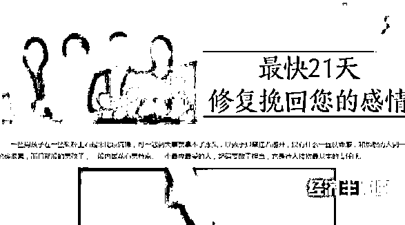

客服人员将林女士引荐给了一位所谓的心理导师。这名心理导师表示，她很擅长处理类似林女士遭遇的这种情感问题，经过她的指导，林女士一定可以成功挽回前任。

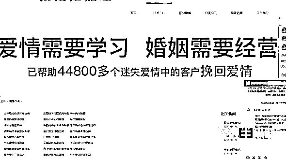

同意接受服务之后，心理导师告诉林女士，她需要缴纳 3888 元的费用。接受服务期间，那个心理导师一直像知心朋友一样，安抚着林女士的情绪，为她出谋划策。只是，林女士并没有因此而等到前男友回心转意的消息。

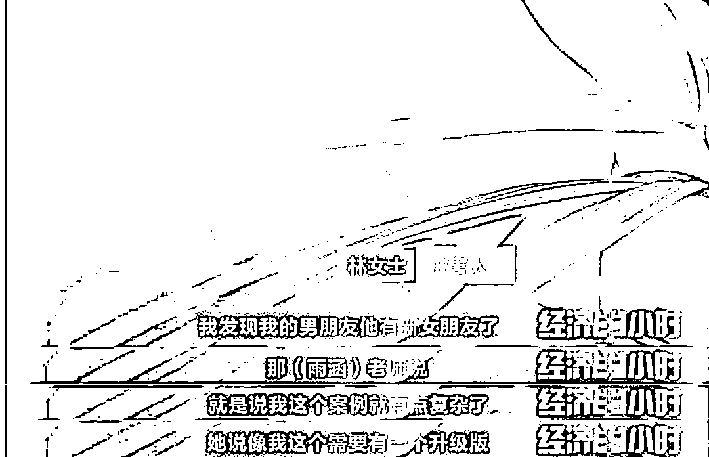

在心理导师的劝说下，林女士又花了 13888 元，升级更专业的服务。

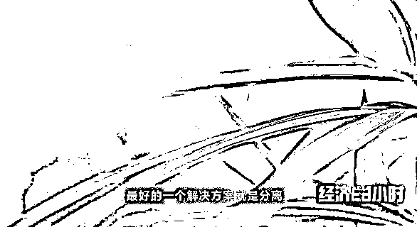

心理导师告诉林女士，所谓的分离方案，就是虚拟一个第三者身份，离间林女士的“情敌”与前男友，让林女士和前男友重归于好。然而，二十天的服务周期很快过去了，林女士并没有看到任何的成效。

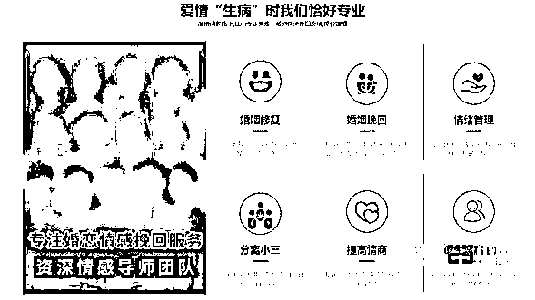

跟林女士有着同样经历的，还有文先生。文先生也是在情感受挫后，主动联系了这家心理咨询机构。在所谓导师的诱骗之下，他先后三次，分别缴纳了 3280 元、18888 元和 15000 元费用，但没想到的是，费用交了，女朋友没回来，原本态度积极的心理导师也联系不上了。

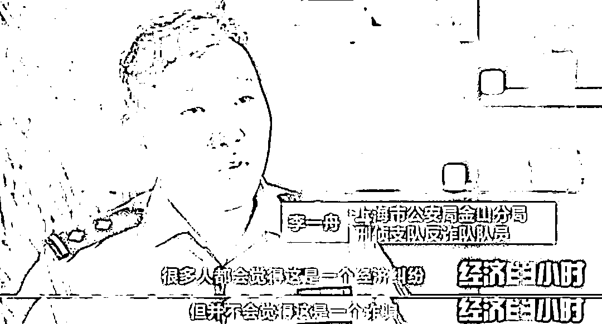

警方对这家心理咨询机构的运营情况展开了外围调查，发现这家机构主要分为客服部、分析部、咨询部以及后勤部四个部门。

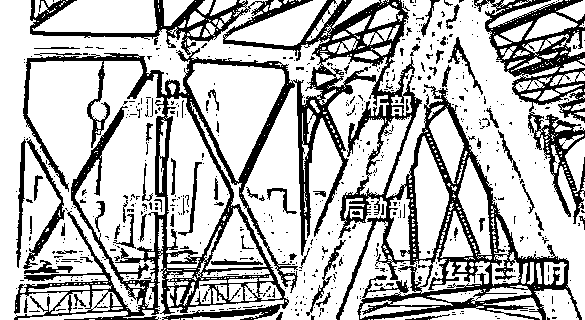

一旦客服部的业务员锁定目标，就会立刻将客户的信息推送给分析部，心理导师马上出场。

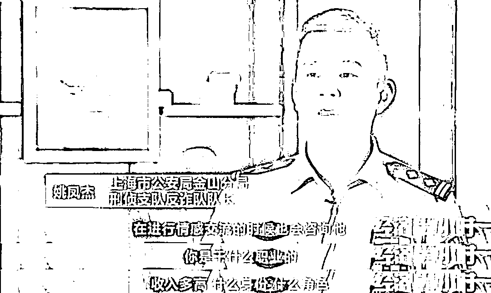

心理导师声称，他们会根据挽回情感的难易程度，收取 2888 到 4888 元不等的费用，但实际上，收取费用的多少，完全是根据客户的收入情况来确定的。

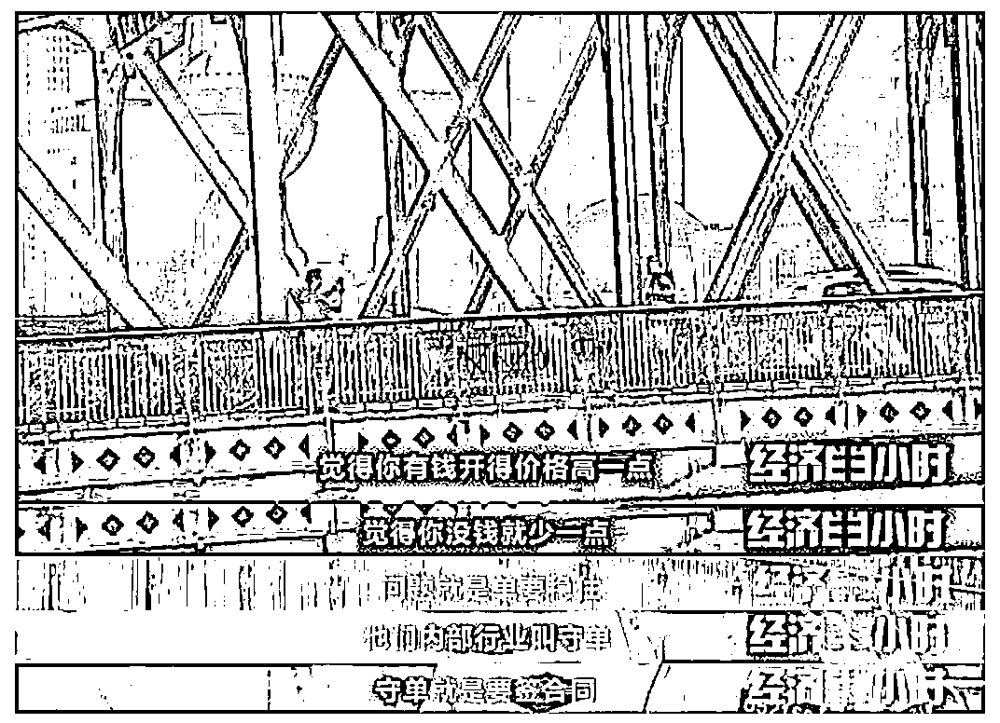

签完服务合同后，这些心理导师会每天给客户汇报所谓的工作进度，并逐步向客户提出解决问题的新方案，以及解决问题需要的升级费用。

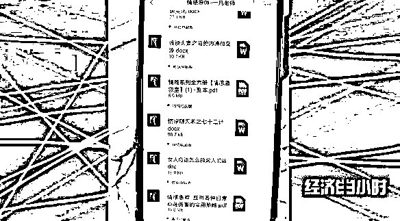

一旦客户对服务不满，或是产生怀疑，这家机构的后勤部就出面应付各种投诉，有的还会退还两三千元作为补偿。

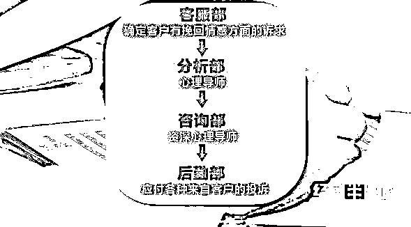

和动辄上万元的服务费相比，两三千元的退款并不多，但是客户往往会因为后勤部人员的各种解释，最终打消了继续投诉的念头。

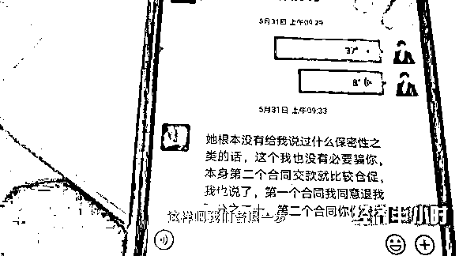

经过深入调查，上海金山警方认定，这家所谓的心理咨询机构以解决情感纠纷为名，伪造事实和服务内容，骗取客户的服务费，涉嫌构成诈骗罪。2021 年 6 月 3 日，警方展开了收网行动，五处窝点共抓获涉案人员共计 117 人。

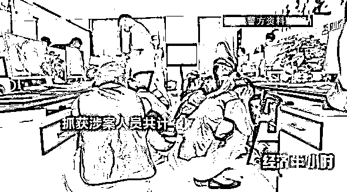

在该团伙的多处窝点，侦办民警都搜到了大量的客户资料、签约合同以及话术本。

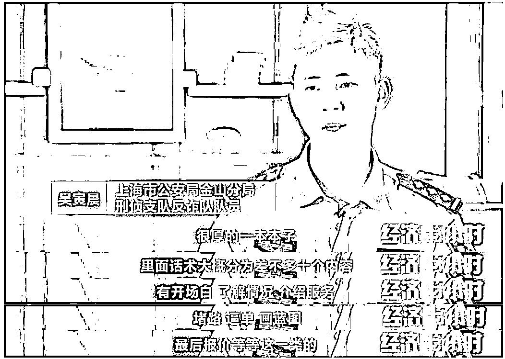

警方发现，该案件涉及的被害人遍布全国各地，涵盖了不同年龄段，总人数多达五千余人。而这家机构给客户们强调的所谓个性化心理咨询服务、各种成功案例，完全都是伪造、包装出来的。

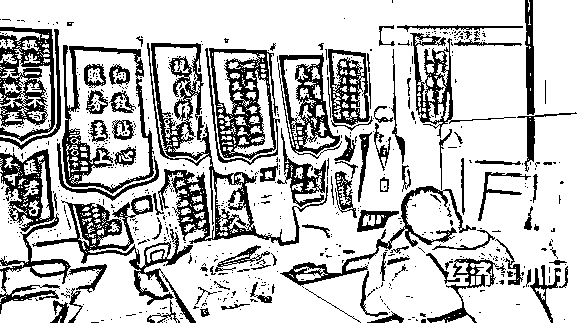

而这家机构最吸引客户的所谓王牌服务：包括窥探他人隐私、掌握行踪轨迹，甚至采用第三方介入的方式左右他人情感等等，都是骗人的把戏。

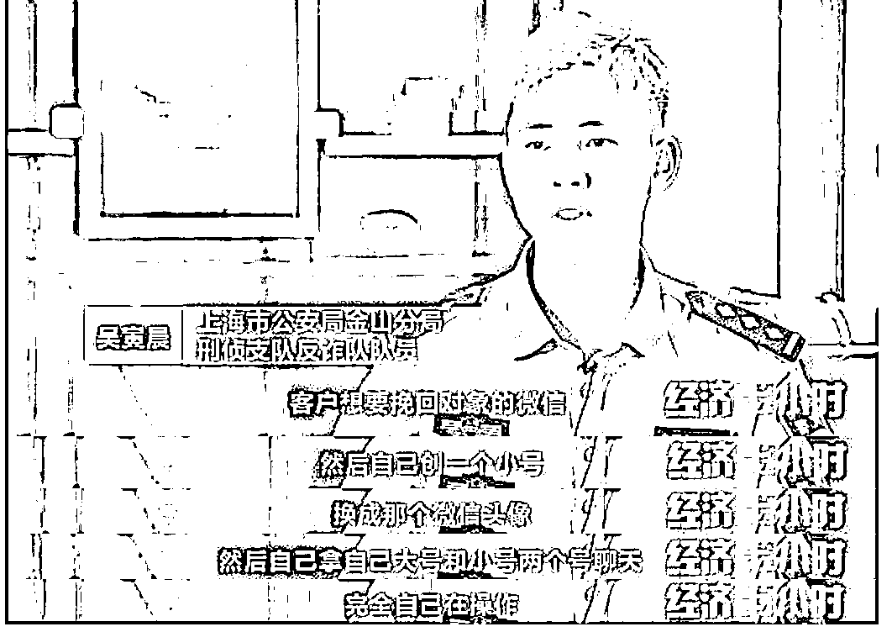

2021 年 12 月 30 日，上海市金山区法院依法公开开庭宣判“情感挽回大师”诈骗案，对被告人肖某某、王某某等 55 名被告人以诈骗罪分别判处有期徒刑十一年至拘役四个月，缓刑四个月不等，并处罚金人民币 20 万元至 2000 元不等。

**半小时观察——筑牢防诈反诈的坚实堤坝**

近年来，公安机关不断加大对诈骗犯罪的打击力度，有效遏制了这类犯罪蔓延的势头。面对公安机关的打击，当前诈骗犯罪呈现出一些新的特点。犯罪手段不断翻新，诈骗团伙具有专业化、公司化特征，犯罪手段智能化。在这里我们要提醒广大群众，在日常生活中一定理性消费、不要贪图小便宜，同时，针对诈骗犯罪的新特点，警方正在与多部门联手，形成打击诈骗犯罪的整体合力，保护人民群众的财产安全。

来源：央视财经（ID：cctvyscj）

← 向右滑动与灰产圈互动交流 →

