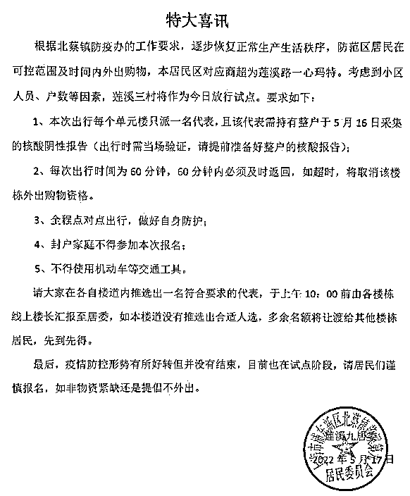
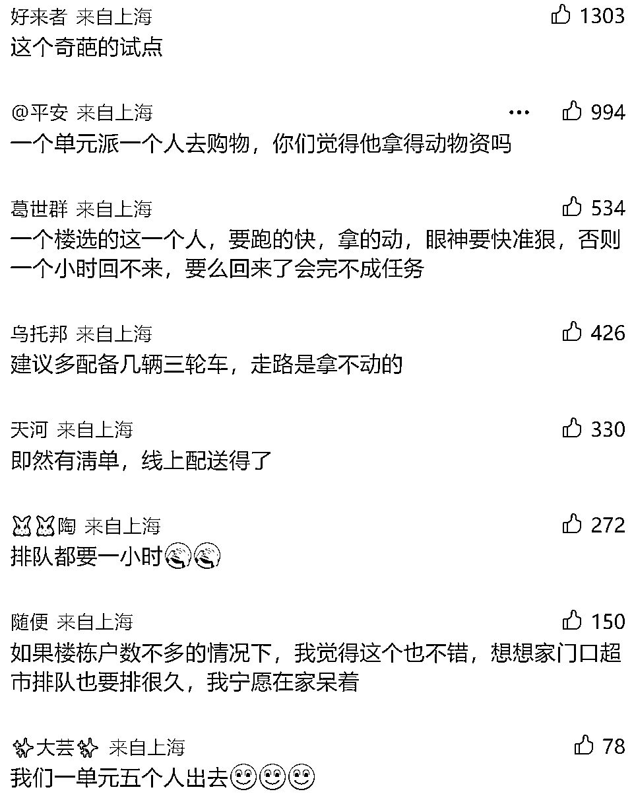

# 上海一小区发喜讯：每单元派 1 名代表购物 1 小时？居委回应

> 原文：[`mp.weixin.qq.com/s?__biz=MzIyMDYwMTk0Mw==&mid=2247536120&idx=7&sn=c116c13999638283c5c9e8277ecb54b6&chksm=97cb86c0a0bc0fd69858d0235ad8748a1bf78829b2280600530ba9c9667f499f58d9a7005e73&scene=27#wechat_redirect`](http://mp.weixin.qq.com/s?__biz=MzIyMDYwMTk0Mw==&mid=2247536120&idx=7&sn=c116c13999638283c5c9e8277ecb54b6&chksm=97cb86c0a0bc0fd69858d0235ad8748a1bf78829b2280600530ba9c9667f499f58d9a7005e73&scene=27#wechat_redirect)

5 月 17 日

上海市浦东新区北蔡镇

莲溪九居委发布的一则通知

引起关注：

每个单元楼派一名代表出门

购物一小时

对此，莲溪九居委工作人员回应，之所以有这样的规定，是通知中提及的线下营业的超市，**离小区步行只有 5 分钟**，且当天接到上级通知，作为试点执行。**超市对该小区开放的时间总共只有 3 小时，外出名单由居民自主选出。**

****

**▲ 北蔡镇莲溪九居委发布的相关通知**

**这份标题为**《特大喜讯》**的居委通知显示，根据北蔡镇防疫办的工作要求，逐步恢复正常生产生活秩序，防范区居民在可控范围及时间内外出购物，本居民区对应商超为莲溪路一心玛特。考虑到小区人员、户数等因素，莲溪三村将作为当日放行试点。**

**通知列出 5 点要求，其中包括本次出行每个单元楼只派一名代表、每次出行时间为 60 分钟、不得使用机动车等内容。**

**通知还提到，请大家在各自楼道内推选出一名符合要求的代表，于上午 10:00 前由各楼栋线上楼长汇报至居委，如本楼道没有推选出合适人选，多余名额将让渡给其他楼栋居民，先到先得。**

**对此**

**莲溪九居委工作人员解释**

**通知是在接到**

**政府相关要求之后下发的**

**小区之前封控已久，终于有点松动的迹象，所以觉得是喜讯。至于为什么是一个单元一个人外出，每个人只允许外出一小时，是因为通知中提到的一心玛特超市，离小区步行只有 5 分钟，而且超市对该小区开放的时间，只有当天 14 点到 17 点 3 个小时，每个小时顾客限流 20 人。也就是说，总共只接待 60 人。**

****名额 60 人，该小区有 48 个单元。谁出去，怎么分？**该居委人员称，疫情以来，该小区居民自治，每个楼栋选出一名线上楼长。当天，通知下发后，各楼栋由业主推选外出的人。除了一个楼栋一人之外，还有多出的十余个名额，由楼长抽签。**

**居委人员表示，当天下午外出购物的居民，由志愿者统一带领前往超市，超市也有对接的志愿者。超市里基本做到出去一名顾客，放一名顾客进去。各楼栋推选的也多为年富力强的代表。大多带着清单，推着购物车或者行李箱前往。**

**与此同时，该居委人员强调，目前的做法，只是试点，当前的规定下，也只能一步步摸着石头过河。至于之后会怎样，也要根据实际情况等待通知。**

来源：上海动态综合自新闻坊  上海发布、看看新闻 KNEWS、实测

← 向右滑动与灰产圈互动交流 →

