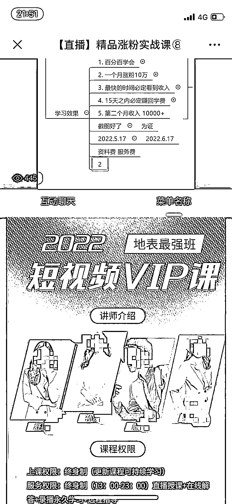

# 无理由退款，轻松月入过万！长沙这类培训班太诱人，背后竟是…

> 原文：[`mp.weixin.qq.com/s?__biz=MzIyMDYwMTk0Mw==&mid=2247536173&idx=4&sn=416cdaa1188f2b0021889ffaf2fac2b0&chksm=97cb8515a0bc0c03d2162dd656895c49774959abee721de08d3a5fefe74ac638cd337a48f1c5&scene=27#wechat_redirect`](http://mp.weixin.qq.com/s?__biz=MzIyMDYwMTk0Mw==&mid=2247536173&idx=4&sn=416cdaa1188f2b0021889ffaf2fac2b0&chksm=97cb8515a0bc0c03d2162dd656895c49774959abee721de08d3a5fefe74ac638cd337a48f1c5&scene=27#wechat_redirect)

在家拿着手机跟着“老师”学习运营短视频

学费只要 2988 元，7 天无理由退款

15 天内必定赚回学费

一个月涨粉 10 万、保底收入 5500 元

第二个月收入万元……

这样的“好机会”，你心动了吗？

长沙甘先生交钱报名后，第二天，他意识到“不对头”提出退款，对方却称只能退 800 余元。

长沙晚报记者了解到，如今步入这种“套路”的人不在少数，而从事类似业务的公司也有不少，亟待相关部门引起重视。甘先生向长沙晚报热线 96333 反映之后，帮帮团记者介入调查，**5 月 18 日，相关公司已全款退还。该公司是否存在虚假宣传，市场监管部门已在对此进行调查。**

**遭 遇**

****交费 2988 元，次日申请退款只能退 800 余元****

****江西赣州的甘先生今年 48 岁，原本开了一家餐饮小店，近期生意不佳，他想着找另一份赚钱的活干。5 月初，他在刷抖音时，看到一条“学习剪辑、运营短视频赚钱”的视频，抱着试一试的想法，在相关链接里填了手机号码。****

****两三天后，一名女子联系他并添加微信，随后连续多日都发来网络链接邀请他听课。在对方每天的提醒下，他点开链接听了几场免费的“公开课”，这些讲课者有的是“老师”，有的是“院长”“CEO”。****

********

****▲ 沙琪教育的讲师在“公开课”上声称可让学员第二个月收入过万元。页面截图****

****甘先生说，虽然讲课者不同，但所讲内容颇有相同之处，而且最终引导听课者扫码添加的，都是湖南沙琪教育科技有限公司（以下简称沙琪教育）的企业微信号。讲课者声称，**学员跟着学习运营短视频，学费只要 2988 元，“7 天无理由退款，一个月涨粉 10 万、保底收入 5500 元，第二个月收入万元……”******

****“他们说自己公司跟抖音、西瓜视频官方都有合作，能给学员大量资源。”甘先生说，讲课者还以微信聊天截图展示学员“成功案例”，声称有的待业在家的全职妈妈跟着其学习，日入数万元，提升了家庭地位。****

****5 月 13 日，甘先生交了 2988 元报名。但交完费后，他便发现，对方拉他进入的聊天群里只有他一个学员，对方原本所说的寄合同之事已只字不提，提醒他上课也不像之前那么积极。感觉“不对头”的他在网上搜索该公司名称，发现网上对该公司的投诉众多。有一些接受培训超过一个月的投诉者称，**实际上根本做不到“15 天赚回学费，一个月保底收入 5500 元”，而且退费困难。******

****5 月 14 日，甘先生便向该公司“老师”提出退费，但对方要么不接电话，要么避而不谈退费事宜，不断劝其继续学。无奈之下，甘先生拨打了长沙 12315 热线。得知此事后，**“老师”给出了退款方案：扣除手续费、服务费、视频费、违约费、粉丝对接费、课程费，可退还 858.76 元。******

****甘先生极为不满：“他们明显涉嫌虚假宣传，之前还说 7 天无理由退款，但我第二天就提出了退款，结果要被扣 2000 多元。”****

******调 查******

********“院长”招“亲传弟子”，宣称可让学员月入过万元********

******5 月 17 日晚上，记者先后点击进入沙琪教育两名讲课者的“公开课”链接，一名自称是“孙某院长”的年轻女子正在直播讲课，**声称她此次要招自己本年度唯一的 10 名“亲传弟子”，每天进行一对一指导，帮助学员运营抖音账号，学习效果包括“一个月涨粉 10 万”“15 天之内必定赚回学费”“第二个月收入 10000+”。********

******随后，她将一个名为“孙某院长”的企业微信号二维码放在屏幕上，让听课者扫码抢唯一的“10 名亲传弟子”名额。**记者以听课者身份添加其微信，对方声称报名后如果不满意课程可以申请退款，而且可以 7 天无理由退款。********

******随后，“陈某老师”在讲课时播放该公司宣传片，展现其“荣誉墙”牌匾，宣称该公司获得了“中国 3·15 诚信品牌”“全国消费者放心满意品牌”“湖南省著名品牌”等荣誉。******

******然而，记者通过国家企业信用信息公示系统查询发现，**沙琪教育注册成立于 2021 年 3 月 29 日。********

********调 查********

********曾接到不少同类投诉，目前在整治********

******“类似的公司确实有一批，我们也接到过不少投诉。仅关于沙琪教育的投诉，我们每个月就会接到一二十起。”长沙高新区市场监管局麓谷管理所相关负责人介绍，近两年来，关于短视频运营培训退费纠纷的投诉量比较大，当事人除了一部分年轻人以外，大多数都是 50 岁以上的人，而且大多都是外地人。******

******记者了解到，听了“公开课”被引导交费后又因退费艰难进行投诉的学员之中，既有瘫痪在床的低保老人，更有年龄高达 74 岁的老人。******

************

******▲ 沙琪教育前台墙壁上的公司名称写的并非“沙琪教育”，而是“沙漏教育”。 ******

******为何此前屡屡接到投诉，如今同样的现象仍时有发生？该负责人称，他们并没有执法权，针对这一类投诉及退费诉求，他们只能组织双方进行调解。企业具体能退多少费用，只能视调解情况而定。至于相关企业是否涉嫌虚假宣传，这需要拥有执法权的长沙市市场监管局高新区执法大队进行调查。******

******随后，记者将相关情况反馈至上述执法大队，其相关负责人称，此前他们也接到过不少投诉，但大多数投诉人都无法提供企业虚假宣传的有效证据，他们也介入过调查，对部分企业进行了立案调查，但关于此类企业的投诉仍不断出现。******

******该负责人称，目前，省市场监管局已部署开展网络培训市场秩序专项整治行动。******

********企 业********

********承认“管理有遗漏”，已退还 2988 元学费********

******5 月 18 日下午，记者与长沙市市场监管局高新区执法大队、长沙高新区市场监管局麓谷管理所工作人员一同前往沙琪教育注册地，发现省市场监管局的相关工作人员正在该公司了解情况、进行调查。******

******令人意外的是，**该公司前台墙壁上的公司名称写的并非“沙琪教育”，而是“沙漏教育”。**沙琪教育总经理王先生说，沙漏教育是此前注册成立的一家公司，目前已停止基本运营，主要是沙琪教育在运营。其公司墙上还挂着“中国 3•15 诚信品牌”“全国消费者放心满意品牌”“湖南省著名品牌”等牌匾。******

************

******▲ 该公司墙壁上摆满了各种奖项牌匾，其总经理说，是网上的人帮忙办的。******

********牌匾从何而来？********

******王先生说，是网上有人帮忙办的，但不清楚对方具体是怎么办的。******

********七天无理由退费？********

******针对甘先生“交费第二天申请退费就被扣 2000 余元”一事，王先生称，公司可以全额退款。那为何之前该公司人员声称要扣款 2000 余元呢？王先生说，**学员申请退费的情况有不少，他们一般会尽量挽留学员，这只是挽留学员的手段。**而且，公司有时会按照双方签订的合同条款进行退款，但也可以做到“7 天内无理由退款”。******

******当日下午，记者及市场监管部门人员离开该公司不久后，投诉者甘先生说，**该公司人员已全部退还 2988 元费用。********

******培训后收入上万？******

****针对该公司讲师宣称的“第一个月保底 5500 元，第二个月收入上万元”，王先生说，并非所有学员都能达到这样的收入，公司也不允许讲师及其他员工如此宣传，但讲师此前确实有过这样的宣传行为，“**我们承认，公司在管理上确实有遗漏。**”****

******是否涉嫌虚假宣传？******

****长沙市市场监管局高新区执法大队工作人员称，他们已与省市场监管部门对其展开调查。****

********专 家********

**********加强新兴行业监管，促进行业自律**********

********长沙市委党校公共管理教研部副主任、副教授孟庆莲认为，近年来，随着短视频平台深度融入市民群众生活、工作，短视频制作和运营培训行业随之兴起，但目前存在投诉、纠纷较多的现象，且受影响者主要涉及到老年群体、待业群体等，反映出该行业机构资质和经营管理参差不齐的现状，亟待规范。********

********孟庆莲建议，市场监督管理等相关部门在此类新兴行业企业注册登记时，要加强前置资格审查，对于类似网络培训企业在注册时要把好关，防止出现“打擦边球”现象；明确监管责任清单，对于新兴行业或者跨行业企业，要进一步明确相关监管部门及监管责任清单，避免出现监管漏洞。********

********“相关执法部门应加大打击力度，对虚假宣传或其他违法行为做到‘该出手时就出手’形成警示作用。”她认为，这也将进一步促使行业自律，营造良好的市场运营环境。相关部门也应进一步强化公民防范意识宣传，特别是要根据最新态势对重点人群开展针对性地宣传，提高大家对常见虚假宣传、新型欺诈行为的警惕、辨别能力。********

********来源：长沙晚报********

********************************

********← 向右滑动与灰产圈互动交流 →********

****************