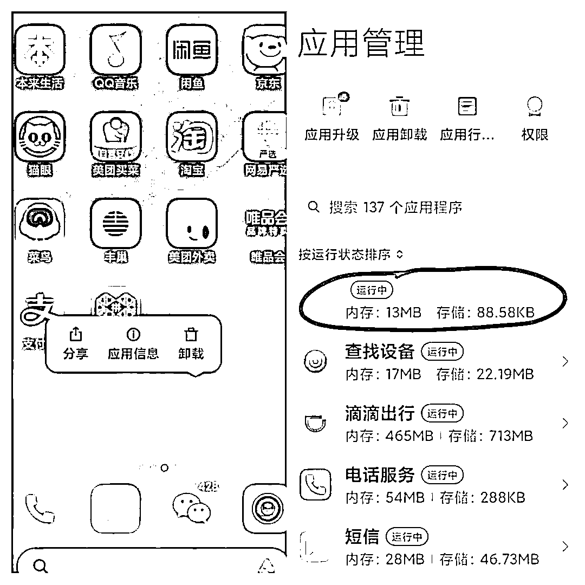
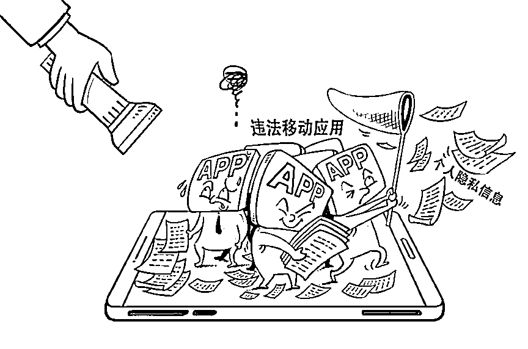

# 警惕！“透明 APP”正偷电量、偷流量、偷隐私

> 原文：[`mp.weixin.qq.com/s?__biz=MzIyMDYwMTk0Mw==&mid=2247536173&idx=6&sn=4bab9286ae6193cda51956847a26fef8&chksm=97cb8515a0bc0c035c3530bda782088b286c201233661711646901f243a511d63d33705ce9d0&scene=27#wechat_redirect`](http://mp.weixin.qq.com/s?__biz=MzIyMDYwMTk0Mw==&mid=2247536173&idx=6&sn=4bab9286ae6193cda51956847a26fef8&chksm=97cb8515a0bc0c035c3530bda782088b286c201233661711646901f243a511d63d33705ce9d0&scene=27#wechat_redirect)

近日，北京周女士的手机莫名其妙地一直弹出广告，而且无法关闭。专业人员检查发现，她的手机桌面上存在一款没有文件名、图标透明的不法软件。

“新华视点”记者调查发现，这类不法软件不仅耗电、耗流量，推送各类广告令机主不胜其扰，还往往过度索权，存在个人信息泄露风险。

[`mp.weixin.qq.com/mp/readtemplate?t=pages/video_player_tmpl&action=mpvideo&auto=0&vid=wxv_2404745146845429762`](https://mp.weixin.qq.com/mp/readtemplate?t=pages/video_player_tmpl&action=mpvideo&auto=0&vid=wxv_2404745146845429762)

**手机上看不见的隐患** 

周女士的遭遇并非个例。广州大学生李博近来发现手机电量消耗得特别快，充满电用不了半天。以前一个月 30G 流量够用，如今只能用半个月，“明明什么程序都没开，手机流量还是拦不住地减少，感觉手机里有‘内鬼’”。 

李博到手机品牌店咨询，工作人员打开手机任务栏后，发现有一个空白程序一直在运行。“不知道什么时候安装上的，也不知道是怎么把这个程序‘唤醒’的。工作人员说如果实在删不掉就只能刷机了。”李博说。

记者调查发现，以没有名称、图标透明的方式隐藏在手机里的 App，是最新出现的一类不法软件。

透明不法 App 在手机桌面上看不到，长按出现卸载等提示，应用管理中显示为空白图标。

不法软件是如何被安装到手机上的？

“利用广告、推送等方式，在用户易触位置，如‘关闭’‘跳过’等按钮中藏入下载链接，一旦用户不经意点击，手机后台便开始悄悄下载。”中国金融认证中心高级安全专家纪崇廉告诉记者，有的透明不法软件甚至利用其他 App 进行捆绑安装，“有可能机主根本没点错按钮，也会在不知不觉中下载了不法软件”。

广州刘女士在一次下载 App 时，偶然发现手机被安装上了不法软件。她反复尝试卸载未能成功，推送广告的行为也没有停止。

腾讯手机管家目前甄别出透明 App 不法软件样本共 500 多万份。腾讯手机管家安全专家郑扬帆告诉记者，透明 App 在后台长期开启，不仅额外消耗手机电量、流量，频繁弹窗推送广告，还会通过技术手段使手机按键失效，强制用户观看广告。此外，一些恶意软件甚至诱导用户开启麦克风、摄像头等权限并进行键盘记录，窃取用户照片、通讯录、短信、位置等个人隐私。

**“吸金”套路多** 

不法软件泛滥的背后，是非法获利的灰黑产业链。

**——推送广告赚取分红。**

刘女士告诉记者，自从手机里有了透明不法 App 后，解锁屏幕时都被迫先看广告。点击页面上的“解锁”，甚至会触发新的广告推送。

奇安信安全专家谢斯说，透明 App 本身没有实质性功能，但一些无良开发者通过往里加入各种功能盈利。广告分红一般通过用户的观看次数、点击跳转次数、下载量等数据进行计算，开发者通过埋伏功能强制推送广告获利。

**——诱导下载恶意扣费。**

佛山白领吴先生近日发现，手机出现一款名为“XX 骑士团”的游戏，每个月被扣掉 10 元钱。吴先生仔细查看发现，该款游戏是无意中从浏览器下载来的。“想投诉也不知道投诉谁，只能吃哑巴亏。”吴先生说。

**——获取用户信息实施商业目的。**

深圳程序员王先生父亲的手机里频繁出现广告弹窗，他仔细检查发现，手机隐藏的透明 App，是某购物软件的小插件。

“父亲说这个购物软件是点击微信上别人发来的链接之后下载的。第一次打开购物 App 时弹出的权限都点击了‘允许’。”王先生告诉记者，由于该款透明 App 捆绑于购物软件，因此，在购物软件中输入的商品信息和浏览记录可能会被记录下来。随后，王先生尝试在父亲手机上打开其他购物软件，发现页面中出现了浏览过的同类别商品。

“这个透明 App 里被嵌入了第三方 SDK 功能包，会收集用户的行为数据，甚至可能将收录的信息内容卖给其他服务商。”王先生说。

专家表示，此类不法 App 不仅推送广告获取收益分红，还有可能窃取个人信息，成为实施电信诈骗等违法活动的工具。

**专家建议用户尽量更新系统，**

**不要点击不明链接** 

国家信息技术安全研究中心专家王扬说，新版本的安卓系统不允许没有图标的软件在后台运行，一些不法软件就披上了各式外衣，透明图标就是其中一种。“实现‘透明’图标很容易，在开发时只需要设置图标属性以及置空 App 名字。”

据悉，该类 App 安装上之后，仅仅删除某个桌面文件并不能将其卸载，一般需要进入设备设置中的“应用管理”进行卸载。有的甚至一次性安装两个以上的程序：一个主程序，一个守护程序，主程序被卸载，守护程序会将其再安装回来，如此反反复复很难彻底删掉。

王扬表示，由于众多 App 的主体难辨，各类软件安装门槛较低、侵害用户权益的 App 层出不穷，用户在安装使用 App 时需格外留心。

据了解，市面上一些大厂商生产的安卓手机内置的系统会实时自动更新，系统的恶意代码库也在不断完善，新系统会对常见的恶意代码进行“阻拦”。但是有的厂商为了节约成本会去掉一些功能，如自动更新，那样手机就无法收到最新的系统补丁。

对此，暨南大学副校长翁健教授提醒：用户尽可能将系统更新到最新版本；恶意应用很少能通过应用商店审核，用户不要点击不明链接，尽量通过系统自带的应用商城下载应用；用户可以在系统设置中打开“禁止安装未知来源软件”的选项，避免不小心安装上恶意程序。

翁健建议，手机厂商在安装应用的流程设计上特别标明应用的权限和风险级别，在应用商城中做好甄别筛选机制；有关部门加大执法力度，打击不法软件灰黑产业链。

2021 年以来，广东省通信管理局对 272 款 App 发出违法违规处置通知，对未按期完成整改的 27 款 App 进行了下架处理。针对透明 App 等手机不法软件新载体，广东省通信管理局表示，下一步将不断扩大 App 监管平台数据采集范围，提升监测能力和技术检测水平，加大处置和曝光力度，强化个人信息保护和数据安全监管。 

据了解，2021 年工信部对 208 万款 App 进行了技术检测，通报违规 App 共 1549 款，下架 514 款，持续推进个人信息保护专项整治。

来源：黑白之道

← 向右滑动与灰产圈互动交流 →

